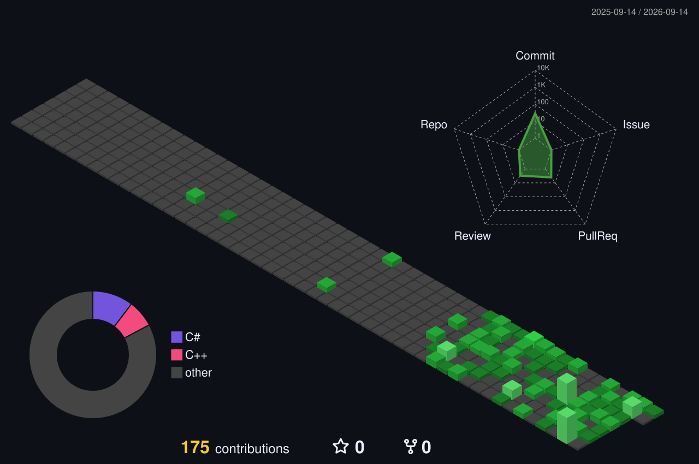

## 📚 Tech Stack  
### 💾 Embedded & Low-Level
<table border="1">
  <tr>
    <td width="200"><b>Languages</b></td>
		<td>
			
			
			
		</td>
	</tr>
	<tr>
    <td width="200"><b>Framework</b></td>
		<td>
			
		</td>
	</tr>
	<tr>
    <td width="200"><b>Hardwares</b></td>
		<td>
			
			
			
			
			
			
			
			<!--  -->
		</td>
	</tr>
	<tr>
    <td width="200"><b>Kernel</b></td>
		<td>
			
		</td>
	</tr>
</table>

### 💻 System & Infrastructure
<table border="1">
  <tr>
    <td width="200"><b>Operating Systems</b></td>
		<td>
			
			
		</td>
	</tr>
	<tr>
    <td width="200"><b>Shell</b></td>
		<td>
			
			
		</td>
	</tr>
	<tr>
    <td width="200"><b>Build Tools</b></td>
		<td>
			
			
			
		</td>
	</tr>
	<tr>
    <td width="200"><b>DevOps & Infrastructure</b></td>
		<td>
			
			
			
			
			<!--  -->
		</td>
	</tr>
</table>

### 📐 Software & Tools
<table border="1">
	<tr>
		<td width="200"><b>Application Programming</b></td>
		<td>
			 
			
			
		</td>
	<tr>
	<tr>
		<td width="200"><b>IDE & EDA Tools</b></td>
		<td>
			
			
			
			
			
			
			
		</td>
	</tr>
	<tr>
		<td width="200"><b>Library</b></td>
		<td>
			
			
			
			
			
			
		</td>
	</tr>
	<tr>
		<td width="200"><b>Markup</b></td>
		<td>
			
			
		</td>
	</tr>
	<tr>
		<td width="200"><b>Virtual Enviroment</b></td>
		<td>
			
			
		</td>
	</tr>
</table>

## 🌱 Currently learning about ...  [^1]
[^1]: *Updated at 2026-09-05*

| About    | Tech           |
| -------- | -------------- |
| ![FPGA]  | ![Vitis]       |
| ![FPGA]  | ![Verilog]     |
| ![Linux] | ![Device Tree] |

[FPGA]:https://img.shields.io/badge/FPGA-000000?style=flat-square&logo=amd&logoColor=white
[Vitis]:https://img.shields.io/badge/AMD%20Vitis-EF3A24?style=flat-square&logo=amd&logoColor=white
[Verilog]:https://img.shields.io/badge/Verilog-2A52BE?style=flat-square&logo=microchip&logoColor=white
[Linux]:https://img.shields.io/badge/Linux-FCC624?style=flat-square&logo=linux&logoColor=black
[Device Tree]:https://img.shields.io/badge/Device%20Tree-FCC624?style=flat-square&logo=linux&logoColor=black

## 📚 Study Notes

공부하며 작성한 필기입니다. 
*각 항목을 클릭하면 동기화된 전체 문서로 이동합니다.*

|    카테고리    | 주제                                                | 전체 문서 링크                                 |
| :------------: | :-------------------------------------------------- | :--------------------------------------------- |
|  **Language**  | C언어                                               | [📄 읽기](./docs/notes/C.md)                    |
| **Language++** | C++                                                 | [📄 읽기](./docs/notes/C++.md)                  |
|  **Language**  | C#                                                  | [📄 읽기](./docs/notes/C#.md)                   |
|  **Embedded**  | Embedded System Basic (STM32)                       | [📄 읽기](./docs/notes/embedded_basic.md)       |
|    **RTOS**    | RTOS 기본 usage (FreeRTOS)                          | [📄 읽기](./docs/notes/RTOS.md)                 |
|   **Linux**    | Linux Bash shell                                    | [📄 읽기](./docs/notes/linux_bash.md)           |
|   **Linux**    | Linux Application & Kernel                          | [📄 읽기](./docs/notes/linux_system.md)         |
|   **Design**   | Software design methodology, architecture, patterns | [📄 읽기](./docs/notes/SW아키텍처와객체지향.md) |
|   **Editor**   | vim motions, commands explaination for myself       | [📄 읽기](./docs/notes/vim.md)                  |

---

<!-- TODO: add 
#### 🚀 My project 

-

-->

<!--
Here are some ideas to get you started:

- Hi there 👋
- 🔭 I’m currently working on ...
- 🌱 I’m currently learning ...
- 👯 I’m looking to collaborate on ...
- 🤔 I’m looking for help with ...
- 💬 Ask me about ...
- 📫 How to reach me: ...
- 😄 Pronouns: ...
- ⚡ Fun fact: ...
-->
<!-- -->
