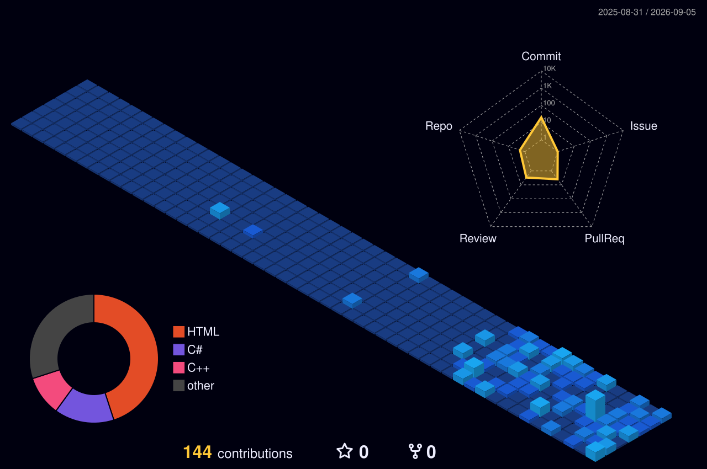

## Hi there 👋

## 📚 Tech Stack  
### 💾 Embedded & Low-Level
<table border="1">
  <tr>
    <td width="200"><b>Languages</b></td>
		<td>
			
			
			
		</td>
	</tr>
	<tr>
    <td width="200"><b>Framework</b></td>
		<td>
			
		</td>
	</tr>
	<tr>
    <td width="200"><b>Hardwares</b></td>
		<td>
			
			
			
			
			
			
			
			<!--  -->
		</td>
	</tr>
</table>

### 💻 System & Infrastructure
<table border="1">
  <tr>
    <td width="200"><b>Operating Systems</b></td>
		<td>
			
			
		</td>
	</tr>
	<tr>
    <td width="200"><b>Shell</b></td>
		<td>
			
			
		</td>
	</tr>
	<tr>
    <td width="200"><b>DevOps & Infrastructure</b></td>
		<td>
			
			
			
			
			<!--  -->
		</td>
	</tr>
</table>

### 📐 Software & Tools
<table border="1">
	<tr>
		<td width="200"><b>Application Programming</b></td>
		<td>
			 
			
			
		</td>
	<tr>
	<tr>
		<td width="200"><b>IDE & EDA Tools</b></td>
		<td>
			
			
			
		</td>
	</tr>
</table>

## 🌱 Currently learning about ...

<!--
Here are some ideas to get you started:

- 🔭 I’m currently working on ...
- 🌱 I’m currently learning ...
- 👯 I’m looking to collaborate on ...
- 🤔 I’m looking for help with ...
- 💬 Ask me about ...
- 📫 How to reach me: ...
- 😄 Pronouns: ...
- ⚡ Fun fact: ...
-->
