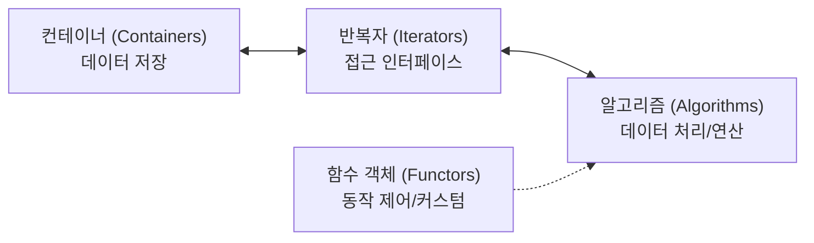
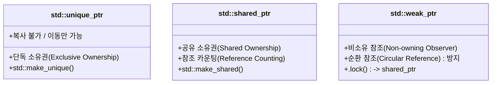

# C++

- [C++](#c)
  - [Class and Object](#class-and-object)
      - [접근 제어자](#접근-제어자)
      - [생성자 (constructor)와 소멸자 (destructer)](#생성자-constructor와-소멸자-destructer)
      - [const method](#const-method)
      - [this](#this)
      - [static](#static)
      - [Inheritance (상속)](#inheritance-상속)
  - [STL (Standard Template Library) \& C++ Standard Library](#stl-standard-template-library--c-standard-library)
    - [1. STL 개요 및 핵심 구성 요소](#1-stl-개요-및-핵심-구성-요소)
    - [2. 반복자 (Iterator) \& 범위 기반 for문](#2-반복자-iterator--범위-기반-for문)
      - [2.1 반복자 (Iterator)](#21-반복자-iterator)
        - [반복자 카테고리 (Iterator Hierarchy)](#반복자-카테고리-iterator-hierarchy)
        - [주요 컨테이너별 내부 구현 및 반복자 동작](#주요-컨테이너별-내부-구현-및-반복자-동작)
        - [반복자 무효화 (Iterator Invalidation) 주의점](#반복자-무효화-iterator-invalidation-주의점)
      - [2.2 범위 기반 for문 (Range-based for Loop)](#22-범위-기반-for문-range-based-for-loop)
        - [올바른 순회 방식 선택 가이드](#올바른-순회-방식-선택-가이드)
    - [3. STL 컨테이너 (Containers)](#3-stl-컨테이너-containers)
      - [3.1 시퀀스 컨테이너 (Sequence Containers)](#31-시퀀스-컨테이너-sequence-containers)
        - [1) `std::vector` 핵심 메서드 및 메모리 관리](#1-stdvector-핵심-메서드-및-메모리-관리)
        - [2) `std::deque` (Double-Ended Queue)](#2-stddeque-double-ended-queue)
        - [3) `std::list` \& `std::forward_list`](#3-stdlist--stdforward_list)
      - [3.2 연관 컨테이너 (Associative Containers)](#32-연관-컨테이너-associative-containers)
        - [주요 특징 및 사용법](#주요-특징-및-사용법)
      - [3.3 비정렬 연관 컨테이너 (Unordered Containers)](#33-비정렬-연관-컨테이너-unordered-containers)
        - [트리 기반 vs 해시 기반 컨테이너 선택 기준](#트리-기반-vs-해시-기반-컨테이너-선택-기준)
      - [3.4 C++23 플랫 컨테이너 (Flat Containers)](#34-c23-플랫-컨테이너-flat-containers)
      - [3.5 컨테이너 어댑터 (Container Adapters)](#35-컨테이너-어댑터-container-adapters)
        - [`std::priority_queue` 선언 및 커스텀](#stdpriority_queue-선언-및-커스텀)
      - [3.6 컨테이너 공통 생성자 및 공통 인터페이스](#36-컨테이너-공통-생성자-및-공통-인터페이스)
        - [1) 공통 생성자 패턴](#1-공통-생성자-패턴)
        - [2) 공통 멤버 함수](#2-공통-멤버-함수)
    - [4. C++ 표준 유틸리티 및 라이브러리](#4-c-표준-유틸리티-및-라이브러리)
      - [4.1 문자열 (`std::string`, `<string>`)](#41-문자열-stdstring-string)
      - [4.2 알고리즘 라이브러리 (`<algorithm>`)](#42-알고리즘-라이브러리-algorithm)
        - [1) 탐색 및 카운트](#1-탐색-및-카운트)
        - [2) 정렬 (Sorting)](#2-정렬-sorting)
        - [3) 변환 및 수정 (Modifying)](#3-변환-및-수정-modifying)
        - [4) 조건 검사 (Predicates)](#4-조건-검사-predicates)
      - [4.3 수치 연산 (`<numeric>`)](#43-수치-연산-numeric)
      - [4.4 유틸리티 (`<utility>`, `<tuple>`)](#44-유틸리티-utility-tuple)
        - [`std::pair` \& `std::tuple`](#stdpair--stdtuple)
        - [`std::move` \& `std::forward`](#stdmove--stdforward)
      - [4.5 함수형 객체 (`<functional>`)](#45-함수형-객체-functional)
      - [4.6 스마트 포인터 (`<memory>`)](#46-스마트-포인터-memory)
      - [4.7 `std::optional` (`<optional>`, C++17)](#47-stdoptional-optional-c17)
  - [auto와 참조 연산자 (참조 \&, 전이 참조 \&\&)](#auto와-참조-연산자-참조--전이-참조-)
  - [람다 표현식](#람다-표현식)
      - [람다 포섭 (Lambda Capture)](#람다-포섭-lambda-capture)
  - [Initializer](#initializer)
  - [타입 추출 (Type extract)](#타입-추출-type-extract)
  - [컴파일 타임 함수](#컴파일-타임-함수)
  - [연산자 다형성 (operator overloading)](#연산자-다형성-operator-overloading)
  - [예외 처리 (exception)](#예외-처리-exception)
  - [파일 입출력](#파일-입출력)


## Class and Object
#### 접근 제어자
~~`Package`: class가 선언된 파일, not in c++~~
| name      | description                  |
| --------- | ---------------------------- |
| public    | 제한 없이 어디서나 접근 가능 |
| protected | 동일한 클래스에서 접근       |
| private   | 선언된 해당 객체에서만 접근  |

**friend 키워드**
private: 안에 friend class Test2; 선언 시, 선언한 클래스에 한해 this 클래스의 private 접근을 허용함.

#### 생성자 (constructor)와 소멸자 (destructer)
*생성자, 소멸자는 해당 클래스의 객체가 생성(메모리 할당)/소멸(할당 해제)될때 객체의 데이터 또는 상태를 초기화하는 동작을 함.*
선언 및 정의 시 반환값 없음.
```cpp
class Test
{
  Test();   // 생성자 선언
  ~Test();  // 소멸자 선언
}
```
**생성자 default 인자**: *default 인자는 선언에만 사용.*
```cpp
class Test
{
  Test(int a = 5, int b = 3);
}
```

**member initializer list**: *정의 부분에만 가능*
```cpp
Test::Test(int _a, int _b) : a(_a), b(_b) 
{
  // 함수 동작
}
```

**변환 생성자**
*매개 변수가 한개인 생성자는 묵시적으로 변환 생성자로 여겨진다.*
void test(MyClass param)이 전역에 있고
MyClass(int n){}이라는 생성자가 있을때,
test(5);는 변환 생성자가 되어 실제로는 test(param(5))가 되어 생성자를 호출한다.
이를 막으려면 생성자에 explicit을 선언. 직접 test(MyClass(5))를 호출해야 위와 같은 동작을 하게 된다.

**가상 소멸자**
컴파일 타임에 평가된 자료형의 소멸자만 호출하므로 자식 객체의 소멸자도 호출하려면 상위 클래스의 소멸자에 virtual 예약어 사용.
*클래스 내에 virtual 함수가 단 하나라도 존재한다면, 소멸자 앞에도 반드시 virtual을 붙여라*

#### const method
const 멤버 함수는 멤버 변수를 수정하지 않는다.

#### this
> this는 현재 클래스 객체의 포인터를 나타내는 식별자이다. this 자체로는 prvalue (포인터 리터럴)이다.
> 모든 클래스 멤버 함수(메소드)는 보이지 않지만 암시적으로 첫번째 인자로 클래스의 포인터 this를 받는다.
> 또한 메소드 내에서 멤버 변수를 다룰때도 암시적으로 this->가 사용된다.
> 한 클래스의 여러 객체를 구분하는 방법이다.

#### static 
- static 멤버 변수
  - 클래스에 하나 존재 (객체마다 가지지 않음.)
  - 초기화: 클래스는 자료형의 정의이므로 전역 영역에서 반드시 초기화 해서 할당해야함.
  - static이므로 data 또는 bss 영역에서 프로세스 끝까지 존재.
- static 멤버 함수
  - 객체 의존성 없음: 객체 없이도 외부에서 호출 가능.
    - this 사용 불가. 오직 static 멤버 변수와 멤버 함수에만 접근.


**Singletone**: 객체를 정적으로 할당해 하나만 생성하여 사용. 자원관리 측면에서 사용.
```cpp
class SingleTone 
{
private:
  int x;
  SingleTone(int _x) :x(_x) {}
  static SingleTone s;
public:
  void printX() 
  {
      cout << "x:" << x << endl;
  }
  static SingleTone getInstance() 
  {
      return s;
  }
};
//static 멤버 초기화 코드, SingleTonde 객체 s 초기화 in SingleTone 클래스.
SingleTone SingleTone::s(2); 
```

#### Inheritance (상속)
- public 상속
  - 부모 클래스의 모든 멤버를 그대로 받고, 자식 클래스 is-a 부모 클래스가 참이다.
- protected 상속
  - public과 protected가 preotected가 된다.
- private 상속
  - upcasting을 허용하지 않는다. 즉 Parent &p = child; 가 안된다.
  - 상속받은 모든 멤버는 private이 된다. (상속된 자식조차 접근 불가.)

**상속 생성자 정의**
Child(int _num) : Parent(_num){}
- Parent int를 받는 생성자 호출.

**upcasting**
부모 클래스의 포인터로 자식 클래스를 가리키면 부모 타입으로 올린것이므로 업캐스팅.
다만 이 상태로 메소드를 호출할 경우 `정적 바인딩`에 의해 무조건 부모 메소드 호출.
`정적 바인딩`: 컴파일 타임에 자료형을 평가하여 해당 클래스의 메소드로만 연결.
*downcasting*: upcast된 객체를 원래 타입으로 내리는 경우. 자식만 가지는 확장된 멤버에 접근할 경우 사용.

**virtual과 override**
부모 클래스에서 virtual로 선언하고, 자식 클래스에서 override로 선언을 한다면
클래스 내부에선 이 함수를 가상 함수 테이블로 관리를 하게 된다.
실행 시점에 해당 객체가 가진 함수 포인터를 따라 실제 원하는 메소드를 실행함.

**추상 클래스 (Abstract Class) == Interface**
순수 가상 함수(virtual _Ty func() = 0;)만을 가진 클래스. 이를 상속받는 파생 클래스가 이를 구현한다.

**다중 상속**
권장되지는 않지만 문법상 존재.
마름모꼴 상속을 받는 경우, 중간 클래스는 Interface를 virtual 상속을 받으면 생성자 호출이 정상화됨.
else, Interface 생성자가 여러번 호출 == 오작동.

`추상 클래스`들의 경우 다중 상속이 유용함. Loose Couple은 아니지만 강력함.

## STL (Standard Template Library) & C++ Standard Library

---

### 1. STL 개요 및 핵심 구성 요소

C++ STL은 재사용 가능한 템플릿 기반의 범용 라이브러리로, 크게 4가지 핵심 요소로 구성됩니다.



1. **컨테이너 (Containers)**: 데이터를 관리하고 저장하는 자료구조 (시퀀스, 연관, 비정렬, 어댑터).
2. **반복자 (Iterators)**: 컨테이너의 원소를 순회하고 가리키는 포인터 추상화 객체 (컨테이너와 알고리즘의 결합도를 낮춤).
3. **알고리즘 (Algorithms)**: 정렬, 탐색, 변환 등 반복자를 통해 컨테이너 데이터를 처리하는 범용 함수군.
4. **함수 객체 (Functors / Callables)**: 알고리즘의 동작(비교 기준, 변환 로직 등)을 커스터마이징하는 호출 가능한 객체 및 람다.

---

### 2. 반복자 (Iterator) & 범위 기반 for문

#### 2.1 반복자 (Iterator)
> **반복자란?** 컨테이너 내부 구조에 구애받지 않고 표준화된 인터페이스(`*`, `++`, `--`, `==`, `!=` 등)로 원소에 접근할 수 있도록 포인터를 추상화한 객체입니다.

##### 반복자 카테고리 (Iterator Hierarchy)
C++ 반복자는 지원하는 기능에 따라 계층적으로 구분됩니다:

| 반복자 종류            | 지원 연산                                                  | 주요 지원 컨테이너                                |
| :--------------------- | :--------------------------------------------------------- | :------------------------------------------------ |
| **Input / Output**     | 판독만 가능 / 쓰기만 가능 (단방향, 1회 순회)               | `istream_iterator`, `ostream_iterator`            |
| **Forward**            | 다중 순방향 순회 (`++`, `*`)                               | `std::forward_list`, `std::unordered_set/map`     |
| **Bidirectional**      | 양방향 순회 (`++`, `--`, `*`)                              | `std::list`, `std::set`, `std::map`               |
| **Random Access**      | 임의 위치 점프 (`[]`, `+`, `-`, `+=`, `-=`, `<` 등 $O(1)$) | `std::vector`, `std::deque`, `std::array`, C 배열 |
| **Contiguous** (C++20) | 연속된 물리 메모리 보장 (포인터 산술 연산 가능)            | `std::vector`, `std::array`, `std::string`        |

##### 주요 컨테이너별 내부 구현 및 반복자 동작
- **`std::vector`**: 물리적으로 연속된 배열. 반복자는 포인터처럼 동작하며 임의 접근(`it + n`, `it[n]`)이 $O(1)$.
- **`std::deque`**: 청크(Chunk, 일정한 크기의 버퍼 배열)들의 주소를 관리하는 맵 포인터 구조. 반복자는 `(현재 청크 포인터, 버퍼 내 인덱스)` 정보를 가지며, 간접 참조를 통해 $O(1)$ 임의 접근 지원.
- **`std::list`**: 이중 연결 리스트(Doubly Linked List). 반복자는 노드 포인터(`Node*`)를 래핑한 객체로, `++it` 시 내부적으로 `it = it->next`를 수행. 임의 접근 불가능($O(N)$).

##### 반복자 무효화 (Iterator Invalidation) 주의점
- **`vector`**: 삽입 시 `capacity`를 초과하여 재할당(Reallocation)이 발생하면 **모든 반복자/참조 무효화**. 재할당이 없다면 삽입/삭제 위치 이후의 반복자만 무효화.
- **`deque`**: 중간 삽입/삭제 시 모든 반복자 무효화. 양 끝(`push_front`, `push_back`) 삽입 시 참조는 유지되나 반복자는 무효화될 수 있음.
- **`list` / `set` / `map`**: 노드 기반 컨테이너이므로 원소가 추가/삭제되어도 **삭제 대상 노드를 가리키는 반복자 외에는 모두 유효 유지**.

---

#### 2.2 범위 기반 for문 (Range-based for Loop)

`for (auto&& item : container)` 형태로 사용하며, 컨테이너의 `begin()`과 `end()` 반복자를 활용해 순회합니다.

```cpp
// 컴파일러에 의해 내부적으로 다음과 같이 전개됨:
auto&& __range = container;
auto __begin = __range.begin(); // 또는 std::begin(__range)
auto __end = __range.end();     // 또는 std::end(__range)
for (; __begin != __end; ++__begin) {
    auto&& item = *__begin;
    // 반복문 본문
}
```

##### 올바른 순회 방식 선택 가이드
```cpp
std::vector<std::string> words = {"apple", "banana", "cherry"};

// 1. 값 복사 (기본 타입이나 복사 비용이 매우 저렴한 경우)
for (auto w : words) { ... }

// 2. 상수 참조 (읽기 전용, 불필요한 복사 방지 - 권장)
for (const auto& w : words) { ... }

// 3. 참조 (원소의 값을 직접 수정해야 할 때)
for (auto& w : words) { w += "!"; }

// 4. 전달 참조 / Universal Reference (프록시 반복자나 제네릭 템플릿 코드)
for (auto&& w : words) { ... }
```

> [!WARNING]
> 반복자 인터페이스(`begin()`, `end()`)를 제공하지 않고 `top()`, `front()`, `pop()`으로만 접근할 수 있는 **컨테이너 어댑터(`std::stack`, `std::queue`, `std::priority_queue`)는 범위 기반 for문을 사용할 수 없습니다.**

---

### 3. STL 컨테이너 (Containers)

#### 3.1 시퀀스 컨테이너 (Sequence Containers)

삽입된 순서(선형적 순서)대로 원소를 보관하는 컨테이너입니다.

| 컨테이너                | 내부 자료구조           |  임의 접근  | 앞쪽 삽입/삭제 |    뒤쪽 삽입/삭제    |    중간 삽입/삭제     | 메모리/캐시 특성                           |
| :---------------------- | :---------------------- | :---------: | :------------: | :------------------: | :-------------------: | :----------------------------------------- |
| **`std::vector`**       | 동적 배열 (연속 메모리) |   $O(1)$    |     $O(N)$     | $O(1)$ *(Amortized)* |        $O(N)$         | 캐시 지역성 최상, 크기 초과 시 재할당 발생 |
| **`std::deque`**        | 청크 단위 분할 배열     |   $O(1)$    |     $O(1)$     |        $O(1)$        |        $O(N)$         | 양 끝 삽입/삭제 최적화, 메모리 단편화 적음 |
| **`std::list`**         | 이중 연결 리스트        | 불가 $O(N)$ |     $O(1)$     |        $O(1)$        | $O(1)$ *(위치 알 때)* | 노드 포인터 오버헤드, 캐시 미스 잦음       |
| **`std::forward_list`** | 단방향 연결 리스트      | 불가 $O(N)$ |     $O(1)$     |         불가         | $O(1)$ *(위치 알 때)* | 노드당 포인터 1개 절약, 뒤쪽 삽입 미지원   |
| **`std::array`**        | 고정 크기 정적 배열     |   $O(1)$    |      불가      |         불가         |         불가          | 스택 할당, 동적 할당 오버헤드 제로         |

##### 1) `std::vector` 핵심 메서드 및 메모리 관리
- `size()`: 현재 저장된 원소 개수.
- `capacity()`: 재할당 없이 저장 가능한 최대 원소 개수.
- `reserve(n)`: 메모리 공간을 미리 `n`개 크기로 확보 (크기 `size`는 변경되지 않음, 불필요한 재할당 방지).
- `resize(n)` / `resize(n, val)`: 실제 원소 개수를 `n`개로 조정 (늘어난 공간은 기본값 또는 `val`로 채움).
- `shrink_to_fit()`: 사용하지 않는 여유 용량(`capacity - size`)을 반환하여 메모리 최적화.
- `push_back(val)` / `emplace_back(args...)`: 맨 뒤에 추가 (`emplace_back`은 객체 직접 생성으로 불필요한 임시 객체 복사/이동 방지).
- `pop_back()`: 맨 뒤 원소 제거.
- `operator[](i)` / `at(i)`: `[]`는 범위 체크 없이 빠른 접근, `at()`은 범위 초과 시 `std::out_of_range` 예외 발생.
- `assign(count, val)` / `assign(first, last)`: 기존 내용을 비우고 새로운 값들로 재할당.

##### 2) `std::deque` (Double-Ended Queue)
- 양 끝에서의 삽입/삭제(`push_front`, `pop_front`, `push_back`, `pop_back`)가 모두 $O(1)$.
- `vector`와 달리 전체 연속 메모리가 아니므로 용량 증가 시 전체 데이터 복사/재할당 비용이 없음.
- 2단계 간접 참조(청크 맵 $\rightarrow$ 실제 버퍼)로 인해 `vector`에 비해 미세하게 접근 오버헤드가 있음.

##### 3) `std::list` & `std::forward_list`
- 어느 위치든 반복자(위치)만 확보되어 있다면 $O(1)$로 삽입/삭제 가능.
- 임의 접근 반복자를 요구하는 `std::sort`를 사용할 수 없으므로, 멤버 함수인 `list::sort()` ($O(N \log N)$)를 사용해야 함.
- `splice(pos, other_list)`: 다른 리스트의 노드를 통째로 잘라 붙이는 연산을 $O(1)$로 수행 가능.
- `std::forward_list`는 단방향이므로 `insert_after()`, `erase_after()`를 사용.

---

#### 3.2 연관 컨테이너 (Associative Containers)

Key를 기반으로 데이터를 정렬된 상태로 유지하며 빠른 검색을 지원합니다.

| 컨테이너            | 내부 자료구조                   | Key 중복 | 데이터 형태                              | 탐색 / 삽입 / 삭제 시간 복잡도 |
| :------------------ | :------------------------------ | :------: | :--------------------------------------- | :----------------------------: |
| **`std::set`**      | Red-Black Tree (균형 이진 트리) |   불허   | Key                                      |          $O(\log N)$           |
| **`std::multiset`** | Red-Black Tree                  |   허용   | Key                                      |          $O(\log N)$           |
| **`std::map`**      | Red-Black Tree                  |   불허   | Key-Value Pair (`std::pair<const K, V>`) |          $O(\log N)$           |
| **`std::multimap`** | Red-Black Tree                  |   허용   | Key-Value Pair                           |          $O(\log N)$           |

##### 주요 특징 및 사용법
- 기본적으로 `<` 연산자(`std::less<T>`)를 기준으로 **오름차순 정렬** 상태를 유지.
- `insert(val)`: 삽입 후 `std::pair<iterator, bool>` 반환 (`bool`은 성공 여부, `multimap`/`multiset`은 iterator만 반환).
- `find(key)`: 원소 탐색, 존재하지 않으면 `end()` 반환.
- `count(key)`: 특정 키의 개수 반환 (`set`/`map`은 0 또는 1).
- `lower_bound(key)` / `upper_bound(key)`: 해당 키의 시작/끝 반복자 반환 (이진 탐색).
- `map::operator[](key)`: 키가 존재하지 않으면 **기본값으로 새 원소를 삽입**하고 참조를 반환하므로 단순 조회 시 주의 (`find()` 권장).
- `erase(key)`, `erase(iterator1)`: 특정 키 또는 iterator 기준 위치로 삭제.
- `clear()`: 모든 요소 삭제하고 비우기

---

#### 3.3 비정렬 연관 컨테이너 (Unordered Containers)

해시 테이블(Hash Table)을 기반으로 동작하여 정렬되지 않은 상태로 키를 관리합니다.

| 컨테이너                      | 내부 자료구조          | Key 중복 | 평균 복잡도 | 최악 복잡도 (해시 충돌) |
| :---------------------------- | :--------------------- | :------: | :---------: | :---------------------: |
| **`std::unordered_set`**      | 해시 테이블 (Chaining) |   불허   |   $O(1)$    |         $O(N)$          |
| **`std::unordered_multiset`** | 해시 테이블            |   허용   |   $O(1)$    |         $O(N)$          |
| **`std::unordered_map`**      | 해시 테이블            |   불허   |   $O(1)$    |         $O(N)$          |
| **`std::unordered_multimap`** | 해시 테이블            |   허용   |   $O(1)$    |         $O(N)$          |

##### 트리 기반 vs 해시 기반 컨테이너 선택 기준
- **정렬 순서 유지나 범위 검색(`lower_bound` 등)이 필요하다** $\rightarrow$ `std::set` / `std::map` ($O(\log N)$)
- **정렬 순서가 필요 없고 단일 키 탐색 성능이 최우선이다** $\rightarrow$ `std::unordered_set` / `std::unordered_map` (평균 $O(1)$)
- 사용자 정의 객체를 Key로 사용할 경우:
  - `map`/`set`: `operator<` 정의 필요
  - `unordered_map`/`unordered_set`: `std::hash` 특수화 및 `operator==` 정의 필요

---

#### 3.4 C++23 플랫 컨테이너 (Flat Containers)

- **`std::flat_set`**, **`std::flat_map`** (`<flat_set>`, `<flat_map>`)
- 노드 기반인 레드-블랙 트리 대신 `std::vector` 같은 **연속 메모리 시퀀스 컨테이너를 내부에 두고 정렬 상태를 유지**하는 어댑터.
- **장점**: 메모리 오버헤드가 적고 캐시 지역성(Cache Locality)이 극대화되어 탐색 속도가 매우 빠름.
- **단점**: 삽입/삭제 시 원소들의 이동이 발생하므로 $O(N)$ 소요. (수정보다 조회가 빈번한 환경에 최적화)

---

#### 3.5 컨테이너 어댑터 (Container Adapters)

기존 시퀀스 컨테이너를 내부 저장소로 두고, 특정 목적에 맞게 인터페이스를 제한한 자료구조입니다.

| 어댑터                    | 기본 내부 컨테이너 | 동작 방식          | 주요 지원 메서드                                                         |
| :------------------------ | :----------------- | :----------------- | :----------------------------------------------------------------------- |
| **`std::stack`**          | `std::deque`       | LIFO (후입선출)    | `push()`, `emplace()`, `pop()`, `top()`, `empty()`, `size()`             |
| **`std::queue`**          | `std::deque`       | FIFO (선입선출)    | `push()`, `emplace()`, `pop()`, `front()`, `back()`, `empty()`, `size()` |
| **`std::priority_queue`** | `std::vector`      | Heap (우선순위 큐) | `push()`, `emplace()`, `pop()`, `top()`, `empty()`, `size()`             |

##### `std::priority_queue` 선언 및 커스텀
```cpp
#include <queue>
#include <vector>

// 1. 기본 선언 (최대 힙: Max-Heap)
std::priority_queue<int> max_pq;

// 2. 최소 힙 선언 (Min-Heap)
std::priority_queue<int, std::vector<int>, std::greater<int>> min_pq;

// 3. 커스텀 구조체 및 비교 람다 사용
struct Point { int x, y; };
auto comp = [](const Point& a, const Point& b) { return a.x > b.x; }; // x 오름차순
std::priority_queue<Point, std::vector<Point>, decltype(comp)> custom_pq(comp);
```

---

#### 3.6 컨테이너 공통 생성자 및 공통 인터페이스

##### 1) 공통 생성자 패턴
```cpp
// 1. 기본 생성자 (빈 컨테이너)
std::vector<int> v1;

// 2. 크기 지정 생성자 (크기 n, 기본값 0으로 초기화)
std::vector<int> v2(10);

// 3. 크기 및 초기값 지정 생성자 (크기 n, 값 val로 초기화)
std::vector<int> v3(10, -1);

// 4. 반복자 범위 생성자 (다른 컨테이너의 [first, last) 구간 복사)
std::vector<int> v4(v3.begin(), v3.end());

// 5. 초기화 리스트 (Initializer List) 생성자
std::vector<int> v5 = {1, 2, 3, 4, 5};
```

##### 2) 공통 멤버 함수
- `empty()`: 비어있는지 여부 확인 (`bool` 반환, `size() == 0`보다 성능상 권장).
- `size()`: 저장된 원소 개수 반환.
- `max_size()`: 시스템상 담을 수 있는 이론상 최대 원소 개수.
- `clear()`: 모든 원소 제거 (단, `vector`의 `capacity`는 줄어들지 않음).
- `swap(other)`: 두 컨테이너의 내부 포인터/버퍼를 $O(1)$로 맞교환.
- `begin()` / `end()`: 시작 및 끝(마지막 원소 다음) 반복자.
- `cbegin()` / `cend()`: 읽기 전용 상수(const) 반복자.
- `rbegin()` / `rend()`: 역방향 순회용 리버스(reverse) 반복자.

---

### 4. C++ 표준 유틸리티 및 라이브러리

#### 4.1 문자열 (`std::string`, `<string>`)

```cpp
std::string str = "Hello, C++ World!";

// 1. 부분 문자열 (pos부터 len길이만큼 추출)
std::string sub = str.substr(7, 3); // "C++"

// 2. 검색 (찾지 못하면 std::string::npos 반환)
size_t pos = str.find("World");
if (pos != std::string::npos) {
    // 찾았을 때 처리
}
size_t rpos = str.rfind('o'); // 뒤에서부터 탐색

// 3. 치환, 삽입, 삭제
str.replace(7, 3, "Modern C++"); // pos 7부터 3글자를 대체
str.insert(0, "[Start] ");
str.erase(0, 8); // pos 0부터 8글자 삭제

// 4. C 스타일 문자열 포인터 변환
const char* c_str = str.c_str();

// 5. 수치 변환
int num = std::stoi("12345");
double d = std::stod("3.1415");
std::string s = std::to_string(42);
```

> **SSO (Small String Optimization)**: `std::string`은 약 15~22바이트 이하의 짧은 문자열을 힙에 동적 할당하지 않고 객체 내부 스택 버퍼에 직접 저장하여 성능을 극대화합니다.

---

#### 4.2 알고리즘 라이브러리 (`<algorithm>`)

반복자 범위 `[first, last)`를 입력받아 작업을 수행하는 범용 함수 모음입니다.

##### 1) 탐색 및 카운트
- `std::find(first, last, val)`: 선형 탐색 ($O(N)$).
- `std::find_if(first, last, pred)`: 조건자(람다 등)를 만족하는 첫 원소 탐색.
- `std::count(first, last, val)` / `std::count_if(first, last, pred)`: 조건 만족 원소 개수.
- `std::binary_search(first, last, val)`: 이진 탐색 존재 여부 ($O(\log N)$, **정렬된 상태 필수**).
- `std::lower_bound(first, last, val)`: `val` 이상인 첫 원소 위치.
- `std::upper_bound(first, last, val)`: `val`을 초과하는 첫 원소 위치.

##### 2) 정렬 (Sorting)
- `std::sort(first, last)`: 인트로소트(Introsort: 퀵소트 + 힙소트 + 삽입소트) 기반, 평균/최악 $O(N \log N)$, 불안정 정렬.
- `std::stable_sort(first, last)`: 병합 정렬 기반, 동등한 원소의 원래 상대적 순서 보장, $O(N \log N)$.

```cpp
std::vector<int> v = {5, 2, 8, 1, 9};

// 오름차순 정렬
std::sort(v.begin(), v.end());

// 내림차순 정렬 (비교자 / 람다식)
std::sort(v.begin(), v.end(), std::greater<int>());
std::sort(v.begin(), v.end(), [](int a, int b) { return a > b; });
```

##### 3) 변환 및 수정 (Modifying)
- `std::for_each(first, last, func)`: 각 원소에 대해 함수 실행.
- `std::transform(first, last, result, func)`: 각 원소를 변환하여 `result`에 기록.
- `std::generate(first, last, gen)`: 발생기(Generator 함수)의 반환값으로 원소들을 채움.
- `std::fill(first, last, val)`: 지정 범위의 모든 원소를 `val`로 채움.
- **Erase-Remove 관용구 (특정 값 제거)**:
  ```cpp
  // C++20 이전
  v.erase(std::remove(v.begin(), v.end(), target_val), v.end());
  v.erase(std::remove_if(v.begin(), v.end(), [](int x) { return x % 2 == 0; }), v.end());

  // C++20 이후 (간결한 std::erase / std::erase_if 지원)
  std::erase(v, target_val);
  std::erase_if(v, [](int x) { return x % 2 == 0; });
  ```

##### 4) 조건 검사 (Predicates)
- `std::all_of(first, last, pred)`: 모든 원소가 조건을 만족하는지 확인.
- `std::any_of(first, last, pred)`: 조건을 만족하는 원소가 1개 이상 존재하는지 확인.
- `std::none_of(first, last, pred)`: 모든 원소가 조건을 만족하지 않는지 확인.
- `std::min_element(first, last)` / `std::max_element(first, last)`: 최소/최대 원소의 반복자 반환.

---

#### 4.3 수치 연산 (`<numeric>`)

```cpp
#include <numeric>
#include <vector>

std::vector<int> v(5);

// 1. iota: 시작값부터 1씩 증가하며 순차 할당 (v = {10, 11, 12, 13, 14})
std::iota(v.begin(), v.end(), 10);

// 2. accumulate: 누적 합 계산 (초기값 0)
int sum = std::accumulate(v.begin(), v.end(), 0);

// 3. partial_sum: 부분합 (누적합 배열 생성)
std::vector<int> prefix_sum(v.size());
std::partial_sum(v.begin(), v.end(), prefix_sum.begin());

// 4. gcd & lcm (C++17): 최대공약수, 최소공배수
int g = std::gcd(12, 18); // 6
int l = std::lcm(12, 18); // 36
```

---

#### 4.4 유틸리티 (`<utility>`, `<tuple>`)

##### `std::pair` & `std::tuple`
- `std::pair<T1, T2>`: 2개의 연관된 데이터를 묶을 때 사용 (`.first`, `.second`).
- `std::tuple<Types...>`: N개의 서로 다른 타입을 하나로 묶을 때 사용 (`std::get<I>(t)`).
- **구조화된 바인딩 (Structured Binding, C++17)**을 통해 깔끔한 분해 가능:
  ```cpp
  auto [x, y] = std::make_pair(10, 20);
  auto [id, name, score] = std::make_tuple(1, "Alice", 95.5);
  ```

##### `std::move` & `std::forward`
- `std::move(val)`: 객체를 rvalue 참조(`T&&`)로 무조건 캐스팅하여 **이동 생성자/이동 대입 연산자**를 호출하도록 유도.
- `std::forward<T>(val)`: 완벽 전달(Perfect Forwarding)에서 인자의 lvalue/rvalue 특성을 보존하여 그대로 전달.

---

#### 4.5 함수형 객체 (`<functional>`)

- **`std::function<R(Args...)>`**: 일반 함수 포인터, 함수 객체(Functor), 람다 표현식을 모두 담을 수 있는 다형성 함수 래퍼.
- **`std::bind`**: 함수의 특정 인자를 미리 고정(바인딩)하여 새로운 호출 객체 생성.
- **`std::ref` / `std::cref`**: 복사 가능한 래퍼를 통해 객체를 참조(Reference) / 상수 참조 형태로 래핑하여 전달.
- **`std::not_fn` (C++17)**: 조건자의 반환값을 반전시키는 도우미 함수.

```cpp
#include <functional>
#include <iostream>

void printSum(int a, int b) { std::cout << a + b << '\n'; }

std::function<void(int, int)> func = printSum;
func(10, 20); // 30

auto addFive = std::bind(printSum, 5, std::placeholders::_1);
addFive(10);  // printSum(5, 10) -> 15
```

---

#### 4.6 스마트 포인터 (`<memory>`)

RAII(Resource Acquisition Is Initialization) 원칙에 따라 메모리 누수를 방지하고 수명을 자동 관리하는 포인터입니다.



```cpp
#include <memory>

// 1. unique_ptr: 단독 소유
std::unique_ptr<MyClass> u1 = std::make_unique<MyClass>(10);
// std::unique_ptr<MyClass> u2 = u1; // 컴파일 에러 (복사 불가)
std::unique_ptr<MyClass> u2 = std::move(u1); // 소유권 이전 (u1은 nullptr)

// 2. shared_ptr: 공유 소유 (참조 카운트 기반 수명 관리)
std::shared_ptr<MyClass> s1 = std::make_shared<MyClass>(20);
std::shared_ptr<MyClass> s2 = s1; // 참조 카운트 = 2

// 3. weak_ptr: 순환 참조 방지 (소유권 없이 관찰만 수행)
std::weak_ptr<MyClass> w1 = s1; // 참조 카운트 증가하지 않음
if (auto locked = w1.lock()) {  // 유효한지 확인하고 shared_ptr 획득
    locked->doSomething();
}
```

---

#### 4.7 `std::optional` (`<optional>`, C++17)

값이 "존재할 수도 있고 존재하지 않을 수도 있는" 상황을 안전하게 다루는 타입 래퍼입니다. (포인터의 `nullptr`나 특수 에러 코드(-1 등)를 대체)

```cpp
#include <optional>
#include <string>

std::optional<std::string> findUserName(int id) {
    if (id == 1) return "Alice";
    return std::nullopt; // 값이 없음을 명시
}

auto user = findUserName(1);

// 1. 값 존재 여부 검사
if (user.has_value()) { // 또는 if (user)
    std::cout << *user << '\n';       // 역참조
    std::cout << user.value() << '\n'; // 값 접근 (없으면 std::bad_optional_access 예외)
}

// 2. 기본값 대체 (Fallback)
std::string name = findUserName(999).value_or("Anonymous");
```


## auto와 참조 연산자 (참조 &, 전이 참조 &&)
| 기호 | 이름        | 가리키는 대상 (자격)                    | 설명                                         |
| ---- | ----------- | --------------------------------------- | -------------------------------------------- |
| &    | lvalue 참조 | 이름과 메모리 주소가 있는 변수          | "기존에 있던 변수에 별명을 붙이겠다."        |
| &&   | rvalue 참조 | 주소가 없고 곧 사라질 리터럴, 임시 객체 | "곧 사라질 임시 값의 메모리를 재사용하겠다." |

| 형태        | 설명                                        | rvalue(리터럴, 표현식) | lvalue(변수) | 컴파일 가능 여부      |
| ----------- | ------------------------------------------- | ---------------------- | ------------ | --------------------- |
| auto        | 값에 의한 호출                              | True                   | True         | True OK               |
| const auto& | 상수 참조 임시 객체(rvalue)에도 바인딩 가능 | True                   | True         | TrueOK                |
| auto&       | 일반 참조. lvalue만 허용, rvalue는 에러     | False                  | True         | True (단 rvalue 불가) |
| auto&&      | universal reference. 모든 값에 바인딩 가능  | True                   | True         | True OK               |


## 람다 표현식
```cpp
[]{}
[](){}                   // 인자가 존재하는 경우
[] => returnType {}      // 반환값이 존재하는 경우
[]() => returnType {}
```

`[]`: 람다 포섭 (Lambda Capture)
`()`: 인자
`=>`: 반환 자료형
`{}`: definition 블록

#### 람다 포섭 (Lambda Capture)
1. 복사 포섭
`[]`안에 외부 변수의 이름을 넣어 그 값을 복사해와 사용할 수 있다. 
초기화 포섭 (Init-Capture)를 하지 않은 변수는 const로 선언되어 바꿀 수 없다.
`mutable`: 함수 선언 블록 전에 쓰는 예약어로, 이를 쓰면 값복사 포섭의 변수를 const가 아닌 내부 지역변수로 쓸 수 있다.
```cpp
    // (1) 외부의 변수 `i`를 포섭. 이제 람다 표현식 안에서 `i`의 이름을 사용할 수 있다.
    [i] { std::println("`i` is {}", i); };

    // (2) 외부의 변수 `j`를 Init-Capture. 포섭한 객체와 포섭 필드의 이름은 중복이어도 된다. 
    [j = j] {};

    // (3) `i`를 이름 `integer_inside`로 포섭
    // `i = i` 처럼 람다 외부와 내부의 이름은 중복되어도 문제없음.
    // 포섭된 `integer_inside`와 `i`는 상수이므로 수정할 수 없음.
    auto lambda = [integer_inside = i, i = i] -> void {
        std::println("{}", i);
    };

    // (4) 변수 `i`를 포섭란에서 즉시 정의.
    [i = std::move(i)] {};

    // (5) 변수 `port`를 포섭란에서 즉시 정의.
    [port = GetPort()](std::string_view ip_address) {};cpp) 외부의 변수 `i`를 포섭. 이제 람다 표현식 안에서 `i`의 이름을 사용할 수 있다.
    [i] { std::println("`i` is {}", i); };

    // (2) 외부의 변수 `j`를 포섭. 포섭한 객체와 포섭 필드의 이름은 중복이어도 된다.
    [j = j] {};

    // (3) `i`를 이름 `integer_inside`로 포섭
    // `i = i` 처럼 람다 외부와 내부의 이름은 중복되어도 문제없음.
    // 포섭된 `integer_inside`와 `i`는 상수이므로 수정할 수 없음.
    auto lambda = [integer_inside = i, i = i] -> void {
        std::println("{}", i);
    };

    // (4) 변수 `i`를 포섭란에서 즉시 정의.
    [i = std::move(i)] {};

    // (5) 변수 `port`를 포섭란에서 즉시 정의.
    [port = GetPort()](std::string_view ip_address) {};
```


2. 참조 포섭
```cpp
int i = 1;

    // (3) `i`를 참조 포섭
    auto lambda2 = [&i] {
        std::println(i);

        // 람다 내부에서 `i`의 값은 4가 됨.
        i = 4;
    };
    lambda2();
    // 마찬가지로 람다 외부의 `i`의 값도 4가 됨.

    // (4) `i`를 이름 `integer_inside`로 참조 포섭
    auto lambda3 = [&integer_inside = i] {
        std::println("{}", integer_inside);

        // 람다 내부에서 `integer_inside`의 값은 5가 됨.
        integer_inside = 5;
    };
```
3. 기본사항 포섭 (Capture Default)
`[]`안에 &, =를 단독으로 적음으로써 해당 스코프의 정보를 전부 포섭할 수 있다. &로 참조 포섭을, =로 복사 포섭을 할 수 있다. 다른 변수의 이름을 추가하여 해당 변수는 다른 방식으로 포섭하도록 할 수 있다.

## Initializer
- Uniform Initializer: 변수, 객체를 만들 때 ()대신 {}를 써서 초기화 할 수 있음.
- Designated Initializer: 구조체(c++에서는 모든 멤버가 public인 class이다) 등을 초기화할 때 멤버 변수를 지정해서 초기화 가능.
```cpp
int array[]{1,6,2};                   // Uniform Initializer
Test test{"name", 1};                 // Uniform Initializer
Test test{.name = "name", .age = 1};  // Designated Initializer
```

## 타입 추출 (Type extract)
- typeid(): run time에 대상이 가리키는 실제 객체(upcasting된 객체라면 파생 객체)를 반환하는 함수. const std::type_info& 객체를 반환한다.
- decltype(): compile time에 평가하는 함수. 포인터, 주소 참조나 참조 등의 연산자의 영향도 평가함.

## 컴파일 타임 함수 
- constexpr: 컴파일 타임에 상수 인자를 전달하면 컴파일 시점에 계산하고, 런타임에 인자를 전달하면 일반 함수처럼 런타임에 계산합니다.
- consteval: 무조건 컴파일 타임에만 실행되도록 강제, 런타임 사용 시도(변수 전달 등) 시 오류 표시.


## 연산자 다형성 (operator overloading)

| 종류 | description |
| ---- | ----------- ||
| 산술           |
| 대입/복합 대입 |
| 배열           |
| 관계           |
| 단항 증감      | operator++()와 operator++(int)는 다르다. ()는 전위, (int)는 후위 연산자이다. 다형성만을 위한 구분 |


```cpp
_Ty operator++(int)
{
  const _Ty temp = this->x;
  this->x++;
  return temp;

}
```


## 예외 처리 (exception) 
`try`, `throw`, `catch`
try 블록에 예외가 발생할만한 코드 구현.
예외 발생 시 throw, throw 하는 자료형에 따라 실행되는 catch 블록이 정해짐.
== 여러개의 catch 가능 

예상하여 대비한 예외가 아니라면 위의 catch 만으론 처리 불가.
== catch(...)으로 나머지 예외 전부는 처리.

**예외 클래스**
#include <stdexcept>
std::exception을 상속받은 클래스는 공통적으로 what() 메소드를 통해 catch한 상황에서 메시지 확인이 가능하게 함.
STL에는 내부 구현에 예외 throw하는 부분이 모두 구현되어 있다.

- std::exception
- std::invalid_argument
- std::out_of_range

메모리 예외 처리: 동적 할당 실패 시의 예외를 처리 할 exception 파생 클래스 bad_alloc을 이용하여 처리한다.
```cpp
#include <new>
catch(bad_alloc &exp)
```

*스택 풀기 (Stack unwinding)*
함수의 다중 호출 상황에서 예외가 발생하더라도, catch 블록이 있는곳까지 돌아감.


## 파일 입출력
`<fstream>`

| class    | usage      |
| -------- | ---------- |
| ifstream | 입력(읽기) |
| ofstream | 출력(쓰기) |
| fstream  | 입출력     |


**파일 열기/닫기**
- `open()`
- `close()`
- `is_open()`

```cpp
std::ofstream outFile("data.txt");  // 해당 파일 생성 및 열기 "rw+"
if (outFile.is_open()) 
{
  outFile << "이름: 김철수" << std::endl;
  outFile << "점수: 100" << std::endl;
  outFile.close(); // 파일 닫기
}
```

**파일 읽기/쓰기**
- << 
- >>
- `put()`: char 하나 출력
- `write()`: binary 블록(바이트 배열) 형태로 출력
- `get()`
- `read()`
- `seekg(val):` 읽기 커서 위치 이동
- `seekp(val):` 쓰기
- `tellg(val):` 읽기 커서 위치 반환
- `tellp(val):`


**파일 상태**
- eof()
- fail()
- bad()
- good()
- clear()

**파일 모드**
- `ios::in`: 읽기
- `ios::out`:	쓰기
- `ios::app`:끝에 추가
- `ios::ate`:파일 끝에서 시작
- `ios::trunc`:	기존 내용 삭제
- `ios::binary`:	바이너리

```cpp
ifstream fin;
fin.exceptions(ifstream::failbit);
try
{
	fin.open("aaa.txt");
}
catch(ios::failure&)
{
	cout<<"오류";
}
```