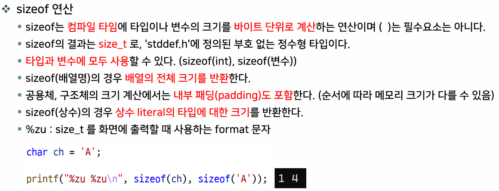
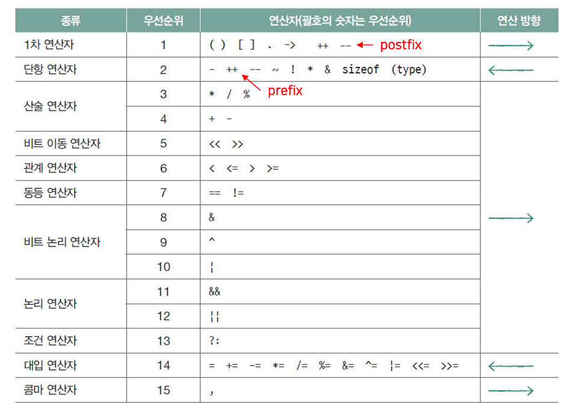
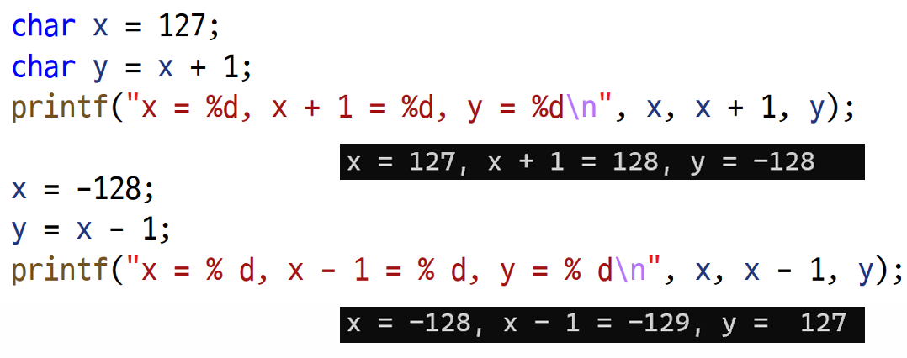
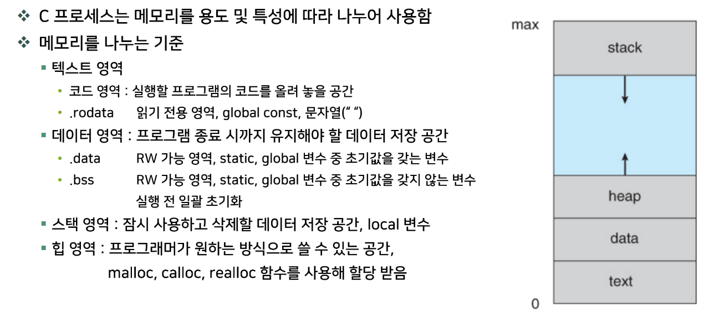
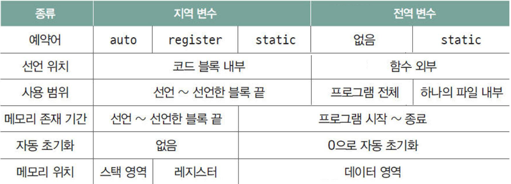
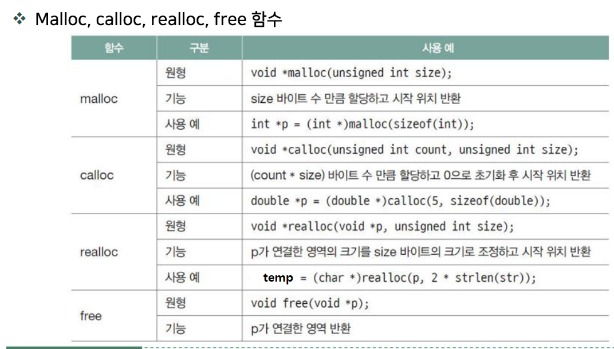

# C언어

- [C언어](#c언어)
	- [C언어 기본](#c언어-기본)
		- [함수 형태](#함수-형태)
		- [printf 함수 포맷](#printf-함수-포맷)
		- [기본 개념](#기본-개념)
			- [진법 사용 표현](#진법-사용-표현)
			- [보수 표현](#보수-표현)
			- [문자열](#문자열)
		- [변수의 개념](#변수의-개념)
			- [char형 변수, ASCII code](#char형-변수-ascii-code)
			- [char형의 포현 범위](#char형의-포현-범위)
			- [int형의 표현 범위](#int형의-표현-범위)
			- [실수형 변수](#실수형-변수)
			- [문자열](#문자열-1)
		- [연산자](#연산자)
			- [주소 연산자와 sizeof 연산자](#주소-연산자와-sizeof-연산자)
			- [const를 사용한 변수](#const를-사용한-변수)
			- [연산자의 종류와 우선순위](#연산자의-종류와-우선순위)
			- [short-circuit 원리](#short-circuit-원리)
			- [조건 연산자](#조건-연산자)
		- [비트 연산자](#비트-연산자)
		- [변수의 선언 및 연산](#변수의-선언-및-연산)
			- [/와 % 연산자](#와--연산자)
			- [복합 대입 연산자](#복합-대입-연산자)
			- [암시적/명시적 형변환](#암시적명시적-형변환)
			- [전위, 후위 연산자](#전위-후위-연산자)
			- [자동 형변환](#자동-형변환)
		- [조건 분기와 반복문](#조건-분기와-반복문)
			- [반복문 연습 코드](#반복문-연습-코드)
		- [함수](#함수)
		- [배열](#배열)
			- [배열의 선언과 초기화, 요소의 사용](#배열의-선언과-초기화-요소의-사용)
			- [문자를 저장하는 배열](#문자를-저장하는-배열)
		- [포인터](#포인터)
			- [포인터의 사용](#포인터의-사용)
			- [\[\], (), \*](#--)
			- [함수 포인터를 통한 호출](#함수-포인터를-통한-호출)
		- [c에서의 메모리](#c에서의-메모리)
			- [변수 사용 영역](#변수-사용-영역)
			- [분할 컴파일](#분할-컴파일)
				- [Call by value, Call by reference](#call-by-value-call-by-reference)
		- [다차원 배열](#다차원-배열)
		- [다중 포인터](#다중-포인터)
		- [메모리 동적 할당](#메모리-동적-할당)
		- [구조체](#구조체)
			- [구조체 멤버 정렬 (alignment)](#구조체-멤버-정렬-alignment)
			- [비트 필드 구조체](#비트-필드-구조체)
			- [자기 참조 구조체](#자기-참조-구조체)
		- [열거형 (enum)](#열거형-enum)
		- [전처리기, 매크로](#전처리기-매크로)
			- [#, ## 전처리 연산자의 사용](#--전처리-연산자의-사용)
		- [assert() 연산의 사용](#assert-연산의-사용)


## C언어 기본
### 함수 형태
```C
returnType functionName(argumentType argumentName, ...)
{
  //work here.
  return returnValue;
}
```

프로그램 진입점
```C
int main(void){return 0;}
```
|   함수 이름   | main  |
| :-----------: | :---: |
| 반환값의 종류 |  int  |
|  인자의 종류  | void  |
|    반환값     |   0   |

### printf 함수 포맷

|  데이터   |    예시     | 결과  |
| :-------: | :---------: | :---: |
|  문자열   |   "hello"   | hello |
| 제어 문자 |    "\n"     |   \   |
|   정수    |  "%d", 10   |  10   |
|   실수    | "%lf", 11.5 | 11.5  |

### 기본 개념
> 대소문자 구분함
> 명령어 끝에 ; 붙이기
> 사용자 함수 정의 가능
> 헤더 파일 포함해야함 (사용자 파일, 라이브러리 파일)
> printf, scanf, memcpy, strcpy 등 라이브러리 함수가 있음
> //, /**/로 주석 (한줄, 여러줄). 컴파일러는 전처리(preprocessing) 과정에 주석을 제거함

#### 진법 사용 표현
| 10진수 | 2진수  | 8진수 | 16진수 |
| :----: | :----: | :---: | :----: |
|   9    | 0b1001 |  011  |  0x09  |
|   10   | 0b1010 |  012  |  0x0A  |
|   11   | 0b1011 |  013  |  0x0B  |
|   12   | 0b1100 |  014  |  0x0C  |
|   13   | 0b1101 |  015  |  0x0D  |
|   14   | 0b1110 |  016  |  0x0E  |
|   15   | 0b1111 |  017  |  0x0F  |

#### 보수 표현
```
2의 보수
n의 보수 = a + a\`가 n이 되는 a\`

**0을 0000으로만 표현하여 공간을 아끼고, 음수 덧셈이 쉬워짐.**
```


#### 문자열
char 배열, char 포인터로 구현.
```C
char msg[2] = {"A"};
char* msg = "A";
// 배열의 경우 함수 호출 스택에 저장,
// 포인터의 경우 내용물은 .const 섹션에 있으므로 대입 불가 
```

### 변수의 개념
*변수 선언: 메모리를 할당하고 이름을 부여하는 것(함수 내 변수 == 스택 공간)
보관할 내용물과 그 크기 정보 == 자료형, type.*

*식별자의 이름: 문자로 시작, 특수 문자 및 숫자는 맨 앞에 못옴. _는 제외*

변수의 초기화, 선언 시 초기화 할 경우 .data에 저장, 안하면 .bss에 저장하고 시작 시 0으로 초기화(초기화 코드가 없다면 쓰레기 값).

변수에 대입: 변수에 상수, 다른 변수, 수식 대입 가능.
**expression: 변수, 상수 함수 호출, 연산자들의 조합은 값(value)로 평가, 수식은 값. 자료형이 유추 가능.**
**statement: python의 경우, 수식 대입은 조건문이 안됨.**
a[n][m];


*limits.h에 정수 타입의 범위를 정하는 매크로가 있음.*

#### char형 변수, ASCII code
line feed = 10 = 0x0a
carrige return = 14 = 0x0d
' ' = 32 = 0x20
esc = 033 = 0x1b
**'0' = 0x30**
**'a' = 0x41**
**'a' = 0x61**

#### char형의 포현 범위
```c
unsigned char uc1, uc2;
signed char c1, c2;

uc1 = -1; uc2 = 128;  // 255, 128 (-1 = 0b11111111)
c1 = -1; c2 = 128;    // -1, -128 (128 = 0b10000000 = -128)
```

#### int형의 표현 범위
```c
unsigned int a, b;
a = 4294967295;
b = -1;
%d, %s, a, a // -1, 429496725
%d, %s, b, b // -1, 429496725
모두 0xffffffff로 같다.
```

#### 실수형 변수
정확한 값을 표시할 수 있는 소수점 이하 자릿수.
| 자료형      | 유효 숫자   |
| ----------- | ----------- |
| float       | 7자리       |
| double      | 15자리      |
| long double | 15자리 이상 |

#### 문자열
문자열은 char배열에 저장, 마지막 자리는 0x00(NULL)을 위한 자리로 문자 갯수보다 1 이상 큰 배열을 확보.
### 연산자
#### 주소 연산자와 sizeof 연산자
**sizeof 연산자: 변수의 크기(byte 수)로 변환** ~~size_t의 출력 포맷 %zu~~
**& 연산자: 변수의 메모리 주소값** ~~주소의 출력 포맷 %p~~
> int a[4]가 있을 때,
> sizeof(a)는 16
> a와 &a는 값은 같지만, a는 (int*, int의 포인터), &a는 (int > *[4], 4크기 배열의 포인터)
> a = &a[0] (a의 첫번째 값의 주소값, int 자료형의 주소값)


패딩의 경우 4바이트 정렬, .align(4)
상수 'a': c에서는 int로 취급, c++에서는 1byte 크기.

#### const를 사용한 변수
- 초기값을 수정할 수 없음.
- 그 식별자 변수만 상수화 하는것으로 메모리를 고정하는게 아님. (read-only section으로 저장하는 기능이 없다.)
```c
const int num = 10;
int *p = &num;
*p = 100; // num은 100
```
```
// 내가 알고 있던 것.
int const *a; // int형 상수의 포인터 a, a의 내용물을 상수 int로 다룸
int (*const a); // (int형)의 상수 포인터 a, 포인터를 바꿀 수 없음.

// 이번에 배운 것.
int const* a; // (상수 int형)의 포인터 a, *a를 바꿀 수 없음
int* (const a); // int 포인터형 상수 a, a(int형 포인터)를 바꿀 수 없음


const int (*const a); // (상수 int형)의 상수 포인터 a, a(int형 포인터)와 *a(상수 int)를 바꿀 수 없음.
const int* (const a); //  (상수 int형)포인터의 상수 a
```


#### 연산자의 종류와 우선순위
우선순위는 결합의 우선순위

```c
*p++; 
// "mov rax, [p]"
// "inc p"
++*p;
// "inc [p]"
// "mov rax, [p]"
```

후치 > 전치

다른 자료형 끼리의 연산은 자동으로 변환됨. 암시적 형변환 사용.
(int + float 는 float)
(uint8_t < int8_t는 uint8_t)
unsigned가 범위가 더 크니까?

#### short-circuit 원리
a && b, a가 거짓이면 b는 연산 안함.
a || b, a가 참이면 b는 연산 안함.
**응용**
*NULL pointer detection*
> ptr != NULL && (asdf)

*array index validation*
> i >=0 && i <= size && (asdf)

#### 조건 연산자
```c
 (조건)?(참이면):(거짓이면); 
```
### 비트 연산자
**and**
| a    | b    | answer |
| :--- | :--- | :----- |
| 0    | 0    | 0      |
| 0    | 1    | 0      |
| 1    | 0    | 0      |
| 1    | 1    | 1      |

**xor**
| a    | b    | answer |
| :--- | :--- | :----- |
| 0    | 0    | 0      |
| 0    | 1    | 1      |
| 1    | 0    | 1      |
| 1    | 1    | 0      |

**or**
| a   | b   | answer |
| --- | --- | ------ |
| 0   | 0   | 0      |
| 0   | 1   | 1      |
| 1   | 0   | 1      |
| 1   | 1   | 1      |

**not**
| a   | answer |
| --- | ------ |
| 0   | 1      |
| 1   | 0      |


| 구분      | 연산자 | 기능                                                           |
| :-------- | :----- | :------------------------------------------------------------- |
| bit logic | &      | 각 비트들에 대하여 and 연산                                    |
| bit logic | ^      | 각 비트들에 대하여 xor 연산                                    |
| bit logic | \|     | 각 비트들에 대하여 or 연산                                     |
| bit logic | ~      | 각 비트들에 대하여 not 연산                                    |
| bit shift | <<     | 비트 왼쪽으로 이동 (정수 값 두배), 0으로 패딩                  |
| bit shift | >>     | 비트 오른쪽으로 이동 (정수 값 절반), 양수는 0, 음수는 1로 패딩 |

### 변수의 선언 및 연산
[참조](#char형의-포현-범위)
[참조](#int형의-포현-범위)

연산 시 value는 4byte int로 다루어 연산 후 대입.
**127 + 1 = 0x80 = 0b10000000이되고 char에 대입 시 -128이 됨.
printf로 넘어가는 인자는 int 레지스터에 다루므로, 1~3 byte에 부호 비트의 1을 모두 패딩하여 0xffffff80이 되어 그 값은 -128이 됨.**

**-128은 0x80, y에 0xffffff80 + 0xffffff를 시행 후 0xffffff7f, 0x7f를 대입하게 됨.**

#### /와 % 연산자
#### 복합 대입 연산자
[연산자 우선순위](#연산자의-종류와-우선순위)
결합의 우선순위가 매우 낮고 오른쪽부터 시행,
#### 암시적/명시적 형변환
(자료형)변수 형태로 변수를 형변환.
#### 전위, 후위 연산자
#### 자동 형변환
일단 int보다 작으면 int로 형변환. 
(정수의 승격, Integral Promotion)
같으면 signed를 unsigned로 형변환.
float int, 정수를 float로 형변환.
대입되는 변수쪽 자료형으로 변환되어 저장.

### 조건 분기와 반복문
> 조건문: if-else, switch
반복문: while, do while, for

- if-else: 조건에 따라 jmp를 통해 분기.
- **조건문은 파일 크기, 메모리 용량, 호출/연산 오버 헤드 등 성능이 달라질 수 있다.**
- switch-case: if-else 체인 대신 사용, 내부적으로 해시 테이블 구현?

- **깊은 반복문의 경우 함수로 분리하여 조건 만족(if내부에서) 시 낭비되는 조건 연산, 반복을 하지 않고 return하도록 한다.**
- 마찬가지로 continue, break를 사용한다면 if뒤에 else를 사용하지 않는게 좋다. **(평시에 불필요한 else 연산을 해야함.)**
- 무한 반복문은 while(1) 보다 for(;;)를 권장한다.
- volatile 키워드, 컴파일러 명령어로 해당 변수, 함수를 최적화(캐싱, 생략 등) 하지 않고 그대로 시행하도록 함.

#### 반복문 연습 코드
```c
// 내 코드
int passwordproc(void)
{
	unsigned int password =  1357;
	unsigned int input;
	printf("input password\r\n");
	int i = 0;
	while(i < 3)
	{
		printf("try %d : ", i + 1);
		scanf_s("%d", &input);
		if (input > 9999 || input < 1000) // 4 digit check. (!(input < 9999 && input > 1000))
		{
			printf("password is 4 digits.\r\n");
			continue;
		}
		if (input == password) 
		// return, continue, break가 있다면 else 불필요 (불필요 jmp 코드 존재)
		{
			printf("authentication sucess.\r\n");
			return 1;
		}
		printf("password is not correct.\r\n");
		i++;
	}
	printf("authentication failed. terminated.\r\n");
	return 0;
}
```
```c
// 다른 코드 반영
int passwordproc1(void)
{
  // 상수
	const unsigned int password = 1357;
	const char *string[] = { "failed", "sucess" };
  // 내부 상태, 제어 변수
	int state = 0; 
	int try = 3;
	unsigned int input;

	while (try)
	{
    printf("try %d", 4 - try);
		scanf_s("%d", &input);
		if (input == password)
		{
			state = 1;
			break; // return 대신 break
		}
    try--;
		printf("%d chance left: ", try);
	}

	// 판별 변수로 일괄 동작
	printf("authentication %s.\r\n", string[state]);
	return state;
}
```
```c
int passwordproc2(void)
{
	unsigned int password = 1357;
	unsigned int input;
	char* string[] = { "관리자에게 문의하세요.", "로그인 성공!" };
	int try = 3;
	int state = 0;
	while (try--)
	{
		scanf_s("%d", &input);
		if (input == password)
		{
			state = 1;
			break;
		}
	}

	printf("%s\r\n", string[state]);
	return state;
}
```
### 함수
인자들을 넣고 호출하여 기능 수행. 호출 오버헤드가 존재하지만 기능 구분으로 생산성 증대.
단일 기능을 하도록 설계 권장.
결합도 응집도

| 구분 | 예시                                        | 설명                                                                                  |
| ---- | ------------------------------------------- | ------------------------------------------------------------------------------------- |
| 선언 | ``` int sum(int, int) ```                   | 컴파일러에게 함수의 형태를 알린다. 원형에 ; 붙이기. 선언 시 인자의 이름은 없어도 작동 |
| 정의 | ``` int sum(int a, int b){return a + b;}``` | 함수의 동작을 정의.                                 블록 안에 기능을 구현.            |
| 호출 | ``` sume(10, 20);```                        | 함수에 필요한 인자를 전달.                                                            |

- 함수 선언은 원형에 ';'을 붙여 하게 되며 매개변수명은 생략 가능.
- 호출 전에 선언하며 컴파일러에 함수 원형에 대한 정보를 제공한다.
- 호출할 때 인수의 형태와 개수 검사를 한다. (무조건 순서, 형태, 개수를 맞춰야 하며 기본값은 적용되지 않는다.)
- 호출한 곳에 반환 값의 형태에 맞는 임시공간을 확보하게 된다. (rax로 전달?)

### 배열
- **동일한 자료형의 메모리를 여러개 할당한 것.**
연속된 변수라고 생각.
- 이름과 인덱스를 가지고 각 요소에 접근 할 수 있음.

1. 자료형
2. 주소값
3. 배열의 길이
런타임에는 배열의 길이가 사라짐 (암시적으로 존재).

- 다차원 배열의 차원은 공간의 차원과는 별개이며, 이는 사용자가 정의하여 쓸 수 있다. 
- > (예) pixel[색상 요소][가로][세로/8] 이런것이 가능함.
- 배열의 이름은 대상 자료형을 다루는 포인터로 쓸 수 있다.
- **(배열의 이름 값은 0번째 요소의 주소값이고 다만 포인터 변수가 아니며 포인터 자료형의 상수이다.)**
```c
arr == &arr[0];
int* parr = arr;
```
#### 배열의 선언과 초기화, 요소의 사용
- 배열의 선언
```c
int arr[5];
```
- 배열 요소의 사용
  - 배열의 요소는 인덱스로 접근하며, 인덱스는 0부터 시작해서 최대는 (요소의 수 - 1).
```c
arr[0];
arr[1];
arr[2];
arr[3];
arr[4];
// arr[5]는 배열의 범위를 벗어난 접근
```

- 배열 초기화
  - 중괄호 안에 초기값을 나열하면 (리터럴) 앞에서부터 초기화된다.
  - 요소의 수보다 초기값이 적으면 남는 요소는 0으로 초기화된다. (더 많으면 error)
  - 선언 시 초기화하면 요소의 수를 생략하고 선언 할 수 있다.
```c
int arr[5] = {1,2,3,4,5};
int arr1[5] = {1,2,3};
int arr2[] = {1,2,3}; // sizeof(arr2)/sizeof(int) = 3
int arr3[10] = { [0] = 12, [7] =12};
int arr4[10] = { [5] = 12, 1, 2, 3};
```

#### 문자를 저장하는 배열
- 문자열을 저장하는 배열은 문자열의 길이보다 적어도 1 더 커야한다.
- - 문자열의 마지막을 알리는 '\0'을 넣어야 한다.

```c
void strcpy(char* dst, char* src);
strcpy(str, "raw string");
```

### 포인터
- 포인터는 어떤 주소값과 암시적으로 그 자료형을 가지고 있음.
- 포인터와 정수의 덧셈 뺄셈, (같은 자료형을 다루는) 포인터간의 뺄셈이 가능함.
  - 포인터에 덧셈, 뺄셈은 1이 움직일 때 그 자료형 크기 만큼의 값이 움직임. 
  - 포인터간의 뺄셈은 대상 자료형 몇 개의 차이인지를 반환.
- 배열의 이름은 포인터로 다루며, 포인터 방식으로 접근이 가능하다. (배열 등가 포인터)
- **(배열의 이름 값은 0번째 요소의 주소값이고 다만 포인터 변수가 아니며 포인터 자료형의 상수이다.)**
```c
int arr[5];
arr[2] == *(arr+2);
```
**배열 포인터**
```c
int (*p)[5]; // int 5개짜리 배열의 포인터
```
**포인터 배열**
```c
int *p[5]; // int 포인터의 배열 
```
**함수 포인터**
```c
int (*fp)(int,int); // int를 반환하는 int 두개를 받는 함수의 포인터
```

```c
int* (*a[5])(int*); // int* 반환하는 int*를 받는 함수의 포인터들의 배열[5]
int* (*a[5])[5](int*); // 컴파일 에러(배열이면서 함수)
int* (*a[5])(int*)[5]; // int*[5]를 반환하는 int*를 받는 함수의 포인터 배열[5]
```

#### 포인터의 사용
- 상수인지 변수인지 파악한다.
  - 상수는 대입할 수 없고, 변수는 대입과 사용 가능.
- 자료형의 정보를 파악한다.
- 가리키는 메모리 특성을 파악한다.
- 가리키는 자료형의 정보는 언제든 변경할 수 있다.
  - 포인터의 경우 형 변환은 자료형의 정보만 변하는 것이기 때문에 정보의 loss가 없다. (int를 char로 바꿀시 상위 3바이트 소멸)
  - 효율적인 동작을 하도록 하기 위해 변경 가능.
  - void 형 포인터는 반드시 형변환이 필요하다.


**배열 등가 포인터**
- 배열의 이름은 포인터로 다루거나, 포인터를 배열 처럼 다룰 수 있음.
- 다만 배열의 이름은 포인터 상수로 다른 값을 넣을 수 없고,
sizeof로 변환 시 배열(포인터 상수)은 배열이 쓰는 크기, 포인터는 주소값의 크기(4또는8 바이트)를 반환.

#### [], (), *
선언 시에는 modifier(수식어)로 사용
```c
int *a;
int a[4];
int a(int num);
```
수식에서는 연산자로 사용
```c
*a;
a[1];
a(3);
```
배열의 이름은 포인터 상수.
함수의 이름은 포인터 상수.
[참조-주소 연산자와 sizeof 연산자](#주소-연산자와-sizeof-연산자)
char str[5] = {"asdf"};
scanf("%s", &str) 이 되는 이유, str은 int\*형의 포인터 상수, &str은 배열의 포인터(int (*)[5])지만 값은 같은 &str[0]를 가리킴.


```c
int (*(*ap)(void))(void); // pointer of func returning pointer of function returning int, right-left 방식
char *(*(*var)(void))[10]; // char*를 가진 array[10]'s pointer를 반환하는 함수의 포인터
int (*(*ap)[10])(); // int 반환 함수의 포인터의 열개짜리 배열의 포인터
```

#### 함수 포인터를 통한 호출
```c
int func(int num){return num;}
int (*fp)(int) = func;
*fp(123); // error: *의 피연산자는 int 일 수 없다. 즉 fp는 int (*)(int), 주소값 int로 수식.
(*fp)(123); // 123
(******fp)(123); // 123
```

```c
int* func3(void)
{
	int arr[5] = {10,20,30,40,50};
	return arr;
}
<main>:
printf("%d\r\n", func3()[3]); // warning 함수가 종료되었지만 그 배열을 참조하고 있음.
```
함수 내 배열을 static 변수로 정의하면 해결. (정적할당)

*문제 실습*
```c
배열 포인터
배열 a는 int 자료형을 갖고 있는 5개의 배열이다.
배열 a의 메모리 주소값은 0x1000 이다.
printf(”%d\n”, &a+1); 을 했을 때 출력되는 값은?
답: 0x1014

int* function(void)
{
	static int arr[5] = {0,1,2,3,4};
	int* ptr = arr;
	return ptr;
}

int function(void)
{
	int arr[10] = {0};
	int* ptr = arr;
	return &arr[3] - ptr;
}
반환값은? 3


int* function(void)
{
	static int arr[10];
	int *ptr;
	ptr = arr + 5;
	ptr++;

	return ptr;
}
arr의 주소값이 0x1000일 때, 반환값은? 0x1018

int main(void)
{
	int a[6] = { 10, 20, 30, 40, 50 };
	int b = 60;
	int *pa = a;
	while(*pa)
	{
		printf("%d\n", ___________);
	}
	return 0;
}
*pa++

int ary[5] = { 10, 20, 30, 40, 50 };
int *pa=ary;
printf("%d\n", *pa); 
pa = pa + sizeof(*pa); 
printf(”%d\n”,*pa);
답: 10, 50

char* to_upper(char* str)
{
	char* save = str;
	char c;
	while(c = *str)
	{
		if (c >= 'a' && c <= 'z') *str = c ^ 0x20;
		str++;
	}
	return save;
}
```
- 문자열 배열은 저장 공간을 스택에 가지고 있고
- 문자열 상수는 rodata 영역에 가지고 있다.
| 구분           | char*                    | char[]                 |
| -------------- | ------------------------ | ---------------------- |
| 선언 및 초기화 | char*pc = "mango"        | char str[80] = "mango" |
| 대입           | pc = "banana"            | strcpy(str, "banana")  |
| 크기           | 4                        | 80                     |
| 수정           | pc[0] = 't'(불가능)      | str[0] = 't'           |
| 입력           | scanf("%s", pc) (불가능) | scanf("%s", str)       |

*문자열 처리 함수 연습*
```c

char* my_strcpy(char* dst, const char* src)
{
  char* save = dst;
  for(;*dst = *src; ++dst, ++src);
  return save;
}

int my_strlen(const char* src)
{
  const char* s = src;
  if(!src) return 0;
  for(;*s;++s);
  return s - src; 
}

int my_strcmp(const char* s1, const char* s2)
{
  if( !s1 || !s2) return 0;
  for(;*s1 == *s2;++s1, ++s2)
  {
    if( !(*s1) ) return 0;
  }
  int c = ( *s1 - *s2 );
  return (c>0)-(c<0); 
}
// (c >> 31|1)
// ( (c>0) << 1) - 1

char* my_strcat(char* dst, const char* src)
{
  char* s = dst;
  for(;*dst;++dst);
  while((*dst++ = *src++));
  return s;
}

char* my_strncat(char* dst, const char* src, int n)
{
  char* s = dst;
  for(;*dst;++dst);
  for(;n;--n, ++dst, ++src)
  {
    *dst = *src;
  }
  return s;
}
```

### c에서의 메모리

#### 변수 사용 영역

- 지역 `static`: 정적 할당, 지역 변수로 선언해도 함수 외부에서 사용 가능하며, 선언 시 초기화는 한번만 시행됨. 복잡한 연산값을 저장해 두고, 다음 호출에서 연산을 피하고자 사용.
- 전역 `static`: 전역 변수로 선언 시, 해당 c파일에서만 사용 가능한 변수로 취급.
- `extern`: 외부 파일의 전역 변수를 가져옴, 초기화 되지 않은 전역 변수는 자신이 초기화하여 .data 섹션에 넣는것이 가능하지만 추천되지 않음.
- 블럭 `{}`: 블럭은 함수 내부뿐 아니라, {}으로 두르면 블럭으로 여긴다. 해당 스코프에서 정의된 변수는 지역 변수이다.
- `register`:
  - 전역 변수로 선언 불가.
  - 주소를 알 수 없다.
  - 실 사용 여부는 컴파일러가 결정한다.


**정적지역변수의 사용 예**
memoization, dynamic programing.
지역 배열을 static으로 선언하여 재귀 호출 memoization을 활용하는 예  
```c
int factorial(int n )
{
	static int memo[100] = {0};
	if (n == 0 || n == 1) return 1;
	if ( memo[n] ) return memo[0];
	memo[n] = n * factorial(n-1);
	return memo[n];
}
```

#### 분할 컴파일
- 여러 기능들을 여러 개의 파일 단위로 묶어서 작성.

##### Call by value, Call by reference
함수 호출 시:
- 값을 넘겨주면, 복사해서 가져가서 사용.
- 주소를 넘겨주면, 해당 주소값을 가지고 참조하여 사용, 변경.


### 다차원 배열
**배열 포인터**
```c
int a[n][m];
int** b = a; // 오답

int* b = a;  // 부분적 답
b[n*m] 형태로 사용

크기가 정해진 배열의 포인터
int*b[m] = a; // 답
**a 는 int (\*)[m], 값은 &a[0][0], 연산에 사용 시 int (\*)[m]**

a + 1  // 4*mbyte 증가
&a + 1 // 4*n *m byte 증가
*a + 1 // 4 byte 증가, *a는 int\*

int* c = a[0];
c == *a == a[0]; // c는 포인터, *a와 a[0]는 배열 등가 포인터
c + 1 == *a + 1;
c[1] == *a[1];
*a[0] == a[0][0] == c[0]
```

*2차원 배열 등가 포인터 응용*
```c
int a[3][4]; 일때
1. int(*p)[4] = a;					// a의 배열 등가 포인터, 배열의 포인터
2. int* p = *a;
3. int* p = a[0];
4. int p = *a[0];           // 1, a의 0번째 배열의 0번 내용물
5. int p = (*a)[0];         // 1, a의 0번째 내용물(배열)의 0번 내용물
6. int p = *(*(a+1)+0);     // 5
7. int p = (*(a+1))[0];     // 5 
8. int p = *(*(a+0)+2);     // 3, a[0][2]
9. int p = (*a+2)[0];       // 3, *(a[0]+2)
10. int p = (*(*a)+1);      // 2 
11. int (*p)[4] = &(a+1)[2]// 1048 out of range
12. int *p = *a+1;          // 1004
13. int *p = (a+1)[2];      // *((a+1)+2), 1048 out of range
14. int *p = &(*a)[0];      // 1000 
15. int *p = a[1]+2;        // 1024
16. int *p = &*(*(a+2));    // 1032 == &d[0]
```
~~참조~~
> 배열 등가 포인터 변수는 []를 떼고 *를 붙인 타입으로 선언.
> 함수 등가 포인터는 이름을 ()로 덮고 *를 붙인 타입으로 선언

- 배열을 인자로 보낼떄는 배열 그 자체가 아닌 배열 등가 포인터를 인자로 보냄. 함수 내의 블록에서는 배열 등가 포인터 변수이다.
- `int arr[][4] == int(*arr)[4]` 함수의 인자에서는 포인터지만 배열처럼 표현 할 수 있다. (포인터를 배열처럼 사용.)

*다차원 배열 등가 포인터 실습*
```c
int (*pa)[3][4] = a; 		// int a[2][3][4];
int (**pb)[4] = b;			// int (*b[3])[4];
int* (**pc)(int*) = c; 	//int* (*c[2])(int*);
int* (*pd)[4] = d; 			// int* d[3][4];
int (*(**pe)(void))[4] = e; // int(*(*e[5])(void))[4];
```

*포인터 참조와 전위, 후위 연산자 문제*
```c
*ptr++; 	// expression *ptr; ptr+=1;
*ptr+1;		// expression (*ptr) + 1;
++*ptr;		// (*ptr)+=1; expression *ptr;
*(ptr+1) 	// expression ptr[1]; 
*ptr+=1		// (*ptr)+=1; expression *ptr;
*++ptr		// ptr +=1; expression *ptr;
(*ptr)++	// expression *ptr; *ptr+=1;
```
*문자열 배열 등가 포인터 문제*
```c
char *ptr[] = {"red", "orange", "pink", "white", "blue", "brown", "black", "gray"};

printf("%c\n", **ptr );
printf("%s\n", ptr[1] );
printf("%s\n", ptr[1] + 3);
printf("%c\n", *(*(ptr+1) + 1) );
printf("%c\n", ( *(*(ptr+2) + 1)) );
printf("%s\n", ptr[3] + 2);
```

> r
> orange
> nge
> r
> i
> ite
 
### 다중 포인터
- 포인터 타입을 가리키는 포인터.
- 다중 포인터 변수는 포인터 변수의 주소 값을 받음.

```c
void func(int** app, int** bpp)
{
  int* temp = *app;
  *app = *bpp;
  *bpp = temp;
}

void func2_old(int* app, int* bpp) 
// x86-64 환경에서 8byte 포인터를 4byte int로 취급하여 상위 4바이트 손실
{
  int* temp = *app; //*app는 a의 주소값(8byte)을 int로 형변환된 값
  *app = *bpp;
  *bpp = temp;
}

void func2(int** app, int** bpp)
{
  int temp = **app;
  **app = **bpp;
  **bpp = temp;
}

int main(void)
{
  int a = 10;
  int b = 20;
  int *ap = &a;
  int *bp = &b;
  printf("%p %p \r\n", ap, bp);
  func(&ap, &bp);
  printf("%p %p \r\n", ap, bp);


  printf("%p %p \r\n", ap, bp);
  func2(&ap, &bp);
  printf("%p %p \r\n", ap, bp);

  return 0; 
}
```
### 메모리 동적 할당

- realloc은 기존 주소 뒤에 충분한 공간이 있다면, 기존 주소 뒤에 메뫼리를 확장한다. (힙 관리 테이블에서 사용공간의 크기만 변경)
- 충분하지 않다면 다른 메모리를 할당 후 내용물을 복사 및 새 주소 반환, 이후 기존 메모리는 힙 관리 테이블에서 제거.
- 할당 불가 시 NULL 반환 (기존 메모리 변경 없음.)
- > p = realloc(p, size);	// 실패 시 NULL 대입, 기존 p의 메모리는 누수

### 구조체
- 구조체는 여러 종류의 멤버 변수를 가질 수 있는, 자료형들의 묶음.
- 정의 후 새로 변수 선언을 해서 사용. (익명 구조체는 바로 사용.)

*typedef*
- typedef a b;, a라는 자료형을 b라는 이름의 자료형으로 사용. a에는 자료형, 배열, 구조체 등 원하는 자료형, b는 원하는 이름.

- . 연산자로 구조체의 멤버 변수에 접근.
- -> 간접 멤버 참조 연산자로 구조체 포인터에서 해당 구조체의 멤버 변수에 접근.

| (struct student*)stu |
| -------------------- |
| &p0                  |
| &p1                  |
| &p2                  |
| &p3                  |
| &p4                  |

in heap,
p0: (struct student)
| (int)id | (int*)scores | (char*)name |
| ------- | ------------ | ----------- |
| 1       | &p0.score    | &p0.name    |

p1:
| (int)id | (int*)scores | (char*)name |
| ------- | ------------ | ----------- |
| 2       | &p2.score    | &p2.name    |

p2:
| (int)id | (int*)scores | (char*)name |
| ------- | ------------ | ----------- |
| 3       | &p3.score    | &p3.name    |

p3:
| (int)id | (int*)scores | (char*)name |
| ------- | ------------ | ----------- |
| 4       | &p4.score    | &p4.name    |

p4:
| (int)id | (int*)scores | (char*)name |
| ------- | ------------ | ----------- |
| 5       | &p4.score    | &p4.name    |

p0.score: 
(int[])
| [0] | [1] | [2] |
| --- | --- | --- |
| 90  | 80  | 76  |

p0.name: (char[])
| [0] | [1] | [2] | [3] | [4] | [5] |
| --- | --- | --- | --- | --- | --- |
| 'j' | 'a' | 'm' | 'e' | 's' | 0   |


#### 구조체 멤버 정렬 (alignment)
- 가장 큰 자료형의 배수형으로 증가한다.
- 멤버가 char, short, char[]로만 구성된 경우 필요한 바이트 만큼이 align 된다.

#### 비트 필드 구조체
```c
struct {
	int a : 8;
	int b : 8;
	int c : 6;
	int d : 10;
}
```
- 비트별로 구분하여 사용할 필요가 있을 때 사용 (예: 비트 마스킹)
- 여러 정보를 하나의 변수에 넣을 때 사용.
- 통신 패킷에서 헤더 등에 비트 단위로 정보를 다룬다.
```c
struct {
	unsigned a : 8;
	unsigned  : 8;
	unsigned c : 6;
	unsigned : 0;
}
```
- 이름이 없는 비트는 공간은 할당하지만 사용하지 않는다.
- 이름 없고 0으로 설정된 비트는 사용 중이던 (자료형)공간을 사용하지 않고 넘기라는 의미. (force alignment to next boundry)

#### 자기 참조 구조체
- **구조체 자신에 대한 포인터를 가진 구조체**
- 같은 종류의 다른 구조체에 대한 정보를 소지함으로써 묶임.


### 열거형 (enum)
- 값(정수)들을 이름(식별자)를 이용해 나열해 놓은 것.
- 가질 수 있는 값들이 정해져 있으면 사용 시 가독성 면에서 좋음.
- 즉시 변수 선언 시 익명 열거형 선언 가능 (구조체와 같음)
- 열거형 이름, 또는 변수 없이 멤버 이름만으로 접근 가능, int 상수 처럼 사용 가능.

### 전처리기, 매크로
전처리기 지시자 매크로
*매크로는 문자열을 직접 치환한다. 매크로 함수의 경우 연산자 결합 우선순위가 의도와 다르게 될 수 있으므로 ()로 감싼다.*
header:
- #include : 주어진 파일을 현재 파일에 포함시킴
macro:
- #define : 매크로 상수를 정의
- #undef : 정의된 매크로 상수 제거
conditional compile:
- #ifdef : 매크로가 정의되어 있으면 실행
- #ifndef : 매크로가 정의되어 있지 않으면 실행
- #if : 조건이 참이면 실행
- #elif : #if 가 거짓이면 비교, 참이면 실행
- #else : #if or #ifdef 등이 거짓이면 실행
- #endif : #if, #ifdef 등의 끝을 가리킴
others, for programmer:
· #line : `__LINE__`, `__FILE__`의 내용을 바꿈
- #error : 오류 메시지 출력 후, 컴파일 중지
- #pragma : 컴파일 선택 사항을 지시하는 명령
전처리 과정은 상단부터 순차적으로 문자열 입력을 받는 인터프리터로 #endif 등이 필요함.

| 이미 정의된 매크로 | 가능                               |
| ------------------ | ---------------------------------- |
| `__FILE__`         | 전체 디렉터리 경로를 포함한 파일명 |
| FUNCTION           | 매크로명이 사용된 함수 이름        |
| LINE               | 매크로명이 사용된 행 번호          |
| DATE               | 컴파일을 시작한 날짜               |
| TIME               | 컴파일을 시작한 시간               |

#### \#, \#\# 전처리 연산자의 사용
\#: \# 뒤의 글자를 겹따옴표로 둘러쌈.(러문자열로 만듬) `STRING(x) #x -> "abcd"`
\#\#: 여러 단어들을 합침. 모든 용법으로 사용 가능.(변수 함수 배열 이름 등) `CAT(a, b) a_##b -> a_b`
\#@: 글자를 욋따옴표로 둘러쌈. `TOCHAR(x) #@x -> 'x'`

### assert() 연산의 사용
#include <assert.h>
`void assert(int expression);`: expression이 false일 경우 stderr에 오류 메세지 전송.

#define NDEBUG를 <assert.h>를 포함하기 전에 정의하면 모든 assert()문이 무시된다.