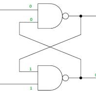
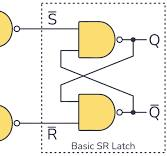

# FPGA (Field Programmable Gate Array)

- [FPGA (Field Programmable Gate Array)](#fpga-field-programmable-gate-array)
  - [Knoewledge Base](#knoewledge-base)
    - [FPGA 개념](#fpga-개념)
    - [주요 논리회로](#주요-논리회로)
      - [조합회로](#조합회로)
      - [순차회로](#순차회로)
        - [latch](#latch)
        - [Flip-Flop:](#flip-flop)
  - [Verilog and FPGA SDE](#verilog-and-fpga-sde)
    - [Verilog HDL](#verilog-hdl)
      - [Syntax](#syntax)
      - [always if-else, case Mux](#always-if-else-case-mux)
    - [Vivado](#vivado)
      - [build](#build)
      - [Simulation과 Synthesis](#simulation과-synthesis)
  - [Vitis](#vitis)
    - [핵심 요약](#핵심-요약)
  - [petalinux-\*](#petalinux-)

## Knoewledge Base 

### FPGA 개념

FPGA가 개념적으로는 하드웨어 구성하는 배선을 HDL (하드웨어 표현 언어)를 통해 설계한다고 말하지만, 실제로는 SRAM LUT에 .bit 파일을 불러와 넣고 입력 조합은 decoding 하여 Look-Up-Table (LUT) 테이블의 주소 역할, 출력은 해당 주소의 값을 출력하는 방식으로 작동한다.
IP: 작동하게끔 설계되어 즉시 사용할 수 있는 하드웨어 블록 모듈, 그 디자인. PL에서의 라이브러리라고 보면 된다.

### 주요 논리회로

#### 조합회로

1. 덧셈기
   1. 반가산기
   2. 전가산기
2. 뺄셈기
  1. 비교기
  2. ALU
3. 디코더
4. 선택기, multiplexer, mux

#### 순차회로

##### latch




1. SR latch
   - NOR
   - NAND
    - (0, 1), (1, 0)을 줄 경우 저장된 신호 반전
    - (1, 1)을 줄 경우 신호 유지
    - !S와 !R에 (0, 0)을 줄 경우 정의되지 않은 동작
2. D latch
   - SR latch의 정의되지 않은 입력을 제거한 latch, NAND 두개와 인버터를 추가 사용.
   - 저장할 신호 1 또는 0을 주는 D
   - D 저장을 활성화 하는 En (클럭으로 활성화)

##### Flip-Flop:

1. D Flip-Flop
2. T Flip-Flop: Deprecated

**D Flip-Flop**

D latch의 경우 En이 High level인 동안의 모든 D 입력이 지속적으로 적용.
플립플랍의 경우 트리거를 레벨이 아닌 엣지로 작동하도록 함.

## Verilog and FPGA SDE

### Verilog HDL

 디지털 회로의 구조와 동작을 기술하기 위한 HDL (Hardware Description Language).
논리 회로에 대한 기술 언어이므로 명령어를 실행하는 것이 아닌 정적인 설계 언어.

#### Syntax

- `module`: The module is the basic unit of logic description
  - wire or reg declarations
  - behavioral, data flow, gate-level constructs
  - lower-level module instantiations
- `input` : 모듈 내에서 입력 정의, 기본 wire 정의와 같음
- `output`: 모듈 내에서 출력 정의, 기본 wire 정의와 같음
- `assign`: data flow 방식의 구축
- `xor()`, `and()` 등의 논리 연산: gate-level 구축
- `wire`: 모듈간의 입출력 연결
- `reg`: 변수 역할을 하는 공간, 실제 하드웨어 구현은 전부 다를 수 있음.
- `#1 `: timescale 단위마다 동작, behavioral 문법, 소프트웨어적 시뮬레이션으로 동작, 
- `timescale ns / ps`: 이 경우 ns마다 동작, ps 단위로 시뮬레이션
- [3:0]: bus 선언, 같은 이름의 input, output을 배열형태로 구분
- `{양 {원본}}`: 복사, 양만큼 똑같이 만들어 나열한다.
- `{하나,둘}`: 두개를 묶는다.
- `always`: behavioral한 명령문.
  - `@(A, B, Cond)`, `@ *`: A, B, Cond가 변하면 작동, 모든 변화에 작동.
- `begin`, `end`: 코드 블록 {}의 역할.
- `if-else`: 우리가 아는 if-else 문, 
- `case`, `endcase`: 우리가 아는 switch-case 문, 그 어떤 경우도 아닌 것 (default)에 대해 정의되지 않으면 `latch inference`

#### always if-else, case Mux

그 어떤 경우도 아닌 것에 대해 정의되지 않으면 `latch inference` 발생
*latch inferece*: 특정 입력 조건에서 출력이 정의되지 않는 경우, 명시적으로 값을 유지해야 한다고 해석하여 의도하지 않은 latch가 배치된다. 이로 인해 타이밍 분석 실패, 레이스 컨디션, 예측 불가능한 회로 Glitch가 유발된다.
`default assignment`가 필요함.

**if-else**
```verilog
// default assignment: constant value
always @ *
  if (sel == 2'b00) y = a;
  else if (sel == 2'b01) y = b;
  else if (sel == 2'b10) y = c;
  else y = 1'bx;      // 값이 뭐가 나오는 상관 없는 경우 상수 x, z 등 사용.
```

```verilog
// Alternate default approach: already substituted value
always @ *
begin
y = 1'bx;
  case (sel)
    2'b00: y = a;
    2'b01: y = b;
    2'b10: y = c;
    default: y = d;
  endcase
end
```

```verilog
// Alternate default approach
always @ *
begin
  en1 = 0;
  en2 = 0;
  en2 = 0;
  en2 = 0;
  if      (sel == 2'b00) en1 = a;
  else if (sel == 2'b01) en2 = b;
  else if (sel == 2'b10) en3 = c;
  else if (sel == 2'b11) en4 = c;
end
```
default assign으로 해도 위의 각 경우에서 (en1 대입하는 경우) en2, en3, en4에 대해 정의 되지 않으면 latch inference.
Alternate default assign으로 대입하는 게 간편하고 가독성이 좋고 선명함.


### Vivado

*Xilinx Vivado*
Xilinx 사에서 제공하는 PL 영역 설계 프로그램.

#### build

- `합성 (Synthesis)`
  - 개념: RTL(HDL) 코드를 FPGA 내부의 마이크로-아키텍처, 물리적 최소 단위 부품(LUT, Flip-Flop, MUX, Block RAM, DSP48E1 등)의 기술망(Netlist)으로 변환하는 단계입니다.
- `구현 (Implementation)`
  - 개념: 합성된 기술망(Netlist)을 Zynq-7010 FPGA 내부의 실제 물리적 위치에 배치하고(Placement), 금속 배선선으로 전기적으로 연결(Routing)하는 과정입니다.
    - Opt Design: 불필요한 로직을 제거하고 최적화합니다.
    - Place Design: 합성된 LUT와 FF들을 FPGA 슬라이스(Slice)의 몇 번째 CLB 좌표에 올려놓을지 물리적 위치를 정합니다.
    - Route Design: 결정된 CLB와 I/O 핀, AXI 버스 사이를 FPGA 내부 스위치 매트릭스 배선을 이용해 구체적으로 이어줍니다.
- `비트스트림 생성 (Generate Bitstream)`
  - 개념: 구현이 끝난 물리적 정보를 FPGA 내부 SRAM 및 프로그래머블 스위치에 다운로드할 수 있는 바이너리 파일(.bit)로 생성하는 최종 단계입니다.

*`RTL`*: Register-Transfer Level, 레지스터간 데이터 이동과 연산을 모델링하는 정도의 추상화된 정보
*`xsa`*: Xilinx Shell Arhcitecture, PL 영역의 정보(bitstream, .bit 파일)과 PS 영역에서 제어할 수 있는 IP로 포장된 것을 주소를 할당한 정보를 포함한 하드웨어 명세서 파일. 이를 가지고 petalinux를 빌드하고, vitis에서 해당 IP 모듈을 사용하는 어플리케이션 프로그램을 만들 수 있다.

#### Simulation과 Synthesis

같은 Verilog 파일 내부에 작성하지만 실제 하드웨어에서 동작하는 내용과 시뮬레이션에서 동작하는 내용이 혼재함. 상태를 정의하는 것이 아닌 실행이 있다면 시뮬레이션.

## Vitis

Vivado에서 HW 디바이스 드라이버용 명세서인 `.xsa` 파일을 내보낸 후, **Vitis** IDE 환경에서 C/C++ 기반으로 실제 베어메탈(Bare-metal)이나 리눅스 앱 개발을 합니다.

---

1. **Platform Project 생성:** Vivado에서 가져온 .xsa 등록.
    - Vivado에서 내보낸 하드웨어 명세 파일(`.xsa`)을 바탕으로 소프트웨어 개발을 위한 기본 하드웨어 플랫폼을 정의합니다.
    1. Vitis 실행 후 **Create Platform Project** 클릭
    2. Platform Name 입력 후 **Hardware Specification (.xsa)** 경로 지정
    3. Target OS(Standalone/FreeRTOS/Linux) 및 CPU(ps7_cortexa9_0) 선택 후 **Finish**
    4. Explorer 창에서 플랫폼 우클릭 후 **Build Project** (`Ctrl+B`) 실행하여 보드 지원 패키지(BSP) 생성


2. **Application Project 생성:** C/C++ 사용자 코드 프로젝트 생성.
    - Platform Project 위에서 동작할 실제 어플리케이션 프로젝트를 작성합니다.
    1. **File $\rightarrow$ New $\rightarrow$ Application Project** 클릭
    2. 앞에서 생성한 **Platform Project** 선택
    3. Application Project Name 입력
    4. Domain 선택 및 Template(예: *Hello World*, *Empty Application*) 선택 후 **Finish**


3. **Custom IP 레지스터제어 코드 작성:** xparameters.h 및 Xil_Out32/In32 활용.
    - Vivado에서 만든 Custom IP의 Base Address를 참조하여 레지스터를 직접 읽고 쓰는 C 코드를 작성합니다.
    - `xparameters.h`: Vivado에서 할당한 Custom IP의 Base Address가 `#define`으로 정의되어 있는 헤더 파일입니다.
    - `Xil_Out32(address, data)`: 특정 주소 메모리(레지스터)에 32비트 데이터 쓰기
    - `Xil_In32(address)`: 특정 주소 메모리(레지스터)의 32비트 데이터 읽기

```c
#include "xparameters.h"
#include "xil_io.h"
#include "xil_printf.h"

// xparameters.h에 정의된 Custom IP의 Base Address
#define CUSTOM_IP_BASEADDR XPAR_MY_CUSTOM_IP_0_S00_AXI_BASEADDR

int main() {
    xil_printf("Custom IP Controller Start!\r\n");

    // Custom IP의 slv_reg0에 값 쓰기 (예: 카운터 동작 제어)
    Xil_Out32(CUSTOM_IP_BASEADDR + 0, 0x00000001);

    // Custom IP의 slv_reg1에서 출력 값 읽기
    u32 read_data = Xil_In32(CUSTOM_IP_BASEADDR + 4);
    xil_printf("Read Value: 0x%08x\r\n", read_data);

    return 0;
}
```

4. **소프트웨어 빌드 (Build):** 실행 파일(.elf) 생성.
    - 작성한 C/C++ 소스 코드를 컴파일하여 실행 가능한 기계어 파일인 `.elf`를 생성합니다.
    1. Explorer 창에서 **Application Project** 선택
    2. 마우스 우클릭 후 **Build Project** 클릭 (또는 망치 아이콘 클릭)
    3. `src` 폴더 밑 `Binaries` 카테고리 안에 `.elf` 파일 생성 확인


5. **타겟 보드 타겟 디버깅 및 실행:** UART 시리얼 모니터 및 Run/Debug.
   - 보드와 PC를 USB JTAG 및 UART Cable로 연결한 뒤 실제 보드에서 코드를 동작시킵니다.

6. **시리얼 터미널 연결:** Vitis 하단 *Terminal* 탭 또는 외부 프로그램(Putty, TeraTerm)을 열어 UART 보드레이트(기본 `115200`)로 접속

7. **Run/Debug 설정:** Application Project 우클릭 $\rightarrow$ **Run As** $\rightarrow$ **Launch Hardware (Single Application Debug)** 클릭

8. FPGA 비트스트림과 `.elf` 파일이 보드에 다운로드되고, 시리얼 터미널을 통해 `xil_printf` 출력 메시지 확인

---

### 핵심 요약

| 구성 요소                       | 역할                                      | 비고                        |
| ------------------------------- | ----------------------------------------- | --------------------------- |
| **.xsa**                        | HW 레지스터/메모리 지도 정보              | Vivado에서 Export           |
| **BSP (Board Support Package)** | CPU 및 하드웨어 드라이버 라이브러리       | Platform 생성 시 자동 구성  |
| **xparameters.h**               | 하드웨어 주소값 정의 헤더                 | IP 주소 확인용 (`XPAR_...`) |
| **.elf**                        | ARM CPU가 실행할 최종 소프트웨어 바이너리 | Vitis Build 결과물          |

---

## petalinux-*

---