# 소프트웨어 개발 개념 및 설계 체계 정리

> 본 문서는 소프트웨어 개발의 거시적 프로세스부터 미시적 코드 설계까지 혼재되기 쉬운 개념들을 **개발 모델**, **개발 방법론**, **아키텍처 설계**, **디자인 패턴 & OOP**의 체계로 분류하고, 각 개념의 원리와 실전 적용을 다이어그램과 표를 통해 정리한 종합 학습 가이드입니다.

---

## 📑 [목차]

- [소프트웨어 개발 개념 및 설계 체계 정리](#소프트웨어-개발-개념-및-설계-체계-정리)
  - [📑 \[목차\]](#-목차)
- [1. 소프트웨어 개발의 3대 축 (개념 비교)](#1-소프트웨어-개발의-3대-축-개념-비교)
  - [1.1. 개요: 개발 방법론, 아키텍처 설계, 디자인 패턴 한눈에 보기](#11-개요-개발-방법론-아키텍처-설계-디자인-패턴-한눈에-보기)
  - [1.2. 규모(Scale)와 관점(Perspective)에 따른 차이 비교](#12-규모scale와-관점perspective에-따른-차이-비교)
  - [1.3. 핵심 비교 표 (대상, 추상도, 핵심 질문, 대표 예시)](#13-핵심-비교-표-대상-추상도-핵심-질문-대표-예시)
- [2. 개발 프로세스의 관리: 개발 모델 vs 개발 방법론](#2-개발-프로세스의-관리-개발-모델-vs-개발-방법론)
  - [2.1. 개발 모델 (Development Model): SDLC의 이론적 뼈대](#21-개발-모델-development-model-sdlc의-이론적-뼈대)
    - [(1) 주요 개발 모델 비교](#1-주요-개발-모델-비교)
      - [**폭포수 모델 (Waterfall Model)**:](#폭포수-모델-waterfall-model)
      - [**V-모델 (V-Model)**:](#v-모델-v-model)
      - [**나선형 모델 (Spiral Model)**:](#나선형-모델-spiral-model)
      - [others](#others)
    - [(2) 핵심 부속 프로세스: 요구공학 (Requirements Engineering)](#2-핵심-부속-프로세스-요구공학-requirements-engineering)
      - [요구사항의 분류](#요구사항의-분류)
  - [2.2. 개발 방법론 (Development Methodology): 구체적인 실천 지침서](#22-개발-방법론-development-methodology-구체적인-실천-지침서)
    - [(1) 프로세스 및 프로젝트 관리 방법론](#1-프로세스-및-프로젝트-관리-방법론)
    - [(2) 아키텍처 및 소프트웨어 설계 중심 방법론](#2-아키텍처-및-소프트웨어-설계-중심-방법론)
  - [2.3. 두 개념의 포함 관계 및 차이점 요약](#23-두-개념의-포함-관계-및-차이점-요약)
- [3. 시스템의 거시적 구조: 아키텍처 설계 (Architecture)](#3-시스템의-거시적-구조-아키텍처-설계-architecture)
  - [3.1. 아키텍처 설계의 정의와 역할](#31-아키텍처-설계의-정의와-역할)
  - [3.2. 주요 아키텍처 패턴 및 스타일](#32-주요-아키텍처-패턴-및-스타일)
    - [(1) 계층화 아키텍처 (Layered Architecture)](#1-계층화-아키텍처-layered-architecture)
    - [(2) 클린 / 헥사고날 아키텍처 (Clean / Hexagonal Architecture)](#2-클린--헥사고날-아키텍처-clean--hexagonal-architecture)
    - [(3) 마이크로서비스 아키텍처 (Microservices Architecture, MSA)](#3-마이크로서비스-아키텍처-microservices-architecture-msa)
    - [(4) 이벤트 기반 아키텍처 (Event-Driven Architecture, EDA)](#4-이벤트-기반-아키텍처-event-driven-architecture-eda)
  - [3.3. 아키텍처 설계와 디자인 패턴의 경계선 (Architecture Pattern vs Design Pattern)](#33-아키텍처-설계와-디자인-패턴의-경계선-architecture-pattern-vs-design-pattern)
    - [(1) 매크로(거시) vs 마이크로(미시)의 경계](#1-매크로거시-vs-마이크로미시의-경계)
    - [(2) UI 프레젠테이션 패턴의 진화: MVC vs MVVM](#2-ui-프레젠테이션-패턴의-진화-mvc-vs-mvvm)
- [4. 소스 코드의 원리와 응용: OOP vs 디자인 패턴](#4-소스-코드의-원리와-응용-oop-vs-디자인-패턴)
  - [4.1. 객체 지향 개념 (OOP Core): 기본 도구와 설계 원칙](#41-객체-지향-개념-oop-core-기본-도구와-설계-원칙)
    - [(1) 프로그래밍 패러다임 비교](#1-프로그래밍-패러다임-비교)
    - [(2) OOP 4대 핵심 특성](#2-oop-4대-핵심-특성)
    - [(3) 객체 지향 설계 5대 원칙 (SOLID)](#3-객체-지향-설계-5대-원칙-solid)
    - [(4) UML 클래스 다이어그램 관계 (Class Diagram Relationships)](#4-uml-클래스-다이어그램-관계-class-diagram-relationships)
  - [4.2. 디자인 패턴 (Design Pattern): 특정 문제 해결을 위한 전술적 레시피](#42-디자인-패턴-design-pattern-특정-문제-해결을-위한-전술적-레시피)
    - [(1) 디자인 패턴의 3대 분류 체계](#1-디자인-패턴의-3대-분류-체계)
    - [(2) 생성 패턴 (Creational Patterns: 5종)](#2-생성-패턴-creational-patterns-5종)
    - [(3) 구조 패턴 (Structural Patterns: 7종)](#3-구조-패턴-structural-patterns-7종)
    - [(4) 행위 패턴 (Behavioral Patterns: 11종)](#4-행위-패턴-behavioral-patterns-11종)
    - [(5) 기타 필수 패턴: Producer-Consumer 패턴](#5-기타-필수-패턴-producer-consumer-패턴)
  - [4.3. 원리와 응용의 관계: 디자인 패턴 속의 OOP 원칙 매핑하기](#43-원리와-응용의-관계-디자인-패턴-속의-oop-원칙-매핑하기)
    - [SOLID 원칙 ↔ GoF 디자인 패턴 핵심 매핑 매트릭스](#solid-원칙--gof-디자인-패턴-핵심-매핑-매트릭스)

---

# 1. 소프트웨어 개발의 3대 축 (개념 비교)

## 1.1. 개요: 개발 방법론, 아키텍처 설계, 디자인 패턴 한눈에 보기
소프트웨어 엔지니어링은 **"어떤 절차로 일할 것인가(Process)"**, **"시스템을 어떤 구조로 나눌 것인가(Structure)"**, **"코드를 어떤 방식으로 작성할 것인가(Code)"**라는 세 가지 층위의 의사결정으로 구성됩니다.

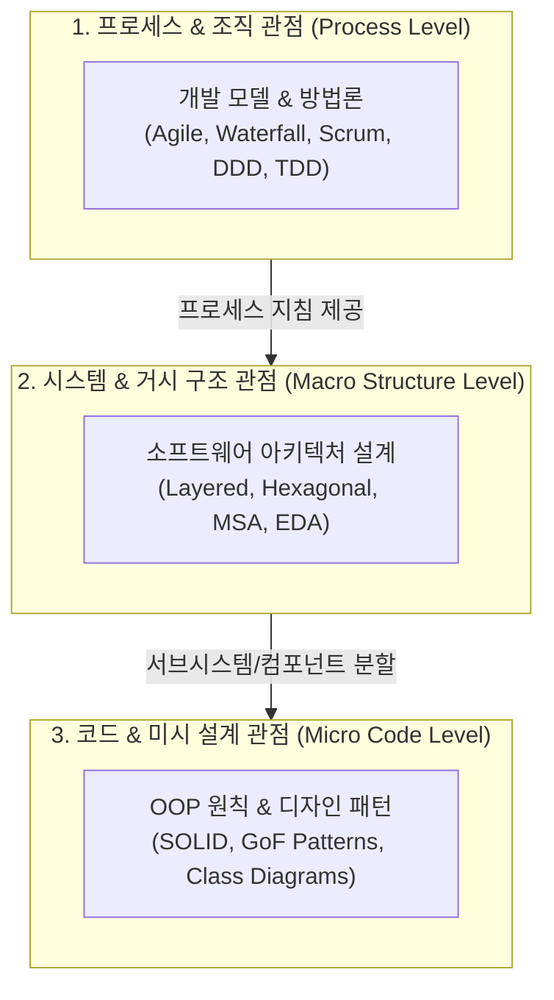

- **개발 방법론 (Methodology)**: 소프트웨어를 만들기 위한 **작업 절차, 의사소통 방식, 일정 및 품질 관리 규칙**.
- **아키텍처 설계 (Architecture Design)**: 시스템 전체의 **컴포넌트 분할, 인터페이스 정의, 비기능적 품질 속성(성능, 보안, 확장성) 달성 구조**.
- **디자인 패턴 (Design Pattern)**: 클래스와 객체 간의 **결합도 완화, 책임 분배, 코드 재사용을 위한 전술적 코드 설계 레시피**.

---

## 1.2. 규모(Scale)와 관점(Perspective)에 따른 차이 비교
건축(Building Construction)의 비유를 통해 세 영역의 관점 차이를 쉽게 이해할 수 있습니다.

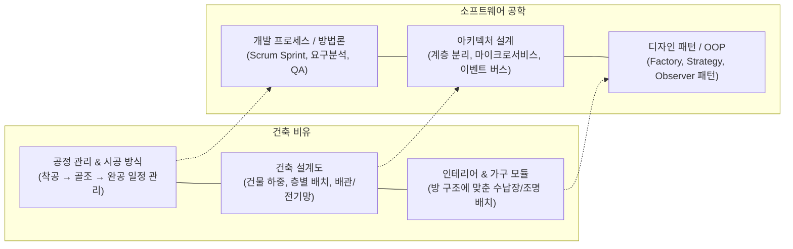

- **공정 관리 (개발 모델 / 방법론)**: 건물을 어떤 순서(설계 후 일괄 시공 vs 구역별 순차 완공)로 지을지, 인력과 일정을 어떻게 관리할지 결정합니다.
- **건축 설계도 (아키텍처 설계)**: 건물이 무너지지 않고 지진(확장성/안정성)을 버티도록 기둥을 세우고, 상하수도와 전기 배선(통신 인프라)을 어떻게 배치할지 큰 그림을 그립니다.
- **인테리어 및 가구 배치 (디자인 패턴)**: 거실의 공간 활용도를 높이기 위해 조립식 가구를 배치하고, 스위치와 조명을 깔끔하게 연결(객체 간 협력)하는 세부적 디테일입니다.

---

## 1.3. 핵심 비교 표 (대상, 추상도, 핵심 질문, 대표 예시)

| 구분            | 개발 모델 & 방법론 (Methodology)                       | 아키텍처 설계 (Architecture)                                           | 디자인 패턴 (Design Pattern)                                 |
| :-------------- | :----------------------------------------------------- | :--------------------------------------------------------------------- | :----------------------------------------------------------- |
| **주요 대상**   | 팀, 개발 프로세스, 일정, 산출물                        | 시스템 전체, 서브시스템, 인프라 연동                                   | 클래스, 인터페이스, 객체 간 관계                             |
| **추상도 수준** | 최상위 (거시적 업무 흐름)                              | 상위 (거시적 기술 구조)                                                | 하위 (미시적 코드 구조)                                      |
| **핵심 질문**   | *"프로젝트를 어떻게 계획하고 협업하여 완수할 것인가?"* | *"시스템의 각 요소가 품질 속성(확장/보안 등)을 어떻게 만족할 것인가?"* | *"이 클래스/객체의 결합도를 낮추고 유연하게 확장할 것인가?"* |
| **변경 비용**   | 프로세스 전환 시 팀 문화/규약 변경 필요                | **변경 비용이 가장 높음** (시스템 전면 재구축)                         | 상대적으로 낮음 (특정 모듈 리팩토링)                         |
| **언어 종속성** | 언어 무관 (Language Independent)                       | 언어 무관 (기술 스택/인프라 의존)                                      | 언어 특성(OOP, 다형성 등)에 밀접                             |
| **대표 예시**   | Waterfall, Scrum, Kanban, ADD, DDD, TDD                | Layered, Hexagonal, Microservices, EDA                                 | Factory Method, Strategy, Observer, Adapter                  |

---

# 2. 개발 프로세스의 관리: 개발 모델 vs 개발 방법론

## 2.1. 개발 모델 (Development Model): SDLC의 이론적 뼈대
**소프트웨어 생명주기 모델(SDLC Model)**은 소프트웨어가 기획되어 요구분석, 설계, 개발, 테스트를 거쳐 유지보수 및 폐기에 이르는 **전체 수명주기의 개념적 진행 흐름(순차적, 반복적, 점진적 등)**을 정의한 이론적 틀입니다.

### (1) 주요 개발 모델 비교

####  **폭포수 모델 (Waterfall Model)**:

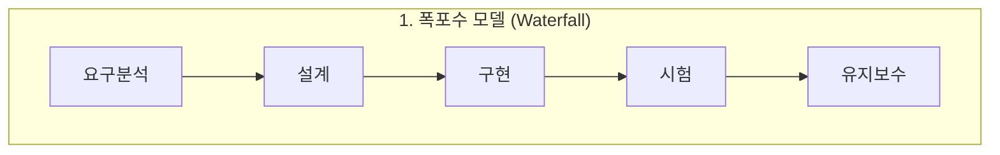

- **특징**: 이전 단계가 완전히 끝나야 다음 단계로 진행하는 선형 순차적 모델.
- **장점**: 단계별 산출물이 명확하여 프로젝트 관리가 용이함.
- **단점**: 요구사항 변경 대응이 극히 어렵고, 후반부 통합 테스트 단계에서 결함 발견 시 치명적인 지연 발생.
- **적합 대상**: 요구사항이 고정되어 있고 변경 가능성이 낮은 프로젝트 (국방, 금융 코어, 항공 제어 등).

#### **V-모델 (V-Model)**:

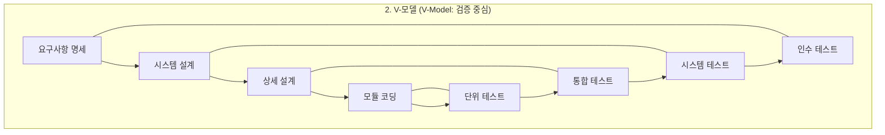
- **특징**: 폭포수 모델의 확장형으로, 각 개발 단계마다 상응하는 테스트 단계를 1:1로 매핑하여 조기 검증을 강조.
- **매핑 구조**:
  - 요구사항 분석 $\leftrightarrow$ **인수 테스트 (Acceptance Test)**
  - 시스템 설계 $\leftrightarrow$ **시스템 테스트 (System Test)**
  - 아키텍처/상세 설계 $\leftrightarrow$ **통합 테스트 (Integration Test)**
  - 모듈 구현 $\leftrightarrow$ **단위 테스트 (Unit Test)**

#### **나선형 모델 (Spiral Model)**:

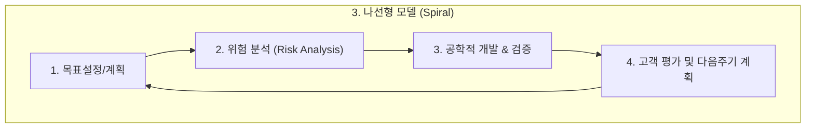

- **특징**: `계획 수립` $\rightarrow$ `위험 분석(Risk Analysis)` $\rightarrow$ `개발/테스트` $\rightarrow$ `고객 평가`의 4단계를 점진적으로 반복.
- **핵심**: 대규모 고위험 프로젝트에서 위험(기술적/비즈니스적 리스크)을 사전에 식별하고 완화하는 데 집중.

#### others

- **프로토타이핑 모델 (Prototyping Model)**:
  - **특징**: 요구사항이 불명확할 때 핵심 기능의 시제품(Prototype)을 빠르게 제작하여 사용자 피드백을 수렴하고 요구사항을 확정.
- **애자일 모델 (Agile Model)**:
  - **특징**: 계획 중심이 아닌 '변화 대응' 중심으로, 짧은 주기(Sprint, 1~4주)를 반복하여 작동 가능한 소프트웨어를 지속적으로 배포.

---

### (2) 핵심 부속 프로세스: 요구공학 (Requirements Engineering)
소프트웨어 개발 모델의 첫 단추는 사용자가 무엇을 원하는지 명확히 정의하는 것입니다.

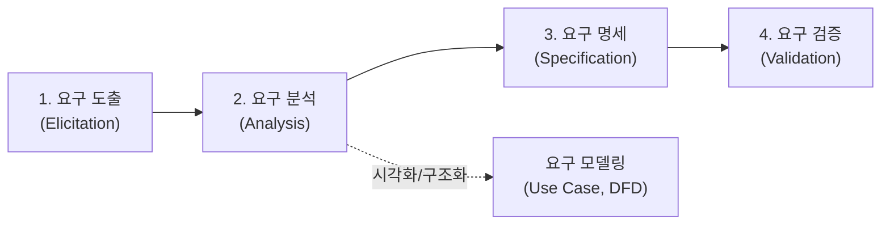

#### 요구사항의 분류
1. **기능 요구사항 (Functional Requirements)**:
   - 시스템이 실제로 수행해야 하는 구체적인 동작, 계산, 데이터 처리, 비즈니스 로직.
   - *예: "사용자는 이메일과 비밀번호로 로그인할 수 있어야 한다."*
2. **비기능 요구사항 (Non-functional Requirements / Quality Attributes)**:
   - 시스템의 전반적인 품질, 성능, 안전, 제약 사항.
   - **분류 요소**:
     - **성능 (Performance)**: 초당 트랜잭션 처리량(TPS), 응답 시간(Latency < 200ms).
     - **가용성 (Availability)**: 99.99% 업타임 보장, 무중단 배포.
     - **보안 (Security)**: 데이터 암호화(AES-256), 인가/인증(OAuth2).
     - **제약 사항 (Constraints)**: 메모리 512MB 이내 임베디드 환경, 특정 OS 지원.

---

## 2.2. 개발 방법론 (Development Methodology): 구체적인 실천 지침서
**개발 방법론**은 개발 모델의 철학을 실제 프로젝트 현장에서 수행할 수 있도록 정의한 **구체적인 역할(Roles), 의식(Ceremonies), 산출물(Artifacts), 설계 규칙(Rules)의 집합**입니다.

### (1) 프로세스 및 프로젝트 관리 방법론
- **스크럼 (Scrum)**:
  - **개념**: 애자일 모델을 구현하는 가장 대표적인 팀 프레임워크.
  - **구성 요소**:
    - **역할**: 제품 책임자(PO), 스크럼 마스터(SM), 개발팀(Developers).
    - **산출물**: 제품 백로그(Product Backlog), 스프린트 백로그(Sprint Backlog), 잠재적 출시 가능 제품 증분(Increment).
    - **의식**: 스프린트 계획 회의, 데일리 스크럼(15분 스탠드업), 스프린트 리뷰, 스프린트 회고.
- **칸반 (Kanban)**:
  - **개념**: 작업의 흐름(Flow)을 시각화하고, 진행 중인 작업 수(WIP: Work In Progress)를 제한하여 병목을 해결하는 지속적 배포 지향 방법론.

---

### (2) 아키텍처 및 소프트웨어 설계 중심 방법론
단순 일정 관리를 넘어, 소프트웨어의 복잡성을 통제하기 위해 코드와 구조를 어떻게 설계할 것인지에 대한 방법론입니다.

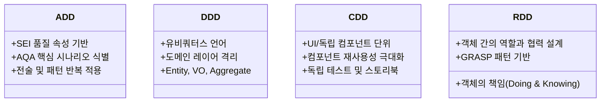

- **ADD (Attribute Driven Design, 속성 기반 설계 - SEI 정립)**:
  - **개념**: 시스템이 반드시 만족해야 하는 **품질 속성 요구사항(AQA: Architectural Quality Attributes)**을 바탕으로 아키텍처를 반복적으로 분할하고 설계하는 품질 주도 방법론.
  - **절차**: 핵심 품질 시나리오 식별 $\rightarrow$ 모듈 분할 및 아키텍처 전술(Tactics) 선택 $\rightarrow$ 설계 검증.
- **DDD (Domain Driven Design, 도메인 주도 설계)**:
  - **개념**: 복잡한 소프트웨어를 해결하기 위해 기술보다 **비즈니스 도메인의 본질적인 규칙과 모델**을 최우선으로 설계하는 방식.
  - **핵심 원칙**:
    - **유비쿼터스 언어 (Ubiquitous Language)**: 도메인 전문가, 기획자, 개발자가 소스 코드와 문서에서 완전히 동일한 단어를 사용.
    - **바운디드 컨텍스트 (Bounded Context)**: 동일한 단어라도 도메인 영역에 따라 의미가 달라지므로 경계를 명확히 분리.
    - **도메인 격리**: 비즈니스 로직(Domain Entity)이 DB나 UI 등 인프라 기술에 오염되지 않도록 격리.
- **CDD (Component Driven Design, 컴포넌트 주도 설계)**:
  - **개념**: 재사용 가능한 가장 작은 UI/기능 단위인 **컴포넌트**부터 상향식(Bottom-up)으로 설계하고 조립하여 전체 시스템을 완성하는 방법론.
  - **컴포넌트 vs 모듈의 차이**:
    - **모듈 (Module)**: 구현 논리적 단위 (함수, 클래스, 소스 파일 단위로 분리된 코드 묶음).
    - **컴포넌트 (Component)**: 독립적으로 배포, 교체, 실행 가능한 재사용 단위 (독립된 인터페이스를 제공하는 실행/UI 블록).
- **RDD (Responsibility Driven Design, 책임 주도 설계)**:
  - **개념**: 객체를 단순 데이터 저장소가 아니라, **객체가 아는 것(Knowing)과 하는 것(Doing)의 '책임'**을 중심으로 역할을 부여하고 협력 관계를 정의하는 객체지향 설계 방법론.
- **TDD (Test Driven Development, 테스트 주도 개발)**:
  - **개념**: `실패하는 단위 테스트 작성(Red)` $\rightarrow$ `테스트를 통과하는 최소한의 코드 작성(Green)` $\rightarrow$ `리팩토링(Refactor)` 사이클을 빠르게 반복하는 실천법.

---

## 2.3. 두 개념의 포함 관계 및 차이점 요약

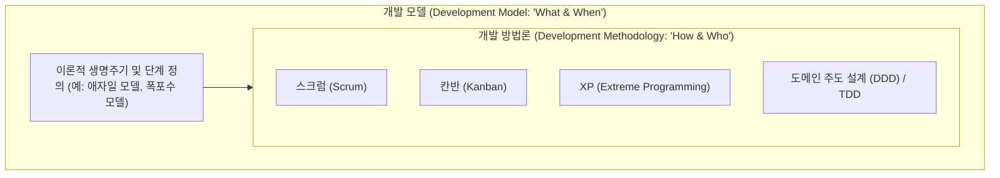

| 비교 항목       | 개발 모델 (Development Model)                            | 개발 방법론 (Development Methodology)                                   |
| :-------------- | :------------------------------------------------------- | :---------------------------------------------------------------------- |
| **개념적 성격** | SDLC의 **철학, 방향성, 이론적 프레임워크**               | 실무에서 적용하는 **구체적인 실천 규약, 도구, 절차**                    |
| **포함 관계**   | 방법론의 상위 개념 (하나의 모델 위에 여러 방법론이 존재) | 특정 모델을 기반으로 구체화된 실행 규칙                                 |
| **질문의 초점** | *"어떤 라이프사이클 흐름을 따를 것인가?"*                | *"누가, 무엇을, 어떤 주기로, 어떤 도구로 구현할 것인가?"*               |
| **관계 예시**   | **애자일 모델(Agile)**이라는 사상/모델                   | $\rightarrow$ **스크럼(Scrum)**, **XP**, **TDD**라는 구체적 실천 방법론 |
| **관계 예시**   | **순차적 모델(Waterfall)**이라는 뼈대                    | $\rightarrow$ **CMMI 기반 정형 개발 방법론**, **방산 SW 프로세스**      |

---

# 3. 시스템의 거시적 구조: 아키텍처 설계 (Architecture)

## 3.1. 아키텍처 설계의 정의와 역할
> *"아키텍처는 나중에 바꾸기 가장 어렵고 비용이 많이 드는 결정들의 총합이다." (Ralph Johnson)*

소프트웨어 아키텍처는 시스템의 기본 구조를 형성하는 **컴포넌트들의 구성, 컴포넌트 간의 상호작용 및 관계, 그리고 이들이 만족해야 하는 시스템 품질 속성(Quality Attributes)**을 결정하는 고수준 설계입니다.

- **기능(Functionality) vs 비기능(Quality Attributes)**: 기능 구현은 어떤 아키텍처로도 가능하지만, **100만 동시 접속 처리(확장성), 99.999% 무중단(가용성), 0.1초 응답(성능), 모듈 독립 수정(변경용이성)**은 올바른 아키텍처 설계 없이는 불가능합니다.

---

## 3.2. 주요 아키텍처 패턴 및 스타일

### (1) 계층화 아키텍처 (Layered Architecture)
시스템을 관심사 분리(SoC) 원칙에 따라 수평적인 계층(Layer)으로 분할하고 수직으로 쌓아 올린 가장 전통적인 패턴입니다.

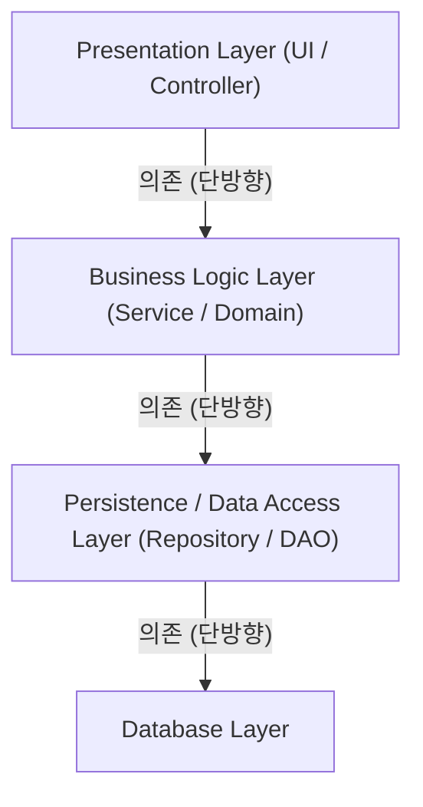

- **핵심 원리**: 상위 계층은 하위 계층을 직접 호출할 수 있지만, 하위 계층은 상위 계층의 존재를 알지 못해야 합니다 (단방향 의존성).
- **장점**: 구조가 직관적이고 역할 구분이 명확하여 초기 개발 속도가 빠름.
- **단점**:
  - **싱크홀 안티패턴(Sinkhole Anti-pattern)**: 단순 조회 기능에서도 비즈니스 로직 없이 모든 레이어를 무의미하게 거쳐 가는 오버헤드.
  - 시스템 규모가 커지면 레이어 간 경계가 흐려지고 결합도가 증가하여 모놀리식의 경직성 발생.

---

### (2) 클린 / 헥사고날 아키텍처 (Clean / Hexagonal Architecture)
비즈니스 로직(도메인)이 프레임워크, DB, UI와 같은 외부 기술에 종속되지 않도록 시스템 중심에 순수하게 격리하는 아키텍처(포트 앤 어댑터)입니다.

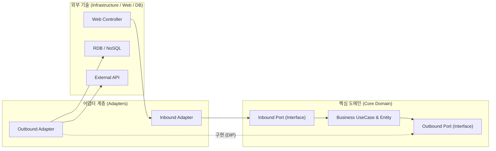

- **핵심 원리 (의존성 역전)**: 의존성의 화살표가 항상 **외부 $\rightarrow$ 내부(순수 도메인)**로 향합니다. 핵심 도메인은 인터페이스(Port)만 정의하고, 세부 DB 구현체(Adapter)가 이를 구현합니다.
- **장점**: DB를 MySQL에서 MongoDB로 바꾸거나 웹 프레임워크를 교체해도 핵심 도메인 코드는 단 한 줄도 수정되지 않음 (테스트 및 유지보수성 극대화).
- **단점**: 인터페이스 및 DTO 매핑 클래스가 증가하여 보일러플레이트 코드량이 많아짐.

---

### (3) 마이크로서비스 아키텍처 (Microservices Architecture, MSA)
단일 대규모 애플리케이션(Monolith)을 **독립적으로 배포, 실행, 확장 가능한 작은 서비스 단위들**로 쪼개어 구축하는 분산 아키텍처입니다.

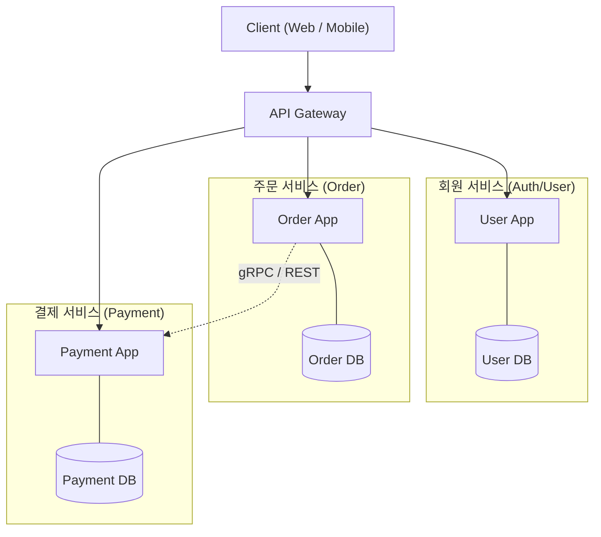

- **핵심 원리**:
  - **Database per Service**: 각 서비스는 전용 DB를 가지며 타 서비스 DB에 직접 접근 불가.
  - **독립적 배포 및 폴리글랏(Polyglot)**: 서비스별로 다른 프로그래밍 언어와 DB 선택 가능.
- **장점**: 대규모 트래픽 발생 시 특정 서비스만 집중 스케일아웃 가능, 장애 격리(Fault Tolerance).
- **단점**: 네트워크 레이턴시 증가, 분산 트랜잭션(2PC, Saga 패턴 필요) 및 분산 모니터링(Tracing)의 극심한 복잡도.

---

### (4) 이벤트 기반 아키텍처 (Event-Driven Architecture, EDA)
시스템 컴포넌트들이 직접 호출하지 않고, **상태의 변화를 나타내는 '이벤트(Event)'를 발행(Produce)하고 소비(Consume)**하는 비동기 메시지 기반 아키텍처입니다.

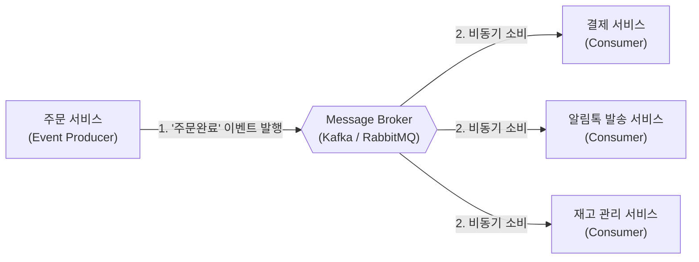

- **핵심 원리**: 이벤트 생산자(Producer)는 이벤트가 누구에게 전달되는지 알 필요가 없으며, 메시지 브로커가 이를 중계하여 완벽한 **시간적·공간적 결합도 분리(Decoupling)**를 달성합니다.
- **장점**: 초고용량 비동기 트래픽 버퍼링, 새로운 기능(Consumer)을 기존 시스템 수정 없이 무한 확장 가능.
- **단점**: 메시지 순서 보장, 유실 방지, 최종 일관성(Eventual Consistency) 및 분산 디버깅 난이도 증가.

---

## 3.3. 아키텍처 설계와 디자인 패턴의 경계선 (Architecture Pattern vs Design Pattern)

### (1) 매크로(거시) vs 마이크로(미시)의 경계
많은 초심자가 **MVC 패턴**이나 **Observer 패턴**을 접할 때 아키텍처와 디자인 패턴을 혼동합니다.

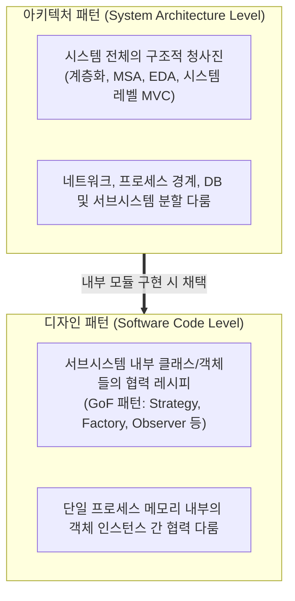

- **아키텍처 패턴 (Macro)**: 전체 시스템의 하드웨어/프로세스 배치, 컴포넌트 간 물리적 통신 방식을 다룹니다.
- **디자인 패턴 (Micro)**: 특정 컴포넌트 내부에서 클래스들을 어떻게 구성하여 다형성과 재사용성을 챙길지 다룹니다.

---

### (2) UI 프레젠테이션 패턴의 진화: MVC vs MVVM

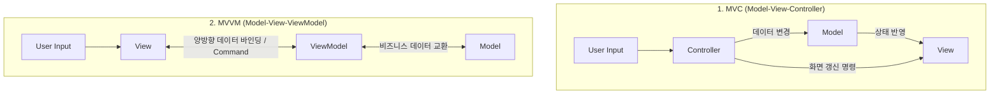

| 구분            | MVC (Model-View-Controller)                           | MVVM (Model-View-ViewModel)                               |
| :-------------- | :---------------------------------------------------- | :-------------------------------------------------------- |
| **Model**       | 데이터 및 비즈니스 로직 캡슐화                        | 데이터 및 비즈니스 로직 캡슐화                            |
| **View**        | UI 렌더링. 사용자의 입력을 컨트롤러에 전달            | UI 렌더링. 바인딩을 통해 뷰모델 상태를 자동 반영          |
| **중재자**      | **Controller**: 입력을 받아 모델을 조작하고 뷰를 선택 | **ViewModel**: 뷰를 위한 상태와 명령(Command)을 캡슐화    |
| **결합도**      | 뷰와 컨트롤러가 1:1 또는 강하게 엮이기 쉬움           | **데이터 바인딩**을 통해 뷰와 뷰모델 간의 결합 완벽 분리  |
| **적합한 환경** | 전통적인 백엔드 웹 렌더링 (Spring MVC, Django)        | 모던 프론트엔드/모바일 (React, Vue, WPF, Android Jetpack) |

---

# 4. 소스 코드의 원리와 응용: OOP vs 디자인 패턴

## 4.1. 객체 지향 개념 (OOP Core): 기본 도구와 설계 원칙

### (1) 프로그래밍 패러다임 비교
- **절차적 프로그래밍 (Procedural)**: 순차적인 명령문과 함수(Procedure)를 통해 공유 데이터를 조작.
- **함수형 프로그래밍 (Functional)**: 순수 함수(Pure Function)와 불변성(Immutability)을 기반으로 부수 효과(Side-effect)를 제거.
- **객체 지향 프로그래밍 (OOP)**: 상태(데이터)와 행위(메서드)를 가진 **객체(Object)**들을 정의하고, 객체 간의 메시지 전달과 협력을 통해 시스템을 구성.

---

### (2) OOP 4대 핵심 특성
1. **추상화 (Abstraction)**:
   - 복잡한 현실 세계의 대상에서 불필요한 세부사항을 제거하고 **본질적인 공통 특징(속성과 행위)**만을 추출해 모델링하는 것.
2. **캡슐화 (Encapsulation)**:
   - 데이터(State)와 이를 조작하는 함수(Method)를 하나로 묶고, 외부에는 공개 인터페이스만 노출하며 내부 구현을 은닉(Information Hiding)하는 것.
   - *"데이터를 숨기는 것이 아니라, 변경될 수 있는 구현 세부사항을 숨겨라."*
3. **상속 (Inheritance)**:
   - 상위 클래스의 특성을 하위 클래스가 물려받아 재사용하는 메커니즘 (`is-a` 관계).
   - ⚠️ **주의**: 단순 코드 재사용을 위한 무분별한 상속은 강한 결합을 초래하므로, **상속보다는 합성(Composition, `has-a`)**을 우선 고려.
4. **다형성 (Polymorphism)**:
   - 동일한 메시지/인터페이스 호출에 대해 각 객체가 서로 다른 방식으로 동작하는 능력. 조건문(`if-else`, `switch`) 분기를 제거하는 핵심 도구.
   - **동적 다형성 (Runtime)**: 상속 및 가상 함수 오버라이딩(Method Overriding).
   - **정적 다형성 (Compile-Time)**: 제네릭/템플릿(Generics/Templates), 메서드 오버로딩(Method Overloading).

---

### (3) 객체 지향 설계 5대 원칙 (SOLID)

| 원칙  | 원칙 명칭                      | 핵심 개념 및 정의                                                              | 위반 시 발생하는 문제                                   |
| :---: | :----------------------------- | :----------------------------------------------------------------------------- | :------------------------------------------------------ |
| **S** | **SRP** (단일 책임 원칙)       | 하나의 클래스는 **단 하나의 책임(변경 이유)**만 가져야 한다.                   | 한 책임의 수정이 무관한 다른 기능의 버그를 유발함.      |
| **O** | **OCP** (개방-폐쇄 원칙)       | **확장에는 열려 있고(Open), 수정에는 닫혀 있어야(Closed)** 한다.               | 신규 기능 추가 시마다 기존 소스코드를 직접 수정해야 함. |
| **L** | **LSP** (리스코프 치환 원칙)   | 서브타입은 언제나 **자신의 상위타입으로 교체(대체)** 가능해야 한다.            | 자식 클래스가 부모의 규약을 어겨 런타임 예외 발생.      |
| **I** | **ISP** (인터페이스 분리 원칙) | 클라이언트는 **자신이 사용하지 않는 인터페이스는 구현하지 않아야** 한다.       | 불필요한 메서드 강제 구현 및 인터페이스 비대화.         |
| **D** | **DIP** (의존 역전 원칙)       | 고수준 모듈은 저수준 세부 구현이 아닌 **추상적인 인터페이스에 의존**해야 한다. | 구현체가 변경될 때 고수준 비즈니스 로직이 연쇄 수정됨.  |

---

### (4) UML 클래스 다이어그램 관계 (Class Diagram Relationships)
객체 간의 관계를 설계하고 표현하는 6가지 표준 UML 관계입니다.

```mermaid
classDiagram
    direction LR
    Parent <|-- Child : 1. Inheritance (일반화/상속)
    Interface <|.. Implementor : 2. Realization (실현/구현)
    Client ..> Service : 3. Dependency (의존: use-a)
    Car o-- Wheel : 4. Aggregation (집합: 약한 소유)
    Building *-- Room : 5. Composition (합성: 강한 생명주기 소유)
    Teacher -- Student : 6. Association (연관: has-a)
```

1. **일반화 / 상속 (Generalization / Inheritance, `──▷`)**:
   - `Child is-a Parent`. 부모 클래스의 속성과 행위를 물려받음.
2. **실현 / 구현 (Realization, `- - -▷`)**:
   - 인터페이스나 순수 가상 클래스의 명세를 구체 클래스가 실제로 구현함.
3. **의존 (Dependency, `- - -▶`)**:
   - 한 클래스가 다른 클래스를 메서드의 파라미터, 지역 변수, 반환값 등으로 일시적으로 참조하는 관계 (`Client use-a Service`).
4. **연관 (Association, `──▶` or `──`)**:
   - 한 클래스가 다른 클래스의 객체를 멤버 변수로 지속적으로 참조하는 대등한 관계 (`has-a`).
5. **집합 (Aggregation, `◇──`)**:
   - 전체-부분의 관계이나 **약한 결합**. 외부에서 객체를 주입받으며, 전체 객체가 소멸해도 부분 객체는 독립적으로 생존 가능.
6. **합성 (Composition, `◆──`)**:
   - 전체-부분의 관계이며 **강한 결합**. 전체 객체가 부분 객체의 생성부터 소멸까지 생명주기를 완전히 소유함 (전체 삭제 시 부분도 자동 소멸).

---

## 4.2. 디자인 패턴 (Design Pattern): 특정 문제 해결을 위한 전술적 레시피
디자인 패턴은 과거의 엔지니어들이 객체지향 설계를 진행하며 맞닥뜨린 반복적인 문제들을 해결하기 위해 정립한 **검증된 객체 구조 템플릿(GoF: Gang of Four 23 패턴)**입니다.

### (1) 디자인 패턴의 3대 분류 체계

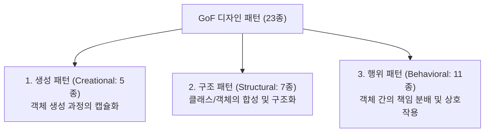

---

### (2) 생성 패턴 (Creational Patterns: 5종)
객체를 직접 `new` 키워드로 생성하지 않고, 객체 생성의 복잡성을 캡슐화하여 유연성을 확보합니다.

| 패턴명               | 핵심 의도 및 해결책                                                                             | 적용 사례                                            |
| :------------------- | :---------------------------------------------------------------------------------------------- | :--------------------------------------------------- |
| **Singleton**        | 클래스의 인스턴스를 오직 **단 하나만 생성**하고 전역적 접근점을 제공.                           | 로그 관리자, 스레드 풀, 설정(Config) 관리자          |
| **Factory Method**   | 객체 생성 인터페이스를 정의하되, **어떤 인스턴스를 생성할지는 서브클래스에 위임**.              | 프레임워크 템플릿 코드, OS별 UI 컴포넌트 팩토리      |
| **Abstract Factory** | 구체적인 클래스를 명시하지 않고 **연관된 객체들의 군(Family)을 일괄 생성**하는 인터페이스 제공. | 크로스 플랫폼 GUI 툴킷 (Dark/Light 테마별 위젯 세트) |
| **Builder**          | 복잡한 객체의 **생성 과정(Step)과 표현 방법을 분리**하여 동일한 절차로 다양한 객체 생성.        | 파라미터가 많은 DTO/Config 객체 구성                 |
| **Prototype**        | 기존 객체를 **복제(Clone)**하여 새로운 인스턴스를 생성. 비용이 큰 객체 생성 최적화.             | 그래픽 에디터의 도형 복사, 게임 캐릭터 스폰          |

---

### (3) 구조 패턴 (Structural Patterns: 7종)
클래스나 객체들을 조합하여 더 큰 구조를 만들면서도 유연성을 잃지 않도록 합니다.

| 패턴명        | 핵심 의도 및 해결책                                                                          | 적용 사례                                                |
| :------------ | :------------------------------------------------------------------------------------------- | :------------------------------------------------------- |
| **Adapter**   | 호환되지 않는 인터페이스를 가진 두 클래스를 **중간에서 변환하여 함께 동작**하도록 래핑.      | 레거시 라이브러리 연동, 서드파티 결제 API 규격 변환      |
| **Bridge**    | **추상층(Abstraction)과 구현부(Implementation)를 분리**하여 둘이 독립적으로 확장되도록 함.   | 다양한 윈도우 OS에서 서로 다른 그래픽 렌더러 동작        |
| **Composite** | 단일 객체와 복합 객체(객체들의 묶음)를 **동일한 트리 구조 인터페이스**로 다룸.               | 파일 시스템(파일-폴더 구조), GUI 컴포넌트 트리           |
| **Decorator** | 기존 코드를 수정하지 않고 **동적으로 객체에 새로운 책임(부가 기능)을 덧붙임**.               | 자바 I/O 스트림(`BufferedInputStream`), 로깅/캐싱 래퍼   |
| **Facade**    | 복잡한 서브시스템의 클래스들을 뒤로 숨기고, 외부에 **단순화된 고수준 통합 인터페이스** 제공. | 복잡한 결제/주문/재고 검증을 하나의 `OrderFacade`로 통합 |
| **Flyweight** | 대량의 작은 객체들이 공유할 수 있는 상태(Intrinsic State)를 모아 **메모리 사용량을 극소화**. | 문서 편집기의 글자 폰트 객체 공유, 게임의 파티클 시스템  |
| **Proxy**     | 실제 객체에 접근하기 전 **대리인(Proxy)을 두어 접근 제어, 지연 로딩, 캐싱, 로깅** 수행.      | 스프링 AOP 프록시, 가상 프록시(대용량 이미지 지연 로딩)  |

---

### (4) 행위 패턴 (Behavioral Patterns: 11종)
객체 간의 결합도를 낮추면서 책임 분배와 통신 알고리즘을 체계화합니다.

| 패턴명                      | 핵심 의도 및 해결책                                                                              | 적용 사례                                                      |
| :-------------------------- | :----------------------------------------------------------------------------------------------- | :------------------------------------------------------------- |
| **Strategy**                | 동일 목적의 여러 **알고리즘을 각각 캡슐화**하고 동적으로 교체 가능하게 만듦.                     | 정렬 알고리즘 선택, 결제 수단(카드/페이/계좌이체) 변경         |
| **Template Method**         | 상위 클래스에서 **알고리즘의 뼈대(흐름)를 정의**하고 세부 단계의 구현은 하위 클래스에 위임.      | 프레임워크 라이프사이클 훅(`init()`, `execute()`, `destroy()`) |
| **Observer**                | 한 객체의 상태가 바뀌면 **구독 중인 모든 관찰자들에게 자동으로 통지(Pub-Sub)**.                  | 이벤트 리스너, 주식 시세 알림, 데이터 바인딩                   |
| **Command**                 | **요청(Request) 자체를 독립된 객체로 캡슐화**하여 매개변수화, 대기열 저장, 실행 취소(Undo) 지원. | GUI 버튼 액션, 작업 큐 스케줄링, 트랜잭션 롤백                 |
| **State**                   | 객체의 **내부 상태에 따라 행동이 달라지도록** 상태 자체를 객체화하여 조건문 제거.                | 자판기 상태(동전있음/없음/품절), TCP 연결 상태 머신            |
| **Chain of Responsibility** | 요청을 처리할 수 있는 핸들러들을 **사슬(Chain)로 엮어** 처리자가 나타날 때까지 전달.             | HTTP 요청 필터 체인(Spring Security), 에러 처리 핸들러         |
| **Mediator**                | 다대다 상호작용을 하는 객체들 사이에 **중재자(Mediator)를 두어 객체 간 직접 참조를 차단**.       | 채팅방 서버, 항공 관제탑 시스템, 복잡한 UI 폼 대화상자         |
| **Iterator**                | 내부 컬렉션 표현 방식을 노출하지 않고 **원소들을 순차적으로 순회**하는 표준 인터페이스 제공.     | `Iterator<T>`, 컬렉션 순회 표준화                              |
| **Memento**                 | 캡슐화를 깨지 않고 **객체의 내부 상태 스냅샷을 저장하여 원복(Undo)** 가능하게 함.                | 텍스트 에디터 되돌리기(Ctrl+Z), 게임 세이브 포인트             |
| **Visitor**                 | 데이터 구조 클래스를 변경하지 않고 **구조 내 원소들에 적용할 새로운 연산(방문자)을 추가**.       | AST(추상 구문 트리) 구문 분석, 컴파일러 타입 체커              |
| **Interpreter**             | 특정 도메인의 간단한 언어 문법을 정의하고 **문장을 해석하는 구문 해석기** 제공.                  | 정규표현식 엔진, SQL 파서, 수식 계산기                         |

---

### (5) 기타 필수 패턴: Producer-Consumer 패턴
- **개념**: 데이터를 생산하는 생산자(Producer)와 이를 소비하는 소비자(Consumer) 사이에 **공유 버퍼(Queue/Buffer)**를 두어 두 주체의 처리 속도 차이를 완충하고 비동기 동시성을 처리하는 패턴.
- **적용**: 멀티스레드 작업 큐, 메시지 큐 시스템의 버퍼링.

---

## 4.3. 원리와 응용의 관계: 디자인 패턴 속의 OOP 원칙 매핑하기
디자인 패턴은 새로운 마법이 아니라, **"OOP의 4대 특성과 SOLID 원칙을 극대화하여 실제 문제를 우아하게 해결한 모범 답안"**입니다.

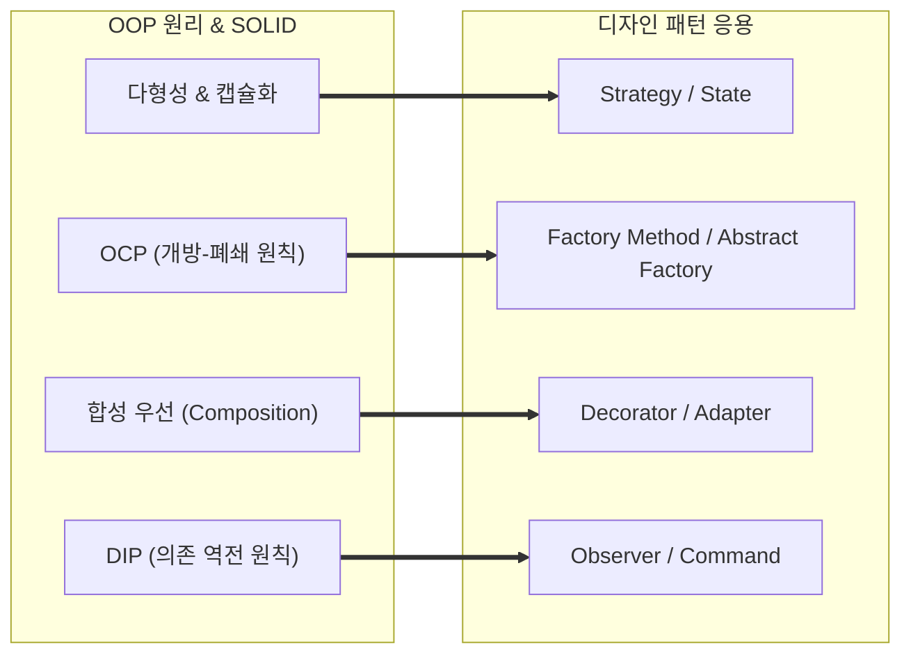

### SOLID 원칙 ↔ GoF 디자인 패턴 핵심 매핑 매트릭스

| 디자인 패턴                         | 기반이 되는 OOP 특성          | 적용된 핵심 SOLID 원칙 | 원리 설명                                                                                       |
| :---------------------------------- | :---------------------------- | :--------------------- | :---------------------------------------------------------------------------------------------- |
| **Strategy (전략)**                 | 다형성 (Polymorphism), 캡슐화 | **OCP, DIP**           | 전략 인터페이스(DIP)에 의존하며, 신규 전략 추가 시 기존 컨텍스트 코드 수정 없이 확장(OCP).      |
| **Factory Method (팩토리 메서드)**  | 다형성, 상속 (Inheritance)    | **OCP, DIP**           | 구체 생성 클래스가 아닌 팩토리 인터페이스에 의존(DIP)하여 생성할 객체 종류를 확장(OCP).         |
| **Decorator (데코레이터)**          | 합성 (Composition), 다형성    | **OCP, SRP**           | 상속 대신 대상 객체를 감싸는 합성(Composition)을 통해 기존 코드를 건드리지 않고 기능 확장(OCP). |
| **Observer (옵저버)**               | 다형성, 캡슐화                | **OCP, DIP, ISP**      | 관찰자 인터페이스(DIP)를 통해 발행자와 구독자 간 결합도를 끊고 새 관찰자를 무한 추가(OCP).      |
| **Adapter (어댑터)**                | 다형성, 합성                  | **OCP, DIP**           | 레거시/외부 인터페이스를 클라이언트 요구 규격으로 맞추어 클라이언트 코드 변경 없이 교체(OCP).   |
| **Template Method (템플릿 메서드)** | 상속, 추상화                  | **OCP, LSP**           | 상위 클래스가 불변 뼈대를 정의하고 하위 클래스가 규약을 준수하며 세부 동작을 치환(LSP).         |
| **Command (커맨드)**                | 캡슐화, 다형성                | **SRP, OCP**           | 실행할 요청 자체를 객체로 캡슐화하여(SRP) 새로운 명령을 손쉽게 시스템에 추가(OCP).              |

> **핵심 요약:**
> - **OOP 4대 특성(추상화·캡슐화·상속·다형성)**은 객체를 다루는 **기본 도구(Tools)**입니다.
> - **SOLID 원칙**은 그 도구를 안전하고 견고하게 사용하기 위한 **설계 지침(Guidelines)**입니다.
> - **디자인 패턴**은 이 지침을 지키며 검증된 실전 문제를 해결하는 **구체적 설계 레시피(Recipes)**입니다.
