# Embedded System

- [임베디드 시스템 개요](#임베디드-시스템-개요)
      - [개발 환경](#개발-환경)
      - [실시간 시스템](#실시간-시스템)
  - [프로세서 46p](#프로세서-46p)
    - [statup code](#statup-code)
    - [레지스터 구조](#레지스터-구조)
    - [주변장치 (Peripheral device)](#주변장치-peripheral-device)
    - [MCU 선택 시 고려 할 사양](#mcu-선택-시-고려-할-사양)
    - [OS 선택 시 고려 할 사양](#os-선택-시-고려-할-사양)
    - [Bare-metal, RTOS, Linux OS](#bare-metal-rtos-linux-os)
  - [메모리와 버스](#메모리와-버스)
      - [메모리 컨트롤러](#메모리-컨트롤러)
    - [Memory Mapped I/O \& Port Mapped I/O](#memory-mapped-io--port-mapped-io)
      - [프로세스의 실행](#프로세스의-실행)
      - [피연산자의 종류 (operand)](#피연산자의-종류-operand)
    - [Memory Layer](#memory-layer)
      - [cache memory와 최적화](#cache-memory와-최적화)
      - [Virtual Memory](#virtual-memory)
  - [인라인 어셈블리](#인라인-어셈블리)
  - [최적화 이론](#최적화-이론)
      - [Function Outlining \& Function Inlining](#function-outlining--function-inlining)
      - [Lookup table](#lookup-table)
      - [register 변수](#register-변수)
      - [전역변수](#전역변수)
      - [고정소수점 연산](#고정소수점-연산)
      - [성능 분석 도구 Dhrystone과 벤치마킹](#성능-분석-도구-dhrystone과-벤치마킹)
      - [RAM 사용 줄이기](#ram-사용-줄이기)
      - [ROM 사용 줄이기](#rom-사용-줄이기)
      - [정렬과 구조체](#정렬과-구조체)
  - [Register](#register)
      - [동작 모드](#동작-모드)
      - [thumb2 명령어 집합](#thumb2-명령어-집합)
      - [파이프라이닝](#파이프라이닝)
      - [Flash memory interface](#flash-memory-interface)
      - [AAPCS (ARM Architectur Procedure Call Standart)](#aapcs-arm-architectur-procedure-call-standart)
      - [ARM assembly syntax](#arm-assembly-syntax)
      - [CONTROL register](#control-register)
  - [CMSIS와 HAL](#cmsis와-hal)
- [peripheral](#peripheral)
  - [GPIO (General Purpose Input Output)](#gpio-general-purpose-input-output)
      - [External Interrupt](#external-interrupt)
      - [Alternate functions](#alternate-functions)
  - [Cortex-M memory and bus architecture](#cortex-m-memory-and-bus-architecture)
    - [Bit Banding](#bit-banding)
  - [RCC (Reset and Clock Control)](#rcc-reset-and-clock-control)
      - [Clock](#clock)
      - [Reset](#reset)
  - [Interrupt](#interrupt)
      - [NVIC (Nested Vector Interrupt Controller)](#nvic-nested-vector-interrupt-controller)
      - [인터럽트 레지스터](#인터럽트-레지스터)
      - [**핸들러 진입과 반환**](#핸들러-진입과-반환)
      - [Vector table in startup code:](#vector-table-in-startup-code)
      - [Exception number와 IRQ number](#exception-number와-irq-number)
      - [prepriority and subpriority](#prepriority-and-subpriority)
      - [스택 프레임](#스택-프레임)
      - [익셉션 리턴 (EXC\_RETURN)](#익셉션-리턴-exc_return)
      - [메모리 리매핑](#메모리-리매핑)
      - [벡터 테이블](#벡터-테이블)
  - [SCB (System Control Block)](#scb-system-control-block)
  - [USART/UART](#usartuart)
  - [TIMER counter, programmable interval TIMER](#timer-counter-programmable-interval-timer)
      - [Prescaler and Divider](#prescaler-and-divider)
      - [Pulse Width Modulation(Output Compare) \& Input Capture](#pulse-width-modulationoutput-compare--input-capture)
  - [DMA(Direct Memory Access)](#dmadirect-memory-access)
      - [DMA sequence](#dma-sequence)
      - [FIFO mode](#fifo-mode)
      - [BURST mode](#burst-mode)
  - [ADC (Analog Digital Converter)](#adc-analog-digital-converter)
      - [ADC operate mode](#adc-operate-mode)
  - [I2C (Inter-Intergrated Circuit)](#i2c-inter-intergrated-circuit)
      - [Hardware](#hardware)
      - [Protocol](#protocol)
      - [register](#register-1)
  - [WDG (Watch Dog)](#wdg-watch-dog)
      - [IWDG (Independant Watch Dog)](#iwdg-independant-watch-dog)
      - [WWDG (Window Watch Dog)](#wwdg-window-watch-dog)
      - [register](#register-2)
  - [RTC (Real-Time Clock)](#rtc-real-time-clock)
      - [RTC and Low-Power mode](#rtc-and-low-power-mode)
      - [RTC Interrupt](#rtc-interrupt)
  - [SPI (Serial Peripheral Interface)](#spi-serial-peripheral-interface)
      - [SPI Bus](#spi-bus)
  


## 임베디드 시스템 개요
- 임베디드 시스템의 정의: **특정한 목적**을 수행하도록 설계된 전자 시스템
- 임베디드 시스템의 구성 요소:
  - 하드웨어: CPU, memory, I/O device
  - 소프트웨어: 장치 제어, 데이터 처리, UI 제공 등을 하는 프로그램.
  - OS, RTOS: RTOS는 작업의 일관성과 정확성을 보장한다.


- memory: 프로ㅔ스의 데이터와 명령어를 적재하는 공간.
  - RAM: 주 기억장치, 전원에 의존하며 실행중에만 임시로 보관하는 장치. 
  - ROM: 전원이 꺼져도 데이터를 보존하는 부 기억장치로, 시스템 프로그램 코드와 config 데이터를 저장.
- I/O device: 센서, 스위치, display, communication 등의 외부 세계와의 상호작용을 담당하는 장치.
  - Input: 센서, 스위치
  - Output: display
  - I/O: 통신

#### 개발 환경
- 호스트 시스템과 타겟 시스템 연결
  - ICE(in-circuit-emulator) with JTAG: 전원, 업로드 및 디버깅, 가상 콘솔 터미널 지원. 
  - serial cable
  - ethernet cable
통신 및 디버깅, 펌웨어 업로드 등읠 위해 사용하는 수단들이다.

임베디드 시스템 운영체제
사실상 RTOS와 리눅스 양강체제
- RTOS는 보장된 응답 시간을 제공.
- 리눅스는 대규모 어플리케이션, 데이터 처리, 네트워크 등.

#### 실시간 시스템
- 소프트 realtime system: 빠르게 임무를 수행하지만 반드시 그 시간이 보장하지는 않음. (timeout = don't care)
- Hard Real Time System: 매우 정확하게, 그리고 반드시 정해진 시간 내에 작동을 마치는 시스템. (timeout = mission fail)
*구분에 매우 빠름과 느림이 중요한것이 아니라, 동작을 보장해야하는것이 중요.*


제작 과정 : 공학적 절차
크로스 컴파일러: 제작 환경(호스트 시스템)과 실행 환경(타겟)이 다르므로 크로스 컴파일. 아키텍쳐가 다르므로 컴파일러도 다름.

JTAG는 IEEE 표준으로 회로 연결의 테스트 검증을 위한 표준. IC의 각 핀들을 능동적, 직접적으로 제어하여 테스트하고 검증할 수 있다.
 == ICE가 보드와의 상호작용을 하는 물리적 표준이다.
 실제로는 ICE는 보드 위의 TAP CONTROLLER와 연결되어 이를 통해 제어.
 5개 선으로 제어.
 - TDI, TDO, TMS(Mode Select), TCK, TRST(Reset).


##  프로세서 46p
- 리셋 후 0x00번지에서 Instruction을 가져오기 시작함. 해당 주소에 실행 코드가 있어야 함.
- 그러므로 임베디드 시스템에서는 ROM 영역을 0x00 근처에 배치하여 프로그램이 항상 저장되어 있도록 한다.
- 0x0에 있는 리셋 벡터에서 실제 진입점으로 분기한다.
- RAM에는 Data, BSS 섹션의 데이터가 저장되고, ROM에는 TEXT, CONST 데이터가 저장된다.

- XIP(execute in place) 레이아웃
  - ROM은 RAM보다 버스 폭이 좁고 속도가 느리다. 벡터 테이블을 통한 프로세서 예외 인터럽트 처리 속도가 느려진다.
- non XIP 레이아웃
  - RAM은 빠르고 버스 대역폭이 넓다.
  - 따라서 0x0이 RAM인 경우 벡터 테이블과 인터럽트 핸들러에 좋다. 
  - 다만 전원을 켤때는 RAM에는 리셋 벡터 항목에 유효한 명령이 없다.
**따라서 전원을 킬 때는 ROM이 0x0에 위차하도록 허용해야 하고, 실행 중에도 RAM이 0x0에 위치하도록 해야 한다.**
== REMAP의 필요성 (시스템 디코더에게 ROM에서 RAM을 0x0으로 하도록 변경한다.)
- **메모리 3종류** 
  - 플래시 ROM은 비휘발성 메모리로 R,W이 되지만 W이 느리므로 동적 데이터는 비추천, 펌웨어와 장기 데이터를 저장하는 데 사용.
  - DRAM (동적 랜덤 액세스 메모리), 가장 일반적 RAM, 1메가바이트당 비용이 가장 낮음, DRAM 컨트롤러를 설정해서 클럭을 이용한 충방전을 필요로 한다.
  - SRAM: DRAM 보다 빠르지만 비싸기 때문에 고속 메모리 및 cache 같은 소규모 고속 작업에 쓴다.

### statup code
- .data 섹션의 내용을 ROM에서 RAM으로 복사.
- RAM의 .bss 섹션을 0으로 초기화.
- RAM에서 .stack은 함수가 호출될때 인자 및 지역변수 영역으로 할당되어 복귀시 해제
- RAM에서 .heap은 동적할당 호출 시 남는 공간을 나눠주는 것이다.

### 레지스터 구조
- CPU안의 레지스터 (범용 레지스터, 특수 레지스터)는 계산, 변수, 인자 전달 등에 사용하는 레지스터를 말함.
- 레지스터는 보통 하드웨어 레지스터를 말함. memory mapped I/O로 해당 메모리 주소에 값을 쓰면 특정한 기능을 하도록 되어있음.
- cortex ARM 프로세서는 32비트 프로세서로 레지스터의 크기가 32비트이다.

### 주변장치 (Peripheral device)
MCU는 CPU(MPU)와 메모리, 그 주변장치를 포함한 칩을 말한다. 이 경우 on-chip peripheral else, off-chip peripheral.
- off-chip인 다른 장치나 센서와의 입출력을 담당한다. 각 주변장치는 단일 기능을 수행하며 간단한 전압 입출력, 통신부터 네트워크 장치까지 종류는 다양하다.

### MCU 선택 시 고려 할 사양
- Processing Power: 클락 스피드(주파수), FPU(실수 연산 장치) 포함 여부, bus width(레지스터 워드 크기) 등을 고려하여 충분한 처리 능력을 가져야 한다.
- Memory Capacitor: 실행 코드 및 데이터 용량을 고려하여 충분한 RAM 및 Flash 메모리를 가져야 한다.
- Communication Interface: 필요한 통신 인터페이스 기능 및 핀이 포함되어 있는지 확인해야 한다. (UART, I2C, SPI, CAN, Ethernet, USB)
- Power Consumption: 배터리 등을 사용하는 경우 전력 소모도 고려해야 한다. 이외에도 절전 모드나 빠른 시작(대기 모드) 기능이 필요 한 경우.
- I/O port: 필요한 입출력 포트 양.
이 외 외적인 이유
- 비용
- 공급망
- 보안
- 소프트웨어 및 하드웨어 지원: 개발 도구, 라이브러리, 테스트 및 디버깅 도구 등의 BSP, 개발 환경의 지원 수준.
  - Board Support Package: 라이브러리, 소스 코드용 템플릿 등 소프트웨어적 지원. 

### OS 선택 시 고려 할 사양
- 시스템 요구 사항: 처리 속도, 메모리 크기, 사용 가능한 저장소 용량, 전력 소모가 충분한지 고려. 
- 실시간 처리: 실시간 요구 사항을 만족할 수 있는 OS를 고려해야 한다. 시간 내 작업 완료를 보장하여 예측 가능성과 안정성이 향상될 수 있다.
- 유지 보수와 지원: 업데이트 트러블슈팅 패치 문서화 커뮤니티 지원 등
- 비용

### Bare-metal, RTOS, Linux OS
- Bare-metal (Firmware)
  - 가장 가볍고 빠름.
  - 단일 쓰레드 (멀티태스킹이 안됨.)
  - 하드웨어를 직접 제어하는 내장 소프트웨어. (라이브러리 사용 또는 직접 작성)
  - 기기가 켜지면 하드웨어 제어 및 초기화를 하며 C언어 런타임 환경 작동.
- RTOS
  - 스케쥴링과 메모리 관리 추가됨.
  - 시간 내 작업 완료를 보장하는데 특화된 OS.
  - 필요한 제어는 직접 구현해야 함.
- Linux
  - 완전한 OS, 스케쥴링 메모리 관리, 파일시스템, 보안, 입출력 전부 관리.
  - 유지 보수 및 지원이 훌륭함.
  - 대신 지원되지 않는 하드웨어로의 포팅은 가장 어려움.


## 메모리와 버스
- 버스
  - 데이터 버스
    - 데이터 버스의 폭은 한번에 전달되는 데이터의 크기를 말함.
  - 어드레스 버스
    - 어드레스 버스의 폭은 다룰 수 있는 주소의 크기를 알 수 있다. 2^버스 폭 (바이너리 디코더)
  - 컨트롤 버스: 칩 셀렉 등
- 버스 마스터: 해당 버스 라인들을 제어하는 마스터 단

> HIGH active와 LOW active: 논리 값이 1일때 enable 되는 핀이 HIGH active, 0이 될때 enable인 핀이 LOW active.
> example: /CS /WR /AS INT* nRESET /ACK BREQ#(intel의 경우)

- 외장 메모리의 직렬 및 병렬 연결
  - 직렬 연결
    - CS핀의 각기 연결 (binary decoder을 통해 각 메모리 활성화)
    - Data bus의 공통 사용
  - 병렬 연결
    - CS핀의 공통 연결 (동시에 전부 사용)
    - Data bus를 메모리마다 연결, 동시에 여러 메모리를 사용. (병렬 사용, 속도 성능이 직렬의 배수)

#### 메모리 컨트롤러
CPU와 메모리 사이에 존재하는, 메모리 단의 버스 마스터로 데이터 흐름을 관리하는 하드웨어.
대부분의 메모리 장치는 소프트웨어적으로 메모리 컨트롤러의 세팅 값(메모리 타이밍, 재생률)을 통해 메모리와의 인터페이스를 설정하며, 인터페이스가 맞는 메모리와 소통이 된다.

```
base 주소를 CS으로 쓴다 == Address 버스의 상위 핀들을 메모리(주변장치)들의 CS으로 사용하여 접근
== memory mapped I/O, base + offset (base == CS, offset == 하위 Address)
```
### Memory Mapped I/O & Port Mapped I/O
주변장치에 접근하는 방식의 차이.
- Memory Mapped I/O
  - 메모리의 특정 부분을 주변장치에 할당하여 해당 주소에 대한 접근을 이용하여 입출력 연산으로 I/O 제어를 수행한다. 
  - 별도의 I/O 명령어 없이 인터페이스를 단순화하여 사용한다.
  - 일부 시스템에서는 DMA(Direct Memory Access)를 지원하여 데이터 전송의 효율을 높인다.
- Port Mapped I/O: intel 방식


#### 프로세스의 실행
1. 메모리의 .text 섹션에서 실행 코드를 가져옴 (fetch)
2. 해석 (decode)
3. 실행 (execute)
   1. 필요한 변수들을 메모리의 해당 섹션 (.data, .bss, .rodata)에서 코어 레지스터로 가져옴.
   2. ALU속에서 decode 된 Instruction에 따라 연산해서 레지스터에 가지고 있음.
   3. 결과 변수를 다시 메모리의 해당 섹션의 그 자리에 적재.

*폰 노이만 아키텍쳐와 하버드 아키텍쳐*
- 하버드 아키텍처의 경우 Instruction memory와 data memory가 분리되어 있어 각각 다른 버스를 사용하기 때문에 성능이 우수하다. (동시, 병렬)
- 버스 설계가 복잡해지고 또한 해당 아키텍처용 프로그램을 개발해야 한다.

#### 피연산자의 종류 (operand)
| 구분  | 크기  |
| ----- | ----- |
| byte  | 8bit  |
| word  | 16bit |
| dword | 32bit |

Big Endian: 높은 자릿수가 먼저 들어옴.
Little Endian: 낮은 자릿수가 먼저 들어옴.
in register:
| endian   | 3   | 2   | 1   | 0   |
| -------- | --- | --- | --- | --- |
| BE dword | 12  | 34  | 56  | 78  |
| LE dword | 78  | 56  | 34  | 12  |
| BE word  |     |     | 12  | 34  |
| LE word  |     |     | 34  | 12  |
| byte     |     |     |     | 12  |

### Memory Layer
`cpu register > cpu cache memory(SRAM) > memory (DRAM) > storage (ROM, SSD, HDD)`

#### cache memory와 최적화
- cache의 지역성
  - 시간 참조의 원리, 시간의 지역성 (temporal locality): 한번 사용한 메모리 내용은 금방 다시 참조한다. 한번 사용한 변수는 캐시에 적재한다.
  - 공간 참조의 원리, 공간의 지역성 (spatial locality): 한번 사용한 메모리 내용은 그 근처의 내용도 참조한다. 사용중인 변수의 근처 몇 dword도 cache에 적재한다.
- volatile 접두사로 선언된 함수 변수 등은 캐시를 쓰지 않고 주 메모리에서 읽고 쓴다.

DRAM(DDR 포함)의 특징
- 연속되 메모리의 내용을 가져오는 경우 BURST mode로 사용 클락 수가 감소한다.

#### Virtual Memory
OS의 MMU의 기능
- 가상 메모리는 물리적 메모리를 여러 개의 '페이지'또는 '세그먼트'로 나누고 이를 각각 디스크의 특정 부분에 대응시킨다.
- 메모리를 요청하면 가상 메모리 시스템이 디스크에서 해당 세그먼트를 찾아 물리적 메모리로 로드한다. 이를 페이징 혹은 스와핑이라 한다.

## 인라인 어셈블리
C 런타임에 사용할 수 없는 Instruction을 사용하기 위해서 어셈블리어를 사용해야 한다.
```C
__attribute__ 
__asm__("NEMONIC ");
```

## 최적화 이론
1. 속도 최적화: 같은 클락 속도에서 처리와 응답성이 빨라지는 것.
2. 공간 최적화: 더 적은 메모리 공간을 사용하는 것.
3. 전력 최적화

#### Function Outlining & Function Inlining
inline 접두사를 붙인 함수는 컴파일 시 해당 함수 호출되는 곳에 실제 코드를 붙여넣고 대신 함수 호출 오버헤드가 발생하지 않게된다.

#### Lookup table
#### register 변수
register 접두사를 붙인 변수는 메모리 접근을 하지 않고 CPU 레지스터만 사용한다.
실제 사용은 컴파일러가 자체적으로 판단한다.
#### 전역변수
- 장점
  - 프로그램 전체에서 사용 가능.
  - 속도가 빠름.
  - 메모리 효율 (스택, 힙 미사용)
  - 정적으로 할당되어 계속 존재.
- 단점
  - 프로그램 전체의 의존성
  - 변수 이름 충돌: 가독성 하락 및 복잡화.
  - 디버깅 어려움 (어떤 곳에서 변경했는지 추적이 어려움)
  - 병렬 처리 시의 race condition.
#### 고정소수점 연산
float 연산: FPU를 이용해서 처리하거나(hardfloat) 소프트웨어적으로 구현하여 실행된다(softfloat).
모든 MCU에 FPU가 있는 것은 아니므로, 소수점 연산을 할 때는 고정소수점(fixed point) 연산을 구현하여 최적화 할 수 있다. 

#### 성능 분석 도구 Dhrystone과 벤치마킹
Dhrystone은 하드웨어의 성능을 측정하기 위한 방법
```
number of runs / execute time
```
#### RAM 사용 줄이기
#### ROM 사용 줄이기
#### 정렬과 구조체
불필요한 __packed로 구조체를 억지로 정렬할 경우 속도가 매우 줄어든다. (bitfield 구조체와 비슷한 이유, 사용 전, 후로 하나씩 읽어와서 비트 마스킹, 이동, 조합 처리를 해야함.)

## Register
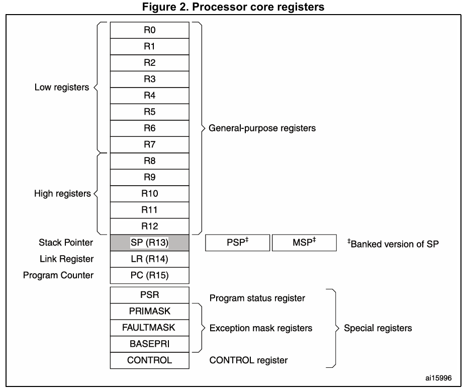
- R0~R12: 범용 레지스터 (General purpose)
- SP: 스택 포인터, 하나의 레지스터가 아닌 두 레지스터 main stack pointer와 process stack pointer의 alias이다. (psp는 user thread 영역에서만 쓴다.)
- LR: 함수 호출 후의 return address, 돌아가서 실행할 instruction의 주소값. 다중 호출을 위해 함수 진입 시 스택에 push, return 전 pop을 해 사용.
- PC: fetch한 Instruction의 주소값을 가지는 레지스터, auto-increment로 자동 증가하고, 파이프라인으로 동작 할때는 현재 실행하는 명령어 + 2번째 주소를 가리킴 (thumb 명령어 크기 2)
- other special registers
- xAPSR (APSR, ISPR, ESPR)
  - N[31] Negative, 연산 결과가 음수라면 (비교가 더 작다면)
  - Z[30] Zero, 연산 결과가 0이라면
  - C[29] Carry(or Borrow), 덧셈 연산 결과가 위로 넘어간다면 (MSB 위에서 하나가 내려온다면)
  - V[28] flag, 연산 결과가 오버플로우 했다면 (C 비트와 조합해서 상태를 명확히 구분)

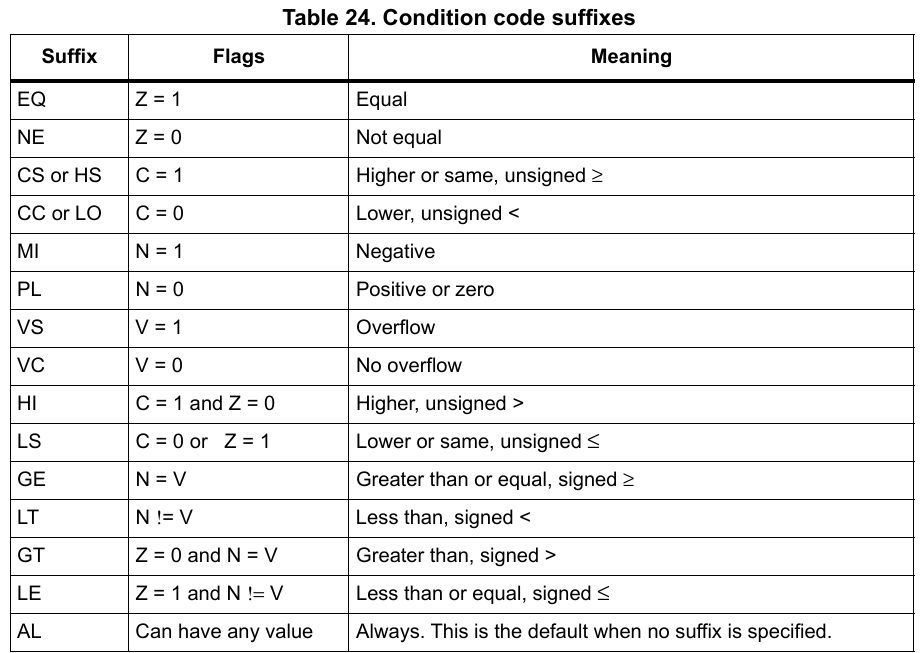


```
push {r7, lr}


pop {r7, pc}

또는

bx lr   @ PC = LR
```

#### 동작 모드
- thread 모드와 handler 모드, 특권 레벨과 비특권 레벨이 존재.
- (운영체제를 사용하는 시스템에서 쓰는 구분)
- 특권 레벨은 특권 명령어를 사용할 수 있는 레벨로 운영체제 레벨에서 사용하며, 비특권 레벨은 사용자 프로세스에서 사용.
- User Thread (사용자 프로세스, process stack을 사용함), Privilege Thread (운영체제 또는 펌웨어에서는 전부), Privilege handler (인터럽트 과정에 작동, 메인 스택을 사용함.)
- 특권 모드에서는 SP는 MSP의 alias이고, 사용자 쓰레드에서는 SP는 PSP의 alias이다.


#### thumb2 명령어 집합
- legacy ARM에서는 32비트 명령어를 사용하는 ARM 명령어를 사용했고 16bit 명령어인 thumb 명령어와 혼용함.
- 16bit에서 32bit 명령어를 사용하면 fetch를 두번하여 조합하고, 32bit arch에서 16bit를 쓰면 fetch 1회의 효용이 낮아져 성능이 떨어짐.
  fetch 횟수 때문에 속도 오버헤드, 명령어를 변환해서 조합하는 부분에서 코드 크기 오버헤드가 발생하였음.
- thumb2 명령어는 16비트 및 32비트 명령어를 혼용하여 사용하며 단점을 개선함.
- 현재 cortex-M은 thumb2를 사용함.

#### 파이프라이닝
1 클락에 fetch, decode, execute를 각각 병렬적으로 실행하여 3배 빠르게 명령어를 실행하게 됨.
PC는 fetch한 명령어의 주소이고, execute는 2클락 전에 fetch한 주소의 명령어이므로 PC는 실행중인 명령 + 2번째의 주소를 가진다.
```
bl <function> @ LR=PC-4 | 1; PC=&fucntion;
Instruction의 크기가 2 또는 4이므로 LR에는 PC에서 해당 명령어 크기만큼 뺀값이 들어가도록 컴파일된다.
thumb2의 경우 PC(LR도) LSB를 1로 올린다.
```

#### Flash memory interface
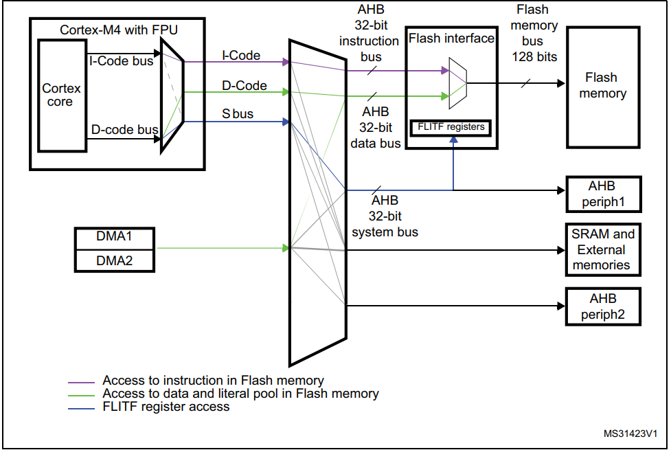
- flash memory bus 128bits: 느리기 때문에 대역폭을 늘림.
- DMA(Direct Memory Access): CPU 대신 DMA소자가 직접 데이터 이동을 접수, 처리하여 CPU의 Idle time을 줄여 성능을 높임.


#### AAPCS (ARM Architectur Procedure Call Standart)
- ARM 아키텍처용 함수 호출 표준
- R0, R1, R2, R3로 인수 전달
- R0으로 반환

#### ARM assembly syntax
opcode operand (dst, src, )
```C
ldr r0, [r1] @ r1이 가리키는 주소의 내용물을 r0에 적재하라.
str r0, [r2] @ r2의 주소의 내용물에 r0의 값을 적재.

ldr r0, =0x78f30000 @ .text 메모리에서 해당 상수값이 있는 곳에서 읽어와라. 
=>
ldr r0, [pc, #216] @ 현재 명령어가 실행하는 위치(.text > FLASH)에서 offset 위치에서 가져와라.

ldr r1, =0x20000120
ldr r0, [r1, #8]  // r0 = [0x20000128]

ldr r0, [r1, #8]! // r1 = 0x20000128, r0 = [0x20000128]

ldr r0, [r1], #8 // r0 = [0x20000128], r1 == 0x20000120,
```

__BKPT(0); // == __asm volatile("bkpt #0"); CPU 정지 명령어, breakpoint 역할 가능

#### CONTROL register
- FPCA[2] :  Indicates whether floating-point context currently active. 1이 floating point context 사용 중.
- SPSEL[1] : Active stack pointer selection. Selects the current stack. 0이 MSP 선택.
- nPRIV[0] : 현재 쓰레드가 특권 쓰레드임을 표시, 0이 특권모드.

## CMSIS와 HAL
- CMSIS(Cortex Microcontroller System Interface Standard): ARM에서 제작한, 해당 프로세서를 이용하는 제품의 소프트웨어 표준, 컴파일러 및 주변장치의 기능에 상관없이 공통적인 부분을 정의했음.
- HAL(Hardware Abstraction Layer): STM에서 개발한 라이브러리, 드라이버 구조/기능/변수 이름을 표준화, 시리즈간의 이식성을 구현했음.

# peripheral
## GPIO (General Purpose Input Output)
- reset value:
  - reset value = 대부분 0x00으로 GPIO의 경우 input float mode가 기본값
- alternate function: MODER 설정으로 다른 주변장치가 해당 포트의 해당 핀을 쓸 수 있게 할 수 있다.
- Output Type: open-drain과 push-pull
  - open-drain: High일때 float, Low일때 0V를 내놓는 모드.
  - push-pull: High일때 3.3V, Low일때 0V를 내놓는 모드.
  - volatile 변수 사용: 실제 I/O를 다루는데 최적화 (코드 생략, 캐싱)하지 않도록 해야 하므로 volatile 접두사를 쓴다.
- ODR을 바로 조작하지 않고 BSRR을 쓰는 이유: 
  - `The purpose of the GPIOx_BSRR register is to allow atomic read/modify accesses to any of the GPIO registers. In this way, there is no risk of an IRQ occurring between the read and the modify access. 즉시 대입 하므로 가져와서 바꾸고 대입(|=, &=)하는 과정을 거치지 않는다.`


#### External Interrupt
#### Alternate functions
- OTYPE register, PUPD register, MODE register등을 설정해야 이용 가능.


## Cortex-M memory and bus architecture
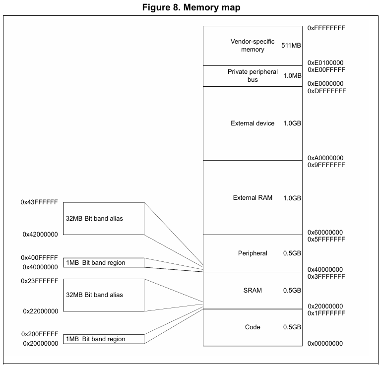
- 0x08000000: 2mb FLASH
- 0x20000000: 192kb RAM
- 0x10000000: 64kb CCRAM

 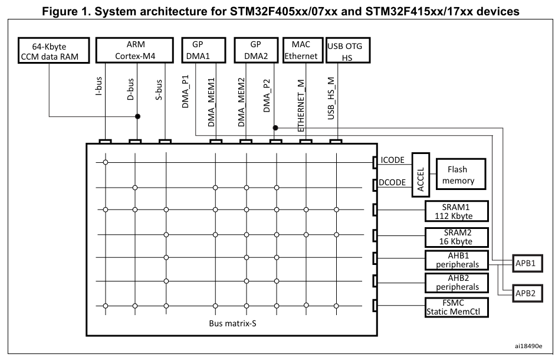
 - I-bus: Instruction bus
 - D-bus: Data bus
 - S-bus: System buso

**SRAM**
 부팅이 선택되거나 (BOOT[1:0] 레지스터) SYSCFG->MEMRMP으로 물리적 리매핑이 될때, SRAM은 시스템 버스, Ibus Dbus로 접근할 수 있다.

**FLASH MEMORY**
- 섹터(페이지) 단위로 구분된 블럭
- 시스템 메모리 부트 모드에서 부팅하는 영역
- 512byte의 OTP(One Time Programmable) 영역
- 읽기 및 쓰기 보호, BOR 레벨 (전원 인가시 안정적인 전압이 될때까지 대기하는 장치),워치독 리셋 정보를 가진 옵션 바이트

### Bit Banding
- 32bit 크기의 alias 영역이 region 영역의 1개 bit를 담당하여 조작한다.
  - alias 영역의 한 WORD에 1을 대입하면 해당하는 region의 bit가 1, 0을 대입하면 0이 된다.
  - R13bitAlias = 1; // region |= (1<<13);, region = region | (1<<13);
- *ptr |= (1<<13)과 같은, Read-Modify-Write 동작을 방지하고 원자적이고 빠르게 Write 만으로 제어하기 위함.
- 원자적 동작을 위해선 mutex 또는 semaphore등을 이용해 구현해야함. (매우 비쌈) 하지만 Bit Banding, BSRR등의 원자적 엑세스 alias 레지스터를 사용하면 메모리 공간은 낭비해도 원자적 구현 비용은 아예 없음. 


## RCC (Reset and Clock Control)
#### Clock
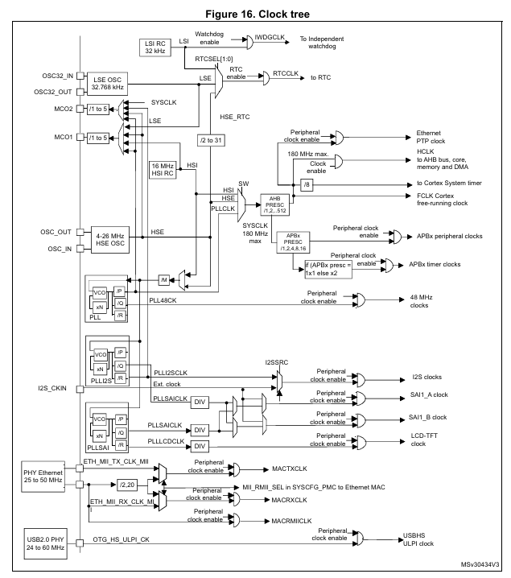
- HSE (High Speed External)
  - 고주파 외부 크리스털 오실레이터 클럭, MCU 밖의 보드에 있는 클락
- HSI (High Speed Internal)
  - 내장 RC 오실레이터, 소형 RC 오실레이터므로 클럭의 품질은 떨어짐.
- PLL (Phase Locked Loop )

- HSE, HSI, PLL 중 1택하여(MUX) 이를 AHB prescaler가 감속하면 SYSCLK (180MHz MAX).
- 이를 HCLK(Core, memory and DMA), HCLK/8 (systick timer).
- FCLK은 HCLK과 동기화 되어있지만, 절전모드를 제외하고는 항상 동일한 클럭으로 인터럽트 샘플링, 디버그 블록 클락에 쓰는 자유 실행 프로세스 클락. 절전 모드 중에 인터럽트를 샘플링하고 절전 이벤트를 추적.
- SYSCLK을 APB prescaler가 분배하면 APB CLK으로 peripheral (GPIO, ADC, Timer 등)이 사용하는 클락으로 사용.


#### Reset
There are three types of reset, defined as system Reset, power Reset and backup domain 
Reset. 

## Interrupt
- 하드웨어적으로 발생하는 신호, 인터럽트 발생시 처리중인 작업을 중단하고 다른 작업으로 전환. (context switching 발생)
- NVIC는 인터럽트 벡터에 정의된 함수(Interrupt Service Routine)를 실행한다.
- IRQ (Interrupt ReQuest): 하드웨어에 의해 발생한 신호를 말함.
- Interrupt Ignore (Masking): 특정 인터럽트를 무시하도록 하는 것.
- 각 인터럽트 소스에 대해 하나의 제어 비트가 있으며, 마스킹된 경우 IRQ는 생성하지 않지만 펜딩 레지스터에서 해당 상태를 볼 수 는 있다.

**인터럽트 초기화**
1. Global Interrupt Enable.
2. Set Interrupt Priority.
3. Enable each Interrupt.

**EXTI (External Interrupt)**
- 외부 핀의 전압으로 직접 인터럽트 받는 장치.

**인터럽트 트리거**
- 레벨 트리거: 신호가 특정 레벨에 도달하면 인터럽트 발생
- 에지 트리거(펄스 트리거): 상승 또는 하강 에지에서 인터럽트 발생

#### NVIC (Nested Vector Interrupt Controller)
- Cortext-M은 레벨 트리거를 지원하지 않음, (NVIC가 에지 트리거에서 최적화)
- 발생한 인터럽트를 처리하는 장치, priority로 우선순위를 판별하며, 지연이 적은 인터럽트 핸들링을 지원한다. 
- Tail-Chaining: 동시에 여러 인터럽트가 발생 시, priority에 따라 우선적인 ISR(핸들링)을 마친 후 원래 context로 복귀(pop) 후 다시 핸들러로 진입(push)하지 않고 바로 이어서 다음 핸들러를 시행하여 오버헤드가 없다.
- ISR 도중이어도 우선순위가 더 높은 IRQ가 들어오면, context switch하여 해당 IRQ에 대한 ISR을 시행한다.
- 동일한 레벨의 인터럽트의 경우 소프트웨어적으로 처리해야 한다. 

*NMI* : Non Masking Interrupt, 절대 끌 수 없는 인터럽트. 
#### 인터럽트 레지스터
- 인터럽트 상태 레지스터: 인터럽트 플래그가 있는 레지스터, 마스킹되지 않은 인터럽트 발생시 플래그 셋.
- 인터럽트 마스크 레지스터: NVIC_ISER, NVIC_ICER (Set/Clear Enable), 활성화/비활성화 하는 데 사용
- 인터럽트 펜딩 레지스터: NVIC_ISPR, NVIC_ICPR (Set/Clear Enable), 들어오는 인터럽트 처리에 사용.

#### **핸들러 진입과 반환**
1. 현재 Instruction 종료 (긴 명령어 = 여러 클락을 쓰는 명령어는 제외)
2. Context Switch: 특수 레지스터와 Caller-saved register (R0 R1 R2 R3 R12=IP LR PC xPSR) push. //Cortex-M의 경우 자동, 그 외의 경우 컴파일러가 작성해줌.
3. 특권 모드
4. PC에 예외 핸들러 주소 로드
5. EXC_RETURN 코드에 LR 로드
6. 예외 번호로 IPSR 로드, xPSR [8:0]에 exception number.
7. 핸들러 코드 시작

1. 반환 처리 트리거링 명령 실행 (EXC_RETURN으로 점프하여 실행)
2. context switch (Unstacking)
3. 이어서 실행


#### Vector table in startup code:
```
   .section  .isr_vector,"a",%progbits
  .type  g_pfnVectors, %object
  .size  g_pfnVectors, .-g_pfnVectors
   
g_pfnVectors:
  .word  _estack        @스택 끝의 주소값
  .word  Reset_Handler  @ booting 시 초기화 핸들러

  /* System Interrupts *
  .word  NMI_Handler
  .word  HardFault_Handler
  .word  MemManage_Handler
  .word  BusFault_Handler
  .word  UsageFault_Handler
  .word  0
  .word  0
  .word  0
  .word  0
  .word  SVC_Handler
  .word  DebugMon_Handler
  .word  0
  .word  PendSV_Handler
  .word  SysTick_Handler
  
  /* External Interrupts */
  ```

####   Exception number와 IRQ number
- Exception number: 모든 Exception들을 표시. 인터럽트는 exception의 부분 집합. 
- IRQ number:  exception 16이 IRQ 0, vector table에서 0x40번지 부터 .WORD 0번 

**exception mask register**
- fault mask register: NMI를 제외한 모든 exception을 방지 (reset, NMI)
- primask register: NMI, fault를 제외한 모든 configurable한 exception을 마스크.
- basepri register: 우선순위 IRQ 값이 이 레지스터에 써있는 값과 ge일 경우 실행하지 않음. 


#### prepriority and subpriority
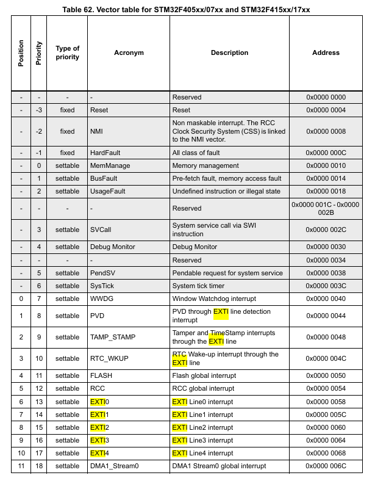
- prepriority 선점우선순위: 여러 예외가 발생했을때 일단 선점우선순위를 비교해서 값이 더 낮으면 선점 (도중이면 context switch)
- subpriority 보조우선순위: 같은 선점우선순위를 가지고 있는 경우 이 값이 낮은 예외를 먼저 처리한다. (도중에 교체는 안됨)


1. configurable한 예외들의 우선순위 기본값은 항상 0이다.
2. reset NMI hardfault는 0보다 낮음
SHPRx: 시스템 핸들러 우선순위 설정
NVIC_IPRx: configurable 인터럽트 우선순위


*소프트웨어 트리거*
STIR 레지스터에 쓰는 방법으로 특정 IRQ를 생성해서 ISR을 호출.

#### 스택 프레임

자동으로 context switching 하는것을 stacking이라 한다. push된 8개의 레지스터를 스택 프레임이라 한다.

#### 익셉션 리턴 (EXC_RETURN)  

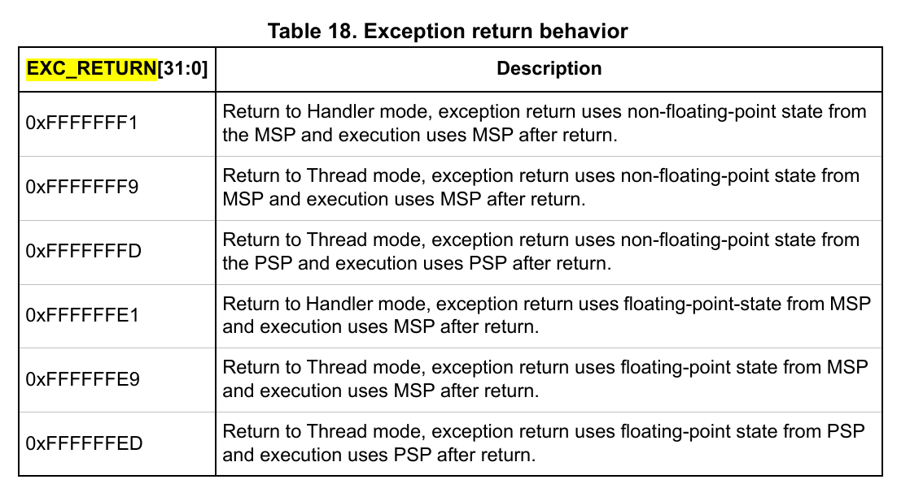
EXC_RETURN is the value loaded into the LR on exception entry.
돌아가야할 쓰레드 모드, 특권 모드, 컨텍스트가 있는 스택을 명시한 테이블의 값을 사용, LR에 넣고 핸들러 진입.
0xFFFFFFFx의 값이 PC에 들어가면 반환 처리 트리거링 실행.

#### 메모리 리매핑  

`SYSCFG_MEMRMP` : 레지스터 내부 `MEM_MODE` 비트가 0x00이 매핑되어 표시하는 실제 메모리를 결정한다.
`Bus Matrix` 0x0~ 0x000F FFFF에 접근 시 디코더가 내부의 SYSCFG 리매핑 MUX 사용하여 분기, 리매핑한다.
실제 0x00과 리매핑된 주소 (Main Flash의 경우 0x0800 0000)이 같은 주소를 가리키는 Aliasing이 발생한다.

#### 벡터 테이블

- Cortex-M 이외의 ARM의 경우, 0x00에 함수의 주소 (Instruction의 Address)가 들어있지 않고 PC에 주소를 로드하는 명령어가 들어있다.
- 0x00에는 stack pointer에 넣을 Stack의 끝의 주소값이 들어있다. (스택 초기화)
- 0x04에는 Reset Handler의 주소가 들어있다. (런타임 초기화)

**벡터 테이블 재배치**
default 0x00에 존재, FLASH에 있는 벡터 테이블은 런타임에 수정 할 수 없으므로 SRAM에 배치해야 바꿔 쓸 수 있음.

VTOR 레지스터를 이용해 벡터테이블을 SRAM에 위치시킬 수 있다.
SCB->VTOR (0xE000ED08, 0xE000ED00 + 0x08)
29번 비트 1:SRAM 0:FLASH

**Systick Interrupt**
System Interrupt의 15번, SCB에서 config 가능함.


## SCB (System Control Block)
CPUID, vector, exception 등의 코어 기능들을 제어하는 모듈

비정렬 액세스: 접근 하려는 메모리의 접근 단위의 정수배가 아닌 주소의 액세스
legacy ARM에서는 불가능, 성능은 좋아짐.
Cortex-M에서는 비정렬이 default, 정렬이 select
```C
uint32_t *ptr;  
uint8_t myarray[] = {1,2,3,4,5,6,7,8};
ptr = (uint32_t*) &myarray[3]; // =0x2002FFDF
insertNumber(ptr, 3);//*ptr = (uint32_t)3;
// myarray[]의 위치에 {1,2,3,3,0,0,0,8}
```
정렬 액세스:
SCB->SHCSR (System Handler Control and Statae Register)에서 usage fault 활성화
SCB->CCR (Configure Control R)에서 비정렬 트랩 활성화
위의 코드 Usage Fault occur

## USART/UART
Universal Synchronous Asynchronous Reciever and Trasnmitter
전이중 비동기/동기 송수신기

configurable format:
- baud rate
- data length
- stop bit length
- parity
- flow control

> parity는 신뢰성이 낮음 (1의 갯수 % 2 만을 따지기에 검사도 실패할 확률이 높음.)
> -> use checksum, CRC, reed solomon etc instead.

| register   | description                                                   |
| ---------- | ------------------------------------------------------------- |
| USART->SR  | 송수신 상태 플래그                                            |
| USART->DR  | 송수신 data 레지스터, 쓰기는 TDR에 쓰고, 읽으면 RDR을 읽는다. |
| USART->BRR | baud rate 생성기 config                                       |
| USART->CRx | USART, TX, RX enables, Interrupt enables, etc.                |

## TIMER counter, programmable interval TIMER
분주 클럭을 직접 사용하는 하드웨어 타이머
TIMER usage on embedded system.
1. Time delay: 정확한 지연 제공. (CPU를 이용한 polling NOP delay는 정확한 타이밍을 예측할 수 없고 낭비)
2. Time measure: 정확한 시간 간격 측정.
3. Pulse Width Modulation: 정밀한 직류 전력 제어.(전압을 제어함으로 평균 전력을 제어)
4. Input Capture: 외부 신호가 들어오는 정확한 시각 포착, 제공.


타이머 종류
| 구분                  | 해당 타이머 |
| --------------------- | ----------- |
| Advanced Timer        | TIM1/ 8     |
| General-Purpose Timer | TIM2~5/9~14 |
| Basic Timer           | TIM6/ 7     |

#### Prescaler and Divider
- Prescaler: Programmable clock divider
- Divider: 상수배 분주기

| name           | description                                                                   |
| -------------- | ----------------------------------------------------------------------------- |
| TIMx->PSC      | 분주기 레지스터, PSC+1로 CK_PSC를 나눔                                        |
| TIMx->CNT      | 카운터 값 레지스터                                                            |
| TIMx->ARR      | Auto Reload Register, 자동으로 해당값으로 재설정                              |
| CK->INT        | 클럭 소스용 내부 클락, PCKLx를 말함(APBx clock을 APBx Prescaler를 거친 것.)   |
| TIMx->CR1.ARPE | Auto Reload Preload Enable, UEV후에 ARR을 바꾼다(ARR Buffered), 0이면 UEV전에 |

*shadow register (ARR, CCMR, PSC)*: CNT가 실제 비교하는 값이 든 레지스터, ARR, CCMR을 바꾸면 preload에 적재되고 PE bit에 따라서 즉시 복사 또는 UEV에 복사 하는지 결정
#### Pulse Width Modulation(Output Compare) & Input Capture
외부 핀(GPIO, TIM PWM AF으로 설핀한 핀)으로 타이머에 설정한 값(클럭 분주비, 사이클 끝 높이, duty 전환 높이)대로 펄스가 나가도록 함.
| register   | description                                        |
| ---------- | -------------------------------------------------- |
| TIMx->CCRy | CNT가 CCRy (y는 채널 번호)에 도달할 경우 펄스 종료 |


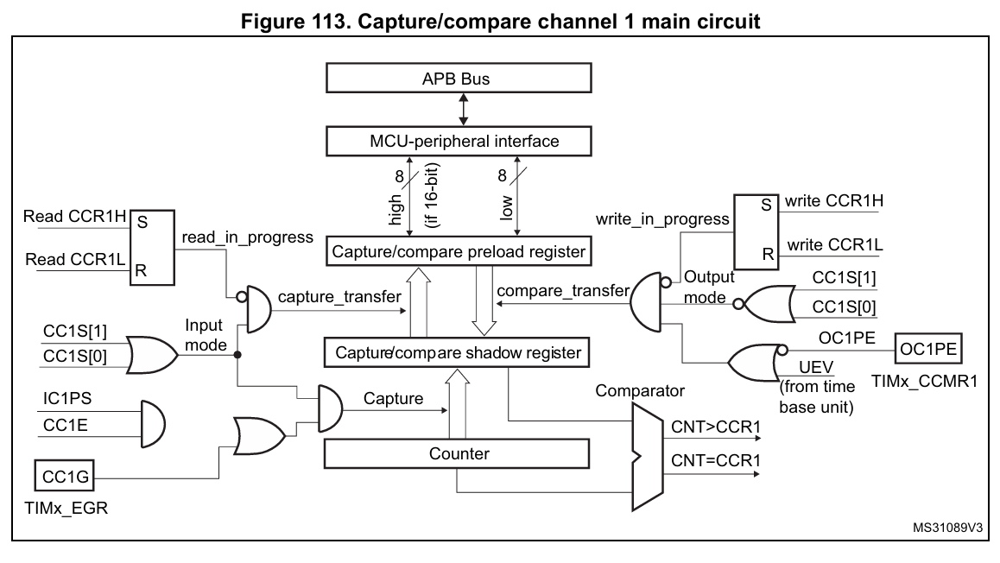
Output Compare mode
Center-aligned mode (in AVR, phase correct PWM)
PWM MODE로 펄스 반전 가능.
mode 1: 비반전 (CCM에 도달하기 전이 pin active)
mode 2: 반전 (CCM에 도달한 후 pin active)


## DMA(Direct Memory Access)
 
DMA는 Bus Master이다.
CPU의 동작 없이도 프로그래밍 된대로 메모리에서 데이터를 옮긴다.
(Memory to Memory, Peripheral to Memory)
큰 용량을 옮기거나, 반복적인 작업을 할 때 사용.

> BURST mode, 메모리를 sequential하게 전송하는 것. 빠르게 대량의 데이터를 방해받지 않고 옮긴다.

**인터럽트와 비교해서**
고속 포트를 사용하는 경우 단순히 버퍼를 비우거나 로드하는 작업을 하기에는 인터럽트의 비용이 높을 수 있다.
이는 데이터 전송에 대한 오버헤드로 볼 수 있다.

#### DMA sequence
1. **DMA config**
    1. SRC address
    1. DST address
    2. Num of Element
    3. Size of Element
    4. BUSRT config.
    5. Repeat config.

2. **Waiting and Start**
    - Memory to Memory: Software Trigger, 즉시 시작
    - Memory to Peripheral: Software Trigger, 즉시 시작 
    - Peripheral to Memory: Peripheral이 DMA controller에게 신호(DREQ)를 보내서 시작, DACK를 응답.
3. Bus Request to CPU
4. CPU send Bus Granted to DMA
5. DMA send Bus Granted Acknowledge to CPU
6. DMA get Bus Master
7. DMA work
8. DMA return Bus Master and CPU get it
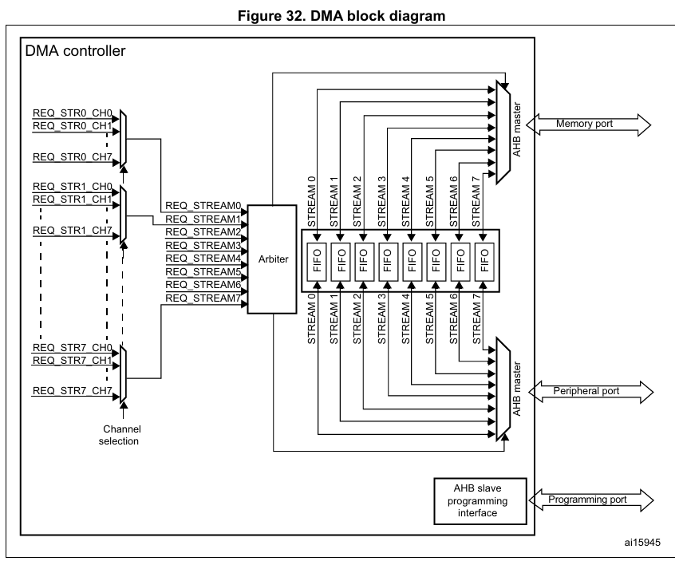

| register   | description                                                                 |
| ---------- | --------------------------------------------------------------------------- |
| DMA_SxCR   | channel sel, BURST, PtoM or MtoM, Increment mode, Circular mode etc config. |
| DMA_SxNDTR | Number of Data                                                              |
| DMA_SxFCR  | DMA stream x FIFO control register                                          |

#### FIFO mode
DMA controller에 있는 FIFO의 버퍼(First-In, First-Out Buffer)를 사용한다.(16 Byte = 4 WORD)
- 속도 불일치 해소: 속도가 느린 주변장치(예: UART, SPI)와 속도가 빠른 시스템 메모리(SRAM, Flash) 간의 속도 차이를 흡수합니다.
- 데이터 패킹/언패킹 (Data Packing/Unpacking): 소스(Source)와 목적지(Destination)의 데이터 폭이 다를 때(예: 8비트 주변장치 → 32비트 메모리) 이를 중간에서 맞추어 줍니다.
- 버스트 전송 대기: 매 데이터마다 시스템 버스(AHB/AXI 등)를 점유하지 않고, 데이터를 FIFO에 모았다가 한 번에 전송할 수 있게 합니다.

Memory to Memory의 경우 FIFO를 사용하는 것이 필수적이다. (직접 변경이 불가능)
FIFO를 사용하는 경우 1회 전달 Data Width가 변경이 가능하고 (BYTE, HALF-WORD, WORD) pack, and unpack.
BURST 모드가 사용 가능해진다.

**Threshold**
FIFO 버퍼에 데이터가 어느 정도 채워졌을 때(또는 비워졌을 때) DMA가 버스 요청을 시작할지 결정하는 기준.
- 수신 (Peripheral → Memory): 주변장치에서 FIFO로 데이터가 들어와 지정된 Threshold(예: FIFO 용량의 1/4, 1/2, 3/4, Full) 이상 채워지면, DMA가 시스템 버스 제어권을 요청하여 메모리로 버스트 전송을 실행.
- 송신 (Memory → Peripheral): FIFO의 데이터가 쓰레스홀드 이하로 떨어지면 메모리에서 새로운 데이터를 가져와 FIFO를 채운다.
"Threshold 설정값 ≥ Burst 전송할 총 데이터 크기"를 성립해야 언더런 오버런이 안난다.

#### BURST mode
BURST mode의 단위는 4/8/16 byte 짜리 `beat`
`beat`의 크기는 Data Packing의 dest의 data size
CNDTR이 Busrt 데이터의 총량(BUSRT Size * Beat size)의 배수여야 한다.
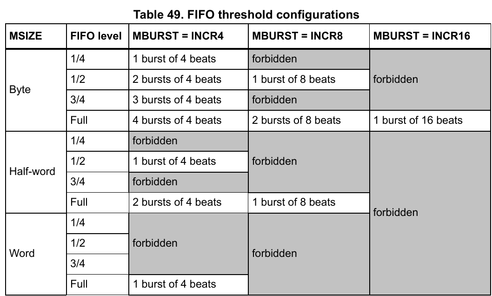

## ADC (Analog Digital Converter)
부호화:
sampling -> quantanization -> coding

Resolution (분해능, 양자화 비트 수)
기준 전압 (Vref, Reference Voltage) 대비 측정 전압을 몇개의 비트로 표현할 것인가.

> Vref = 3.3V, 12bit resolution ADC, Voltage per 1bit = 3.3V / 4096 = 0.8056640625 mV
>
> 3.3V를 측정 시 ADC 값은 4095


#### ADC operate mode
- Single Conversion Mode: SWSTART bit를 set하여 변환 시작 또는 EXT Trigger
- Continious Conversion Mode: CONT bit를 set하여 설정,
- Scan Mode (scan all ADCx channel)
- External Trigger
- Injected Mode

**Interrupts**
- End of Conversion IT
- Injected End of Conversion IT
- Analog Watchdog IT

*Reference Voltage*
- Vref+  
- Vdda   
- Vref-  
- Vssa   
- analog 
ADC_SR[1:1] EOC:  
Regular channel end of conversion This bit is set by hardware at the end of the conversion of a regular group of channels. It is cleared by software or by reading the ADC_DR register.
DR를 읽으면 0이 된다.

---
## I2C (Inter-Intergrated Circuit)
> On board 통신용으로 개발된, 소프트웨어 및 하드웨어 프로토콜.
#### Hardware
- Pin Description
  - SDA: Data bus.
  - SCL: Clock bus. [1](1)
- 모든 버스는 Pull-UP 저항에 연결되어 있으며, MOSFET 단자의 Open Drain/Open Collector로 되어있어 Low가 되면 전체가 0V가 된다.
  - Pull-UP 저항은 Idle State에 High가 되도록 보장하는 용도, 없으면 float되어 동작하지 않음.
- Master에 의해 START. Slave에 의해 Acknowledge 응답.
- 1 byte 이상의 데이터를 포함하는 패킷을 전송.

[1]: I2C는 클럭 동기식 통신이다.


#### Protocol
1. Master가 Start bit 신호. (다른 장치가 Bus Master가 아닌 경우에)
2. 7bit Address를 보내서 대상 지정.
3. Address 뒤의 1bit가 High면 Read, Low면 Write.
4. Write의 경우 Slave의 ACK을 받음. else, Read의 경우, NO-ACK.

#### register
| register    | description                                        |
| :---------- | :------------------------------------------------- |
| I2Cx->CR1   | Enable, START, STOP, ACK등의 비트 생성             |
| I2Cx->CR2   | Interrupt Enable 및 APB 클락의 값을 적는 FREQ[5:0] |
| I2Cx->OAR1  | 7-bit, 10-bit target 설정 및 SLAVE의 Address       |
| I2Cx->OAR2  | Dual Addressing 용                                 |
| I2Cx->DR    | 전송하고 수신할 1-byte data                        |
| I2Cx->SR1   | Timeout, error, Data input flag, STOP detection    |
| I2Cx->SR2   |
| I2Cx->CCR   |
| I2Cx->TRISE |
| I2Cx->FLTR  |


---
## WDG (Watch Dog)
소프트웨어, 하드웨어적 오류로 인한 루프에 빠져있는 경우를 해결하는 장치.
와치독 타이머는 다운카운터로 언더플로우 발생시 리셋.

**KR (Key Register)에 정확한 값을 쓰는 것으로 제어할 수 있다.**
| value  | Behavior                                                                       |
| ------ | ------------------------------------------------------------------------------ |
| 0xCCCC | Starts Watch Dog                                                               |
| 0x5555 | Enable access to the IWDG_PR(Prescaler) and IWDG_RLR(ReLoad) registers, config |
| 0xAAAA | Down Counter Reset                                                             |

#### IWDG (Independant Watch Dog)
LSI에 의해 클럭되는 WDG로 코어 클럭과 독립적으로 작동한다.
타이밍 정확도가 낮은 어플리케이션에 적합.
#### WWDG (Window Watch Dog)
PCLK을 사용하여 타이밍 정확도가 중요한 어플리케이션에 적합.

#### register
| register  | description                                          |
| :-------- | :--------------------------------------------------- |
| IWDG->KR  | config and control register by write specific value. |
| IWDG->RLR | Watchdog Counter Reload value.                       |
| IWDG->PR  | Presacler divider from LSI (32kHz in STM32F).        |
| IWDG->SR  | RLR update flag and PR update flag register.         |
| WWDG->CR  |
| WWDG->CFR |
| WWDG->SR  |

---
## RTC (Real-Time Clock)
`BCD (Binary Coded Decimal)` format: 십진수 한자리를 2진수 byte 하나에 적음.
NTP (Network Time Protocol): 운영 체제가 내부적으로 자동으로 사용해 시간을 동기화함.


#### RTC and Low-Power mode
| mode    | description                                              |
| ------- | -------------------------------------------------------- |
| sleep   | No wakeup.                                               |
| stop    | LSI/LSE on?: RTC alarm, event, wakeup으로 Stop모드 종료. |
| standby | LSI/LSE on?: RTC alarm, event, wakeup으로 Stop모드 종료. |

#### RTC Interrupt
`RTC_WKUP`: through the EXTI Line


## SPI (Serial Peripheral Interface)
#### SPI Bus
- MOSI: Master Output Slave Input
- MISO: Master Input Slave Output 
- CLK: Clock for synchronous operation.
- CS: Chip Select, Chip Select Bus needed as number of Peripheral. (Low Active)
Two Data Bus == full duplex communication.
CS as many as peripheral == bus complex and need decoder.


