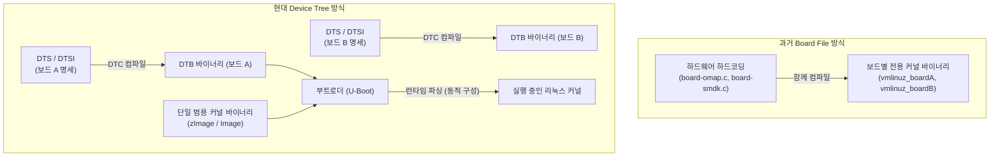
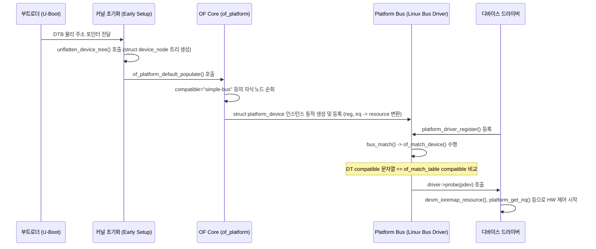
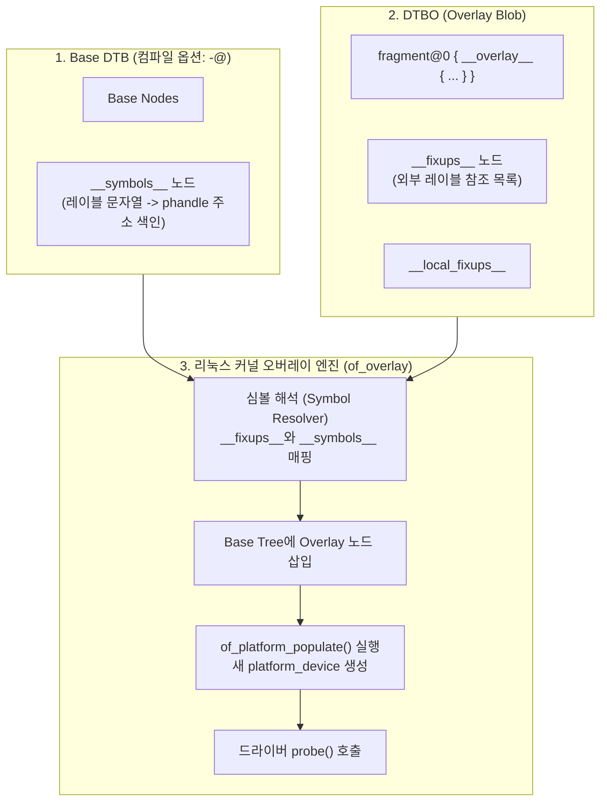

# Linux System & Kernel Programming

- [Linux System \& Kernel Programming](#linux-system--kernel-programming)
- [1. Linux basic \& Application Programming](#1-linux-basic--application-programming)
  - [GNU 툴킷 기반 빌드 시스템 (Build in Linux with GNU Toolkit)](#gnu-툴킷-기반-빌드-시스템-build-in-linux-with-gnu-toolkit)
    - [컴파일 \& 링커 옵션 (gcc, ar, ld)](#컴파일--링커-옵션-gcc-ar-ld)
      - [정적 라이브러리 (Static Library, `.a`) 컴파일 및 생성](#정적-라이브러리-static-library-a-컴파일-및-생성)
      - [동적/공유 라이브러리 (Dynamic/Shared Library, `.so`) 컴파일 및 생성](#동적공유-라이브러리-dynamicshared-library-so-컴파일-및-생성)
      - [동적 링커 런타임 바인딩 설정 (`/etc/ld.so.conf`, `ldconfig`)](#동적-링커-런타임-바인딩-설정-etcldsoconf-ldconfig)
    - [Cross Compile \& Native Compile](#cross-compile--native-compile)
      - [툴체인(Toolchain) 명명 규칙 (Target Triplet)](#툴체인toolchain-명명-규칙-target-triplet)
      - [Sysroot \& SDK](#sysroot--sdk)
    - [GNU Make \& Makefile](#gnu-make--makefile)
      - [Makefile 기본 구조 및 동작 원리](#makefile-기본-구조-및-동작-원리)
      - [자동 변수 (Automatic Variables)](#자동-변수-automatic-variables)
      - [패턴 규칙 (Pattern Rules)](#패턴-규칙-pattern-rules)
      - [자동 의존성 생성 (`gccmakedep`, `gcc -MMD`)](#자동-의존성-생성-gccmakedep-gcc--mmd)
      - [Special Targets (특수 타겟)](#special-targets-특수-타겟)
      - [조건부 구문 (`ifeq`, `ifneq`, `ifdef`, `ifndef`)](#조건부-구문-ifeq-ifneq-ifdef-ifndef)
      - [Makefile 주요 내장 함수](#makefile-주요-내장-함수)
      - [변수 할당 연산자 차이](#변수-할당-연산자-차이)
    - [Target Binary Deployment \& 개발 도구 (ctags, cscope)](#target-binary-deployment--개발-도구-ctags-cscope)
      - [Target Binary Deployment (디바이스 패키지/명령어 추가)](#target-binary-deployment-디바이스-패키지명령어-추가)
      - [Development Environment Tools (ctags, cscope)](#development-environment-tools-ctags-cscope)
  - [프로세스 \& 스레드 프로그래밍 (Process \& Thread Management)](#프로세스--스레드-프로그래밍-process--thread-management)
    - [Linux Thread 모델 (LWP) \& POSIX Threads (`pthread`)](#linux-thread-모델-lwp--posix-threads-pthread)
      - [POSIX Thread API (`<pthread.h>`) 및 스레드 상태](#posix-thread-api-pthreadh-및-스레드-상태)
    - [Daemon Processes \& systemd](#daemon-processes--systemd)
      - [데몬 프로세스 (Daemon Process)](#데몬-프로세스-daemon-process)
      - [systemd 서비스 및 모듈 자동 로드](#systemd-서비스-및-모듈-자동-로드)
  - [프로세스 간 통신(IPC) \& 동기화 (IPC \& Synchronization)](#프로세스-간-통신ipc--동기화-ipc--synchronization)
    - [유저 레벨 뮤텍스 \& 조건 변수](#유저-레벨-뮤텍스--조건-변수)
      - [뮤텍스 (Mutex)](#뮤텍스-mutex)
      - [Mutex Priority Ceiling (우선순위 천장)](#mutex-priority-ceiling-우선순위-천장)
      - [조건 변수 (Condition Variables)](#조건-변수-condition-variables)
    - [파이프 (Pipe \& FIFO)](#파이프-pipe--fifo)
      - [Anonymous Pipe (이름 없는 파이프)](#anonymous-pipe-이름-없는-파이프)
      - [Named Pipe (FIFO)](#named-pipe-fifo)
    - [메모리 매핑 I/O (`mmap` \& `/dev/zero`)](#메모리-매핑-io-mmap--devzero)
    - [System V \& POSIX IPC (Message Queue, Shared Memory, Semaphore)](#system-v--posix-ipc-message-queue-shared-memory-semaphore)
    - [Signal Handling (`sigaction`, `sigprocmask`)](#signal-handling-sigaction-sigprocmask)
      - [`struct sigaction` 및 신호 처리 API](#struct-sigaction-및-신호-처리-api)
    - [Session \& Process Group](#session--process-group)
  - [I/O 다중화 (Multiplexed I/O)](#io-다중화-multiplexed-io)
    - [API 비교](#api-비교)
  - [애플리케이션 디버깅 \& 크래시 분석 (Application Debugging \& Crash Analysis)](#애플리케이션-디버깅--크래시-분석-application-debugging--crash-analysis)
    - [GDB \& Core Dump Analysis](#gdb--core-dump-analysis)
      - [Core Dump](#core-dump)
      - [코어 덤프 활성화 및 생성](#코어-덤프-활성화-및-생성)
- [2. 커널 프로그래밍](#2-커널-프로그래밍)
  - [부팅 시퀀스 \& 가상 파일 시스템 (Boot Sequence \& Virtual File Systems)](#부팅-시퀀스--가상-파일-시스템-boot-sequence--virtual-file-systems)
    - [Boot Sequence (BootROM -\> FSBL -\> U-Boot -\> Kernel)](#boot-sequence-bootrom---fsbl---u-boot---kernel)
      - [부팅 관련 네트워크/도구 환경](#부팅-관련-네트워크도구-환경)
    - [Mount, Unmount \& Ramdisk (initramfs)](#mount-unmount--ramdisk-initramfs)
    - [Virtual File Systems (/proc, /sys)](#virtual-file-systems-proc-sys)
  - [커널 빌드 \& 로드 가능 커널 모듈 (LKM)](#커널-빌드--로드-가능-커널-모듈-lkm)
    - [Kernel Configuration \& Build (menuconfig, BusyBox)](#kernel-configuration--build-menuconfig-busybox)
      - [커널 빌드 절차](#커널-빌드-절차)
      - [BusyBox](#busybox)
    - [LKM Concept \& Architecture](#lkm-concept--architecture)
      - [Loadable Kernel Module (LKM)](#loadable-kernel-module-lkm)
      - [`.ko` (Kernel Object) 파일 구조](#ko-kernel-object-파일-구조)
      - [LKM 기본 소스 코드 구조](#lkm-기본-소스-코드-구조)
    - [Module Management Commands \& Auto-loading](#module-management-commands--auto-loading)
      - [모듈 관리 명령어](#모듈-관리-명령어)
      - [부팅 시 자동 모듈 적재 설정](#부팅-시-자동-모듈-적재-설정)
    - [Kernel Module Parameters](#kernel-module-parameters)
    - [Kernel Module Dependency \& Symbol Export](#kernel-module-dependency--symbol-export)
      - [커널 심볼 (Kernel Symbol)](#커널-심볼-kernel-symbol)
      - [심볼 내보내기 매크로](#심볼-내보내기-매크로)
      - [`/lib/modules/$(uname -r)/` 의존성 관련 파일](#libmodulesuname--r-의존성-관련-파일)
    - [Kernel Module License \& Safety Rules](#kernel-module-license--safety-rules)
      - [라이선스 (License) 및 Tainted Kernel](#라이선스-license-및-tainted-kernel)
      - [커널 모듈 작성 3대 안전 수칙](#커널-모듈-작성-3대-안전-수칙)
    - [Kernel Debugging Tools \& Log Levels (printk, dmesg)](#kernel-debugging-tools--log-levels-printk-dmesg)
      - [`printk` 및 `pr_*` 매크로](#printk-및-pr_-매크로)
      - [커널 로그 레벨 (8단계)](#커널-로그-레벨-8단계)
      - [콘솔 로그 레벨 제어 (`/proc/sys/kernel/printk`)](#콘솔-로그-레벨-제어-procsyskernelprintk)
  - [디바이스 드라이버 아키텍처 (Device Drivers Architecture)](#디바이스-드라이버-아키텍처-device-drivers-architecture)
    - [Software Stack for Hardware Access](#software-stack-for-hardware-access)
    - [Device Driver Types \& Device Numbers (Major/Minor)](#device-driver-types--device-numbers-majorminor)
      - [디바이스 드라이버 3대 분류](#디바이스-드라이버-3대-분류)
      - [Device Number (디바이스 번호)](#device-number-디바이스-번호)
      - [동적 주번호 할당 API](#동적-주번호-할당-api)
    - [Memory Mapping (`ioremap`)](#memory-mapping-ioremap)
    - [Address Spaces \& User/Kernel Data Exchange](#address-spaces--userkernel-data-exchange)
      - [주소 공간 구분 (32-bit ARM Linux 기준)](#주소-공간-구분-32-bit-arm-linux-기준)
      - [유저-커널 간 안전한 데이터 교환](#유저-커널-간-안전한-데이터-교환)
    - [Character Device Driver Architecture (`cdev` \& `struct file_operations`)](#character-device-driver-architecture-cdev--struct-file_operations)
      - [`struct file_operations` 정의](#struct-file_operations-정의)
      - [`cdev` 구조체 생성 및 등록](#cdev-구조체-생성-및-등록)
      - [udev](#udev)
    - [Driver Private Data Context (`private_data` \& `container_of`)](#driver-private-data-context-private_data--container_of)
      - [`struct file`의 `private_data`](#struct-file의-private_data)
      - [`container_of()` 매크로](#container_of-매크로)
    - [`ioctl` Interface](#ioctl-interface)
    - [GPIO Subsystem](#gpio-subsystem)
  - [커널 동적 메모리 할당 (Kernel Dynamic Memory Allocation)](#커널-동적-메모리-할당-kernel-dynamic-memory-allocation)
  - [커널 인터럽트 \& 블로킹 I/O (GPIO Interrupt \& Blocking I/O)](#커널-인터럽트--블로킹-io-gpio-interrupt--blocking-io)
    - [커널 인터럽트 처리 체계와 Top/Bottom Half 개념](#커널-인터럽트-처리-체계와-topbottom-half-개념)
    - [대기 큐(Wait Queue)와 블로킹 I/O (Blocking I/O)](#대기-큐wait-queue와-블로킹-io-blocking-io)
      - [태스크 대기 상태 (Waiting Task States)](#태스크-대기-상태-waiting-task-states)
      - [주요 Wait Queue 매크로 및 함수 (`<linux/wait.h>`)](#주요-wait-queue-매크로-및-함수-linuxwaith)
    - [Top Half (ISR) 구현 규칙 및 인터럽트 컨텍스트 4대 수칙](#top-half-isr-구현-규칙-및-인터럽트-컨텍스트-4대-수칙)
      - [인터럽트 등록 및 해제 API (`<linux/interrupt.h>`)](#인터럽트-등록-및-해제-api-linuxinterrupth)
      - [ISR 시그니처 및 반환값 (`irqreturn_t`)](#isr-시그니처-및-반환값-irqreturn_t)
      - [인터럽트 컨텍스트 4대 절대 금기 수칙](#인터럽트-컨텍스트-4대-절대-금기-수칙)
    - [Top Half vs Bottom Half 메커니즘 비교](#top-half-vs-bottom-half-메커니즘-비교)
      - [실행 환경 및 동작 특성 비교](#실행-환경-및-동작-특성-비교)
      - [Bottom Half 4대 메커니즘 비교](#bottom-half-4대-메커니즘-비교)
    - [Bottom Half 지연 처리 기법 4종 상세](#bottom-half-지연-처리-기법-4종-상세)
      - [Workqueue (워크큐)](#workqueue-워크큐)
      - [Threaded IRQ (스레드화된 IRQ)](#threaded-irq-스레드화된-irq)
      - [Softirq (소프트 인터럽트)](#softirq-소프트-인터럽트)
      - [Tasklet (태스크릿)](#tasklet-태스크릿)
    - [GPIO 인터럽트 및 블로킹 I/O 드라이버 구현 종합 패턴](#gpio-인터럽트-및-블로킹-io-드라이버-구현-종합-패턴)
  - [커널 동시성 \& 동기화 제어 (Mutex \& Concurrency)](#커널-동시성--동기화-제어-mutex--concurrency)
    - [Race Condition](#race-condition)
    - [커널 뮤텍스 (Kernel Mutex)](#커널-뮤텍스-kernel-mutex)
    - [Spinlock](#spinlock)
    - [원자적 연산 (`atomic_t`)](#원자적-연산-atomic_t)
    - [커널 스레드 (kernel thread, kthread)](#커널-스레드-kernel-thread-kthread)
      - [커널 스레드의 특징 및 개념](#커널-스레드의-특징-및-개념)
      - [핵심 API 및 생명주기 (`<linux/kthread.h>`)](#핵심-api-및-생명주기-linuxkthreadh)
      - [kthread Priority Set (우선순위 및 스케줄링 설정)](#kthread-priority-set-우선순위-및-스케줄링-설정)
        - [1) Nice 값 설정 (CFS / `SCHED_NORMAL`)](#1-nice-값-설정-cfs--sched_normal)
        - [2) Real-Time (RT) 우선순위 설정 (`SCHED_FIFO` / `SCHED_RR`)](#2-real-time-rt-우선순위-설정-sched_fifo--sched_rr)
      - [Multiple kthread (다중 커널 스레드 구성 및 관리)](#multiple-kthread-다중-커널-스레드-구성-및-관리)
        - [1) 다중 스레드 배열 관리 및 CPU Affinity 바인딩](#1-다중-스레드-배열-관리-및-cpu-affinity-바인딩)
        - [2) 다중 스레드 동기화 기법](#2-다중-스레드-동기화-기법)
        - [3) kthread vs Workqueue 비교 선택 가이드](#3-kthread-vs-workqueue-비교-선택-가이드)
    - [File Permission](#file-permission)
      - [Linux Capability system](#linux-capability-system)
    - [DMA engine, asyncronous memory transfer](#dma-engine-asyncronous-memory-transfer)
      - [DMA 전송 유형](#dma-전송-유형)
      - [DMA 메모리 할당](#dma-메모리-할당)
    - [mmap](#mmap)
      - [mmap의 동작 원리](#mmap의-동작-원리)
      - [mmap의 활용 사례](#mmap의-활용-사례)
  - [Linux Device Tree 및 커널 드라이버 연동](#linux-device-tree-및-커널-드라이버-연동)
    - [1. Device Tree 기본 개념 및 도입 배경](#1-device-tree-기본-개념-및-도입-배경)
      - [1.1 도입 배경 (Board File 방식의 한계와 패러다임 전환)](#11-도입-배경-board-file-방식의-한계와-패러다임-전환)
      - [1.2 핵심 용어 및 컴파일 체계](#12-핵심-용어-및-컴파일-체계)
      - [1.3 기본 DTS 문법 및 노드 구조](#13-기본-dts-문법-및-노드-구조)
        - [1 노드 및 속성 명명 규칙](#1-노드-및-속성-명명-규칙)
        - [2 프로퍼티(Property) 데이터 타입](#2-프로퍼티property-데이터-타입)
        - [3 핵심 공통 표준 속성](#3-핵심-공통-표준-속성)
    - [2. Device Tree 세부 문법 (DTS Syntax Details)](#2-device-tree-세부-문법-dts-syntax-details)
      - [2.1 `reg` 속성과 주소 지정 모델 (`#address-cells`, `#size-cells`)](#21-reg-속성과-주소-지정-모델-address-cells-size-cells)
        - [주소 셀 상속 규칙](#주소-셀-상속-규칙)
        - [버스 유형별 `reg` 속성의 의미](#버스-유형별-reg-속성의-의미)
        - [다중 레지스터 뱅크](#다중-레지스터-뱅크)
      - [2.2 `interrupts` 속성과 인터럽트 컨트롤러 (Interrupt Architecture)](#22-interrupts-속성과-인터럽트-컨트롤러-interrupt-architecture)
        - [핵심 속성 정의](#핵심-속성-정의)
        - [ARM Generic Interrupt Controller (GIC)의 3셀 규격 상세](#arm-generic-interrupt-controller-gic의-3셀-규격-상세)
      - [2.3 `ranges`와 버스 브리지 (Bus Bridge \& Address Translation)](#23-ranges와-버스-브리지-bus-bridge--address-translation)
        - [버스 브리지 노드(Bus Bridge Node)란?](#버스-브리지-노드bus-bridge-node란)
        - [`ranges` 속성 문법](#ranges-속성-문법)
        - [1 1:1 매핑 (Identity Mapping)](#1-11-매핑-identity-mapping)
        - [2 주소 변환 매핑 (Translation Mapping)](#2-주소-변환-매핑-translation-mapping)
      - [2.4 핵심 표준 노드 (Standard Well-Known Nodes)](#24-핵심-표준-노드-standard-well-known-nodes)
    - [3. Driver와의 연결 메커니즘 (Device Tree to Driver Binding)](#3-driver와의-연결-메커니즘-device-tree-to-driver-binding)
      - [3.1 전체 바인딩 시퀀스 (Binding Sequence Lifecycle)](#31-전체-바인딩-시퀀스-binding-sequence-lifecycle)
      - [3.2 `of_match_table`과 `MODULE_DEVICE_TABLE`](#32-of_match_table과-module_device_table)
      - [3.3 `struct platform_driver` 구조체와 핵심 멤버](#33-struct-platform_driver-구조체와-핵심-멤버)
        - [1 라이프사이클 및 제어 콜백 함수](#1-라이프사이클-및-제어-콜백-함수)
        - [2 `driver` (`struct device_driver`) 공통 메타데이터](#2-driver-struct-device_driver-공통-메타데이터)
        - [3 기타 플랫폼 특화 멤버](#3-기타-플랫폼-특화-멤버)
        - [4 등록 및 해제 편의 매크로](#4-등록-및-해제-편의-매크로)
      - [3.4 커널 핵심 파싱 API 및 실전 드라이버 코드](#34-커널-핵심-파싱-api-및-실전-드라이버-코드)
        - [1 필수 OF \& 플랫폼 API 명세](#1-필수-of--플랫폼-api-명세)
        - [2 실전 예제: DTS 노드와 드라이버 `probe` 구현](#2-실전-예제-dts-노드와-드라이버-probe-구현)
    - [4. Device Tree Overlay (DTO) 완벽 가이드](#4-device-tree-overlay-dto-완벽-가이드)
      - [4.1 DTO의 개념과 필요성](#41-dto의-개념과-필요성)
      - [4.2 핵심 원리 및 커널 링킹 메커니즘](#42-핵심-원리-및-커널-링킹-메커니즘)
        - [4.3 DTSO 문법과 실전 작성법](#43-dtso-문법과-실전-작성법)
          - [1 클래식 Fragment 문법 (Legacy / Standard)](#1-클래식-fragment-문법-legacy--standard)
          - [2 최신 신택틱 슈가 문법 (Modern DTC Syntax)](#2-최신-신택틱-슈가-문법-modern-dtc-syntax)
        - [4.4 런타임 DTO 적용 및 해제 실무 (ConfigFS)](#44-런타임-dto-적용-및-해제-실무-configfs)
          - [컴파일](#컴파일)
          - [런타임 적용 (Loading)](#런타임-적용-loading)
          - [런타임 해제 (Unloading / Hot-Unplug)](#런타임-해제-unloading--hot-unplug)
- [3. 컴퓨터 과학 배경지식 (Computer Science Basic)](#3-컴퓨터-과학-배경지식-computer-science-basic)
  - [프로세스 \& 스레드 이론 (Process \& Thread Theory)](#프로세스--스레드-이론-process--thread-theory)
    - [프로세스와 스레드의 자원 격리 및 공유 모델](#프로세스와-스레드의-자원-격리-및-공유-모델)
    - [CPU 스케줄링 및 우선순위 체계](#cpu-스케줄링-및-우선순위-체계)
    - [Completely Fair Scheduler (CFS)의 수학적 모델](#completely-fair-scheduler-cfs의-수학적-모델)
  - [메모리 관리 이론 (Memory Management Theory)](#메모리-관리-이론-memory-management-theory)
    - [가상 메모리 (Virtual Memory)의 개념 및 필요성](#가상-메모리-virtual-memory의-개념-및-필요성)
    - [가상 주소 구조 및 하드웨어 주소 변환 (MMU \& TLB)](#가상-주소-구조-및-하드웨어-주소-변환-mmu--tlb)
    - [지연 할당 (Lazy Allocation) \& 요구 페이징 (Demand Paging)](#지연-할당-lazy-allocation--요구-페이징-demand-paging)
    - [Swap Space \& 페이지 교체 (Page Replacement)](#swap-space--페이지-교체-page-replacement)
  - [CPU 캐시 인덱싱 \& 태깅 방식 (VIVT, VIPT, PIPT)](#cpu-캐시-인덱싱--태깅-방식-vivt-vipt-pipt)
    - [1. VIVT (Virtually Indexed, Virtually Tagged)](#1-vivt-virtually-indexed-virtually-tagged)
    - [2. VIPT (Virtually Indexed, Physically Tagged)](#2-vipt-virtually-indexed-physically-tagged)
    - [3. PIPT (Physically Indexed, Physically Tagged)](#3-pipt-physically-indexed-physically-tagged)
  - [동시성 \& 동기화 이론 (Concurrency \& Synchronization Theory)](#동시성--동기화-이론-concurrency--synchronization-theory)
    - [경쟁 상태 (Race Condition)와 임계 영역 (Critical Section)](#경쟁-상태-race-condition와-임계-영역-critical-section)
    - [동기화 메커니즘 특성 비교](#동기화-메커니즘-특성-비교)
      - [Compare-And-Swap (CAS) 하드웨어 원리](#compare-and-swap-cas-하드웨어-원리)
    - [우선순위 역전 (Priority Inversion)과 해결 알고리즘](#우선순위-역전-priority-inversion과-해결-알고리즘)
    - [프로세스 간 통신 (IPC) 모델 비교](#프로세스-간-통신-ipc-모델-비교)
  - [컴퓨터 구조 및 메모리 일관성 (Computer Architecture \& Memory Consistency)](#컴퓨터-구조-및-메모리-일관성-computer-architecture--memory-consistency)
    - [메모리 재배치 (Memory Reordering)](#메모리-재배치-memory-reordering)
    - [ARM 메모리 배리어 (Memory Barrier) 명령어 종류](#arm-메모리-배리어-memory-barrier-명령어-종류)
  - [I/O 및 인터럽트 시스템 이론 (I/O \& Interrupt Architecture Theory)](#io-및-인터럽트-시스템-이론-io--interrupt-architecture-theory)
    - [실행 컨텍스트 분리](#실행-컨텍스트-분리)
    - [인터럽트 분할 처리 (Top-Half \& Bottom-Half) 원리](#인터럽트-분할-처리-top-half--bottom-half-원리)
    - [I/O 모델 비교](#io-모델-비교)
  - [운영체제 커널 구조 이론 (OS Kernel Architecture Theory)](#운영체제-커널-구조-이론-os-kernel-architecture-theory)
  - [FPGA 개념](#fpga-개념)
---

# 1. Linux basic & Application Programming
[Linux Man Pages 참조 매뉴얼](https://man7.org/linux/man-pages/)

## GNU 툴킷 기반 빌드 시스템 (Build in Linux with GNU Toolkit)

### 컴파일 & 링커 옵션 (gcc, ar, ld)
`gcc` 기본 컴파일 단계별 주요 옵션:
- `-S`: 전처리 및 컴파일을 수행하되 어셈블리어를 생성하고 멈춤 (`.s` 파일 생성)
- `-c`: 전처리, 컴파일, 어셈블까지 수행하여 기계어 이진 오브젝트 파일만 생성 (`.o` 파일 생성, 링킹 미수행)
- `-o <file>`: 출력 파일 이름 지정
- `-I<dir>`: 헤더 파일 검색 디렉터리 경로 추가
- `-L<dir>`: 라이브러리 파일 검색 디렉터리 경로 추가
- `-l<name>`: 링크할 라이브러리 이름 지정 (`lib<name>.a` 또는 `lib<name>.so` 형태 검색)
- `-fPIC`: Position Independent Code (위치 독립 코드) 생성. 공유 라이브러리 만들 때 필수
- `-shared`: 공유 라이브러리(`.so`)를 생성하도록 지정
- `-Wl,<options>`: 링커(`ld`)에 쉼표로 구분된 옵션을 직접 전달

#### 정적 라이브러리 (Static Library, `.a`) 컴파일 및 생성
여러 오브젝트 파일(`.o`)을 하나의 아카이브 파일(`.a`)로 묶어 정적 링킹할 때 사용합니다
```bash
# 오브젝트 파일 생성
gcc -c file1.c file2.c

# 정적 라이브러리 생성 (r: 교체/추가, c: 생성, s: 색인 생성)
ar rcs libmyfunc.a file1.o file2.o 

# 정적 라이브러리를 이용하여 응용프로그램 컴파일
gcc -L/path/to/lib -lmyfunc main.c -o main_app
```

#### 동적/공유 라이브러리 (Dynamic/Shared Library, `.so`) 컴파일 및 생성
실행 시 메모리에 로드되어 여러 프로세스가 공유할 수 있는 라이브러리입니다
```bash
# 위치 독립 코드(PIC)로 오브젝트 생성 후 공유 라이브러리 생성
gcc -c -fPIC myfunc.c -o myfunc.o
gcc -shared -Wl,-soname,libmyfunc.so.1 -o libmyfunc.so.1.0.0 myfunc.o

# 심볼릭 링크 생성 (gcc 링커 및 런타임 바인딩을 위해 식별자 맞춤)
ln -s libmyfunc.so.1.0.0 libmyfunc.so.1
ln -s libmyfunc.so.1 libmyfunc.so

# 동적 라이브러리 링크 및 빌드
gcc main.c -L. -lmyfunc -o main_app
```
> **심볼릭 링크 사용 이유**: 라이브러리의 실체 파일 버전(`libmyfunc.so.1.0.0`)과 별개로 빌드 시점이나 런타임 시점에 항상 일정한 소네임(`libmyfunc.so.1` 또는 `libmyfunc.so`)을 참조하도록 유지하기 위함입니다

#### 동적 링커 런타임 바인딩 설정 (`/etc/ld.so.conf`, `ldconfig`)
`ld.so` 또는 `ld-linux.so`는 프로그램 실행 시 공유 라이브러리를 로드합니다
- `ldconfig` 명령어: `/etc/ld.so.conf` 및 `/etc/ld.so.conf.d/` 하위 파일들에 명시된 경로를 탐색하여 런타임 동적 링크 캐시 파일(`/etc/ld.so.cache`)을 갱신하고 필요한 심볼릭 링크를 자동 생성/관리합니다
- `ldconfig -v`: 캐시 갱신 과정을 상세히 출력합니다

---

### Cross Compile & Native Compile
- **Native Compile**: 소스 코드를 컴파일하는 호스트 시스템(Host)과 생성된 실행 파일이 동작하는 타겟 시스템(Target)의 아키텍처가 동일한 경우
- **Cross Compile**: 호스트 시스템(예: x86_64 PC)에서 타겟 시스템(예: ARM64 임베디드 보드)에서 동작할 바이너리를 빌드하는 과정

#### 툴체인(Toolchain) 명명 규칙 (Target Triplet)
크로스 컴파일러 툴체인은 일반적으로 다음과 같은 접두사 형식을 가집니다:
`<Architecture>-<Vendor>-<OS>-<ABI>`
- **Architecture**: `arm`, `aarch64`, `mips`, `riscv64` 등
- **Vendor**: `xilinx`, `poky`, `none` (제조사 식별자 또는 생략 가능)
- **OS**: `linux`, `none` (OS 유무, 베어메탈의 경우 eabi만 표시)
- **ABI**: `gnu`, `eabi` (Embedded ABI), `eabihf` (Embedded ABI Hard Float: 하드웨어 부동소수점 연산 장치 사용)
- **ToolName**: `gcc`, `ld`, `ar`, `objdump`, `readelf` 등
- *예시*: `arm-linux-gnueabihf-gcc`, `aarch64-xilinx-linux-gcc`

#### Sysroot & SDK
- **Sysroot**: 타겟 시스템의 루트 파일 시스템 구조(헤더 파일 `/usr/include`, 라이브러리 `/usr/lib`, `/lib` 등)를 호스트 디렉터리에 모아 놓은 공간. 크로스 컴파일 시 `--sysroot=/path/to/sysroot` 옵션을 주어 타겟 전용 헤더 및 C 라이브러리와 링크하도록 설정합니다
- **SDK (Software Development Kit)**: Cross Compiler, Sysroot, 빌드 래퍼 스크립트 및 디버깅 도구를 하나로 패키징한 독립 개발 환경. 타겟 보드의 전체 타겟 빌드 시스템(Yocto, Buildroot 등)을 매번 돌리지 않고도 독립적인 응용프로그램 및 커널 모듈을 손쉽게 개발할 수 있습니다

---

### GNU Make & Makefile

#### Makefile 기본 구조 및 동작 원리
```makefile
VAR = value

target: dependency1 dependency2
	command1
	command2
```
- **동작 원리**: Target 파일과 Dependency 파일들의 최종 수정 시간(Timestamp)을 비교하여, Dependency가 Target보다 최근에 변경되었을 때만 Command를 실행합니다
- **문법 규칙**: Command 라인의 맨 앞에는 **반드시 탭(Tab) 문자**가 위치해야 합니다
- **기본 타겟**: `make` 명령어 단독 실행 시 Makefile의 첫 번째 타겟을 빌드합니다. `make target_name` 형태로 특정 타겟을 지정할 수 있습니다
- **변수 오버라이딩**: `make VAR=new_value` 형태로 실행 시 외부 인자로 변수 값을 재정의할 수 있습니다
- **디렉터리 이동 빌드**: `make -C /path/to/dir` 옵션으로 특정 디렉터리로 이동해 그곳의 Makefile을 실행합니다

#### 자동 변수 (Automatic Variables)
| 자동 변수 | 설명                                     |
| :-------- | :--------------------------------------- |
| `$@`      | 현재 규칙의 Target 이름                  |
| `$<`      | 첫 번째 Dependency의 이름                |
| `$^`      | 모든 Dependency 목록 (공백으로 구분)     |
| `$?`      | Target보다 최근에 변경된 Dependency 목록 |

#### 패턴 규칙 (Pattern Rules)
동일한 규칙을 여러 파일에 일괄 적용할 때 `%` 와일드카드를 사용합니다
```makefile
%.o: %.c
	$(CC) $(CFLAGS) -c $< -o $@
```

#### 자동 의존성 생성 (`gccmakedep`, `gcc -MMD`)
소스 파일이 참조하는 헤더 파일의 변경 사항을 추적하기 위해 의존성 규칙을 자동 생성합니다
- `gccmakedep $(SRCS)`: Makefile 하단에 헤더 의존성을 자동 추가
- 현대적 방식: `gcc -MMD -MP` 옵션을 사용하여 `.d` 파일로 의존성 정보를 자동 출력 및 `include $(DEPS)`로 불러옴

#### Special Targets (특수 타겟)
| 키워드          | 의미                                                                                           |
| :-------------- | :--------------------------------------------------------------------------------------------- |
| `.PHONY`        | 실제 파일이 아닌 가상 타겟(예: `clean`, `all`)을 정의하여 파일 존재 유무와 상관없이 항상 실행. |
| `.DEFAULT`      | 규칙이 정의되지 않은 타겟을 요청받았을 때 실행할 기본 규칙 정의.                               |
| `.SUFFIXES`     | 자동 접미사 처리 규칙 지정.                                                                    |
| `.PRECIOUS`     | 빌드 도중 중단되어도 삭제하지 않고 보존할 중간 파일 지정.                                      |
| `.INTERMEDIATE` | 중간 생성물로 취급하여 빌드 완료 후 자동으로 삭제할 파일 지정.                                 |
| `.IGNORE`       | 해당 규칙의 명령어 실행 중 오류가 발생해도 무시하고 계속 진행.                                 |
| `.SILENT`       | 명령어 실행 시 셸 출력(Echoing)을 억제.                                                        |

#### 조건부 구문 (`ifeq`, `ifneq`, `ifdef`, `ifndef`)
```makefile
DEBUG ?= yes

ifeq ($(DEBUG),yes)
    CFLAGS := -g -DDEBUG -O0
else
    CFLAGS := -O2
endif

main: main.c
	gcc $(CFLAGS) main.c -o main
```

#### Makefile 주요 내장 함수
| 함수       | 설명                                  | 사용 예시                       |
| :--------- | :------------------------------------ | :------------------------------ |
| `wildcard` | 지정한 패턴에 맞는 파일 목록을 가져옴 | `$(wildcard src/*.c)`           |
| `patsubst` | 패턴 치환 수행                        | `$(patsubst %.c, %.o, $(SRCS))` |
| `subst`    | 단순 문자열 치환                      | `$(subst src, obj, $(DIR))`     |
| `filter`   | 조건에 일치하는 항목만 추출           | `$(filter %.c, $(FILES))`       |
| `foreach`  | 목록의 각 요소에 대해 반복 연산 수행  | `$(foreach f, $(DIRS), -I$(f))` |

#### 변수 할당 연산자 차이
```makefile
VAR = $(OTHER)      # 지연 할당 (Lazy Evaluation): 변수가 실제 참조되는 시점에 평가
VAR := $(shell date)# 즉시 할당 (Immediate Evaluation): 선언되는 시점에 즉시 평가
VAR ?= default_val  # 조건부 할당: 변수가 정의되지 않았을 때만 할당
VAR += append_val   # 값 덧붙이기 (Append)
```

---

### Target Binary Deployment & 개발 도구 (ctags, cscope)

#### Target Binary Deployment (디바이스 패키지/명령어 추가)
임베디드 타겟 시스템 환경에서 패키지 관리자(`apt`, `yum` 등)가 제공되지 않거나 네트워크가 제약될 때, 필요한 바이너리 및 툴을 타겟에 직접 배포하는 전형적인 방법입니다
1. **패키지 바이너리 추출**: Ubuntu Packages 검색 서비스 등에서 타겟 아키텍처에 맞는 `.deb` 또는 `.tar.gz` 패키지 다운로드 URL 확보 (`wget`)
2. **압축 해제 및 바이너리 추출**:
   ```bash
   wget http://ports.ubuntu.com/pool/main/x/.../package.tar.gz
   tar -zxf package.tar.gz
   ```
3. **실행 경로 이동**: 추출된 유틸리티 바이너리를 타겟의 셸 실행 경로인 `/bin`, `/usr/bin`, `/sbin` 등으로 복사하거나 심볼릭 링크 연결

#### Development Environment Tools (ctags, cscope)
- **ctags**: 소스 코드 내 함수, 구조체, 변수 등의 심볼 정의 위치를 타겟 파일(`tags`)로 인덱싱하여 빠른 코드 이동을 돕는 도구
  ```bash
  # C 언어 전용, build 디렉터리 제외, 줄 번호 정보를 포함하여 재귀 탐색
  ctags -R --languages=c --exclude=build --fields=+n 
  ```
- **cscope**: 심볼의 정의뿐만 아니라 호출 관계, 참조 위치, 포함 관계까지 다각도로 검색 가능한 C 전용 소스코드 분석 도구
  `.vimrc` 설정 예시:
  ```vim
  set cscopetag
  set csprg=/usr/bin/cscope
  set csto=1
  set cst
  set nocsverb
  cs add cscope.out
  set autochdir
  ```

---

## 프로세스 & 스레드 프로그래밍 (Process & Thread Management)

### Linux Thread 모델 (LWP) & POSIX Threads (`pthread`)
- 리눅스는 프로세스와 스레드를 근본적으로 구분하지 않고 모두 **LWP (Light Weight Process)**로 다룹니다
- 단일 프로세스: `1 Process = 1 LWP = 1 Thread`
- 멀티 스레드: `1 Process = Multi LWPs` (동일한 TGID - Thread Group ID 공유)
- 동일한 프로세스 내 스레드들은 **가상 메모리 주소 공간(코드, 데이터, 힙, 파일 디스크립터 등)을 공유**합니다
- 각 스레드는 **독립적인 스택(Stack) 공간과 레지스터 세트, 스레드 ID(TID)**를 보유합니다

#### POSIX Thread API (`<pthread.h>`) 및 스레드 상태
```c
#include <pthread.h>

int pthread_create(pthread_t *thread, const pthread_attr_t *attr, 
                   void *(*start_routine) (void *), void *arg);
int pthread_join(pthread_t thread, void **retval);
int pthread_detach(pthread_t thread);
```
- **Joinable State (기본 상태)**: 스레드가 종료되어도 타 스레드가 `pthread_join()`을 호출하여 리턴값을 회수하고 자원을 정리할 때까지 커널 자원(스택 및 스레드 상태 정보)이 완전히 해제되지 않습니다
- **Detached State**: `pthread_detach()`를 호출하거나 속성을 변경해 Detached 상태로 만들면, 스레드가 종료되는 즉시 커널이 자원을 자동으로 반환합니다. 종료 상태 조회가 필요 없는 데몬성 작업 스레드에 적합합니다

---

### Daemon Processes & systemd

#### 데몬 프로세스 (Daemon Process)
터미널 입력과 분리되어 백그라운드에서 특정 시스템 서비스를 수행하는 프로세스
- 표준 입출력/오류 (`0, 1, 2`)를 `/dev/null`로 재지정
- `setsid()`를 호출하여 제어 터미널(Controlling Terminal)과 세션 결합을 끊음

#### systemd 서비스 및 모듈 자동 로드
현대 리눅스의 기본 시스템 및 서비스 관리자
- 서비스 관리: `.service` 단위 파일 정의 (`systemctl start/enable myservice`)
- 커널 모듈 자동 로드: 부팅 시 모듈을 자동으로 `insmod/modprobe` 하도록 `/etc/modules-load.d/*.conf` 디렉터리에 로드할 모듈 이름을 기술합니다

---

## 프로세스 간 통신(IPC) & 동기화 (IPC & Synchronization)

### 유저 레벨 뮤텍스 & 조건 변수

#### 뮤텍스 (Mutex)
임계 영역(Critical Section)에 단 하나의 스레드만 접근할 수 있도록 보장하는 상호 배제 Lock
```c
pthread_mutex_t mutex = PTHREAD_MUTEX_INITIALIZER;
pthread_mutex_lock(&mutex);
/* Critical Section */
pthread_mutex_unlock(&mutex);
```

#### Mutex Priority Ceiling (우선순위 천장)
- **우선순위 역전(Priority Inversion)**: 낮은 우선순위 스레드가 Lock을 잡고 있을 때 중간 우선순위 스레드가 CPU를 선점하여, Lock을 기다리는 높은 우선순위 스레드가 블록되는 현상
- **Priority Ceiling 동작**: 특정 뮤텍스를 사용할 수 있는 스레드 중 **가장 높은 우선순위 값**을 뮤텍스의 천장(Ceiling) 값으로 설정합니다. 스레드가 뮤텍스를 획득하는 즉시 해당 스레드의 우선순위가 천장 값으로 상승하여 중간 우선순위 스레드의 선점을 방지합니다

#### 조건 변수 (Condition Variables)
특정 조건이 충족될 때까지 스레드를 대기(Wait)시키고, 조건 발생 시 신호(Signal/Broadcast)를 보내 깨우는 동기화 메커니즘 (`<pthread.h>`)
- 생산자-소비자 패턴에서 뮤텍스와 함께 사용합니다
- `pthread_cond_wait(&cond, &mutex)`: 대기 상태로 진입하면서 **소유하고 있던 뮤텍스 잠금을 원자적으로 해제**하고 블록됩니다. 신호를 받아 깨어나면 뮤텍스를 다시 획득하고 실행을 재개합니다

---

### 파이프 (Pipe & FIFO)

#### Anonymous Pipe (이름 없는 파이프)
- `<unistd.h>`의 `pipe(int fd[2])` 시스템 콜로 생성
- 부모-자식 프로세스처럼 단일 계통 관계를 가진 프로세스 간 **단방향 통신**
- `fd[0]`: 읽기 전용 (Read End), `fd[1]`: 쓰기 전용 (Write End)

#### Named Pipe (FIFO)
- 특수 파일 형태로 파일 시스템 상에 존재하는 파이프 (`mknod` 또는 `mkfifo()` 시스템 콜 사용)
- 파일 경로 이름을 알고 있는 전혀 관계없는 독립적인 프로세스들 간에도 통신이 가능

---

### 메모리 매핑 I/O (`mmap` & `/dev/zero`)
파일이나 하드웨어 디바이스 메모리를 프로세스의 가상 주소 공간에 직접 매핑합니다. 매번 `read()` / `write()` 시스템 콜을 호출하여 커널-유저 간 버퍼 복사를 거치지 않고 포인터 접근으로 I/O를 수행하여 고성능을 제공합니다

```c
#include <sys/mman.h>

void *mmap(void *addr, size_t length, int prot, int flags, int fd, off_t offset);
int munmap(void *addr, size_t length);
```
- `addr`: 매핑할 가상 주소 시작점 (보통 `NULL` 지정 시 커널이 자동 선택)
- `length`: 매핑할 바이트 크기
- `prot`: 메모리 보호 플래그 (`PROT_READ`, `PROT_WRITE`, `PROT_EXEC` 등)
- `flags`: 매핑 유형 (`MAP_SHARED`: 타 프로세스와 공유/파일 반영, `MAP_PRIVATE`: Copy-on-Write, `MAP_ANONYMOUS`: 파일 미연동 동적 메모리 할당)
- `fd`: 매핑 대상 파일 디스크립터
- `offset`: 파일 매핑 시작 오프셋 (페이지 크기의 배수여야 함)

> **`/dev/zero`**: 읽을 경우 무한히 `0 (NULL)`을 반환하는 커널 가상 장치. `mmap()`과 조합하여 파일 배경이 없는 익명 공유 메모리 영역을 할당할 때 사용됩니다

---

### System V & POSIX IPC (Message Queue, Shared Memory, Semaphore)
UNIX System V에서 시작되어 POSIX 표준으로 발전한 IPC 구조
1. **Message Queue (`<mqueue.h>`)**: 메세지 단위로 데이터를 주고받는 큐 (`mq_open`, `mq_send`, `mq_receive`, `mq_close`, `mq_unlink`)
2. **Shared Memory (`shm_open`, `shmget`)**: 프로세스 간 메모리 영역을 직접 공유하여 가장 빠른 통신 속도 제공 (동기화 수단 필수)
3. **Semaphore (`sem_open`, `sem_wait`, `sem_post`)**: 공유 자원에 대한 접근 카운터를 기반으로 동기화 제공

---

### Signal Handling (`sigaction`, `sigprocmask`)
프로세스에게 비동기적 사건(Event) 발생을 알리는 메커니즘 (`<signal.h>`)

#### `struct sigaction` 및 신호 처리 API
```c
#include <signal.h>

struct sigaction sa;
sa.sa_handler = my_signal_handler; // 시그널 핸들러 함수 포인터
sigemptyset(&sa.sa_mask);           // 시그널 핸들러 실행 중 블록할 시그널 집합 비우기
sa.sa_flags = 0;

sigaction(SIGINT, &sa, NULL);      // SIGINT (Ctrl+C) 핸들러 등록
```
- `sigemptyset(sigset_t *set)`: 시그널 집합 초기화
- `sigfillset(sigset_t *set)`: 모든 시그널을 집합에 포함
- `sigprocmask(int how, const sigset_t *set, sigset_t *oldset)`: 현재 프로세스의 시그널 차단 마스크(Signal Mask)를 설정/변경

---

### Session & Process Group
- **Process Group**: 관련 있는 프로세스들의 집합 (예: 파이프라인으로 연결된 명령 그룹)
- **Session**: 하나 이상의 프로세스 그룹의 집합 (`setsid()` 호출 시 호출한 프로세스가 새 세션의 리더 및 새 프로세스 그룹의 리더가 되며 제어 터미널 제거)

---

## I/O 다중화 (Multiplexed I/O)

단일 디바이스에서 여러 디바이스를 동시에 감시하려면?
1. `read()`를 이용하면 블로킹 구현으로 인해 정확히 배치한 순서대로 신호가 오지 않으면 작동하지 않는다
2. 각 `read`마다 쓰레드를 만들면 작동은 하지만 쓸데없이 비용이 크다

*Multiplexed I/O*: 단일 스레드로 여러 개의 파일 디스크립터를 동시에 감시

```c
struct pollfd fds[n];
fds[0].fd = BTN_DRIVER; 
fds[0].events = POLLIN; // events는 이벤트의 종류를 나타내는 플래그
poll(fds, n, ms_timeout); // n개 동시 발생하면 참
```

### API 비교
- `select(int nfds, fd_set *readfds, fd_set *writefds, fd_set *exceptfds, struct timeval *timeout)`
  - BSD Unix에서 시작된 오래된 I/O 다중화
  - `fd_set`은 비트맵 구조로 비트 하나가 fd 하나
  - 최대 fd 개수가 제한됨 (`FD_SETSIZE`, 보통 1024)
  - 호출 때마다 커널에 `fd_set` 전체 복사로 인한 오버헤드 발생
  - 반환 시 `fd_set`이 변경되므로 매번 재초기화 필요 ($O(N)$)
- `poll(struct pollfd fds[], nfds_t nfds, int timeout)`
  ```c
  struct pollfd {
      int fd;
      short events;
      short revents;
  };
  ```
  - System V에서 도입
  - 배열 구조를 쓰므로 fd 개수 제한이 없음
  - 요청(`events`)과 결과(`revents`)가 분리되어 있어 매번 재초기화할 필요 없음 ($O(N)$)
- `epoll` (`epoll_create`, `epoll_ctl`, `epoll_wait`)
  - Linux 2.6 커널에서 도입
  - 커널 이벤트 콜백 기반으로 동작하여 감시 대상이 많아져도 활성화된 fd만 $O(1)$로 반환

---

## 애플리케이션 디버깅 & 크래시 분석 (Application Debugging & Crash Analysis)

### GDB & Core Dump Analysis

#### Core Dump
응용프로그램이 비정상 종료(Segmentation Fault 등)될 시점의 프로세스 메모리 상태 이미지와 레지스터 정보를 그대로 기록한 ELF 포맷 파일

#### 코어 덤프 활성화 및 생성
```bash
# 코어 덤프 파일 크기 제한 해제 (무제한 생성 허용)
ulimit -c unlimited

# 코어 덤프 생성 후 GDB로 비정상 종료 원인 분석
gdb ./my_app core
```

GDB 세션 내 분석 명령어:
- `bt` (backtrace): 프로그램이 충돌한 순간의 함수 호출 스택 출력
- `info registers`: 충돌 시점의 CPU 레지스터 값 조회
- `print <var>`: 해당 시점의 변수 값 검사

---

# 2. 커널 프로그래밍

## 부팅 시퀀스 & 가상 파일 시스템 (Boot Sequence & Virtual File Systems)

### Boot Sequence (BootROM -> FSBL -> U-Boot -> Kernel)
```
[Power On] ──> [BootROM] ──> [FSBL] ──> [U-Boot] ──> [Linux Kernel] ──> [Init/systemd]
```
1. **BootROM**: SoC 내부 ROM에 고정된 시퀀스 실행. 핀 설정(Jumper/Dip Switch)을 읽어 Boot Device(SD, eMMC, QSPI Flash 등)를 선택하고 FSBL을 로드
2. **FSBL (First Stage Bootloader)**: 클럭 설정, DDR 메모리 컨트롤러 초기화 수행 후 메인 부트로더(U-Boot)를 DRAM에 적재
3. **U-Boot (Second Stage Bootloader)**: 하드웨어 주변장치 초기화, 네트워크(TFTP), SD 카드 또는 Flash로부터 커널 이미지(`zImage`, `uImage`)와 Device Tree (`.dtb`)를 DRAM에 로드하고 커널 부팅 파라미터(bootargs)를 전달하여 커널 실행
4. **Linux Kernel**: 메모리 관리자 초기화, 드라이버 로드, 루트 파일 시스템(Rootfs) 마운트 후 사용자 공간의 첫 번째 프로세스(`init` 또는 `systemd`) 호출

#### 부팅 관련 네트워크/도구 환경
- **TFTP Server**: 부팅 시 네트워크를 통해 개발 PC(Host)로부터 커널 이미지를 타겟 DRAM으로 고속 다운로드
- **NFS Server (Network File System)**: 타겟 보드가 네트워크를 통해 호스트 PC의 특정 디렉터리를 루트 파일 시스템으로 마운트. SD 카드 재플래싱 없이 소스 코드 컴파일 후 즉시 타겟에서 테스트 가능
- **`u-boot-tools`**: U-Boot용 이미지 래퍼 헤더를 생성하는 `mkimage` 등의 유틸리티 모음

---

### Mount, Unmount & Ramdisk (initramfs)
- **`mount` / `umount`**: 파일 시스템 디바이스(또는 가상 파일 시스템)를 특정 디렉터리 트리(Mount Point)에 연결하거나 해제하는 작업
- **`initramfs` (Initial RAM File System)**: 커널 부팅 초기 단계에서 실제 루트 파일 시스템(NFS, NVMe, SDCard 등)을 마운트하기 위해 필요한 드라이버와 모듈을 포함하고 있는 임시 램 디스크 파일 시스템

---

### Virtual File Systems (/proc, /sys)
실제 디스크 상에 존재하는 파일이 아니라 커널 내부의 상태 및 하드웨어 정보에 접근할 수 있도록 제공하는 메모리 기반 가상 파일 시스템

- **`/proc` (procfs)**: 프로세스 상태 및 커널 런타임 수치 정보를 파일 형태로 제공
  - `/proc/modules`: 현재 로드된 커널 모듈 목록
  - `/proc/devices`: 등록된 캐릭터/블록 디바이스 주번호 목록
  - `/proc/interrupts`: CPU별 인터럽트(IRQ) 발생 횟수
  - `/proc/iomem`: I/O 맵핑된 물리 메모리 주소 영역
  - `/proc/sys/kernel/printk`: 커널 로그 레벨 제어 인터페이스
- **`/sys` (sysfs)**: 커널의 디바이스 모델(Bus, Device, Driver 계층 구조)을 유저 공간에 체계적으로 노출
  - `/sys/class/gpio/`: GPIO 제어용 sysfs 인터페이스
  - `/sys/module/<name>/`: 로드된 모듈의 파라미터 및 버전 정보

---

## 커널 빌드 & 로드 가능 커널 모듈 (LKM)

### Kernel Configuration & Build (menuconfig, BusyBox)

#### 커널 빌드 절차
```bash
make menuconfig       # ncurses 기반 커널 기능 및 모듈 설정 TUI 화면
make -j$(nproc)       # 커널 압축 이미지 빌드
make modules          # 모듈로 설정된(M) 파일 빌드
make modules_install  # 빌드된 .ko 모듈들을 /lib/modules/$(uname -r)/ 에 복사
```

#### BusyBox
임베디드 리눅스 환경에서 유저 공간의 기본 유틸리티 명령어(`ls`, `cd`, `cp`, `sh` 등) 수십~수백 개를 단 하나의 바이너리로 압축하여 제공하는 도구

---

### LKM Concept & Architecture

#### Loadable Kernel Module (LKM)
운영체제 재부팅이나 전체 커널 다시 빌드 없이, **런타임에 동적으로 커널 메모리에 로드하거나 제거할 수 있는 코드 조각**

#### `.ko` (Kernel Object) 파일 구조
`.ko` 파일은 **Relocatable ELF 이진 파일** 형식이며 다음 섹션들을 포함합니다:
1. **모듈 실행 코드**: 커널 공간에서 동작할 기계어 코드
2. **심볼 테이블 (Symbol Table)**: 모듈이 내보내거나(Export) 참조하는 심볼 목록
3. **Vermagic (Version Magic)**: 빌드할 때 사용한 커널 버전, SMP(대칭형 다중 처리) 설정, Preemption 옵션 등의 메타데이터 (로드 시 커널 호환성 검사 기준)
4. **모듈 메타데이터**: 라이선스, 작성자, 파라미터 정보 등

#### LKM 기본 소스 코드 구조
```c
#include <linux/init.h>
#include <linux/module.h>

MODULE_LICENSE("GPL");
MODULE_AUTHOR("Developer");
MODULE_DESCRIPTION("Sample LKM");

static int __init my_module_init(void) {
    pr_info("Module Loaded!\n");
    return 0; // 0이 아닌 음수 반환 시 로드 실패
}

static void __exit my_module_exit(void) {
    pr_info("Module Unloaded!\n");
}

module_init(my_module_init);
module_exit(my_module_exit);
```
- `__init` 매크로 (`__section(".init.text")`): init 함수가 성공적으로 실행된 후, 해당 코드 섹션의 메모리를 커널이 즉시 해제하도록 지정
- `__exit` 매크로 (`__section(".exit.text")`): built-in 빌드 시에는 불필요하므로 제거되고 LKM 모듈 제거 시에만 사용됨

---

### Module Management Commands & Auto-loading

#### 모듈 관리 명령어
| 명령어     | 기능                  | 설명 및 예시                                                                      |
| :--------- | :-------------------- | :-------------------------------------------------------------------------------- |
| `insmod`   | 모듈 적재             | `sudo insmod mymod.ko` (파일 경로를 명시하여 적재, 의존성 자동 해결 불가)         |
| `rmmod`    | 모듈 제거             | `sudo rmmod mymod` (로드된 모듈 이름으로 제거)                                    |
| `lsmod`    | 로드 목록 출력        | `/proc/modules`의 내용을 읽어 로드된 모듈 및 참조 카운트 표시                     |
| `modinfo`  | 메타데이터 조회       | `modinfo mymod.ko` (vermagic, license, author, param 조회)                        |
| `modprobe` | 의존성 자동 해결 로드 | `sudo modprobe mymod` (`modules.dep` 기준 의존 모듈 자동 적재, `-r` 옵션 시 제거) |
| `depmod`   | 의존성 DB 갱신        | `/lib/modules/$(uname -r)/modules.dep` 및 관련 binary DB 생성                     |

#### 부팅 시 자동 모듈 적재 설정
1. 전통적 방식: `/etc/modules` 파일에 모듈 이름 추가
2. systemd 방식: `/etc/modules-load.d/mymodules.conf` 파일 생성 후 모듈 이름 명시

---

### Kernel Module Parameters
`insmod` 또는 `modprobe` 시점에 모듈에 파라미터를 전달하여 런타임에 모듈의 동작(디버그 레벨, 하드웨어 설정 등)을 변경할 수 있습니다

```c
#include <linux/moduleparam.h>

static int debug_level = 1;
static char *device_name = "default_dev";

module_param(debug_level, int, 0644);
MODULE_PARM_DESC(debug_level, "Debug level (0-7)");

module_param_named(name, device_name, charp, 0444);
```
- **권한 비트 (Permission)**: `0644` 지정 시 `/sys/module/<modulename>/parameters/debug_level` 가상 파일이 생성되어 유저 공간에서 조회 및 수정 가능 (`0`으로 지정 시 sysfs 파일 미생성)
- **자동 파라미터 전달**: `/etc/modprobe.d/mymodule.conf` 파일에 `options mymodule debug_level=5` 형태로 기술

---

### Kernel Module Dependency & Symbol Export

#### 커널 심볼 (Kernel Symbol)
커널 또는 타 모듈이 내보내어(Export) 외부 모듈에서 참조할 수 있는 함수나 전역 변수의 식별자 주소
- **전체 심볼 목록 확인**: 빌드 결과물 `System.map` 또는 런타임 파일 `/proc/kallsyms` 조회를 통해 확인 가능

#### 심볼 내보내기 매크로
```c
int my_shared_func(void) { return 0; }
EXPORT_SYMBOL(my_shared_func);     // 모든 라이선스의 모듈에게 공개

int my_gpl_func(void) { return 0; }
EXPORT_SYMBOL_GPL(my_gpl_func); // GPL 라이선스 모듈에만 공개
```

#### `/lib/modules/$(uname -r)/` 의존성 관련 파일
- `modules.dep` / `modules.dep.bin`: 모듈 간의 의존성 관계 텍스트 및 바이너리 DB
- `modules.symbols` / `modules.symbols.bin`: 심볼과 이를 소유한 모듈 매핑 정보
- `modules.alias` / `modules.alias.bin`: 디바이스 ID와 모듈의 별칭 매핑
- `modules.builtin`: 커널 내부에 built-in으로 빌드된 모듈 목록

---

### Kernel Module License & Safety Rules

#### 라이선스 (License) 및 Tainted Kernel
- **General Public License (GPL)**: 코드 배포 시 소스 코드 공개 의무 발생 (단, 배포하지 않고 내부만 사용 시 미공개 가능)
- `MODULE_LICENSE("GPL")`: 커널의 핵심 함수(`printk`, `ioremap` 등) 및 `EXPORT_SYMBOL_GPL`로 내보낸 심볼을 사용하려면 필수
- **Tainted Flag**: Non-GPL 또는 Proprietary 모듈 적재 시 커널에 Tainted(오염) 플래그가 설정되며, 이 상태에서 발생하는 버그 커널 리포트는 커널 커뮤니티에서 무시될 수 있음

#### 커널 모듈 작성 3대 안전 수칙
1. **커널 권한 실행**: 모듈 오류는 프로세스만 죽는 것이 아니라 시스템 전체가 다운되는 **커널 패닉(Kernel Panic / OOPS)**을 유발하므로 모든 포인터와 자원을 엄격히 검증
2. **Init / Exit 리소스 symmetry (대칭성)**: `init`에서 할당한 자원(메모리, IRQ, I/O 맵핑 등)은 `exit`에서 무조건 대칭적으로 해제해야 함. 해제 누수 발생 시 재부팅 전까지 커널 메모리가 상실됨
3. **부동 소수점 (Float Point) 연산 엄금**: 커널 공간에서는 FPU(Float Point Unit) 레지스터 컨텍스트 스위칭 비용으로 인해 기본적으로 부동 소수점 연산이 금지됨

---

### Kernel Debugging Tools & Log Levels (printk, dmesg)

#### `printk` 및 `pr_*` 매크로
커널 공간에서는 표준 C 라이브러리의 `printf`를 사용할 수 없으며 `printk()`를 사용합니다
- `#define pr_fmt(fmt) KBUILD_MODNAME ": " fmt`를 파일 상단에 정의하면 `pr_info()`, `pr_err()` 출력 시 자동으로 모듈 이름 접두사가 추가됩니다

#### 커널 로그 레벨 (8단계)
| Level | Macro          | 설명                        | 용도                  |
| :---: | :------------- | :-------------------------- | :-------------------- |
| **0** | `KERN_EMERG`   | 시스템을 사용할 수 없음     | 커널 패닉 직전 메세지 |
| **1** | `KERN_ALERT`   | 즉각적인 조치가 필요함      | 데이터베이스 오염 등  |
| **2** | `KERN_CRIT`    | 치명적인 상황               | 하드웨어 장치 오류    |
| **3** | `KERN_ERR`     | 에러 상태                   | 드라이버 동작 실패    |
| **4** | `KERN_WARNING` | 경고 메세지                 | 장치 미발견 등        |
| **5** | `KERN_NOTICE`  | 정상 상태이지만 주목할 조건 | 중요한 이벤트 알림    |
| **6** | `KERN_INFO`    | 일반 정보 메세지            | 모듈 로드 성공 정보   |
| **7** | `KERN_DEBUG`   | 디버그 메세지               | 개발 상세 로그        |

#### 콘솔 로그 레벨 제어 (`/proc/sys/kernel/printk`)
`cat /proc/sys/kernel/printk` 실행 시 출력되는 4개 숫자 예시: `4  4  1  7`
1. `console_loglevel` (4): 이 값보다 **우선순위가 높은(숫자가 작은 0~3) 로그만 실제 터미널 콘솔에 출력**됨
2. `default_message_loglevel` (4): 로그 레벨이 명시되지 않은 `printk`에 부여되는 기본 로그 레벨
3. `minimum_console_loglevel` (1): `console_loglevel`이 설정될 수 있는 최소 허용치
4. `default_console_loglevel` (7): 부팅 시의 기본 콘솔 로그 레벨

> `dmesg -w`: 커널 Ring Buffer에 누적된 전체 로그를 실시간 관찰

---

## 디바이스 드라이버 아키텍처 (Device Drivers Architecture)

### Software Stack for Hardware Access
유저 응용프로그램이 실제 하드웨어 장치에 접근하기까지의 계층적 소프트웨어 스택:
```
+-------------------------------------------------------+
|             User Space Application                    |
+-------------------------------------------------------+
								│ System Call (open, read, write, ioctl) 
+-------------------------------------------------------+
|             Driver Subsystem (VFS / cdev)             |
+-------------------------------------------------------+
|             Specific Device Driver                    |
+-------------------------------------------------------+
|             Bus Subsystem (I2C, SPI, PCIe Core)       |
+-------------------------------------------------------+
|             Bus Controller Driver (Host Controller)   |
+-------------------------------------------------------+
                           │ Hardware Bus (I2C, SPI, MMIO)
+-------------------------------------------------------+
|             Hardware Device (Sensor, Storage, etc.)   |
+-------------------------------------------------------+
```

---

### Device Driver Types & Device Numbers (Major/Minor)

#### 디바이스 드라이버 3대 분류
| 구분                | Character Device Driver       | Block Device Driver         | Network Device Driver               |
| :------------------ | :---------------------------- | :-------------------------- | :---------------------------------- |
| **데이터 단위**     | 바이트(Byte) 스트림           | 블록(Block, 보통 512B/4KB)  | 패킷(Packet) 단위                   |
| **접근 방식**       | 순차적 (Sequential)           | 무작위 (Random Access)      | 패킷 송수신 전용 소켓               |
| **버퍼링/캐시**     | 없음 (직접 접근)              | 커널 Page Cache 적극 활용   | 커널 `sk_buff` 큐 활용              |
| **노드 파일**       | `/dev/` 하위 생성 (`c`)       | `/dev/` 하위 생성 (`b`)     | `/dev/` 파일 노드 없음 (`ifconfig`) |
| **주요 인터페이스** | `struct file_operations`      | `block_device_operations`   | `struct net_device_ops`             |
| **대표 예시**       | UART, GPIO, I2C/SPI 센서, RTC | NVMe SSD, SATA HDD, SD/eMMC | Ethernet (NIC), Wi-Fi               |

#### Device Number (디바이스 번호)
커널은 드라이버를 식별하기 위해 32-bit `dev_t` 구조의 번호를 사용합니다:
- **Major Number (주번호, 상위 12-bit)**: 해당 디바이스 드라이버의 종류를 식별
- **Minor Number (부번호, 하위 20-bit)**: 동일한 드라이버가 제어하는 개별 하드웨어 인스턴스를 식별

#### 동적 주번호 할당 API
```c
dev_t dev_id;
// dev_id 동적 할당 (첫 부번호 0, 요청 개수 1개, 디바이스 이름)
int ret = alloc_chrdev_region(&dev_id, 0, 1, "my_dev");
int major = MAJOR(dev_id);
int minor = MINOR(dev_id);

// 할당 해제
unregister_chrdev_region(dev_id, 1);
```

---

### Memory Mapping (`ioremap`)
임베디드 하드웨어 제어 시 SoC 레지스터의 물리 메모리 주소(Physical Address)에 직접 접근할 수 없으므로, 커널 가상 주소로 매핑해야 합니다

```c
#include <asm/io.h>

void __iomem *ioremap(phys_addr_t offset, size_t size);
void iounmap(volatile void __iomem *addr);
```
- `__iomem`: 정적 분석 도구(Sparse)가 I/O 메모리 영역임을 파악할 수 있도록 돕는 어노테이션
- 매핑된 `__iomem` 포인터는 C 언어의 포인터 직접 참조(`*ptr = val`)를 금지하고, 반드시 커널 전용 I/O 접근 함수를 사용해야 합니다:
  - `readb()`, `readw()`, `readl()` (8-bit, 16-bit, 32-bit 읽기)
  - `writeb()`, `writew()`, `writel()` (8-bit, 16-bit, 32-bit 쓰기)

---

### Address Spaces & User/Kernel Data Exchange

#### 주소 공간 구분 (32-bit ARM Linux 기준)
| 주소 종류                  | 주소 범위                 | 접근 주체     | 설명                                                       |
| :------------------------- | :------------------------ | :------------ | :--------------------------------------------------------- |
| **Physical Address**       | `0x00000000 ~ 0xFFFFFFFF` | 하드웨어 버스 | SoC 데이터시트에 명시된 실제 물리 레지스터/DRAM 주소       |
| **Kernel Virtual Address** | `0xC0000000 ~ 0xFFFFFFFF` | 커널 코드     | MMU가 맵핑한 커널 전용 가상 주소 공간 (전체 프로세스 공유) |
| **User Virtual Address**   | `0x00000000 ~ 0xBFFFFFFF` | 유저 프로세스 | 각 프로세스별로 독립적인 유저 가상 주소 공간               |

#### 유저-커널 간 안전한 데이터 교환
유저 프로세스가 전달한 포인터 주소를 디바이스 드라이버가 커널 공간에서 **직접 역참조(`*ptr`)하는 것은 엄격히 금지**됩니다
- 유저 가상 주소는 페이지 스왑아웃이나 지연 할당(Lazy Alloc) 상태일 수 있으며, 잘못된 유저 주소 접근 시 시스템 전체 커널 패닉을 일으키거나 보안 취약점이 발생합니다
- 반드시 전용 안전 복사 함수를 사용해야 합니다:
```c
#include <linux/uaccess.h>

// 유저 데이터 -> 커널 버퍼 복사 (성공 시 0, 실패 시 복사 못 한 바이트 수 반환)
unsigned long copy_from_user(void *to, const void __user *from, unsigned long n);

// 커널 버퍼 -> 유저 영역 복사
unsigned long copy_to_user(void __user *to, const void *from, unsigned long n);
```

---

### Character Device Driver Architecture (`cdev` & `struct file_operations`)
캐릭터 디바이스 드라이버는 유저 공간의 파일 시스템 인터페이스(`open`, `read`, `write`, `close` 등)와 커널 내 드라이버 함수를 연동합니다

```
 User Space:   open("/dev/mydev") ───> read() ───> write() ───> close()
                    │                   │            │            │
 VFS / cdev:   .open               .read        .write       .release
                    │                   │            │            │
 Driver Code: my_dev_open()        my_read()    my_write()   my_release()
```

#### `struct file_operations` 정의
```c
#include <linux/fs.h>

static struct file_operations my_fops = {
    .owner   = THIS_MODULE,
    .open    = my_driver_open,
    .read    = my_driver_read,
    .write   = my_driver_write,
    .release = my_driver_release,
    .unlocked_ioctl = my_driver_ioctl,
};
```

#### `cdev` 구조체 생성 및 등록
```c
#include <linux/cdev.h>

struct cdev my_cdev;

// 1. cdev 초기화 및 file_operations 연동
cdev_init(&my_cdev, &my_fops);
my_cdev.owner = THIS_MODULE;

// 2. 커널에 cdev 추가 (dev_id: alloc_chrdev_region으로 할당받은 디바이스 번호)
int ret = cdev_add(&my_cdev, dev_id, 1);

// 3. 드라이버 해제 시 cdev 제거
cdev_del(&my_cdev);
```

---

#### udev
udev는 디바이스 관리 daemon이다. 디바이스를 관리하면 uevent를 발생시키고 udev가 수신하여 /dev/ 노드의 속성을 조정한다.

**자동으로 디바이스 드라이버 파일 생성 및 설정**
`/etc/udev/rules.d/<priority_number>-<device_name>.rules` 설정 예시:
```
KERNEL=="led_device", SUBSYSTEM="led_device", MODE="0666"
```

---

### Driver Private Data Context (`private_data` & `container_of`)

#### `struct file`의 `private_data`
동일한 드라이버가 여러 개의 물리적 디바이스 인스턴스를 관리할 때, open 시점에 각 인스턴스의 전용 상태 구조체를 `file->private_data`에 저장하여 read/write/ioctl 등에서 공통으로 활용합니다

#### `container_of()` 매크로
구조체의 **특정 멤버 변수의 포인터 주소**로부터 해당 **구조체 전체의 시작 주소**를 역산해내는 커널 핵심 매크로입니다

```c
// 디바이스 개별 상태 관리 구조체
struct my_device {
    int dev_id;
    char buffer[1024];
    struct cdev cdev; // cdev 구조체를 내장
};

static int my_driver_open(struct inode *inode, struct file *file)
{
    struct my_device *dev;

    // inode->i_cdev 포인터로부터 my_device 구조체의 시작 주소를 계산!
    dev = container_of(inode->i_cdev, struct my_device, cdev);

    // file의 private_data에 개별 인스턴스 포인터 보관
    file->private_data = dev;
    return 0;
}
```

---

### `ioctl` Interface
단순한 `read()` / `write()` 데이터 스트림 교환 외에, 하드웨어 설정 제어(속도 변경, 모드 변경, 상태 조회 등)를 수행하기 위한 디바이스 전용 제어 명령어 인터페이스

```c
// ioctl 매직 번호 및 명령 코드 정의 매크로 (<convenience macros>)
#define MY_MAGIC 'k'
#define MY_CMD_RESET  _IO(MY_MAGIC, 0)
#define MY_CMD_READ   _IOR(MY_MAGIC, 1, int)
#define MY_CMD_WRITE  _IOW(MY_MAGIC, 2, int)

// 드라이버 구현
static long my_driver_ioctl(struct file *file, unsigned int cmd, unsigned long arg)
{
    struct my_device *dev = file->private_data;
    switch (cmd) {
    case MY_CMD_RESET:
        /* 하드웨어 리셋 */
        break;
    default:
        return -ENOTTY;
    }
    return 0;
}
```

---

### GPIO Subsystem
하드웨어 Pin 레지스터 주소와 Bit Mask를 디바이스 드라이버가 직접 제어하지 않고, 커널이 제공하는 추상화 계층을 통해 GPIO 제어를 수행하는 서브시스템
- **레거시 sysfs 방식**: `/sys/class/gpio/export`에 Pin 번호를 써서 개방 후 `/sys/class/gpio/gpioX/direction` 및 `value` 제어
- **현대적 gpiod 방식**: Device Tree의 node 정보를 기반으로 커널 gpiod API (`gpiod_get()`, `gpiod_direction_output()`, `gpiod_set_value()`)를 사용하여 하드웨어 의존성을 분리

---

## 커널 동적 메모리 할당 (Kernel Dynamic Memory Allocation)
커널 내부에서 메모리를 동적으로 할당할 때 목적에 맞춰 아래의 할당자를 선택합니다

| 구분                | `kmalloc()`                             | `vmalloc()`                                     | SLAB / SLUB Allocator                                   |
| :------------------ | :-------------------------------------- | :---------------------------------------------- | :------------------------------------------------------ |
| **메모리 연속성**   | **물리적 & 가상으로 모두 연속**         | **가상 메모리만 연속** (물리적으로 불연속 가능) | 객체 단위 연속 할당                                     |
| **할당 크기**       | 작은 크기 (보통 4KB ~ 128KB 이하)       | 대용량 메모리 할당에 적합                       | 자주 사용되는 특정 구조체 크기                          |
| **속도 / 오버헤드** | 매우 빠름 (DMA 접근 가능)               | 상대적으로 느림 (페이지 테이블 재구성 오버헤드) | 매우 빠름 (객체 재사용 캐싱)                            |
| **주요 용도**       | 하드웨어 I/O 버퍼, 드라이버 소형 구조체 | 대형 소프트웨어 버퍼, 커널 모듈 코드 로딩       | `struct task_struct`, `struct file` 등 커널 구조체 캐시 |

---

## 커널 인터럽트 & 블로킹 I/O (GPIO Interrupt & Blocking I/O)

### 커널 인터럽트 처리 체계와 Top/Bottom Half 개념
임베디드 리눅스에서 GPIO 핀의 입력 상태 변화(Edge/Level)는 인터럽트 컨트롤러(ARM GIC 등)를 거쳐 CPU에 하드웨어 IRQ Exception을 발생시킵니다. 커널의 Generic IRQ 서브시스템은 해당 인터럽트를 디바이스 드라이버에 전달합니다

```
 [Hardware Event] ──> [GPIO / GIC IRQ] ──> [CPU Exception]
                                                 │
 ┌───────────────────────────────────────────────┴──────────────────────────────────────────────┐
 │ Linux Kernel IRQ Subsystem                                                                   │
 │                                                                                              │
 │ 1. Top Half (ISR - Fast Interrupt Handler)                                                   │
 │    - 실행 컨텍스트: 인터럽트 컨텍스트 (Interrupt Context)                                    │
 │    - 주요 역할: 하드웨어 인터럽트 ACK/Clear, 최소 데이터 복사, Bottom Half 스케줄링/Wakeup     │
 │    - 실행 시간: 수 마이크로초(µs) 이내로 극히 짧게 완료 (Sleep 절대 금지)                   │
 │                                                                                              │
 │ 2. Bottom Half (Deferred Task - Slow/Heavy Handler)                                          │
 │    - 실행 컨텍스트: 프로세스 컨텍스트 (Workqueue, Threaded IRQ) 또는 Softirq 컨텍스트       │
 │    - 주요 역할: 대용량 데이터 연산, 버스 통신(I2C/SPI), 파일/네트워크 I/O, Sleep 대기 등     │
 │    - 실행 시점: CPU 스케줄러에 의해 비동기적으로 지연 실행                                  │
 └──────────────────────────────────────────────────────────────────────────────────────────────┘
```

- **Top/Bottom Half 분리 이유**: Top Half(ISR) 실행 중에는 해당 IRQ 라인이 비활성화되거나 CPU가 인터럽트 처리에 묶이므로, 시스템 응답성과 실시간성을 유지하기 위해 무겁고 오래 걸리는 작업(I/O, 버퍼 가공, 지연 대기 등)은 Bottom Half로 위임(Defer)합니다

---

### 대기 큐(Wait Queue)와 블로킹 I/O (Blocking I/O)
유저 애플리케이션이 `read()` 시스템 콜을 호출했을 때 처리할 데이터나 이벤트가 아직 발생하지 않은 경우, 프로세스를 대기 큐(Wait Queue)에 넣어 **수면(Sleep) 상태로 전환(블로킹)**하고, 하드웨어 GPIO 인터럽트 발생 시 ISR에서 프로세스를 깨워 데이터를 반환하는 패턴입니다

#### 태스크 대기 상태 (Waiting Task States)
| 태스크 상태                | 설명 및 특성                                                                                                                                                                                                                       |
| :------------------------- | :--------------------------------------------------------------------------------------------------------------------------------------------------------------------------------------------------------------------------------- |
| **`TASK_RUNNING`**         | CPU에서 현재 실행 중이거나 실행 큐(Runqueue)에서 스케줄링을 대기하는 상태.                                                                                                                                                         |
| **`TASK_INTERRUPTIBLE`**   | 이벤트 발생(`wake_up()`)뿐만 아니라 **시그널(Signal, 예: `SIGINT`/Ctrl+C, `SIGTERM`)을 수신해도 즉시 깨어나는 대기 상태**. 드라이버의 일반 블로킹 I/O 구현 시 표준으로 권장됨 (시그널 수신 시 `-ERESTARTSYS` 또는 `-EINTR` 반환).  |
| **`TASK_UNINTERRUPTIBLE`** | 시그널을 완전히 무시하고 오직 명시적인 **`wake_up()` 이벤트에 의해서만 깨어나는 대기 상태** (`ps` 명령 시 `D` 상태). 짧은 디스크/하드웨어 I/O 대기에 사용되며, 장시간 빠질 경우 강제 종료 불가능한 언킬러블(Unkillable) 상태가 됨. |
| **`TASK_KILLABLE`**        | `TASK_UNINTERRUPTIBLE` 기반이지만, 치명적인 종료 시그널(`SIGKILL`)에는 반응하여 깨어나는 안전한 대기 상태 (`wait_event_killable()` 사용).                                                                                          |

#### 주요 Wait Queue 매크로 및 함수 (`<linux/wait.h>`)
```c
#include <linux/wait.h>
#include <linux/sched.h>

// 대기 큐 헤드 정적/동적 선언
DECLARE_WAIT_QUEUE_HEAD(my_wait_queue);
// 또는 런타임 초기화: init_waitqueue_head(&my_dev->wq);

// 1. 유저 프로세스 대기 (Process Context - read/ioctl 등)
// condition이 참(true)이 될 때까지 TASK_INTERRUPTIBLE 상태로 수면
// 대기 도중 시그널을 받아 깨어나면 -ERESTARTSYS 반환
if (wait_event_interruptible(my_wait_queue, condition != 0)) {
    return -ERESTARTSYS;
}

// 2. 대기 중인 프로세스 깨우기 (Top Half ISR 또는 Bottom Half)
condition = 1;
wake_up_interruptible(&my_wait_queue); // TASK_INTERRUPTIBLE 상태 태스크 깨움
```

---

### Top Half (ISR) 구현 규칙 및 인터럽트 컨텍스트 4대 수칙

#### 인터럽트 등록 및 해제 API (`<linux/interrupt.h>`)
```c
#include <linux/interrupt.h>
#include <linux/gpio.h>

// GPIO 번호 -> 커널 가상 IRQ 번호 획득
int irq = gpio_to_irq(gpio_pin); // 또는 gpiod_to_irq(desc)

// 인터럽트 핸들러 등록
int ret = request_irq(irq,                  // IRQ 번호
                      my_gpio_isr,          // ISR 핸들러 함수 포인터
                      IRQF_TRIGGER_FALLING, // 인터럽트 트리거 플래그
                      "my_gpio_irq",        // /proc/interrupts 에 등록될 이름
                      dev_id);              // 핸들러에 전달될 사용자 데이터 포인터

// 모듈 제거 시 인터럽트 해제 (필수)
free_irq(irq, dev_id);
```

> **[!IMPORTANT]**
> 모듈 제거(`__exit` 또는 `remove`) 시 **반드시 `free_irq()`를 호출하여 인터럽트를 해제**해야 합니다. 인터럽트가 등록된 상태에서 모듈 메모리가 해제되면, 이후 하드웨어 인터럽트 발생 시 해제된 커널 주소로 점프하여 즉시 **커널 패닉(Kernel Panic)**이 발생합니다

#### ISR 시그니처 및 반환값 (`irqreturn_t`)
```c
static irqreturn_t my_gpio_isr(int irq, void *dev_id)
{
    struct my_device *dev = (struct my_device *)dev_id;
    
    /* 하드웨어 상태 확인 및 플래그 갱신 */
    dev->event_flag = 1;
    wake_up_interruptible(&dev->wq);

    return IRQ_HANDLED;
}
```
| 반환값                | 설명                                                                                                                                |
| :-------------------- | :---------------------------------------------------------------------------------------------------------------------------------- |
| **`IRQ_HANDLED`**     | 자신이 담당하는 디바이스가 발생시킨 인터럽트가 맞으며, 정상적으로 처리를 완료함.                                                    |
| **`IRQ_WAKE_THREAD`** | 자신이 담당하는 디바이스의 인터럽트이며 전반 처리를 마쳤고, 커널 스레드(Threaded IRQ Handler)를 깨워 지연 작업을 수행하도록 위임함. |
| **`IRQ_NONE`**        | (공유 인터럽트 `IRQF_SHARED` 환경에서) 자신의 디바이스가 발생시킨 인터럽트가 아님.                                                  |

#### 인터럽트 컨텍스트 4대 절대 금기 수칙
인터럽트 컨텍스트는 특정 프로세스 스레드의 문맥이 아니므로 **스케줄링되거나 수면(Sleep/Block)할 수 없습니다**
1. **수면/지연 유발 함수 호출 금지**: `msleep()`, `ssleep()`, `schedule()`, `wait_event*()` 등 CPU 제어권을 넘기는 함수 호출 엄금 (필요 시 마이크로초 단위의 비수면 지연 함수 `udelay()`, `mdelay()` 사용)
2. **수면 가능한 동기화 락(Sleeping Lock) 금지**: `mutex_lock()`, `down()`(세마포어) 사용 불가 $\rightarrow$ **`spinlock_t` (`spin_lock_irqsave()`, `spin_unlock_irqrestore()`)**만 사용 가능
3. **유저 공간 메모리 복사 함수 금지**: `copy_to_user()`, `copy_from_user()` 호출 불가 (유저 주소 접근 시 Page Fault가 발생하면 페이지를 로드하기 위해 디스크 I/O를 수행하며 수면 상태로 전환되므로 커널 패닉 유발)
4. **메모리 할당 시 `GFP_KERNEL` 금지**: 메모리 부족 시 수면할 수 있는 `GFP_KERNEL` 대신 비수면 즉시 할당 플래그인 **`GFP_ATOMIC`**만 사용 가능 (할당 실패 가능성에 대비 필수)

---

### Top Half vs Bottom Half 메커니즘 비교

#### 실행 환경 및 동작 특성 비교
| 구분               | 실행 컨텍스트                        | Sleep 가능 여부 | 실행 시점                   | 전형적 작업                                            |
| :----------------- | :----------------------------------- | :-------------- | :-------------------------- | :----------------------------------------------------- |
| **Top Half (ISR)** | 인터럽트 컨텍스트                    | **불가**        | 하드웨어 인터럽트 발생 즉시 | 인터럽트 ACK, 플래그 설정, `wake_up`, Bottom Half 큐잉 |
| **Workqueue**      | 프로세스 컨텍스트 (커널 스레드)      | **가능**        | 스케줄러 스케줄링 후        | 긴 데이터 연산, 버스 I/O (I2C/SPI), 파일 I/O, `msleep` |
| **Threaded IRQ**   | 프로세스 컨텍스트 (전용 커널 스레드) | **가능**        | 스케줄러 스케줄링 후        | I2C/SPI 센서·터치 드라이버의 레지스터 읽기 및 I/O 처리 |
| **Softirq**        | Softirq (인터럽트) 컨텍스트          | **불가**        | ISR 복귀 직전 / ksoftirqd   | 네트워크 패킷 송수신(`NET_RX`/`NET_TX`), 커널 타이머   |
| **Tasklet**        | Softirq (인터럽트) 컨텍스트          | **불가**        | softirq 처리 시점           | 경량 비수면 지연 처리 (**Deprecated**)                 |

#### Bottom Half 4대 메커니즘 비교
| 메커니즘         | 실행 컨텍스트              | Sleep 가능 | 동적 생성          | 멀티코어 동시성                              | 주요 사용처                                   |
| :--------------- | :------------------------- | :--------- | :----------------- | :------------------------------------------- | :-------------------------------------------- |
| **Softirq**      | 소프트 인터럽트            | 불가       | 불가 (정적 컴파일) | 동일 핸들러가 여러 CPU에서 동시 실행 가능    | 네트워크 서브시스템, 고성능 블록 I/O          |
| **Tasklet**      | 소프트 인터럽트            | 불가       | 가능               | 동일 인스턴스는 단일 CPU에서만 실행 (직렬화) | 구형 드라이버 경량 지연 처리 (**Deprecated**) |
| **Workqueue**    | 커널 스레드 (`kworker`)    | **가능**   | 가능               | 여러 CPU에서 병렬 실행 가능                  | 일반 디바이스 드라이버 범용 Bottom Half       |
| **Threaded IRQ** | 커널 스레드 (`irq/X-name`) | **가능**   | 가능               | 스레드 단위 스케줄링                         | 최신 리눅스 드라이버 인터럽트 처리 표준       |

---

### Bottom Half 지연 처리 기법 4종 상세

#### Workqueue (워크큐)
프로세스 컨텍스트의 전용 커널 스레드(`kworker`)를 통해 작업을 비동기적으로 실행하는 지연 처리 메커니즘

- **허용되는 작업**:
  | 작업 종류                 | API 예시                                     | 설명                                              |
  | :------------------------ | :------------------------------------------- | :------------------------------------------------ |
  | **Sleep / 지연**          | `msleep()`, `usleep_range()`, `ssleep()`     | 장시간 대기 및 수면 가능                          |
  | **Mutex / Semaphore**     | `mutex_lock()`, `down()`                     | 블로킹 동기화 락 사용 가능                        |
  | **메모리 동적 할당**      | `kmalloc(size, GFP_KERNEL)`                  | 페이지 교체 대기가 가능한 일반 커널 할당 가능     |
  | **파일 / 버스 I/O**       | `vfs_read()`, `i2c_transfer()`, `spi_sync()` | I2C/SPI 등 동기식 버스 전송 및 파일 I/O 수행 가능 |
  | **대기 큐 대기**          | `wait_event_interruptible()`                 | 조건 만족 시까지 프로세스 수면 가능               |
  | **유저 공간 데이터 복사** | `copy_to_user()`, `copy_from_user()`         | Page Fault 수면이 수반되는 유저 버퍼 복사 가능    |

- **Workqueue 구현 예시**:
```c
#include <linux/workqueue.h>

static struct workqueue_struct *my_wq;
static struct work_struct my_work;

// Bottom Half 핸들러 함수 (프로세스 컨텍스트 - Sleep 가능)
static void my_work_handler(struct work_struct *work)
{
    /* 긴 작업, I2C/SPI 버스 통신, msleep() 등 수행 */
    pr_info("Workqueue executed in process context: %s\n", current->comm);
}

static irqreturn_t my_isr(int irq, void *dev_id)
{
    // Top Half ISR에서 Workqueue로 지연 작업 큐잉
    queue_work(my_wq, &my_work);
    return IRQ_HANDLED;
}

static int __init my_init(void)
{
    // 전용 워크큐 생성 및 작업 초기화
    my_wq = create_singlethread_workqueue("my_custom_wq");
    INIT_WORK(&my_work, my_work_handler);
    return 0;
}

static void __exit my_exit(void)
{
    cancel_work_sync(&my_work); // 대기 중인 작업 취소 및 완료 대기
    destroy_workqueue(my_wq);   // 워크큐 해제
}
```

#### Threaded IRQ (스레드화된 IRQ)
최신 리눅스 커널에서 I2C, SPI, 센서 디바이스 드라이버 인터럽트 처리에 가장 널리 권장되는 방식 (`<linux/interrupt.h>`)

- **필요성**: I2C/SPI 기반 터치스크린이나 센서는 인터럽트가 발생했을 때 하드웨어 레지스터를 읽기 위해 I2C/SPI 버스 트랜잭션을 실행해야 합니다. 하지만 I2C/SPI 버스 컨트롤러 드라이버는 전송 완료 대기를 위해 내부적으로 Sleep(`wait_event` 등)을 사용하므로, 인터럽트 컨텍스트(Top Half)에서 직접 I2C/SPI 함수를 호출하면 커널 패닉이 발생합니다. Threaded IRQ를 사용하면 전용 커널 스레드에서 Sleep 가능한 I/O를 안전하게 수행할 수 있습니다
- **Threaded IRQ 등록 API**:
```c
int request_threaded_irq(unsigned int irq,
                         irq_handler_t handler,          // Primary Handler (Top Half: Fast ISR)
                         irq_handler_t thread_fn,        // Thread Function (Bottom Half: Kernel Thread)
                         unsigned long irqflags,
                         const char *devname,
                         void *dev_id);
```
- **동작 흐름 및 예시**:
```c
// 1. Primary Handler (Top Half - 인터럽트 컨텍스트, Sleep 불가)
static irqreturn_t sensor_irq_top_half(int irq, void *dev_id)
{
    // 하드웨어 인터럽트 유효성 확인
    // IRQ_WAKE_THREAD를 반환하면 커널이 bottom half 스레드를 스케줄링함
    return IRQ_WAKE_THREAD;
}

// 2. Thread Function (Bottom Half - 커널 스레드 컨텍스트, Sleep 가능)
static irqreturn_t sensor_irq_thread_fn(int irq, void *dev_id)
{
    struct sensor_dev *dev = (struct sensor_dev *)dev_id;

    // I2C 버스를 통해 센서 데이터 읽기 (Sleep 가능)
    i2c_smbus_read_i2c_block_data(dev->client, REG_DATA, 6, dev->buf);

    dev->data_ready = 1;
    wake_up_interruptible(&dev->wq);

    return IRQ_HANDLED;
}

// 등록 (Top Half로 NULL 전달 시 기본 핸들러가 IRQ_WAKE_THREAD 자동 반환)
ret = request_threaded_irq(irq, sensor_irq_top_half, sensor_irq_thread_fn,
                           IRQF_TRIGGER_FALLING | IRQF_ONESHOT,
                           "sensor_irq", dev);
```

#### Softirq (소프트 인터럽트)
- 커널 소스 컴파일 시점에 정적으로 등록되는 초고속 지연 처리 메커니즘 (`open_softirq()`, 최대 32개로 제한)
- 동일한 Softirq 핸들러가 **여러 CPU 코어에서 동시에 병렬 실행**될 수 있어 극도의 동기화 및 락(Lock) 관리가 필요합니다
- 일반 디바이스 드라이버에서는 직접 등록할 수 없으며, 네트워크 서브시스템(`NET_TX_SOFTIRQ`, `NET_RX_SOFTIRQ`), 블록 계층, 타이머(`TIMER_SOFTIRQ`), RCU 등 커널 핵심 코어에서만 사용됩니다

#### Tasklet (태스크릿)
- Softirq(`TASKLET_SOFTIRQ`, `HI_SOFTIRQ`)를 기반으로 동적 생성이 가능하도록 구현된 가벼운 지연 처리 방식
- 동일한 Tasklet 인스턴스는 다른 CPU에서 동시에 실행되지 않도록 커널이 직렬화(Serialization)를 보장합니다
- **제약 및 현황**: 인터럽트 컨텍스트에서 실행되므로 여전히 Sleep이 불가능하며, 높은 우선순위로 인해 실시간성 저하를 유발할 수 있어 **현대 리눅스 커널(Linux 5.x/6.x 이후)에서는 공식적으로 사용을 지양(Deprecated)**하고 Workqueue 또는 Threaded IRQ로 대체하고 있습니다

---

### GPIO 인터럽트 및 블로킹 I/O 드라이버 구현 종합 패턴
유저 공간의 `read()` 호출 시 블로킹 대기하고, 하드웨어 GPIO 핀 인터럽트 발생 시 대기 중인 프로세스를 깨워 데이터를 전달하는 표준 캐릭터 디바이스 드라이버 전체 구현입니다

```c
#include <linux/module.h>
#include <linux/fs.h>
#include <linux/cdev.h>
#include <linux/interrupt.h>
#include <linux/gpio.h>
#include <linux/wait.h>
#include <linux/uaccess.h>

#define DEV_NAME "gpio_irq_dev"
#define GPIO_PIN 17

struct gpio_event_dev {
    dev_t dev_num;
    struct cdev cdev;
    int irq;
    int event_count;
    wait_queue_head_t wq;
    int data_ready;
};

static struct gpio_event_dev g_dev;

// 1. Top Half ISR (인터럽트 발생 시 호출)
static irqreturn_t gpio_isr_handler(int irq, void *dev_id)
{
    struct gpio_event_dev *dev = (struct gpio_event_dev *)dev_id;

    dev->event_count++;
    dev->data_ready = 1;

    // 대기 큐에서 잠자고 있는 read() 프로세스 깨우기
    wake_up_interruptible(&dev->wq);

    return IRQ_HANDLED;
}

// 2. read() 시스템 콜 (유저 공간 호출 -> 블로킹 대기)
static ssize_t gpio_dev_read(struct file *file, char __user *buf, size_t count, loff_t *ppos)
{
    struct gpio_event_dev *dev = file->private_data;

    // 비블로킹 모드 O_NONBLOCK 플래그 확인
    if (file->f_flags & O_NONBLOCK) {
        if (!dev->data_ready) return -EAGAIN;
    } else {
        // 데이터가 준비될 때까지 TASK_INTERRUPTIBLE 상태로 Sleep 대기
        if (wait_event_interruptible(dev->wq, dev->data_ready != 0)) {
            return -ERESTARTSYS; // 시그널 수신 시 재시작 반환
        }
    }

    // 조건 리셋
    dev->data_ready = 0;

    // 유저 공간으로 안전하게 데이터 복사
    if (copy_to_user(buf, &dev->event_count, sizeof(int))) {
        return -EFAULT;
    }

    return sizeof(int);
}

static int gpio_dev_open(struct inode *inode, struct file *file)
{
    file->private_data = container_of(inode->i_cdev, struct gpio_event_dev, cdev);
    return 0;
}

static const struct file_operations fops = {
    .owner   = THIS_MODULE,
    .open    = gpio_dev_open,
    .read    = gpio_dev_read,
};

// 3. 모듈 초기화 (Init)
static int __init gpio_irq_init(void)
{
    int ret;

    // 디바이스 번호 할당 및 cdev 등록
    alloc_chrdev_region(&g_dev.dev_num, 0, 1, DEV_NAME);
    cdev_init(&g_dev.cdev, &fops);
    cdev_add(&g_dev.cdev, g_dev.dev_num, 1);

    // 대기 큐 초기화
    init_waitqueue_head(&g_dev.wq);
    g_dev.data_ready = 0;
    g_dev.event_count = 0;

    // GPIO 요청 및 방향 설정
    gpio_request(GPIO_PIN, "sys_gpio_irq");
    gpio_direction_input(GPIO_PIN);

    // GPIO IRQ 매핑 및 핸들러 등록
    g_dev.irq = gpio_to_irq(GPIO_PIN);
    ret = request_irq(g_dev.irq, gpio_isr_handler, 
                      IRQF_TRIGGER_RISING | IRQF_TRIGGER_FALLING, 
                      DEV_NAME, &g_dev);
    if (ret) {
        pr_err("Failed to request IRQ %d\n", g_dev.irq);
        return ret;
    }

    pr_info("GPIO IRQ Driver Loaded on IRQ %d\n", g_dev.irq);
    return 0;
}

// 4. 모듈 제거 (Exit - 리소스 대칭 해제)
static void __exit gpio_irq_exit(void)
{
    free_irq(g_dev.irq, &g_dev); // IRQ 해제 필수!
    gpio_free(GPIO_PIN);
    cdev_del(&g_dev.cdev);
    unregister_chrdev_region(g_dev.dev_num, 1);
    pr_info("GPIO IRQ Driver Unloaded\n");
}

module_init(gpio_irq_init);
module_exit(gpio_irq_exit);

MODULE_LICENSE("GPL");
MODULE_AUTHOR("Developer");
MODULE_DESCRIPTION("GPIO Interrupt & Blocking I/O Character Device Driver");
```

---

## 커널 동시성 & 동기화 제어 (Mutex & Concurrency)

### Race Condition
1. 두 프로세스가 동시에 공유 자원 사용
2. ISR과 일반 코드의 변수 공유
3. **Read-Modify-Write 패턴**: 읽고 바꾸는 사이 다른 코드가 새로 읽고 바꾸고 써버리면 한쪽의 영향이 Lost update

> [!NOTE]
> 멀티 코어 환경에서는 동시성 문제를 다루기 위해 spinlock 같은 도구가 필요
> 공유 자원은 항상 보호 (디버깅 작업 중 재현 불가지만 가능성이 반드시 존재)

### 커널 뮤텍스 (Kernel Mutex)
- **뮤텍스의 핵심**:
  1. ownership (소유권)
  2. not sleep (Lock 실패 시 수면 블록)
  3. priority inheritance (우선순위 상속)
- **사용 규칙**:
  1. 프로세스 context에서만 사용 (Sleep으로 인한 블록)
  2. Lock 한 주체, 소유자가 unlock
  3. 재귀 lock 금지 (Deadlock 발생)
  4. lock 상태에서 모듈 unload 금지
  5. 중첩 lock 순서 일관성 유지 (FILO, LIFO)
- **Mutex API**:
  - `mutex_lock(struct mutex *)`
  - `mutex_unlock(struct mutex *)`
  - `mutex_lock_interruptible(struct mutex *)`
  - `mutex_trylock(struct mutex *)`: Non-Blocking 구현, 이미 점유된 뮤텍스라면 기다리지 않고 0 반환

### Spinlock
Non-blocking, busy-wait을 하는 동기화 메커니즘
CPU 자원을 낭비하지만 ISR, Tasklet, Softirq context의 유일한 공유 자원 보호 기능

- `DEFINE_SPINLOCK(spinlock_t name);`
- `spin_lock()`: ISR 내에서 사용
- `spin_unlock()`: ISR 내에서 사용
- `spin_lock_irqsave(&lock, flags)`: 자원을 공유하는 프로세스 컨텍스트에서 인터럽트를 비활성화하고 락 획득
- `spin_unlock_irqrestore(&lock, flags)`: 이전 인터럽트 상태를 복원하고 락 해제

**사용 규칙**:
- Critical Section 최소화
- Sleep 가능 함수 호출 절대 금지
- `copy_*_user()` 사용 금지 (Page fault 유발)

### 원자적 연산 (`atomic_t`)
원자적 연산은 중요하지만 간단한 변수 하나에 mutex, spinlock은 낭비가 심합니다 $\rightarrow$ 원자적 `atomic_t` 타입의 변수와 전용 API 함수를 사용합니다

> [!NOTE]
> **CAS (Compare and Swap) instruction 사용!**
> 일단 메모리에서 읽어서 백업해놓고 (예상한 값), 바꾸기 전에 한 번 더 비교해서 같으면 바꾸고, 아니면 (다른 context가 수정하면) 백업부터 다시 시도한다
> 하드웨어적으로 그 자리에서 실행하기에 커널의 컨텍스트 스케줄링 단위에서 관리하는 mutex보다 빠르다!

- `atomic_inc(atomic_t *v)`
- `atomic_dec(atomic_t *v)`
- `atomic_inc_return(atomic_t *v)`
- `atomic_dec_return(atomic_t *v)`
- `atomic_dec_and_test(atomic_t *v)`
- `atomic_cmpxchg(atomic_t *v, int old, int new)`

---

### 커널 스레드 (kernel thread, kthread)
커널 공간(Kernel Space)에서 백그라운드 작업을 독립적으로 수행하기 위해 커널에 의해 생성되고 관리되는 스레드.

#### 커널 스레드의 특징 및 개념
- **주소 공간 (Address Space)**: 유저 공간 가상 메모리가 없음 (`current->mm == NULL`). 커널 영역 메모리만 참조하며 이전 프로세스의 `active_mm`을 차용.
- **프로세스 컨텍스트 (Process Context)**: 인터럽트 컨텍스트(ISR)와 달리 프로세스 컨텍스트에서 실행되므로, `msleep()`, `schedule()`, 뮤텍스 락 대기 등 **블로킹(Sleep/Wait)이 가능**.
- **부모 프로세스**: 시스템 부팅 시 커널의 2번 프로세스인 `kthreadd`가 모든 커널 스레드의 부모(PPID=2)가 됨 (`ps -ef` 실행 시 대괄호 `[...]`로 표시).
- **주요 활용 사례**:
  - 주기적인 하드웨어 상태 폴링 또는 헬스체크
  - 대용량 데이터 버퍼 플러시 및 비동기 후처리
  - 멀티채널 고속 DMA 수신 대기 및 패킷 처리
  - 실시간 제어 루프 (Real-Time Control Loop)

#### 핵심 API 및 생명주기 (`<linux/kthread.h>`)
| API                                      | 설명                                                                                            |
| ---------------------------------------- | ----------------------------------------------------------------------------------------------- |
| `kthread_create(fn, data, namefmt, ...)` | 스레드를 생성하고 `TASK_UNINTERRUPTIBLE` 상태로 대기 (실행하려면 `wake_up_process()` 호출 필요) |
| `kthread_run(fn, data, namefmt, ...)`    | 스레드 생성과 동시에 즉시 실행 (`kthread_create` + `wake_up_process` 매크로)                    |
| `kthread_should_stop()`                  | 외부에서 `kthread_stop()` 호출 여부를 확인 (스레드 루프 탈출 조건)                              |
| `kthread_stop(task)`                     | 스레드에 중지 신호를 보내고, 스레드 함수가 완전히 반환(`return`)될 때까지 블로킹 대기           |
| `kthread_bind(task, cpu)`                | 특정 CPU 코어에 스레드를 고정 (Affinity 설정, 실행 전 호출 권장)                                |

**기본적인 kthread 제어 패턴 (단일 스레드 예시)**:
```c
#include <linux/kthread.h>
#include <linux/delay.h>

static struct task_struct *my_thread = NULL;

static int thread_fn(void *data)
{
    pr_info("kthread: started\n");

    // kthread_stop()이 호출될 때까지 루프 반복
    while (!kthread_should_stop()) {
        // 백그라운드 작업 수행
        pr_info("kthread: working...\n");

        // 대기 (인터럽트 가능한 수면)
        msleep_interruptible(1000);
    }

    pr_info("kthread: exiting\n");
    return 0;
}

static int __init my_module_init(void)
{
    // 스레드 생성 및 즉시 실행
    my_thread = kthread_run(thread_fn, NULL, "my_kthread_%d", 0);
    if (IS_ERR(my_thread)) {
        pr_err("Failed to create kthread\n");
        return PTR_ERR(my_thread);
    }
    return 0;
}

static void __exit my_module_exit(void)
{
    if (my_thread) {
        // 스레드 종료 요청 및 완료 대기
        kthread_stop(my_thread);
        my_thread = NULL;
    }
}
```

> [!WARNING]
> **kthread_stop() 사용 시 주의사항**
> - 스레드가 스스로 `do_exit()` 등으로 자율 종료된 후 `kthread_stop()`을 호출하면 이미 해제된 `task_struct`를 참조하여 커널 패닉(Kernel Crash / Oops)이 발생합니다.
> - 따라서 스레드 함수는 자율 종료보다는 `while (!kthread_should_stop())` 루프를 유지하고 모듈 언로드 등에서 `kthread_stop()`에 의해 제어되도록 설계해야 합니다.
> - 스레드가 `wait_event()` 등으로 대기 중인 경우, `kthread_stop()`이 내부적으로 깨우긴 하지만 대기 조건에 `kthread_should_stop()`을 함께 포함해야 데드락 없이 즉각 빠져나옵니다.

#### kthread Priority Set (우선순위 및 스케줄링 설정)
커널 스레드는 기본적으로 일반 CFS 스케줄러(`SCHED_NORMAL`)의 우선순위를 갖지만, 실시간 응답성이 필요한 경우 RT 정책(`SCHED_FIFO`, `SCHED_RR`)이나 Nice 값을 조정할 수 있습니다.

##### 1) Nice 값 설정 (CFS / `SCHED_NORMAL`)
일반 스레드의 우선순위를 상대적으로 조정합니다 (-20: 최고 우선순위, 19: 최저 우선순위).
```c
#include <linux/sched.h>

// 스레드 함수 내부에서 자신의 nice 설정
set_user_nice(current, -10);

// 또는 스레드 핸들(task_struct)로 외부에서 설정
set_user_nice(my_thread, -10);
```

##### 2) Real-Time (RT) 우선순위 설정 (`SCHED_FIFO` / `SCHED_RR`)
하드웨어 제어나 저지연 고속 패킷 처리를 위해 RT 스케줄링을 적용합니다. RT 우선순위 범위는 `1` (최저) ~ `99` (최고).
- **최신 커널 헬퍼 함수 활용 (권장)**:
  ```c
  #include <linux/sched.h>

  // SCHED_FIFO 적용 (기본 RT 우선순위: 50)
  sched_set_fifo(my_thread);

  // 최저 RT 우선순위(1)로 설정
  sched_set_fifo_low(my_thread);

  // 다시 일반 CFS(nice 0)로 복원
  sched_set_normal(my_thread, 0);
  ```
- **상세 파라미터 직접 지정 (`sched_setscheduler`)**:
  ```c
  #include <uapi/linux/sched/types.h>

  struct sched_param param = { .sched_priority = 80 }; // 1~99
  sched_setscheduler(my_thread, SCHED_FIFO, &param);
  ```

> [!CAUTION]
> **RT 커널 스레드 주의사항**
> `SCHED_FIFO` 스레드가 CPU를 양보하지 않고 무한 연산 루프를 돌면 해당 코어의 모든 일반 프로세스와 다른 스레드가 멈추는 CPU Starvation 현상이 발생합니다. 반드시 루프 내에 `msleep()`, `usleep_range()`, `schedule()`, 또는 `wait_event()`를 두어 CPU를 양보해야 합니다.

#### Multiple kthread (다중 커널 스레드 구성 및 관리)
멀티코어 분산 처리, 멀티 채널 DMA, Producer-Consumer 파이프라인 처리 시 여러 개의 kthread를 생성하고 동기화하여 운영합니다.

##### 1) 다중 스레드 배열 관리 및 CPU Affinity 바인딩
특정 CPU 코어에 스레드를 1:1로 고정(`kthread_bind`)하면 캐시 미스를 최소화하고 코어 간 간섭을 줄일 수 있습니다.

```c
#define NUM_THREADS 4

static struct task_struct *workers[NUM_THREADS];

struct worker_data {
    int id;
    wait_queue_head_t wq;
    atomic_t has_work;
};
static struct worker_data g_data[NUM_THREADS];

static int multi_worker_fn(void *arg)
{
    struct worker_data *data = (struct worker_data *)arg;
    int id = data->id;

    pr_info("Worker[%d] started on CPU %d\n", id, smp_processor_id());

    while (!kthread_should_stop()) {
        // 작업 이벤트 발생 또는 stop 요청 시까지 sleep (CPU 점유 0%)
        wait_event_interruptible(data->wq,
            atomic_read(&data->has_work) || kthread_should_stop());

        if (kthread_should_stop())
            break;

        if (atomic_read(&data->has_work)) {
            // 실제 작업 처리 수행
            pr_info("Worker[%d] processing on CPU %d\n", id, smp_processor_id());
            atomic_set(&data->has_work, 0);
        }
    }

    pr_info("Worker[%d] terminating\n", id);
    return 0;
}

// 초기화: 스레드 생성, CPU 바인딩 및 기상
int init_multi_threads(void)
{
    int i;
    for (i = 0; i < NUM_THREADS; i++) {
        g_data[i].id = i;
        init_waitqueue_head(&g_data[i].wq);
        atomic_set(&g_data[i].has_work, 0);

        // 1. 스레드 생성 (대기 상태)
        workers[i] = kthread_create(multi_worker_fn, &g_data[i], "my_worker/%d", i);
        if (IS_ERR(workers[i])) {
            pr_err("Failed to create worker %d\n", i);
            goto cleanup;
        }

        // 2. CPU 바인딩 (i번째 코어에 할당)
        kthread_bind(workers[i], i % num_online_cpus());

        // 3. 스레드 실행 시작
        wake_up_process(workers[i]);
    }
    return 0;

cleanup:
    while (--i >= 0) {
        if (workers[i])
            kthread_stop(workers[i]);
    }
    return -ENOMEM;
}

// 정리: 모든 스레드 안전 종료
void exit_multi_threads(void)
{
    int i;
    for (i = 0; i < NUM_THREADS; i++) {
        if (workers[i]) {
            // wait_event에서 빠져나올 수 있도록 kthread_stop 호출 (내부적으로 wake_up_process 수행)
            kthread_stop(workers[i]);
            workers[i] = NULL;
        }
    }
}
```

##### 2) 다중 스레드 동기화 기법
- **Waitqueue (`wait_event_interruptible` / `wake_up`)**: 작업이 없을 때 스레드를 슬립 상태로 유지하여 불필요한 CPU 점유 방지.
- **Completion (`wait_for_completion` / `complete`)**: 특정 작업(예: 스레드 초기화 완료, 특정 스테이지 완료)을 1회성으로 동기화할 때 유용.
- **Spinlock vs Mutex**:
  - `mutex`: 커널 스레드는 프로세스 컨텍스트이므로 뮤텍스를 통한 블로킹 락 사용 가능.
  - `spinlock`: 인터럽트 핸들러(Top-half)와 커널 스레드 간 데이터 공유 시 `spin_lock_irqsave` 필수.

##### 3) kthread vs Workqueue 비교 선택 가이드
| 구분              | Kernel Thread (kthread)                                     | Workqueue (`alloc_workqueue`)                                 |
| ----------------- | ----------------------------------------------------------- | ------------------------------------------------------------- |
| **실행 주체**     | 드라이버가 직접 생성/제어하는 전용 태스크                   | 커널 공용 워커 풀 (`kworker/*`) 공유                          |
| **오버헤드**      | 전용 `task_struct` 및 커널 스택(8~16KB) 상시 점유           | 필요 시 워커 풀에서 실행되어 메모리 절약                      |
| **우선순위 제어** | RT(`SCHED_FIFO`), Nice, 특정 코어 고정 등 정밀 제어 가능    | 기본적으로 CFS 기반, 세부 우선순위 제어 제한적                |
| **실행 주기**     | 상시 루프 기반 폴링, 저지연 데이터 스트리밍에 적합          | 간헐적/일회성 비동기 태스크 처리에 적합                       |
| **적합한 사례**   | 고속 DMA 전송 엔진, 전용 RT 센서 수집 루프, FPGA 인터페이스 | I2C/SPI 비동기 읽기, 인터럽트 Bottom-half, 타임아웃 지연 처리 |

---

### File Permission
디바이스 드라이버 파일에도 적용되는 파일 권한의 값
기본적인 

- `0brwxrwxrwx` or `0[root][group][other]`

#### Linux Capability system 
Linux Capability system는 root 권한을 세분화된 단위로 분리한다
드라이버 작성자에 의해 특정 권한 레벨에 대한 특정 파일 입출력을 추가적으로 제한 또는 구현 할 수 있다

*driver level Permission check*
- `capable(CAP_SYS_ADMIN)`

**에러 코드의 차이**
- `-EPREM`  : 프로세스의 Capability/권한이 부족할 때
- `-EACCESS`: 파일 접근 모드가 맞지 않을 때


### DMA engine, asyncronous memory transfer
메모리 이동을 CPU가 처리하지 않고, 대신 DMA 하드웨어를 이용하여 CPU 비동기적, 비점유 방식으로 데이터를 전송하는 것

- `Burst Transfer`: 연속된 주소에 있는 데이터를 연속으로 전송, 일반적으로 약 4배 빠름

**필요한 사례 예시**
- 고속 데이터 스트리밍
- 네트워크 패킷 처리
- PS (Processing System) - PL (Programmable Logic) 간 데이터 교환

#### DMA 전송 유형
- DMA_MEMCPY     : mem to mem copy
- DMA_MEMSET     : 메모리 채우기
- DMA_SG         : Scatter-Gather, 비연속 메모리 블록 전송 = 흩어져 있는 메모리 블록들을 한곳에 보냄
- DMA_CYCLIC     : 순환 버퍼
- DMA_SLAVE      : peripheral to mem copy
- DMA_INTERLEAVE : interleave 패턴 전송

#### DMA 메모리 할당
DMA는 physical address로 메모리에 접근.

**kmalloc()을 쓰면 안되는 이유**
- kmalloc 반환 주소값은 Virtual Address, DMA에 호환 안됨.
- 캐시 일관성 문제: 캐시에 있는 데이터가 메모리에 반영되지 않아 오래된 값 전송, DMA가 DDR에 옮겼지만 해당 주소 내용이 캐시에 남아있다면 오래된 값 사용.

**캐시 일관성 문제 해결법**
- CPU 쓰기, DMA 읽기 시 문제: CPU 캐시 flush 후 DMA가 읽기
- DMA 쓰기, CPU 읽기 시 문제: CPU 캐시 invalidate 후 DDR에서 다시 읽기

`dma_alloc_coherent(struct device *, size_t, dma_addr_t*, gfp_t)`: 캐시 우회 및 직접 쓰기, 읽기 적용한 DMA API. 

gfp_t
- GFP_KERNEL: 프로세스 컨텍스트에서 사용
- GFP_ATOMIC: 인터럽트 컨텍스트에서 사용

---

### mmap
드라이버 단의 mmap 구현

**mmap의 필요 배경**
read() write()를 통해 디바이스와 접근하면 두번의 복사 발생
1. 유저 프로세스에서 커널 영역으로 전달
2. 커널 영역에서 하드웨어 전달
이 경우 아래 데이터들을 다루면 큰 자원 낭비
- 비디오 프레임버퍼
- 대용량 센서 데이터
- DMA 전송 버퍼
- 하드웨어 레지스터


#### mmap의 동작 원리
`mmap()`의 핵심은 Page Table 조작.

1. 유저 ps mmap() 호출
2. 커널이 VMA 생성: 프로세스 가상 주소 공간의 빈 영역에 vm_area_struct 구조체 생성
3. 드라이버 .mmap 핸들러 호출: struct file_operations.mmap
4. remap_pfn_range() 실행: 드라이버가 Physical Frame Number를 유저 가상 주소에 매핑하도록 PTE에 설정.

**`vm_area_struct` 구조체**
.mmap 핸들러 호출 시 커널은 `vm_area_struct`의 포인터 전달.

```c
struct vm_area_struct {
  unsigned long vm_start;       // 매핑 시작 주소  
  unsigned long vm_end;         // 매핑 끝 주소
  unsigned long vm_pgoff;       // 파일/디바이스 내 offset (Page 단위)  
  pgprot_t vm_page_prot;        // R/W/X 권한
  unsigned long vm_flags;       // flag  
  struct file *vm_file;         // 파일 포인터
}
```

| pgprot_t   | 의미      |
| ---------- | --------- |
| PROT_READ  | 읽기 허용 |
| PROT_WRITE | 쓰기 허용 |
| PROT_EXEC  | 실행 허용 |
| PROT_NONE  | 불가      |

| vm_flags        | 의미                                           |
| --------------- | ---------------------------------------------- |
| `VM_READ`       | 유저 공간 읽기 허용                            |
| `VM_WRITE`      | 유저 공간 쓰기 허용                            |
| `VM_EXEC`       | 유저 공간 실행 허용                            |
| `VM_SHARED`     | 여러 프로세스 간 메모리 공유 및 변경 내용 반영 |
| `VM_IO`         | 메모리 맵 I/O 영역 지정 (Core Dump 방지)       |
| `VM_DONTEXPAND` | `mremap()` 등을 통한 VMA 확장 방지             |
| `VM_DONTDUMP`   | Core dump 시 해당 영역 제외                    |

| 필드 / 오프셋 | 의미                                                                                    |
| ------------- | --------------------------------------------------------------------------------------- |
| `vm_pgoff`    | 파일 또는 디바이스 메모리 내 시작 오프셋 (단위: Page, 4KB 기준 `address >> PAGE_SHIFT`) |

**msync()**: 쓰기 동기화
MAP_SHARED로 매핑한 경우, 캐시와 메모리 사이의 동기화 보장


#### mmap의 활용 사례
| 분야                   | 설명                                   | 커널 드라이버 예시 |
| ---------------------- | -------------------------------------- | ------------------ |
| 비디오 프레임버퍼      | 화면 출력 버퍼를 직접 사용             | fbdev,DRM/KMS      |
| V4L2카메라 버퍼        | 카메라 프레임을 복사 없이 사용         | videobuf2          |
| DMA 결과 버퍼          | 전송 완료 데이터를 직접 읽기           | ALSA               |
| 하드웨어 레지스터 접근 | 성능 카운터, 디버깅용 레지스터 polling | UIO                |
| IPC 공유 메모리        | 대용량 데이터 공유                     | shm_open + mmap    |
| 파일 I/O 최적화        | 대용량 파일 read/write                 | -                  |

*FPGA와 UIO 패턴*
PL 영역에서 구현한 커스텀 IP의 레지스터를 PS의 유저 공간에서 직접 제어하면 효율적.

---

## Linux Device Tree 및 커널 드라이버 연동

### 1. Device Tree 기본 개념 및 도입 배경

#### 1.1 도입 배경 (Board File 방식의 한계와 패러다임 전환)
- **레거시 Board File 방식 (`arch/arm/mach-*`)의 문제점**:
  - 임베디드 리눅스 초기에는 각 보드의 하드웨어 정보(UART 베이스 주소, IRQ 번호, GPIO 핀 매핑, I2C/SPI 슬레이브 주소 등)가 C 소스 파일(`board-*.c`) 형태로 커널 소스 트리에 직접 하드코딩되었습니다.
  - **커널 소스 오염 (Kernel Bloat)**: 새로운 보드와 SoC가 출시될 때마다 수천 줄의 중복된 보드 파일이 커널 소스에 추가되어 유지보수가 불가능할 정도로 비대해짐 (2011년 Linus Torvalds의 *"ARM 커널 소스는 쓰레기장 같다"*는 유명한 비판 계기).
  - **단일 커널 이미지(Single Kernel Image) 불가**: 동일한 SoC라도 메모리 맵이나 주변장치 구성이 조금만 다르면 커널 바이너리 자체를 따로 빌드해야 함.
  - **유지보수 비용 폭증**: 사소한 하드웨어 변경(핀 번호, IRQ 등)에도 전체 커널을 재컴파일하고 재배포해야 하는 문제.

- **Device Tree의 해결책과 의의**:
  - **하드웨어 명세와 커널 코드의 완전한 분리**: 하드웨어 명세는 독립적인 텍스트 파일(DTS)로 분리하고, 커널 바이너리(`zImage`/`Image`)는 순수한 실행 로직만 담당.
  - **단일 바이너리 재사용 (Single Kernel Image)**: 동일한 커널 바이너리로 부팅하되, 부트로더가 타깃 보드에 맞는 컴파일된 디바이스 트리(`*.dtb`)를 메모리에 로드하여 커널에 전달하면 커널이 런타임에 동적으로 하드웨어 구조를 파싱.
  - **신속한 보드 포팅 및 유지보수**: 하드웨어 변경 시 커널을 재빌드하지 않고 DTS 파일 수정 및 DTB 컴파일만으로 즉시 적용 가능.



---

#### 1.2 핵심 용어 및 컴파일 체계
| 용어       | 풀네임 (Full Name)                                | 설명 및 역할                                                                                                                                  |
| :--------- | :------------------------------------------------ | :-------------------------------------------------------------------------------------------------------------------------------------------- |
| **DTS**    | **Device Tree Source**                            | 사람이 읽고 편집할 수 있는 텍스트 형태의 하드웨어 기술 소스 파일 (`.dts`). 최상위 보드 파일.                                                  |
| **DTSI**   | **Device Tree Source Include**                    | 여러 보드나 동일 SoC 계열에서 공통으로 재사용되는 노드 정의를 모아둔 인클루드/헤더 파일 (`.dtsi`). `#include` 또는 `/include/` 구문으로 포함. |
| **DTB**    | **Device Tree Blob (Flattened Device Tree, FDT)** | DTC 컴파일러를 통해 컴파일된 바이너리 형태의 디바이스 트리 파일 (`.dtb`). 부트로더가 DRAM에 적재 후 커널에 메모리 주소를 전달.                |
| **DTC**    | **Device Tree Compiler**                          | 텍스트 파일인 DTS를 바이너리 DTB로 변환(또는 역변환 디컴파일 `dtb -> dts`)하는 전용 컴파일러 도구.                                            |
| **OF API** | **Open Firmware API**                             | PowerPC Open Firmware 규격에서 유래한 리눅스 커널 내부의 디바이스 트리 파싱 및 노드 탐색 함수군 (`of_property_read_*`, `of_find_node_*` 등).  |

---

#### 1.3 기본 DTS 문법 및 노드 구조
디바이스 트리는 루트 노드(`/`)를 시작점으로 하는 계층적 트리 구조(Tree Structure)를 가집니다.

```dts
/dts-v1/; // DTS 버전 선언 (필수)

// 1. 공통 헤더/SoC 정의 인클루드
#include "zynq-7000.dtsi"

// 2. 루트 노드 (Root Node)
/ {
    model = "Xilinx Zynq ZED Board"; // 보드 식별 명칭
    compatible = "xlnx,zynq-zed", "xlnx,zynq-7000"; // 최상위 호환성 문자열

    #address-cells = <1>;
    #size-cells = <1>;

    // 3. 자식 노드 정의: [label:] node-name[@unit-address]
    aliases {
        serial0 = &uart1;
    };

    memory@0 {
        device_type = "memory";
        reg = <0x00000000 0x20000000>; // 512MB RAM
    };

    chosen {
        bootargs = "console=ttyPS0,115200 root=/dev/mmcblk0p2 rw earlyprintk";
        stdout-path = "serial0:115200n8";
    };

    soc {
        #address-cells = <1>;
        #size-cells = <1>;
        compatible = "simple-bus";
        ranges;

        my_led: gpio-leds@41200000 {
            compatible = "vendor,custom-led-1.0";
            reg = <0x41200000 0x1000>;
            status = "okay";
        };
    };
};
```

##### 1 노드 및 속성 명명 규칙
- **노드 명명 형식**: `[레이블:] 노드이름[@단위주소]`
  - `label:`: 타 노드에서 이 노드를 직접 참조(phandle)하기 위한 식별자 (예: `&my_led`).
  - `node-name`: 소문자 알파벳으로 시작하는 장치 유형 (예: `serial`, `ethernet`, `timer`).
  - `@unit-address`: 장치의 기본 물리 시작 주소 또는 채널 번호 (해당 노드의 `reg` 첫 번째 값과 일치해야 함).
  - *형제 노드(Sibling Nodes) 간에는 이름이 유일해야 하지만, 단위 주소가 다르면 동일 노드 이름 사용 가능.*

##### 2 프로퍼티(Property) 데이터 타입
디바이스 트리의 속성값은 바이트, 정수, 문자열, 빈 속성 등으로 표현됩니다.
| 데이터 타입                   | 문법 표현               | 설명 및 예시                                                                       |
| :---------------------------- | :---------------------- | :--------------------------------------------------------------------------------- |
| **32-bit Cell (정수)**        | `<0x1000 42>`           | 꺾쇠괄호 `< >` 안에 32비트 부호 없는 정수(빅엔디안)를 공백으로 나열.               |
| **String (문자열)**           | `"okay"`                | 큰따옴표 `" "`로 묶은 NULL 종료 ASCII 문자열.                                      |
| **String List (문자열 목록)** | `"ns16550a", "ns16550"` | 쉼표로 구분된 문자열 배열 (우선순위 순 드라이버 매칭).                             |
| **Byte String (바이트 배열)** | `[00 11 22 33 AA BB]`   | 대괄호 `[ ]` 안에 16진수 바이트를 2자리씩 공백으로 나열 (주로 MAC 주소 등에 사용). |
| **Empty / Boolean (플래그)**  | `empty-property;`       | 값이 없는 속성. 속성의 존재 여부 자체가 `true` / `false`를 의미.                   |
| **phandle (노드 참조)**       | `<&uart0>`              | 꺾쇠 안에 `&레이블` 형태로 타 노드를 가리킴. DTC 컴파일 시 고유 정수 ID로 치환.    |

##### 3 핵심 공통 표준 속성
- **`compatible`**: 디바이스 노드와 리눅스 커널 드라이버를 연결하는 **가장 핵심적인 키(Key)**. `"제조사,모델명"` 형식.
- **`status`**: 하드웨어 활성화 상태 (`"okay"`: 정상 활성화, `"disabled"`: 사용 안 함 / 드라이버 probe 방지).
- **`phandle`**: 노드 간 상호 연결(인터럽트 컨트롤러 참조, 클럭/GPIO 참조 등)을 위한 내부 32비트 포인터 ID.

---

### 2. Device Tree 세부 문법 (DTS Syntax Details)

#### 2.1 `reg` 속성과 주소 지정 모델 (`#address-cells`, `#size-cells`)

디바이스 노드의 주소와 메모리 매핑 크기는 해당 노드의 부모 버스 노드에 선언된 `#address-cells`와 `#size-cells`에 의해 결정됩니다.

##### 주소 셀 상속 규칙
- 자식 노드의 `reg`에 적히는 정수(u32) 셀의 개수는 **부모 노드**의 설정을 따릅니다.
- `#address-cells`: 디바이스의 시작 주소를 표현하는 32비트 정수(Cell)의 개수
- `#size-cells`: 디바이스가 점유하는 메모리 크기(Range)를 표현하는 32비트 정수(Cell)의 개수

```dts
/ {
    #address-cells = <1>;
    #size-cells = <1>;

    soc {
        #address-cells = <1>;
        #size-cells = <1>;
        compatible = "simple-bus";
        ranges;

        // 부모(soc)의 #address-cells = 1, #size-cells = 1 적용
        // 물리 주소 0x40000000, 크기 0x1000 (4KB)
        serial@40000000 {
            compatible = "ns16550a";
            reg = <0x40000000 0x1000>;
        };

        // 64비트 시스템의 경우: #address-cells = <2>, #size-cells = <2>
        // reg = <0x0 0x80000000 0x0 0x40000000>; // 2GB 메모리 영역
    };
};
```

##### 버스 유형별 `reg` 속성의 의미
버스 유형에 따라 `reg`는 물리 메모리 주소뿐만 아니라 채널 번호나 슬레이브 주소를 나타냅니다.

| 버스 유형                  | `#address-cells` | `#size-cells` | `reg`의 의미                   | 예시                          |
| :------------------------- | :--------------: | :-----------: | :----------------------------- | :---------------------------- |
| **Memory-mapped (MMIO)**   |     1 또는 2     |   1 또는 2    | 시작 물리 메모리 주소 및 크기  | `reg = <0x43C00000 0x10000>;` |
| **I2C 버스**               |        1         |       0       | I2C 슬레이브 7비트 주소        | `reg = <0x50>;` (EEPROM 주소) |
| **SPI 버스**               |        1         |       0       | SPI Chip Select (CS) 라인 번호 | `reg = <0>;` (CS 0번 채널)    |
| **MDIO 버스 (이더넷 PHY)** |        1         |       0       | PHY 주소 (0 ~ 31)              | `reg = <1>;` (PHY ID 1)       |

##### 다중 레지스터 뱅크
하나의 디바이스가 여러 개의 독립된 메모리 영역(예: 제어 레지스터와 데이터 FIFO 버퍼)을 가질 경우 튜플 형태로 나열하며, 드라이버 편의를 위해 `reg-names` 속성을 함께 명시합니다.

```dts
my_device@40000000 {
    compatible = "vendor,my-device";
    reg = <0x40000000 0x1000>,
          <0x40001000 0x2000>;
    reg-names = "control", "fifo";
};
```

---

#### 2.2 `interrupts` 속성과 인터럽트 컨트롤러 (Interrupt Architecture)

디바이스 트리는 계층적 인터럽트 제어 구조(Tree topology)를 명확하게 표현합니다.

##### 핵심 속성 정의
- `interrupt-controller`: 해당 노드가 인터럽트 신호를 수신하고 중재하는 컨트롤러(IC)임을 선언하는 빈 속성 (Boolean).
- `#interrupt-cells`: 이 컨트롤러에 연결되는 디바이스 노드가 인터럽트 번호 및 속성을 정의할 때 사용해야 하는 32비트 셀 개수.
- `interrupt-parent`: 디바이스의 인터럽트 라인이 물리적으로 연결된 인터럽트 컨트롤러 노드를 phandle(`<&label>`)로 지정. 부모 노드에 지정 시 자식 노드들이 상속받습니다.
- `interrupts`: 인터럽트 지정자(Specifier) 리스트. 형식은 해당 인터럽트 컨트롤러의 `#interrupt-cells` 스펙을 따릅니다.
- `interrupts-extended`: 인터럽트 소스마다 서로 다른 컨트롤러에 연결될 때 컨트롤러 phandle과 스펙을 묶어서 선언하는 방식.
  ```dts
  interrupts-extended = <&gic 0 33 4>, <&gpio1 8 1>;
  ```

##### ARM Generic Interrupt Controller (GIC)의 3셀 규격 상세
ARM Cortex-A 기반 시스템(Zynq, Raspberry Pi, i.MX 등)에서 GIC 노드는 `#interrupt-cells = <3>;`을 사용합니다.

```dts
gic: interrupt-controller@f8f01000 {
    compatible = "arm,cortex-a9-gic";
    #interrupt-cells = <3>;
    interrupt-controller;
    reg = <0xf8f01000 0x1000>,
          <0xf8f00100 0x100>;
};
```

*GIC 3-Cell Specifier 분석:*
```dts
interrupt-parent = <&gic>;
interrupts = <0 32 4>;
```

1. **Cell 1: 인터럽트 타입 (Interrupt Type)**
   - `0` (`GIC_SPI`): Shared Peripheral Interrupt. 주변 장치에서 발생하여 여러 CPU 코어 중 하나 또는 전체로 전달 가능한 인터럽트 (글로벌 페리페럴).
   - `1` (`GIC_PPI`): Private Peripheral Interrupt. 특정 CPU 코어에 독점적으로 연결된 로컬 인터럽트 (예: 로컬 타이머, Core Performance Monitor).
   - *(참고: SGI - Software Generated Interrupt는 소프트웨어 IPI로 사용되므로 DTS에 기술하지 않음)*
2. **Cell 2: 인터럽트 번호 (Interrupt Number)**
   - `SPI`: 0 ~ 987 (주의: GIC 하드웨어 인터럽트 ID 체계는 32번부터 SPI가 시작하므로, 커널 내부 ID = SPI 번호 + 32).
   - `PPI`: 0 ~ 15 (하드웨어 인터럽트 ID 16 ~ 31).
3. **Cell 3: 트리거 방식 플래그 (Trigger Flag & Polarity)**
   - `1` (`IRQ_TYPE_EDGE_RISING`): 상승 에지 트리거
   - `2` (`IRQ_TYPE_EDGE_FALLING`): 하강 에지 트리거
   - `4` (`IRQ_TYPE_LEVEL_HIGH`): 액티브 하이 레벨 트리거 (대부분의 온칩/AXI IP가 채택)
   - `8` (`IRQ_TYPE_LEVEL_LOW`): 액티브 로우 레벨 트리거

---

#### 2.3 `ranges`와 버스 브리지 (Bus Bridge & Address Translation)

##### 버스 브리지 노드(Bus Bridge Node)란?
- **개념**: 서로 다른 물리 주소 체계, 버스 프로토콜, 또는 주소 비트 폭을 가진 두 버스를 연결해주는 하드웨어 장치입니다.
  - 예: CPU 내부의 AXI 시스템 버스와 외부 메모리 제어기(EBI, Local Bus), PCIe 호스트 컨트롤러 버스 브리지.
- 브리지 하위에 달린 디바이스는 브리지 내부의 로컬 주소(Child Bus Address)를 사용하며, CPU는 시스템 물리 주소(Parent Bus Address)를 통해 접근해야 하므로 **주소 변환(Mapping)**이 필수적입니다.

##### `ranges` 속성 문법
```dts
ranges = <child-bus-address  parent-bus-address  length>;
```
- `child-bus-address`: 자식 노드가 사용하는 시작 로컬 주소 (셀 크기는 현재 노드의 `#address-cells`)
- `parent-bus-address`: 부모 노드(상위 버스)의 시작 물리 주소 (셀 크기는 부모 노드의 `#address-cells`)
- `length`: 매핑할 메모리 영역의 크기 (셀 크기는 현재 노드의 `#size-cells`)

##### 1 1:1 매핑 (Identity Mapping)
```dts
soc {
    compatible = "simple-bus";
    #address-cells = <1>;
    #size-cells = <1>;
    ranges; // 빈 ranges 속성: 자식 버스 주소와 부모 버스 주소가 완전히 동일함
};
```

##### 2 주소 변환 매핑 (Translation Mapping)
로컬 버스 내부의 오프셋 주소를 시스템 주소 공간으로 오프셋 시켜 매핑하는 구조입니다.
```dts
axi_to_local_bridge {
    compatible = "vendor,local-bus-bridge";
    #address-cells = <1>;
    #size-cells = <1>;

    // 로컬 버스의 0x0000_0000 ~ 0x0001_0000(64KB)을 시스템 물리 주소 0x8000_0000에 매핑
    ranges = <0x00000000 0x80000000 0x00010000>;

    sram@0 {
        reg = <0x00000000 0x4000>; // 로컬 0x0 -> 실제 CPU 주소는 0x80000000 매핑
    };
};
```

> [!NOTE]
> 만약 노드에 `ranges` 속성이 아예 선언되어 있지 않다면, 해당 노드 아래의 자식 장치들은 부모의 주소 공간으로 메모리 맵(MMIO)되지 않음을 뜻합니다. I2C나 SPI 컨트롤러가 대표적이며, 이들의 자식 노드는 메모리 주소가 아닌 채널/슬레이브 ID를 가지므로 `ranges`가 없습니다.

---

#### 2.4 핵심 표준 노드 (Standard Well-Known Nodes)

디바이스 트리 루트(`/`) 바로 아래에는 리눅스 부팅과 하드웨어 추상화를 위한 표준 시스템 노드들이 정의됩니다.

| 노드 경로  | 역할 및 구성 요소                                                                                                                                                                                                                                                                                                                                                                 |
| :--------- | :-------------------------------------------------------------------------------------------------------------------------------------------------------------------------------------------------------------------------------------------------------------------------------------------------------------------------------------------------------------------------------- |
| `/`        | **루트 노드**. 시스템 모델명(`model`), 최상위 호환성 문자열(`compatible`), 최상위 주소 셀 규칙(`\#address-cells`, `\#size-cells`)을 정의.                                                                                                                                                                                                                                         |
| `/cpus`    | 시스템에 장착된 모든 CPU 코어의 정보를 정의. 코어별 동작 주파수(`clock-frequency`), SMP 코어 부팅 방식(`enable-method = "psci";` 등), L1/L2 캐시 크기 및 토폴로지 설정 포함.                                                                                                                                                                                                      |
| `/memory`  | 시스템의 실제 물리 RAM 시작 주소 및 용량을 정의.<br>`device_type = "memory";`<br>`reg = <0x00000000 0x40000000>;` (1GB RAM)<br>U-Boot 부트로더가 DRAM 초기화 후 실제 감지된 크기로 이 값을 부팅 직전에 동적으로 수정(Update)하기도 함.                                                                                                                                            |
| `/chosen`  | 하드웨어가 아닌 **OS 부팅 파라미터 및 환경**을 커널로 전달하기 위한 특수 노드.<br>- `bootargs`: 커널 커맨드라인 파라미터 (`"console=ttyPS0,115200 root=/dev/mmcblk0p2 rw"`)<br>- `stdout-path`: 부팅 초기에 커널 로그를 출력할 기본 시리얼 콘솔 경로 (`&uart0` 또는 `"serial0:115200n8"`)<br>- `linux,initrd-start`, `linux,initrd-end`: 램디스크(RAMDisk) 물리 메모리 적재 주소. |
| `/aliases` | 길고 복잡한 디바이스 트리 절대 경로 대신 사람이 읽기 쉽고 고정된 식별자를 부여하는 별칭 테이블.<br>예: `serial0 = &uart0;`, `ethernet0 = &gem0;`<br>리눅스 커널은 이 별칭 번호를 참조하여 `/dev/ttyS0`, `eth0` 등의 인덱스를 일관되게 부여함.                                                                                                                                     |

---

### 3. Driver와의 연결 메커니즘 (Device Tree to Driver Binding)

#### 3.1 전체 바인딩 시퀀스 (Binding Sequence Lifecycle)



1. **DTB 로드 및 언플래트닝 (Unflattening)**:
   - 부트로더(U-Boot)가 DTB를 메모리에 올리고 R2 레지스터(ARM32) 또는 X0 레지스터(ARM64)에 주소를 담아 커널을 시작합니다.
   - 커널은 부팅 초기 `unflatten_device_tree()`를 실행하여 직렬화된 Flattened Device Tree(FDT) 바이너리를 C 구조체 링크드 리스트 형태인 `struct device_node` 트리로 메모리에 재구성합니다.
2. **`platform_device` 동적 인스턴스화**:
   - 아키텍처 드라이버 초기화 중 `of_platform_default_populate()`가 실행됩니다.
   - 루트 노드의 자식 노드 중 `compatible` 속성이 있거나 `simple-bus`, `simple-mfd` 속성을 가진 버스 노드의 자식들을 순회하며 `struct platform_device` 구조체를 동적으로 생성합니다.
   - 이 과정에서 DT의 `reg` 속성은 `IORESOURCE_MEM`, `interrupts` 속성은 `IORESOURCE_IRQ` 타입의 `struct resource` 배열(`pdev->resource`)로 자동 변환됩니다.
3. **매칭 및 `probe()` 호출**:
   - `platform_driver_register()`를 통해 드라이버가 등록되면, 커널의 플랫폼 버스 매칭 엔진(`platform_match`)이 동작합니다.
   - `of_driver_match_device()`가 노드의 `compatible` 속성과 드라이버의 `of_match_table` 문자열들을 비교하여 가장 적합한 매칭을 찾습니다.
   - 일치하는 항목이 발견되면 드라이버의 `.probe(struct platform_device *pdev)` 함수가 실행됩니다.

---

#### 3.2 `of_match_table`과 `MODULE_DEVICE_TABLE`

드라이버는 자신이 지원하는 하드웨어 목록을 `of_device_id` 구조체 배열로 선언합니다.

```c
##include <linux/module.h>
##include <linux/platform_device.h>
##include <linux/of.h>

// 1. 하드웨어별 특화 설정 데이터 정의 (선택 사항)
struct my_ip_config {
    int fifo_depth;
    bool has_dma;
};

static const struct my_ip_config cfg_v1 = { .fifo_depth = 16, .has_dma = false };
static const struct my_ip_config cfg_v2 = { .fifo_depth = 64, .has_dma = true };

// 2. of_match_table 선언
static const struct of_device_id my_driver_dt_ids[] = {
    { .compatible = "vendor,myip-1.0", .data = &cfg_v1 },
    { .compatible = "vendor,myip-2.0", .data = &cfg_v2 },
    { /* Sentinel (끝을 알리는 null 항목) */ }
};

// 3. 모듈 자동 로딩을 위한 디바이스 테이블 내보내기
MODULE_DEVICE_TABLE(of, my_driver_dt_ids);
```

> [!IMPORTANT]
> **`MODULE_DEVICE_TABLE(of, ...)`의 역할**
> 드라이버를 커널 모듈(`.ko`)로 빌드할 때, 빌드 도구(`scripts/mod/file2alias.c`)가 이 테이블을 파싱하여 모듈 바이너리의 `.modinfo` 섹션에 `alias=of:N*T*Cvendor,myip-1.0*` 형태의 문자열을 생성합니다.
> 커널이 DT 노드를 발견하고 `platform_device`를 생성하면 `MODALIAS=of:N...` 환경변수와 함께 `udev` 이벤트를 발생시키고, udev는 `depmod` 인덱스를 조회하여 해당 모듈을 즉시 자동으로 `modprobe`합니다.

---

#### 3.3 `struct platform_driver` 구조체와 핵심 멤버

리눅스 커널의 플랫폼 버스 모델에서 드라이버를 정의하는 핵심 구조체는 `<linux/platform_device.h>`에 정의된 `struct platform_driver`입니다.

```c
struct platform_driver {
    int (*probe)(struct platform_device *);
    void (*remove)(struct platform_device *);   // 리눅스 6.11+부터 void 반환 (구버전은 int)
    void (*shutdown)(struct platform_device *);
    int (*suspend)(struct platform_device *, pm_message_t state);
    int (*resume)(struct platform_device *);
    struct device_driver driver;
    const struct platform_device_id *id_table;
    bool prevent_deferred_probe;
};
```

##### 1 라이프사이클 및 제어 콜백 함수
드라이버의 생명주기에 맞춰 커널의 플랫폼 코어가 호출하는 함수 포인터들입니다.

| 멤버                           | 시그니처 / 타입                                                                                       | 설명 및 역할                                                                                                                                                                                                                                                                                                                                         |
| :----------------------------- | :---------------------------------------------------------------------------------------------------- | :--------------------------------------------------------------------------------------------------------------------------------------------------------------------------------------------------------------------------------------------------------------------------------------------------------------------------------------------------- |
| **`.probe`**                   | `int (*probe)(struct platform_device *pdev)`                                                          | **[필수]** 하드웨어 매칭 성공 시 최초 호출되는 진입점.<br>- DT/ACPI 리소스(MMIO 레지스터, IRQ, 클럭, GPIO 등) 획득 및 매핑<br>- 드라이버 내부 상태 구조체(`priv`) 메모리 할당 및 `platform_set_drvdata()`로 저장<br>- 서브시스템(V4L2, IIO, Char dev, Net dev 등) 등록<br>- 성공 시 `0`, 실패 시 음수 에러 코드(예: `-ENOMEM`, `-EPROBE_DEFER`) 반환 |
| **`.remove`**                  | `void (*remove)(struct platform_device *pdev)`<br>*(구버전: `int`)*                                   | 드라이버 언로드(`rmmod`), 디바이스 강제 언바인딩, DTO 제거 등으로 장치가 분리될 때 호출.<br>- 등록했던 서브시스템 등록 해제<br>- 하드웨어 동작 정지 및 인터럽트 비활성화<br>- `devm_*` 계열 미사용 리소스의 명시적 해제                                                                                                                              |
| **`.shutdown`**                | `void (*shutdown)(struct platform_device *pdev)`                                                      | 시스템 종료(`poweroff`) 또는 재부팅(`reboot`) 시 커널이 호출.<br>- 진행 중인 DMA 전송 중지, FIFO 비우기, HW 칩 슬립 모드 전환 등 시스템 안전 상태 확보                                                                                                                                                                                               |
| **`.suspend`** / **`.resume`** | `int (*suspend)(struct platform_device *, pm_message_t)`<br>`int (*resume)(struct platform_device *)` | 레거시 전원 관리 콜백 (System Sleep/Wakeup).<br>*현재는 후술할 `driver.pm` (`dev_pm_ops`) 사용이 강력히 권장됨.*                                                                                                                                                                                                                                     |

##### 2 `driver` (`struct device_driver`) 공통 메타데이터
리눅스 디바이스 모델의 최상위 베이스 드라이버 구조체로, 버스 공통 속성과 매칭 테이블을 보관합니다.

```c
.driver = {
    .name = "my-custom-driver",
    .of_match_table = my_of_match,
    .pm = &my_dev_pm_ops,
    .owner = THIS_MODULE,
}
```

| `driver` 하위 멤버      | 타입                              | 설명                                                                                                                                                                         |
| :---------------------- | :-------------------------------- | :--------------------------------------------------------------------------------------------------------------------------------------------------------------------------- |
| **`.name`**             | `const char *`                    | **[필수]** 드라이버 이름. sysfs 경로(`/sys/bus/platform/drivers/<name>`)에 디렉토리로 노출되며, DT가 없는 레거시 디바이스와 이름 기반 매칭 시 비교 키로 사용됨.              |
| **`.of_match_table`**   | `const struct of_device_id *`     | **[Device Tree 연동 핵심]** 디바이스 트리의 `compatible` 속성과 매칭할 목록 포인터. 커널은 이 테이블을 최우선으로 검사하여 probe를 호출함.                                   |
| **`.acpi_match_table`** | `const struct acpi_device_id *`   | x86이나 ARM64 서버 등 ACPI 펌웨어를 사용하는 시스템에서 디바이스를 매칭하기 위한 테이블.                                                                                     |
| **`.pm`**               | `const struct dev_pm_ops *`       | **모던 전원 관리 구조체**. `suspend`, `resume`, `runtime_suspend`, `runtime_resume` 등 세분화된 전원 관리 함수들을 묶어서 지정.                                              |
| **`.owner`**            | `struct module *`                 | 모듈의 소유자(보통 `THIS_MODULE`). 드라이버가 디바이스와 바인딩되어 동작 중일 때 커널 모듈이 메모리에서 임의로 언로드되는 것을 방지하기 위해 참조 카운트(`refcount`)를 관리. |
| **`.groups`**           | `const struct attribute_group **` | 디바이스 등록 시 sysfs 노드에 자동으로 노출할 속성(Attribute) 파일들의 그룹 배열.                                                                                            |

##### 3 기타 플랫폼 특화 멤버
- **`id_table` (`const struct platform_device_id *`)**:
  - 디바이스 트리(DT)를 사용하지 않는 전통적인(Legacy) x86이나 임베디드 보드 파일 방식에서, 장치 이름과 드라이버 전용 식별자(`driver_data`)를 매칭할 때 사용합니다.
- **`prevent_deferred_probe` (`bool`)**:
  - `true`로 설정하면 클럭이나 레귤레이터, GPIO 컨트롤러가 아직 초기화되지 않아 드라이버 probe 중 `-EPROBE_DEFER`가 반환될 때, 큐에 등록하여 나중에 재시도하지 않고 즉시 초기화 실패로 처리합니다.

##### 4 등록 및 해제 편의 매크로
보일러플레이트 코드(`init`, `exit`)를 줄이기 위해 커널은 매크로를 제공합니다.

```c
// [수동 등록 방식]
static int __init my_driver_init(void) {
    return platform_driver_register(&my_platform_driver);
}
static void __exit my_driver_exit(void) {
    platform_driver_unregister(&my_platform_driver);
}
module_init(my_driver_init);
module_exit(my_driver_exit);

// [최신 표준 매크로] - 위 10줄을 한 줄로 대체!
module_platform_driver(my_platform_driver);
```

---

#### 3.4 커널 핵심 파싱 API 및 실전 드라이버 코드

##### 1 필수 OF & 플랫폼 API 명세
- `int of_property_read_u32(const struct device_node *np, const char *propname, u32 *out_value)`
  - 지정한 노드에서 32비트 단일 정수 속성 값을 읽어옵니다. (성공 시 0 반환)
- `int of_property_read_string(const struct device_node *np, const char *propname, const char **out_string)`
  - 지정한 노드에서 문자열 속성을 읽어 포인터로 전달합니다.
- `bool of_property_read_bool(const struct device_node *np, const char *propname)`
  - 해당 빈 속성(Flag)이 존재하는지 여부를 boolean(`true`/`false`)으로 반환합니다.
- `struct resource *platform_get_resource(struct platform_device *pdev, unsigned int type, unsigned int num)`
  - `pdev`에서 `num`번째 `IORESOURCE_MEM` 또는 `IORESOURCE_IRQ` 리소스를 가져옵니다.
- `void __iomem *devm_ioremap_resource(struct device *dev, const struct resource *res)`
  - **현대 리눅스 표준 MMIO 매핑 API**: `request_mem_region()`(자원 충돌 검사 및 점유)과 `ioremap()`(가상 주소 변환)을 일괄 수행하며, 드라이버 언로드(`remove`) 시 자동으로 해제(`devm_`)합니다.
- `int platform_get_irq(struct platform_device *pdev, unsigned int num)`
  - 디바이스 트리의 `interrupts` 속성을 리눅스 커널 가상 IRQ 번호로 변환하여 반환합니다.

##### 2 실전 예제: DTS 노드와 드라이버 `probe` 구현
**Device Tree 노드:**
```dts
axi_custom_dev: custom_dev@43c00000 {
    compatible = "vendor,my-axi-dev";
    reg = <0x43c00000 0x10000>;
    interrupt-parent = <&gic>;
    interrupts = <0 29 4>;
    vendor,clock-freq = <100000000>;
    vendor,enable-test-mode;
};
```

**커널 드라이버 소스코드:**
```c
##include <linux/module.h>
##include <linux/platform_device.h>
##include <linux/io.h>
##include <linux/interrupt.h>
##include <linux/of.h>

struct custom_dev_priv {
    void __iomem *base;
    int irq;
    u32 clk_freq;
    bool test_mode;
};

static irqreturn_t custom_dev_irq_handler(int irq, void *dev_id) {
    // 인터럽트 처리 루틴
    return IRQ_HANDLED;
}

static int custom_dev_probe(struct platform_device *pdev) {
    struct device *dev = &pdev->dev;
    struct custom_dev_priv *priv;
    struct resource *res;
    int ret;

    dev_info(dev, "Probing custom device...\n");

    priv = devm_kzalloc(dev, sizeof(*priv), GFP_KERNEL);
    if (!priv) return -ENOMEM;

    // 1. MMIO 주소 획득 및 매핑
    res = platform_get_resource(pdev, IORESOURCE_MEM, 0);
    priv->base = devm_ioremap_resource(dev, res);
    if (IS_ERR(priv->base))
        return PTR_ERR(priv->base);

    // 2. IRQ 획득 및 핸들러 등록
    priv->irq = platform_get_irq(pdev, 0);
    if (priv->irq < 0) return priv->irq;

    ret = devm_request_irq(dev, priv->irq, custom_dev_irq_handler,
                           0, dev_name(dev), priv);
    if (ret) {
        dev_err(dev, "Failed to request IRQ %d\n", priv->irq);
        return ret;
    }

    // 3. OF 커스텀 속성 파싱
    ret = of_property_read_u32(dev->of_node, "vendor,clock-freq", &priv->clk_freq);
    if (ret) priv->clk_freq = 50000000; // 기본값

    priv->test_mode = of_property_read_bool(dev->of_node, "vendor,enable-test-mode");

    platform_set_drvdata(pdev, priv);
    dev_info(dev, "Successfully initialized at 0x%pK, IRQ %d\n", priv->base, priv->irq);
    return 0;
}

static void custom_dev_remove(struct platform_device *pdev) {
    dev_info(&pdev->dev, "Removing custom device\n");
    // devm_* 함수를 사용했으므로 ioremap, irq, kzalloc은 자동 정리됨
}

static const struct of_device_id custom_dev_of_match[] = {
    { .compatible = "vendor,my-axi-dev", },
    { /* sentinel */ }
};
MODULE_DEVICE_TABLE(of, custom_dev_of_match);

static struct platform_driver custom_dev_driver = {
    .probe = custom_dev_probe,
    .remove = custom_dev_remove,
    .driver = {
        .name = "custom-axi-dev",
        .of_match_table = custom_dev_of_match,
    },
};

module_platform_driver(custom_dev_driver);
MODULE_LICENSE("GPL");
```

---

### 4. Device Tree Overlay (DTO) 완벽 가이드

#### 4.1 DTO의 개념과 필요성

- **기존 DTB의 한계**: 부팅 시점에 커널 메모리에 로드되어 정적으로 고정됩니다.
- **DTO(Device Tree Overlay)의 목적**: 시스템이 부팅되어 가동 중인 **런타임(Runtime)** 상태에서 하드웨어가 변경되거나 동적으로 추가/제거될 때, 메인 DTB를 수정하지 않고 차분(Overlay Patch) 파일(`.dtbo`)을 동적으로 병합하거나 분리합니다.
- **주요 활용 분야**:
  - **FPGA Dynamic Reconfiguration (Zynq / FPGA SoC)**: PL(Programmable Logic)에 새로운 AXI IP 코어를 다운로드할 때 드라이버를 즉시 연결.
  - **확장 쉴드 / HAT**: Raspberry Pi HAT, BeagleBone Cape 등 확장 커넥터에 새 보드가 장착되었을 때 핀멀티플렉싱(Pinmux) 및 I2C/SPI 버스 장치 활성화.

---

#### 4.2 핵심 원리 및 커널 링킹 메커니즘



1. **Base DTB 심볼 지원 (`dtc -@`)**:
   - 오버레이가 베이스 트리의 특정 노드를 참조하려면 레이블 정보가 남아 있어야 합니다.
   - `dtc -@` 옵션으로 빌드하면 DTB 내부에 `__symbols__`라는 특별한 노드가 생성되어, 모든 레이블의 원본 경로가 텍스트로 보존됩니다.
2. **DTBO 링킹 정보 생성 (`__fixups__`)**:
   - 오버레이 파일(`*.dtso`)을 컴파일할 때 외부 레이블(예: `<&axi_bus>`)은 즉시 phandle 정수로 확정될 수 없습니다.
   - DTC는 미해결된 외부 참조를 `__fixups__` 노드에 기록하고, 오버레이 내부의 로컬 phandle은 `__local_fixups__`에 기록합니다.
3. **런타임 오버레이 적용 단계**:
   - 사용자가 커널에 DTBO 바이너리를 전달하면 커널 내부의 `of_resolve_phandles()`가 동작합니다.
   - 오버레이의 `__fixups__`를 Base DTB의 `__symbols__`와 대조하여 실제 런타임 phandle 값을 채워 넣습니다.
   - 이후 Base 트리의 대상 노드(`target`)에 `__overlay__`의 자식 노드와 속성을 추가하고, 새 노드에 대해 `of_platform_populate()`를 호출하여 드라이버의 `probe()`를 자동으로 유도합니다.

---

##### 4.3 DTSO 문법과 실전 작성법

###### 1 클래식 Fragment 문법 (Legacy / Standard)
```dts
/dts-v1/;
/plugin/; // 오버레이 소스임을 선언

/ {
    // 0번 오버레이 조각
    fragment@0 {
        // 적용할 대상 노드 지정 (레이블 기반)
        target = <&amba>;
        
        // 레이블이 없을 경우 절대 경로 지정 가능
        // target-path = "/amba";

        __overlay__ {
            #address-cells = <1>;
            #size-cells = <1>;

            // amba 버스 하위에 새롭게 추가할 하드웨어 노드
            my_fpga_timer: timer@43c00000 {
                compatible = "vendor,my-timer-1.0";
                reg = <0x43c00000 0x1000>;
                interrupt-parent = <&gic>;
                interrupts = <0 30 4>;
                status = "okay";
            };
        };
    };
};
```

###### 2 최신 신택틱 슈가 문법 (Modern DTC Syntax)
최신 DTC 컴파일러는 가독성을 높이기 위해 `fragment` 구문 없이 C++ 네임스페이스 확장처럼 직접 레이블을 선언하는 문법을 지원합니다.
```dts
/dts-v1/;
/plugin/;

// amba 노드에 직접 자식 노드를 삽입
&amba {
    #address-cells = <1>;
    #size-cells = <1>;

    my_fpga_timer: timer@43c00000 {
        compatible = "vendor,my-timer-1.0";
        reg = <0x43c00000 0x1000>;
        interrupt-parent = <&gic>;
        interrupts = <0 30 4>;
        status = "okay";
    };
};
```

---

##### 4.4 런타임 DTO 적용 및 해제 실무 (ConfigFS)

리눅스 커널은 ConfigFS를 통해 유저스페이스에서 쉘 명령어로 DTO를 적용하고 언로드할 수 있는 표준 인터페이스를 제공합니다.

###### 컴파일
```bash
### 오버레이 소스(.dtso)를 DTBO(.dtbo)로 컴파일 (-@ 필수)
dtc -@ -I dts -O dtb -o my_overlay.dtbo my_overlay.dtso
```

###### 런타임 적용 (Loading)
```bash
### 2. configfs 마운트 확인 (대부분 자동 마운트됨)
mount -t configfs none /sys/kernel/config

### 3. overlays 디렉토리 아래에 새 인스턴스 디렉토리 생성
mkdir /sys/kernel/config/device-tree/overlays/my_ip_overlay

### 4. dtbo 바이너리를 configfs 노드로 복사
cat my_overlay.dtbo > /sys/kernel/config/device-tree/overlays/my_ip_overlay/dtbo

### -> 이 순간 커널이 DTBO를 파싱하여 트리를 병합하고, 호환되는 디바이스 드라이버 probe()가 호출됨!
### dmesg 명령어로 드라이버 초기화 로그 확인
dmesg | tail -n 20
```

###### 런타임 해제 (Unloading / Hot-Unplug)
```bash
### 디렉토리를 제거하면 커널이 오버레이를 해제하고 드라이버 remove()를 호출함
rmdir /sys/kernel/config/device-tree/overlays/my_ip_overlay
```

---

# 3. 컴퓨터 과학 배경지식 (Computer Science Basic)

## 프로세스 & 스레드 이론 (Process & Thread Theory)

### 프로세스와 스레드의 자원 격리 및 공유 모델
- **프로세스 (Process)**: 독립적인 가상 주소 공간과 시스템 자원을 독점적으로 소유하는 운영체제 실행 단위
  - 하드웨어(MMU)와 OS 보호 링을 통해 주소 공간이 완벽히 격리되어 한 프로세스의 오류가 다른 프로세스에 영향을 주지 않음
- **스레드 (Thread)**: 프로세스 내부에서 실행되는 경량 실행 단위(LWP)
  - **공유 자원**: 가상 메모리 공간(Code 영역, Data 영역, Heap 영역), 열린 파일 디스크립터(FD Table), 시그널 핸들러
  - **독립 자원**: 각 스레드의 함수 호출 스택(Stack Frame), Program Counter(PC) 및 CPU 범용 레지스터 세트, 스레드 고유 ID(TID)

### CPU 스케줄링 및 우선순위 체계
- **선점형 스케줄러 (Preemptive Scheduler)**: CPU를 점유 중인 프로세스가 있어도, 우선순위가 더 높은 프로세스가 준비 상태가 되거나 타임 슬라이스가 소진되면 OS가 강제로 CPU 제어권을 회수하여 전환
- **스케줄링 우선순위 체계 (Linux Kernel 기준)**:
  - 커널 내부의 우선순위 값(Priority)은 숫자가 **낮을수록 우선순위가 높음**
  - 전체 범위: `-40 ~ 99` (커널 내부 인덱스: `0 ~ 139`)
  ```
    -40                        59 60                       99 (Priority)
    [---- Real-Time Priority ----][---- Normal Priority ----]
    (SCHED_FIFO / SCHED_RR)       (SCHED_OTHER / CFS)
                                  Nice: -20 ~ +19 (Default 0 -> Priority 80)
  ```
  1. **일반 태스크 (`SCHED_OTHER` / `SCHED_NORMAL`)**: Priority `60 ~ 99` (기본값: `80`). Nice 값(`-20 ~ 19`)을 통해 우선순위 조정
  2. **실시간 태스크 (`SCHED_FIFO` / `SCHED_RR`)**: Priority `-40 ~ 59`. 일반 태스크에 대해 절대적인 무조건 선점권 보장

### Completely Fair Scheduler (CFS)의 수학적 모델
- **`vruntime` (Virtual Runtime)**: 프로세스가 실제 CPU를 사용한 물리적 실행 시간에 Nice 가중치를 반영한 가상 실행 시간
  $$\text{vruntime} \mathrel{+}= \Delta \text{exec\_time} \times \frac{\text{NICE\_0\_LOAD}}{\text{task\_weight}}$$
  - 우선순위가 높은 태스크(Nice < 0)는 가중치가 커서 `vruntime`이 느리게 증가
  - 우선순위가 낮은 태스크(Nice > 0)는 가중치가 작아서 `vruntime`이 빠르게 증가
- **Red-Black Tree 기반 공평 분배**:
  - Runnable 상태의 모든 태스크를 Red-Black Tree에 `vruntime` 키 값으로 정렬하여 보관
  - CFS는 항상 트리의 가장 왼쪽 노드(**`vruntime`이 가장 작은 프로세스**)를 다음에 실행할 프로세스로 $O(1)$에 선택하여 공평한 CPU 점유 시간을 보장 ($O(\log N)$ 삽입/삭제)

---

## 메모리 관리 이론 (Memory Management Theory)

### 가상 메모리 (Virtual Memory)의 개념 및 필요성
물리 DRAM의 크기 한계를 극복하고 각 프로세스에게 0번지부터 시작하는 독립적인 가상 주소 공간을 제공하는 추상화 기법
1. **멀티태스킹 독립성**: 각 프로세스가 독자적인 메모리 지도를 가져 프로그램 작성 및 컴파일 단순화
2. **메모리 보호 및 격리**: 프로세스 간 메모리 침범을 하드웨어 수준에서 차단
3. **단편화 방지**: 가상 주소에서는 연속된 대형 메모리 블록이라도 실제 물리 메모리(DRAM)에서는 불연속적으로 분산된 프레임들을 매핑하여 할당 가능
4. **효율적 자원 관리**: 실제 접근이 발생하는 페이지만 물리 메모리에 올리는 Demand Paging 구현

### 가상 주소 구조 및 하드웨어 주소 변환 (MMU & TLB)
- **Page 단위**: 기본 4KB ($2^{12}\text{ Bytes}$) 단위로 주소를 맵핑 및 관리
- **32-bit 가상 주소 구조**: 상위 20-bit는 가상 페이지 번호 (Virtual Page Number, VPN), 하위 12-bit는 페이지 내 오프셋 (Page Offset)
- **MMU (Memory Management Unit)**: CPU가 가상 주소를 참조할 때 이를 물리 주소로 실시간 하드웨어 변환
- **Page Table**: 가상 페이지와 물리 프레임(Physical Page Frame) 간의 매핑 정보와 읽기/쓰기/실행 권한을 보관하는 테이블
- **TLB (Translation Lookaside Buffer)**: MMU 내부의 고속 캐시 메모리로, 최근 변환된 가상-물리 주소 쌍을 캐싱하여 페이지 테이블 다단계 순회 오버헤드를 완화

```
+------------------------------------+--------------------------+
|    Virtual Page Number (VPN)       |    Page Offset (12-bit)  |
+------------------------------------+--------------------------+
                  │                                   │
                  ▼                                   │
            [ TLB Lookup ] ──(Hit)──┐                 │
                  │ (Miss)          │                 │
                  ▼                 │                 │
           [ Page Table ]           │                 │
                  │                 │                 │
                  ▼                 ▼                 ▼
+------------------------------------+--------------------------+
|    Physical Frame Number (PFN)     |    Page Offset (12-bit)  |
+------------------------------------+--------------------------+
```

### 지연 할당 (Lazy Allocation) & 요구 페이징 (Demand Paging)
- `malloc()` 등으로 메모리를 할당하더라도 실제 쓰기 동작이 일어나 **Page Fault Exception**이 발생하기 전까지는 물리 메모리를 매핑하지 않음
- 실제 접근 시 커널이 물리 프레임을 할당하고 페이지 테이블을 갱신한 후 명령어를 재실행

### Swap Space & 페이지 교체 (Page Replacement)
- **Page Out / Swap Out**: 물리 RAM 용량이 부족할 때 비활성 가상 페이지를 저장 장치(Disk/NVMe)의 스왑 영역으로 방출
- **Page In / Swap In**: 해당 페이지에 다시 접근하여 Page Fault가 발생하면 디스크에서 DRAM으로 복원

## CPU 캐시 인덱싱 & 태깅 방식 (VIVT, VIPT, PIPT)

가상 메모리를 사용하는 시스템에서 CPU 코어가 캐시 메모리에 접근할 때, **주소를 찾는 기준(Index)**과 **데이터가 맞는지 확인하는 기준(Tag)**을 가상 주소(VA)로 할지 물리 주소(PA)로 할지에 따른 분류


*핵심 요약 테이블*
| 방식     | Index (위치 찾기) | Tag (일치 확인) | 작동 속도 | 하드웨어 복잡도 | 앨리어싱(Aliasing) 위험 |     현대 CPU 채택 여부     |
| :------- | :---------------: | :-------------: | :-------: | :-------------: | :---------------------: | :------------------------: |
| **VIVT** |  가상 주소 (VA)   | 가상 주소 (VA)  | 가장 빠름 |   ️ 매우 단순   |        매우 높음        | **퇴출됨** (과거 임베디드) |
| **VIPT** |  가상 주소 (VA)   | 물리 주소 (PA)  | 매우 빠름 |    ️ 복잡함     |       조건부 발생       |   **현대 L1 캐시 표준**    |
| **PIPT** |  물리 주소 (PA)   | 물리 주소 (PA)  | 가장 느림 |   ️ 단순·안전   |     **없음 (완벽)**     | **현대 L2, L3 캐시 표준**  |

---

### 1. VIVT (Virtually Indexed, Virtually Tagged)
> **MMU를 거치지 않고 가상 주소로만 다 끝낸다**

- **동작 흐름:** CPU 코어 ➔ 가상 주소로 캐시 인덱스 탐색 ➔ 가상 주소 태그 비교 ➔ Hit 시 데이터 반환. (L1 캐시 미스가 발생해야만 MMU/TLB를 거쳐 물리 주소로 변환됨)
- **장점:** 
	-   캐시를 읽을 때 주소 변환(TLB) 과정을 완벽히 건너뛰므로 **속도가 가장 빠름**
- **치명적인 단점 (도태된 이유):**
  1.  **Homonym (동음이의어) 문제:** 서로 다른 프로세스가 같은 가상 주소를 가질 때, 이전 프로세스의 캐시 데이터를 오독하는 오류 발생 ➔ 컨텍스트 스위칭 때마다 캐시를 전부 비워야 함(Flush)으로 인해 성능 저하
	2.  **Synonym (이음동의어 / Aliasing) 문제:** 두 개 이상의 가상 주소가 하나의 실제 물리 주소를 가리킬 때, 동일한 데이터가 캐시의 서로 다른 곳에 중복 저장되어 데이터 불일치 발생

### 2. VIPT (Virtually Indexed, Physically Tagged)
> **인덱스 탐색과 주소 변환(TLB)을 동시에 처리하는 하이브리드**

- **동작 흐름:** CPU 코어가 가상 주소를 던지면 **두 가지 일이 병렬(Parallel)로 동시에 일어남**
	1.  가상 주소의 하위 비트로 **캐시 인덱스(위치) 탐색** 시작
	2.  동시에 MMU(TLB)를 통해 가상 주소를 **물리 주소로 변환**
	3.  캐시 라인에 도착하면, 방금 변환 완료된 **물리 주소 태그(PA Tag)와 비교**하여 Hit 여부 판정
- **장점:**
	-   주소 변환과 캐시 탐색을 동시에 진행하므로 PIPT보다 **액세스 속도가 훨씬 빠름**
	-   물리 태그를 사용하므로 VIVT의 '동음이의어(Homonym)' 문제가 완벽히 해결됨 (컨텍스트 스위칭 시 캐시 Flush 불필요)
- **단점:**
	-   캐시 용량이 커지면 여전히 **Aliasing(동의어) 문제**가 발생할 수 있음. 이를 막기 위해 페이지 크기(주로 4KB)와 캐시 웨이(Way) 크기를 맞추는 설계 제약이나 하드웨어적인 Anti-Aliasing 회로가 필요함
- **적용:** 현대 고성능 CPU(x86_64, ARM, RISC-V 등)의 **L1 캐시**(특히 명령어 캐시)에 주로 사용

### 3. PIPT (Physically Indexed, Physically Tagged)
> **가장 안전하고 완벽하지만, 단계를 거쳐야 하므로 느리다**

- **동작 흐름:** CPU 코어 ➔ MMU/TLB를 거쳐 **물리 주소(PA)로 변환을 먼저 완료** ➔ 변환된 물리 주소로 캐시 인덱스 탐색 ➔ 물리 주소 태그 비교
- **장점:**
	-   모든 것을 실제 물리 주소 기반으로만 처리하므로 주소 중복, 오독 등의 **소프트웨어적/하드웨어적 부작용(Aliasing 등)이 100% 없음**. 설계가 매우 깔끔하고 안전함
- **단점:**
	-   반드시 TLB 주소 변환이 끝나야만 캐시 메모리에 접근할 수 있으므로, **물리적인 지연 시간(Latency)이 가장 길음**
- **적용:** 속도보다는 대용량 데이터의 정확성과 관리가 중요한 현대 CPU의 **L2, L3 캐시**, 그리고 일부 ARM/RISC-V의 L1 데이터 캐시에 사용

---

**요약**
-   **VIVT:** 빠르지만 버그 덩어리라 현재는 안 씀
-   **VIPT:** 1분 1초가 급한 코어 바로 옆 **L1 캐시**용 (동시 처리로 속도 확보)
-   **PIPT:** 신뢰성이 중요한 하위 레벨 **L2, L3 캐시**용 (안전 제일)

---

## 동시성 & 동기화 이론 (Concurrency & Synchronization Theory)

### 경쟁 상태 (Race Condition)와 임계 영역 (Critical Section)
- **경쟁 상태 (Race Condition)**: 2개 이상의 동시 실행 흐름이 공유 자원에 접근할 때, 비결정적인 실행 순서에 따라 결과가 달라지는 오류 상태
  - 대표적 원인: **Read-Modify-Write** 패턴 (메모리에서 읽고 $\rightarrow$ 연산하여 수정하고 $\rightarrow$ 다시 쓰는 사이에 다른 스레드가 개입하여 갱신 손실(Lost Update) 발생)
- **임계 영역 (Critical Section)**: 공유 자원에 접근하므로 반드시 상호 배제(Mutual Exclusion)가 보장되어야 하는 코드 구간

### 동기화 메커니즘 특성 비교
| 동기화 기법      | 동작 방식                              | CPU 점유 상태          | 권장 사용 환경                                          |
| :--------------- | :------------------------------------- | :--------------------- | :------------------------------------------------------ |
| **Mutex**        | Lock 실패 시 Sleep 대기 후 Wakeup      | CPU를 타 태스크에 양보 | 임계 영역이 길거나 I/O 대기가 수반되는 경우             |
| **Spinlock**     | Lock 획득 시까지 Loop 대기 (Busy-wait) | CPU 100% 점유 유지     | 임계 영역이 극히 짧고 수면이 불가능한 인터럽트 컨텍스트 |
| **Atomic (CAS)** | 하드웨어 레벨 단일 명령어 원자적 실행  | Lock-free (대기 없음)  | 단순 카운터, 플래그, 단일 변수 동기화                   |

#### Compare-And-Swap (CAS) 하드웨어 원리
$$\text{CAS}(\text{address}, \text{expected\_val}, \text{new\_val})$$
- 하드웨어 명령어가 메모리의 현재 값을 읽어 $\text{expected\_val}$과 일치하면 $\text{new\_val}$을 기록하고 성공을 반환하며, 불일치 시 쓰기를 취소하고 실패를 반환하여 루프를 통해 재시도

### 우선순위 역전 (Priority Inversion)과 해결 알고리즘
- **우선순위 역전**: 낮은 우선순위 태스크(L)가 락을 잡고 있을 때 중간 우선순위 태스크(M)가 L을 선점하여, 락을 기다리는 높은 우선순위 태스크(H)가 M의 실행 완료까지 무기한 지연되는 현상
- **우선순위 상속 (Priority Inheritance)**: H가 L의 락을 대기하는 동안 L의 우선순위를 H의 우선순위로 일시 승격시켜 M의 선점을 방지
- **우선순위 천장 (Priority Ceiling)**: 락에 접근 가능한 태스크 중 최고 우선순위를 락의 천장값으로 지정하고, 락 획득 즉시 태스크의 우선순위를 천장값으로 승격

### 프로세스 간 통신 (IPC) 모델 비교
| IPC 방식              | 데이터 전송 단위 | 통신 방향 및 범위                | 주요 특징                                              |
| :-------------------- | :--------------- | :------------------------------- | :----------------------------------------------------- |
| **Anonymous Pipe**    | Byte Stream      | 단방향 (단일 부모-자식 계통)     | 단순 파이프라인 통신                                   |
| **Named Pipe (FIFO)** | Byte Stream      | 단방향/양방향 (독립 프로세스 간) | 파일 시스템 경로명을 매개로 통신                       |
| **Message Queue**     | Message (구조체) | 메시지 단위 송수신               | 비동기 메시지 버퍼링 지원                              |
| **Shared Memory**     | Memory Block     | 양방향 (메모리 직접 공유)        | 커널 버퍼 복사가 없어 **가장 빠름**, 동기화(Lock) 필수 |
| **Semaphore**         | 정수 카운터      | 자원 개수 기반 제어              | 상호 배제 및 자원 카운팅 동기화 도구                   |

---

## 컴퓨터 구조 및 메모리 일관성 (Computer Architecture & Memory Consistency)

### 메모리 재배치 (Memory Reordering)
현대 CPU와 컴파일러는 파이프라인 효율과 성능 최적화를 위해 명령어 실행 순서를 임의로 재배치합니다
1. **컴파일러 최적화 재배치**: 레지스터 할당 최적화를 위해 C 코드 순서를 변경
2. **CPU 비순차적 실행 (Out-of-Order Execution)**: 의존성이 없는 메모리 로드/스토어를 먼저 실행
3. **Store Buffer & Posted Write 비동기성**: CPU의 Store Buffer나 버스 브리지에 의해 쓰기 명령이 즉시 물리 메모리/하드웨어에 도달하지 않고 지연됨. (해결: 쓰기 후 즉시 읽어오는 **Read-Back** 적용)

### ARM 메모리 배리어 (Memory Barrier) 명령어 종류
- **DMB (Data Memory Barrier)**: 배리어 이전의 메모리 접근 명령이 배리어 이후 메모리 접근 명령보다 먼저 완료되도록 메모리 접근 순서 보장
- **DSB (Data Synchronization Barrier)**: 배리어 이전의 모든 메모리 접근 및 버스 트랜잭션이 완전히 완료될 때까지 CPU 실행을 중단
- **ISB (Instruction Synchronization Barrier)**: CPU의 파이프라인을 비우고(Flush), 파이프라인 이후의 명령어를 다시 인출

---

## I/O 및 인터럽트 시스템 이론 (I/O & Interrupt Architecture Theory)

### 실행 컨텍스트 분리
- **프로세스 컨텍스트 (Process Context)**: 특정 프로세스/스레드의 문맥에서 실행. CPU 스케줄러에 의해 선점되거나 I/O 대기를 위해 **수면(Sleep) 가능**
- **인터럽트 컨텍스트 (Interrupt Context)**: 하드웨어 인터럽트 신호에 의해 실행. 특정 프로세스에 귀속되지 않으므로 **스케줄링 및 수면(Sleep)이 절대 불가능**

### 인터럽트 분할 처리 (Top-Half & Bottom-Half) 원리
- 인터럽트 처리 중에는 해당 인터럽트 라인이 비활성화되거나 CPU가 인터럽트 처리에 묶이므로 시스템 응답성이 저하됨
- 따라서 **즉시 처리해야 하는 최소 작업(ACK/플래그)**만 Top Half(ISR)에서 수행하고, **무거운 연산이나 버스 I/O**는 Bottom Half로 지연 위임하여 처리

### I/O 모델 비교
- **블로킹 I/O**: 데이터가 준비될 때까지 태스크가 대기 큐에서 Sleep 상태로 대기
- **I/O 다중화 (Multiplexed I/O)**:
  - `select`/`poll`: 전체 감시 대상 fd 목록을 순회 ($O(N)$)
  - 이벤트 주도형 (`epoll`): 준비된 이벤트만 커널 콜백을 통해 통지받아 처리 ($O(1)$)

---

## 운영체제 커널 구조 이론 (OS Kernel Architecture Theory)

- **모놀리식 커널 (Monolithic Kernel)**:
  - 프로세스 관리, 메모리 관리, 파일 시스템, 디바이스 드라이버가 모두 단일 커널 주소 공간에서 동작
  - 모듈 간 호출이 함수 호출 수준이므로 **성능이 뛰어남**
  - 특정 모듈의 오류(Kernel Panic)가 전체 시스템 장애로 이어질 수 있음. (LKM을 통해 모듈화 지원)
- **마이크로커널 (Microkernel)**:
  - 커널은 최소한의 기능(IPC, 기본 가상 메모리, 스케줄링)만 담당하고, 드라이버와 파일 시스템은 유저 공간 서버 프로세스로 분리
  - **모듈성과 안정성이 매우 높음**
  - 잦은 유저-커널 컨텍스트 스위칭 및 IPC 오버헤드로 인한 성능 비용 발생

## FPGA 개념
FPGA가 개념적으로는 하드웨어 구성하는 배선을 HDL (하드웨어 표현 언어)를 통해 설계한다고 말하지만, 실제로는 SRAM LUT에 .bit 파일을 불러와 넣고 입력 조합은 decoding 하여 Look-Up-Table (LUT) 테이블의 주소 역할, 출력은 해당 주소의 값을 출력하는 방식으로 작동한다.
IP: 작동하게끔 설계되어 즉시 사용할 수 있는 하드웨어 블록 모듈, 그 디자인. PL에서의 라이브러리라고 보면 된다.
