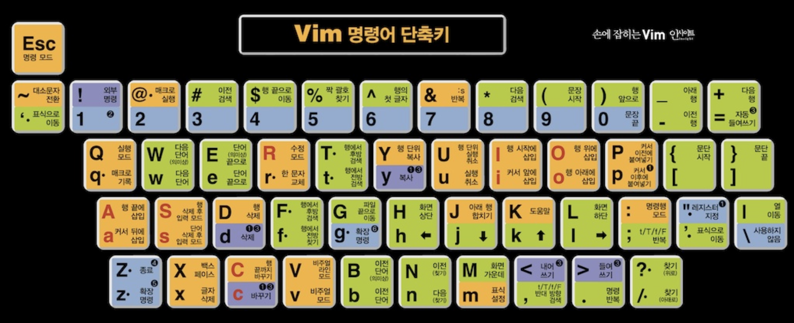

# vim motions and commands

#### motion
| key        | behavior                                                 |
| :--------- | :------------------------------------------------------- |
| h / H      | 커서 왼쪽으로/ 화면 상단으로                             |
| j          | 커서 아래로                                              |
| k          | 커서 위로                                                |
| l / L      | 커서 오른쪽으로/ 화면 하단으로                           |
| w / W      | 다음 단어/ (의미상, 기호 제외 공백으로만)                |
| e / E      | 단어 끝으로/(의미상, 기호 제외 공백 앞으로만)            |
| b / B      | 단어 앞 끝으로/ (의미상, 기호 제외 공백으로만)           |
| f / F      | 행 앞으로 가며 찾아 이동 / 반대 방향                     |
| t / T      | 행 앞으로 가며 찾아 그 전까지 이동 / 반대 방향           |
| M          | 화면 가운데의 맨 앞으로                                  |
| zz         | 커서 위치로 화면 정렬                                    |
| z.         | 커서 위치로 화면 정렬, 커서를 줄 앞의 non-blank까지 이동 |
| $          | 행 끝으로                                                |
| 0          | 행 맨 앞으로                                             |
| ^          | 행의 문맥 앞으로                                         |
| %          | 짝 괄호 찾기                                             |
| []         | 잘 모르겠음/ 두번눌러 { }와 같음                         |
| { }        | 다음 문단 (빈 라인으로)                                  |
| ( )        | 다음 문장 (의미상, 과 공백이 있는 것이 문장)             |
| g(숫자)g/G | (숫자)줄로 이동/파일 끝으로 이동                         |
| /          | 검색 모드                                                |
| #          | 커서 위의 단어 찾기 (역순)                               |
| *          | 커서 위의 단어 찾기                                      |
| ?          | 검색 모드 (역순)                                         |
| n / N      | 검색 앞으로/뒤로 (역순에서는 거꾸로)                     |
| ;          | 마지막으로 사용한 t/T, f/F [count]번 시행                |
| ,          | 마지막으로 사용한 t/T, f/F  반대 방향으로                |
| m{a-zA-Z}  | 현재 커서 위치에 해당 알파벳을 태그로 마크 설정          |
| `{a-zA-Z}  | 설정했던 마커로 이동                                     |
| `` / ''    | 줄 점프하기 전으로 이동                                  |
| :          | 커맨드 모드, cmdline 으로 진입 및 :입력                  |

#### 편집
| key                | behavior                                                                      |
| ------------------ | ----------------------------------------------------------------------------- |
| a/A                | 현재 커서 다음에 삽입 입력/ 행 뒤에 삽입 입력                                 |
| i/I                | 현재 커서 앞에 삽입 입력/ 행 앞에 삽입 입력                                   |
| o/O                | 현재 커서 다음 줄에 행 삽입 후 입력/현재 커서 이전 줄에 행 삽입 후 입력       |
| x/X                | 현재 커서 지우기/ 커서 앞 지우기                                              |
| d/D                | d 이후 커맨드에 따라 지우기/ 문장 지우기                                      |
| dd                 | 문장 줄 지우기/ "1 레지스터에 저장됨                                          |
| c/C                | c 이후 (커맨드)에 따라 바꾸기/ 커서 뒤로 행 끝까지 바꾸기                     |
| cc                 | 문장 줄 지우고 삽입                                                           |
| s/S                | char 바꾸기/ 행 전체 바꾸기                                                   |
| u                  | undo                                                                          |
| U                  | 줄단위 undo, 다시 하면 줄단위 redo, 특수 행동으로 취급되어 스택에 쌓임        |
| CTRL-R             | redo                                                                          |
| ~                  | 하나 대소문자 바꾸기                                                          |
| <{motion}<         | {motion} 만큼의 문장을 왼쪽 들여쓰기                                          |
| >{motion}>         | {motion} 만큼의 문장을 오른쪽 들여쓰기                                        |
| .                  | 마지막 입력 반복                                                              |
| J                  | 아래 행 합치기(현 행 끝 줄바꿈 없앰)                                          |
| v/V/CTRL-Q         | 비주얼 모드 / 비주얼 라인 모드 / 비주얼 블록 모드                             |
| "{1-9a-zA-z}       | 레지스터 사용, yank, paste 등 가능                                            |
| CTRL-A             | 커서 위치의 숫자 또는 알파벳 문자의 값을 증가시킨다                           |
| CTRL-X             | 커서 위치의 숫자 또는 알파벳 문자의 값을 감소시킨다                           |
| guu / gugu         | 해당 라인 영문자를 소문자로                                                   |
| gUU / gUgU         | 해당 라인 영문자를 대문자로                                                   |
| CTRL-G             | 커맨드 라인에 파일 이름, 파일 상태, 줄 등 상태 표시                           |
| g_CTRL-G           | 커맨드 라인에 현재 커서 위치를 Column, Line, Word, Character and Byte 로 표시 |
| ZZ                 | write 및 quit, :x (write, quit but write only when changed) 와 같음           |
| ZQ                 | quit without checking for changes, :q! 와 같음                                |
| :m / :mov [number] | 현재 줄의 내용을 [number]줄 아래로 보내기                                     |
| :co [number]       | 현재 줄의 내용을 복사해서 [number]줄 아래로 붙여넣기                          |
| :norm [command]    | 일괄 적용, :1,10norm A; 시 1부터 10까지의 줄에서 명령어 A후 ; 작성 동작       |

#### 반복 매크로
| key               | behavior                                                        |
| ----------------- | --------------------------------------------------------------- |
| q{0-9A-Za-z"}     | q뒤에 쓴 식별드의 레지스터로 동작을 기록한다 q로 recording 종료 |
| @{0-9A-Za-z".=*+} | record한 레지스터의 동작을 다시 반복한다, [count]               |
| @@                | 마지막으로 실행 했던 매크로 동작을 반복한다                     |
| [number] Q        | [number] 횟수만큼 마지막 매크로 반복                            |

#### 비주얼, 비주얼 라인, 비주얼 블록 전용
| key               | behavior                                                                       |
| ----------------- | ------------------------------------------------------------------------------ |
| v                 | 비주얼 모드                                                                    |
| V                 | 비주얼 라인 (라인 전체 선택)                                                   |
| ctrl+ q or CTRL-V | 비주얼 블록 (사각형 형태의 선택)                                               |
| u, U              | 선택한 영역 소문자/대문자로 변경                                               |
| v_CTRL-G          | select mode 진입, 일반 편집기의 드래그 상태로 취급되어 입력한 문자가 들어간다. |
| CTRL-D            |                                                                                |
| CTRL-T            |                                                                                |

## magic과 패턴
> atom: 커맨드 위에서 특정 문자열을 지정하고, 특정 방식으로 표현하여 대체하는 와일드 카드 기능들
> 해당 문법들은 sed의 기능과 Regex 표현을 그대로 가져온 것

| character | desc                                               |
| --------- | -------------------------------------------------- |
| .         | 아무 리터럴 하나                                   |
| _         | 아무 리터럴 몇개든 == *                            |
| *         | 이전 적용한 atom이 몇개든 적용되는 전부            |
| ^         | 문장의 맨 앞을 의미                                |
| $         | 문장의 맨 뒤를 의미                                |
| %^        | 파일의 맨 앞을 의미                                |
| %$        | 파일의 맨 뒤를 의미                                |
| \<        | 단어(iskeyword에 의해 word로 정의된) 의 맨 앞 문자 |
| \>        | 단어(iskeyword에 의해 word로 정의된) 의 맨 뒤 문자 |
| ~         | 마지막으로 변경한 단어                             |
| \( \)     | 감싸진 부분을 atom으로 쓸 수 있는 그룹으로 만듬    |
| \1-9      | 앞에 지정한 그룹을 가져다 씀                       |

#### 블록 폴드
| key        | description                       |
| ---------- | --------------------------------- |
| za/zA      | 폴드 상태 토글 (열기/닫기)/(재귀) |
| zc/zC      | 폴드 닫기/(재귀)                  |
| zo/zO      | 폴드 열기/(재귀)                  |
| zf{motion} | 새 폴드 정의 (동작으로 정의)      |
| zd/zD      | 폴드 삭제/ (재귀)                 |
| zm/zM      | 모든 폴드 닫기/(재귀)             |
| zr/zR      | 모든 폴드 열기/ (재귀)            |

#### 스크롤 (Scroll)
| key           | description                                                     |
| ------------- | --------------------------------------------------------------- |
| [count]CTRL-E | [count]만큼 화면을 아래로 스크롤                                |
| CTRL-D        | buffer에 있는 페이지의 절반 이동, [count] 입력 시 CTRL-E와 같음 |
| CTRL-F        | buffer에 있는 페이지 하나 이동,                                 |
| [count]CTRL-Y | [count]만큼 화면을 위로 스크롤                                  |
| CTRL-U        | buffer에 있는 페이지의 절반 이동, [count] 입력 시 CTRL-Y와 같음 |
| CTRL-B        | buffer에 있는 페이지 하나 이동,                                 |

#### Window
| key                      | description                                                                       |
| ------------------------ | --------------------------------------------------------------------------------- |
| CTRL-W                   | :wincmd 와 같은 동작, 추가 입력으로 동작                                          |
| CTRL-W [number] w/CTRL-W | 이동 / [number]로 이동                                                            |
| CTRL-W s/S/CTRL-S        | 화면 split, 수평으로 갈라짐 :hor :horizon :sp                                     |
| CTRL-W v/V/CTRL-V        | 화면 split vertical, 수직으로 갈라짐 :vsp :vsplit :vs                             |
| CTRL-W n/CTRL-N          | 화면 split, 새 파일 열기  == :new , :vnew                                         |
| CTRL-W q/CTRL-Q          | split 화면 닫기                                                                   |
| CTRL-W o/CTRL-O          | 현재 화면을 유일하게 (only) 하고 나머지 닫기                                      |
| [number] CTRL-W c/CTRL-C | [number]번쨰의 / split 화면 닫기                                                  |
| CTRL-W w/W/t/b/h/j/k/l   | 분할된 화면 간 이동, 순환/역순환/최상단/최하단/좌/하/상/우                        |
| CTRL-W CTRL-^            | 현재 파일 분할 및 대체 파일로 편집                                                |
| CTRL-W H/J/K/L           | 현재 포커스된 윈도우를 좌/하/상/우로 이동                                         |
| CTRL-W r /CTRL-W R       | 현재 윈도우들을 회전 / 역회전                                                     |
| CTRL-W x                 | (exchange) 현재 윈도우와 다음 (없으면 이전) 윈도우와 위치 변경                    |
| CTRL-W T                 | 현재 split된 화면 하나를 tab page로 옮김 (열린 화면이 하나면 불가능)              |
| CTRL-W - / +             | 현재 화면 높이를 줄임/높임                                                        |
| CTRL-W _                 | 현재 화면 높이를 최대로                                                           |
| CTRL-W < / >             | 현재 화면 폭을 줄임/높임, <와 >에 [number] 적용                                   |
| CTRL-W <BAR>             | 현재 화면 폭을 최대로                                                             |
| CTRL-W =                 | 현재 화면 폭 초기화                                                               |
| z{number}<CR>            | <CR> = \r 화면 높이 {number}로 변경                                               |
| :ls / :buffers           | 편집기의 파일들의 내용을 가진 버퍼 리스트를 연다, 파일이 닫혀도 남아있으므로 유용 |
| :sb / :sbuffer           | split buffer, 버퍼 숫자를 기준으로 화면 스플릿                                    |
| :vert / :hor             | :vertical / :horizon , 뒤에 오는 화면 분할/열기 명령어에 해당 속성을 강제한다     |
| :difft[his]              | 현재 윈도우를 비교 윈도우로 만든다.                                               |

#### tab page
| key                     | description                                                                    |
| ----------------------- | ------------------------------------------------------------------------------ |
| g<tab>                  | 탭 간 이동 (마지막으로 간 tab page)                                            |
| [number] g t / T        | 탭 오른쪽 / 왼쪽 이동, [number] 탭으로 이동                                    |
| :tabm [number$#+-]      | 현재 탭을 하나 이동 / [number] 위치로 이동 $:마지막 #:직전탭우측 +:우측 -:좌측 |
| :buf[fer]               | 파일 버퍼 목록 보기                                                            |
| :sb / :sbuffer [number] | [number]번 버퍼의 파일을 split 윈도우로 만든다                                 |

#### Jumps
커서의 점프 기록을 담는 스택
| key          | description           |
| ------------ | --------------------- |
| CTRL-O       | 이전 커서 위치로 점프 |
| CTRL-I       | 다음 커서 위치로 점프 |
| :ju / :jumps | 점프 리스트 보기      |

#### tagsrch (tag search)
| key             | description                                             |
| --------------- | ------------------------------------------------------- |
| `CTRL-]`        | Jump to definition of keyword under the cursor          |
| {number} CTRL-T | {number} 만큼 이전의 tag 이동 스택으로 복귀 (default 1) |
| CTRL-W CTRL-I   | 정의로 이동하는 데, 새로운 split window에다가 열어줌    |
| :tag {name}     | {name} 식별자의 태그로 이동                             |
| :tags           | 태그 스택 내용 표시                                     |

#### Internal Variable
| key           | description                                                                |
| ------------- | -------------------------------------------------------------------------- |
| :let [string] | 변수 목록을 보거나 [string] 형태의 변수를 본다. [string]= 형태로 대입한다. |

#### External Program
| key               | description                                                                     |
| ----------------- | ------------------------------------------------------------------------------- |
| :![command]       | 외부 서브쉘을 열어서 [command]를 실행한다.                                      |
| !{motion}{filter} | 지정된 범위의 문자열을 외부 변환 프로그램을 통해 가공한다. (awk, sed, sort 등 ) |